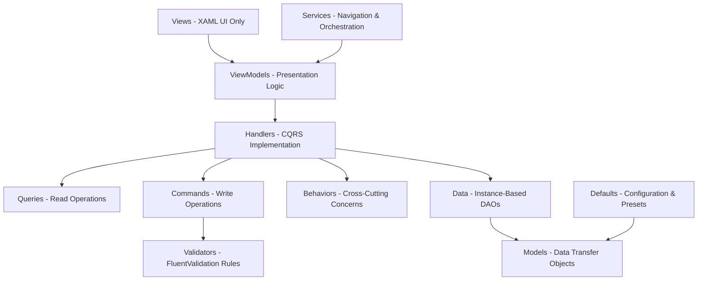
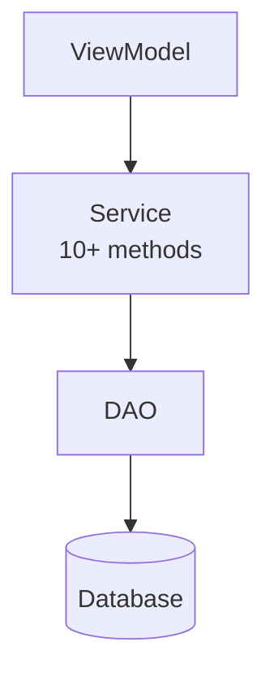
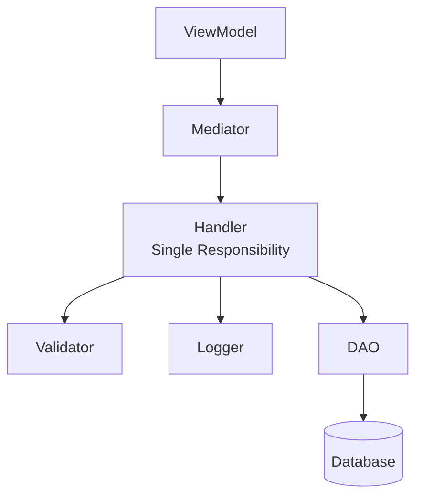

# Module_Receiving Ground-Up Rebuild Implementation Guide

**Version:** 2.0.0 | **Date:** January 15, 2026 | **Estimated Effort:** 6-8 weeks

---

## Executive Summary

This document outlines a complete architectural redesign of Module_Receiving using modern patterns and industry-standard libraries. The goal is to create a highly modular, testable, and maintainable codebase that reduces service bloat in Module_Core while maintaining strict architectural compliance.

**Key Objectives:**

- Reduce Module_Core service count by approximately 50%
- Implement industry-standard CQRS (Command Query Responsibility Segregation) pattern
- Improve testability through proper abstraction
- Enable true modular independence
- Establish blueprint for modernizing other modules

---

## Current State Analysis

### Problems to Solve

1. **Service Bloat** - Too many Receiving-specific services residing in shared Module_Core infrastructure
2. **Tight Coupling** - ViewModels, Services, and Data Access Objects are not properly abstracted
3. **Limited Modularity** - Module_Receiving depends heavily on Module_Core
4. **Testing Challenges** - Difficult to test due to tight coupling and lack of proper interfaces
5. **Maintenance Burden** - Changes to Receiving logic create ripple effects across Module_Core

### What Works Well

- Strict Model-View-ViewModel (MVVM) architecture with partial ViewModels
- Instance-based Data Access Objects returning structured result objects
- Dependency Injection configured centrally
- WinUI 3 with compile-time data binding
- Stored procedures for all MySQL database operations

### What Needs Improvement

- Service layer is monolithic (single service with 10+ methods)
- Navigation is custom-built and tightly coupled to specific implementation
- Validation logic is scattered across ViewModels, Services, and custom validators
- Logging lacks structured context and semantic properties
- CSV export functionality uses custom writer instead of proven libraries

## Target Architecture

### Modern Architecture Stack

**Selected Patterns:**

1. **CQRS (Command Query Responsibility Segregation)** - Separates read operations (Queries) from write operations (Commands), improving clarity and testability
2. **Structured Logging** - Adds semantic context to log entries for better diagnostics
3. **Declarative Validation** - Strongly-typed validation rules that are composable and testable
4. **Type-Safe CSV Export** - Mature library for CSV operations
5. **Resilience Patterns** (Optional) - Retry policies and circuit breakers for database operations

**Library Justification:**

- **MediatR (607M+ downloads)** - Industry standard for implementing mediator pattern and CQRS
- **Serilog (2.3B+ downloads)** - Most popular structured logging framework for .NET
- **FluentValidation (741M+ downloads)** - De facto standard for validation in .NET
- **CsvHelper (34M+ downloads)** - Mature, feature-rich CSV library

### Architectural Layers Overview

**Post-Rebuild Structure:**

_(See Diagram Appendix A: Module Architecture Layers - Page end of document)_

The architecture consists of multiple layers:
- **Presentation Layer:** Views and ViewModels manage user interface and presentation logic
- **Application Layer:** Handlers process business operations using CQRS pattern
- **Validation Layer:** Declarative validators ensure data integrity
- **Data Access Layer:** Data Access Objects interface with database
- **Domain Layer:** Models represent business entities

### Data Flow Transformation

_(See Diagram Appendix B: Current vs. New Data Flow - Page end of document)_

The rebuild transforms data flow from a monolithic service pattern to a modern CQRS pattern where:

**Benefits:**

- Each handler is a single class with one responsibility
- Easy to add cross-cutting concerns (logging, validation) via pipeline behaviors
- Handler classes are highly testable with mocked dependencies
- Reduces large service files into many small, focused handler classes

---

## Constitutional Constraints

These architectural principles are non-negotiable and must be maintained throughout the rebuild:

### I. MVVM Architecture

- ViewModels SHALL NOT directly call Data Access Objects
- ViewModels SHALL NOT access database helpers or connection strings
- All data access MUST flow through Service or Mediator layer
- All ViewModels MUST be partial classes using source generators
- All data binding MUST use compile-time binding

### II. Database Layer

- All MySQL operations MUST use stored procedures (no raw SQL in application code)
- All Data Access Objects MUST return structured result objects
- Data Access Objects MUST be instance-based and registered in Dependency Injection
- SQL Server (Infor Visual) is READ ONLY - no write operations permitted

### III. Dependency Injection

- All services MUST be registered in central configuration
- Constructor injection REQUIRED for all dependencies
- Service locator pattern is FORBIDDEN

### IV. Error Handling

- Use centralized error handler for user-facing errors
- Use structured logging for all diagnostic information
- Data Access Objects MUST NOT throw exceptions (return failure results instead)

- Braces required for all control flow statements
- Async methods MUST end with "Async" suffix
- XML documentation comments required for all public APIs

### VI. Documentation

- All diagrams MUST use PlantUML (no ASCII art)
- Architecture documents MUST be updated when behavior changes

ask tracking required with status updates

---

## Implementation Strategy

### Phase 1: Foundation & Setup (Week 1)

**Objective:** Install packages, create folder structure, configure dependency injection

**Key Tasks:**

1. Install NuGet packages (MediatR, Serilog, FluentValidation, CsvHelper)
2. Create new folder structure for Handlers, Validators, Defaults
3. Configure Serilog for file-based structured logging
4. Register MediatR with pipeline behaviors
5. Register FluentValidation auto-discovery

**Deliverables:**

- All packages installed and configured
- Folder structure established
- Dependency injection configured

ogging outputs to daily rolling log files

---

### Phase 2: Models & Validation (Week 1-2)

**Objective:** Review existing models and create declarative validators

**Key Tasks:**

1. Review all existing model classes
2. Create FluentValidation validators for each model
3. Define validation rules with custom error messages
4. Create default configuration models for presets
5. Write unit tests for validators

**Validation Approach:**

Instead of scattered validation logic in ViewModels and Services, validation rules are defined in dedicated validator classes that are:

- Strongly-typed (compile-time checked)
- Composable (rules can be shared and combined)
- Testable (easy to verify validation behavior)
- Centralized (single source of truth for validation rules)

**Deliverables:**

- All models documented
- Validators created for each model
- Unit tests for validation rules
- Default configuration values defined

### Phase 3: CQRS Handlers (Week 2-3)

**Objective:** Replace Service methods with MediatR handlers

**Migration Pattern:**

**Before:** Single service class with multiple methods (InsertLine, UpdateLine, GetLines, DeleteLine, etc.)

**After:** Separate handler classes:

- GetReceivingLinesQuery + GetReceivingLinesHandler (read operation)
- InsertReceivingLineCommand + InsertReceivingLineHandler (write operation)
- UpdateReceivingLineCommand + UpdateReceivingLineHandler (write operation)
- DeleteReceivingLineCommand + DeleteReceivingLineHandler (write operation)

**Key Concepts:**

**Queries (Read Operations):**

- Retrieve data without modifying state
- Can be cached or optimized differently than commands
- Return data transfer objects or result wrappers

**Commands (Write Operations):**

- Modify application state
- Include validation before execution
- Return success/failure result objects

**Pipeline Behaviors (Cross-Cutting Concerns):**

- Logging Behavior - Automatically logs all handler executions
- Validation Behavior - Automatically validates commands before execution
- Transaction Behavior (Optional) - Wraps commands in database transactions

**Deliverables:**

- All service methods migrated to Query/Command handlers
- ViewModels updated to use Mediator instead of direct service calls
- Pipeline behaviors implemented and tested
- Unit tests for all handlers

### Phase 4: ViewModels & Navigation (Week 3-4)

**Objective:** Refactor ViewModels to use Mediator pattern

**ViewModel Changes:**

**Before:** ViewModels injected multiple specific services

**After:** ViewModels inject single Mediator interface

**Benefits:**

- Reduced coupling to specific service implementations
- Easier to mock for testing (mock Mediator instead of multiple services)
- Clearer separation of concerns
- Easier to add new operations without modifying ViewModel

**Navigation Strategy:**

Two approaches considered:

1. **Keep Custom Service (Simplest)** - Retain existing navigation service, remove data access logic
2. **Use Navigation Library** - Adopt third-party ViewModel-based navigation

**Recommendation:** Start with custom navigation for MVP, evaluate migration to library later.

**Deliverables:**

- All ViewModels refactored to use Mediator
- Logging updated to use structured logging framework
- Navigation strategy implemented and working
- All ViewModels properly registered in dependency injection

### Phase 5: Services Cleanup (Week 4)

**Objective:** Remove or relocate Receiving-specific services from Module_Core

**Services to Remove/Replace:**

1. MySQL Receiving Line Service → Replaced by MediatR handlers
2. Receiving Validation Service → Replaced by FluentValidation validators
3. Custom CSV Writer → Replaced by CsvHelper-based generic export service
4. Custom Logging Utility → Replaced by Serilog structured logging

**Services to Keep (Shared across all modules):**

- Error Handler Service
- Window Management Service
- UI Thread Dispatcher Service

**Deliverables:**

- Receiving-specific services removed from Module_Core
- Generic CSV export service created
- All dependency injection registrations updated
- Zero compilation errors

### Phase 6: Testing & Documentation (Week 5)

**Objective:** Achieve 80% test coverage and update all documentation

**Testing Strategy:**

**Unit Tests:**

- ViewModels with mocked Mediator
- Handlers with mocked Data Access Objects
- Validators with test data

**Integration Tests:**

- Data Access Objects against test database
- End-to-end workflow scenarios

**Documentation Updates:**

- Module README with new architecture overview
- Architecture document with design decisions
- Changelog with all changes documented
- Updated Copilot instructions with new patterns

**Deliverables:**

- 80% unit test coverage achieved
- Integration tests for all Data Access Objects
- All documentation updated
- Code review completed and approved

## Success Metrics

### Quantitative Goals

- Reduce Module_Core service count by 50% (from ~15 to 7-8 services)
- Achieve 80%+ test coverage for Module_Receiving
- Reduce average service file size from 500 lines to under 100 lines (handlers)
- Maintain or improve application performance
- Zero architectural constraint violations

### Qualitative Goals

- **Modularity:** Module_Receiving is 100% self-contained
- **Testability:** Easy to mock Mediator interface for ViewModel testing
- **Maintainability:** One handler class equals one responsibility
- **Scalability:** Easy to add new operations without modifying existing code
- **Developer Experience:** Clear patterns for implementing new features

## Common Pitfalls to Avoid

### Anti-Pattern 1: Direct DAO Injection

**Incorrect:** ViewModels directly inject Data Access Objects

**Correct:** ViewModels inject Mediator interface

### Anti-Pattern 2: God Handlers

**Incorrect:** Single handler performing multiple operations (CreateAndUpdateUser)

**Correct:** Separate handlers for each operation (CreateUser, UpdateUser)

### Anti-Pattern 3: Skipping Validation

**Incorrect:** Handlers that don't validate input before processing

**Correct:** All commands validated before execution via pipeline behavior

### Anti-Pattern 4: String Interpolation in Logging

**Incorrect:** Log messages with string concatenation or interpolation

**Correct:** Structured logging with semantic properties

## Risk Mitigation

### Performance Risk

**Risk:** MediatR adds overhead to every operation

**Mitigation:** Establish performance baseline before rebuild, measure after each phase, optimize hotspots

### Migration Risk

**Risk:** Breaking existing functionality during transition

**Mitigation:** Feature flags to enable gradual rollout, maintain old code paths until new paths proven

### Testing Risk

**Risk:** Insufficient test coverage leads to production defects

**Mitigation:** 80% coverage requirement, automated test suite, integration testing against real database

### Knowledge Transfer Risk

**Risk:** Team unfamiliar with new patterns

**Mitigation:** Comprehensive documentation, code examples, pair programming during implementation

## Pre-Implementation Checklist

**Before Starting Phase 1:**

- [ ] All critical questions in Clarification Questions document answered
- [ ] Team approval on library selections
- [ ] NuGet package approval process completed
- [ ] Test database environment available
- [ ] Development environment setup verified
- [ ] Constitutional compliance review completed

**During Implementation:**

- [ ] Follow phase order strictly (1 through 6)
- [ ] Update task tracking after each task completion
- [ ] Run automated tests after each phase
- [ ] Document architectural decisions
- [ ] Conduct code review after each phase

**Post-Implementation:**

- [ ] All tests passing with 80%+ coverage
- [ ] No architectural violations detected
- [ ] Documentation complete and accurate
- [ ] Performance benchmarks meet targets
- [ ] Code review approved by team
- [ ] Deployment plan reviewed and approved

## References

### Official Documentation

- MediatR: github.com/jbogard/MediatR/wiki
- Serilog: serilog.net
- FluentValidation: docs.fluentvalidation.net
- CsvHelper: joshclose.github.io/CsvHelper
- WinUI 3: learn.microsoft.com/windows/apps/winui

### Architecture Patterns

- Clean Architecture: blog.cleancoder.com/uncle-bob/2012/08/13/the-clean-architecture.html
- CQRS Pattern: martinfowler.com/bliki/CQRS.html
- Modular Monolith: github.com/kgrzybek/modular-monolith-with-ddd

### Project-Specific Documents

- Constitution: .specify/memory/constitution.md
- Copilot Instructions: .github/copilot-instructions.md
- MVVM Guide: .github/instructions/mvvm-pattern.instructions.md
- DAO Guide: .github/instructions/dao-pattern.instructions.md

## Appendix: Key Concepts

### CQRS (Command Query Responsibility Segregation)

Architectural pattern that separates read operations (queries) from write operations (commands). Queries retrieve data without side effects. Commands modify state and may trigger validation or business rules.

### Mediator Pattern

Behavioral design pattern that reduces coupling between components by having them communicate through a mediator object instead of directly with each other. In this context, ViewModels send requests to Mediator, which routes them to appropriate handlers.

### Pipeline Behavior

Middleware-like functionality that wraps handler execution, allowing cross-cutting concerns (logging, validation, transactions) to be applied consistently without duplicating code in each handler.

### Structured Logging

Logging approach that treats log events as data structures with semantic properties rather than plain text strings. Enables better filtering, searching, and analysis of log data.

### Declarative Validation

Validation rules defined as data/configuration rather than imperative code. Rules are composable, reusable, and can be tested independently of business logic.

---

---

# DIAGRAM APPENDIX

## Diagram Appendix A: Module Architecture Layers

**Purpose:** Visual representation of the complete Module_Receiving architecture showing all layers, their components, and dependencies after the rebuild is complete.

### Component Descriptions

**[1] Views - XAML UI Only**
- **Purpose:** Pure user interface markup using WinUI 3 XAML
- **Responsibility:** Display data and capture user input through data binding
- **Key Constraint:** Contains zero business logic; all logic resides in ViewModels
- **Technology:** WinUI 3 XAML with compile-time binding (x:Bind)

**[2] ViewModels - Presentation Logic**
- **Purpose:** Bridge between user interface and application logic
- **Responsibility:** Manage UI state, handle user commands, coordinate with Mediator to execute operations
- **Key Feature:** Uses source generators for property change notifications and command implementations
- **Dependencies:** Injects Mediator interface for all business operations

**[3] Handlers - CQRS Implementation**
- **Purpose:** Execute specific business operations (one handler = one operation)
- **Responsibility:** Coordinate Queries, Commands, Validators, and Data Access Objects
- **Key Benefit:** Highly testable, single responsibility per class
- **Pattern:** Mediator pattern routes requests from ViewModels to appropriate handlers

**[4] Queries - Read Operations**
- **Purpose:** Retrieve data without modifying application state
- **Responsibility:** Execute database queries and return results
- **Key Characteristic:** Side-effect free; can be cached or optimized independently
- **Return Type:** Data transfer objects or result wrappers

**[5] Commands - Write Operations**
- **Purpose:** Modify application state (create, update, delete operations)
- **Responsibility:** Execute state-changing operations with validation
- **Key Feature:** Always validated before execution via pipeline behaviors
- **Return Type:** Success/failure result objects

**[6] Behaviors - Cross-Cutting Concerns**
- **Purpose:** Apply consistent functionality across all handlers
- **Responsibility:** Logging, validation, transaction management, error handling
- **Key Benefit:** Eliminates code duplication; applied automatically via pipeline
- **Examples:** Logging every handler execution, validating all commands, wrapping operations in transactions

**[7] Validators - FluentValidation Rules**
- **Purpose:** Define validation logic separate from business operations
- **Responsibility:** Validate data integrity using declarative rules
- **Key Feature:** Strongly-typed, composable, testable validation
- **Technology:** FluentValidation library with custom validation rules

**[8] Services - Navigation & Orchestration**
- **Purpose:** High-level workflow coordination and navigation management
- **Responsibility:** Manage workflow steps, coordinate multiple operations, handle navigation
- **Key Change:** Data access logic removed; focuses solely on orchestration
- **Scope:** Module-specific services only (Receiving-specific services stay in Module_Receiving)

**[9] Data - Instance-Based DAOs**
- **Purpose:** Interface with database using stored procedures
- **Responsibility:** Execute database operations and return structured results
- **Key Constraint:** Never throws exceptions; returns success/failure result objects
- **Pattern:** Instance-based (registered in dependency injection) with connection string injection

**[10] Models - Data Transfer Objects**
- **Purpose:** Represent business entities and data structures
- **Responsibility:** Hold data; provide structure for data transfer between layers
- **Key Feature:** Plain objects with no behavior; focused on data representation
- **Usage:** Shared across all layers for data transfer

**[11] Defaults - Configuration & Presets**
- **Purpose:** Centralized configuration values and default settings
- **Responsibility:** Provide preset values, default configurations, lookup tables
- **Key Benefit:** Single source of truth for default values
- **Examples:** Default package types, validation thresholds, workflow step definitions

## Diagram Appendix B: Current vs. New Data Flow

**Purpose:** Contrast between existing monolithic service architecture and new CQRS-based architecture to illustrate the transformation in data flow patterns.

### Current Architecture (Service Pattern)

### Current Architecture - Component Descriptions

**[1] ViewModel**
- **Role:** Presentation logic container
- **Problem:** Tightly coupled to specific service implementations
- **Issue:** Difficult to test (must mock entire service with 10+ methods)

**[2] Service (10+ methods)**
- **Role:** Monolithic business logic container
- **Problem:** Single file contains multiple responsibilities (Insert, Update, Delete, Get, Validate, Export)
- **Issue:** Large files (500+ lines), difficult to maintain, violates Single Responsibility Principle

**[3] DAO (Data Access Object)**
- **Role:** Database interface
- **Note:** This layer works well and is retained in new architecture

**[4] Database**
- **Role:** Data persistence
- **Note:** MySQL for application data, SQL Server (Infor Visual) for read-only reference data

### New Architecture (CQRS Pattern)

### New Architecture - Component Descriptions

**[1] ViewModel**
- **Role:** Presentation logic container
- **Improvement:** Injects single Mediator interface instead of multiple services
- **Benefit:** Easier to test (mock Mediator instead of 5+ service interfaces)

**[2] Mediator**
- **Role:** Request router and dispatcher
- **Responsibility:** Routes queries and commands to appropriate handlers
- **Benefit:** Decouples ViewModels from specific handler implementations

**[3] Handler (Single Responsibility)**
- **Role:** Execute one specific operation (example: InsertReceivingLine)
- **Improvement:** One class per operation instead of one service for all operations
- **Benefit:** Small, focused classes (~50-100 lines), easy to understand and maintain

**[4] Validator**
- **Role:** Data integrity enforcement using declarative rules
- **Responsibility:** Automatically validates commands before execution via pipeline behavior
- **Benefit:** Centralized validation logic, reusable rules, testable independently

**[5] Logger**
- **Role:** Diagnostic information capture
- **Responsibility:** Automatically logs handler execution via pipeline behavior
- **Benefit:** Consistent structured logging across all operations without duplicating logging code

**[6] DAO (Data Access Object)**
- **Role:** Database interface (unchanged from current architecture)
- **Note:** Instance-based, returns structured result objects, uses stored procedures

**[7] Database**
- **Role:** Data persistence (unchanged from current architecture)
- **Note:** MySQL for read/write, SQL Server (Infor Visual) for read-only access

### Key Transformation Benefits

**Reduced Coupling:**
- Current: ViewModel depends on specific service implementation
- New: ViewModel depends only on Mediator interface

**Single Responsibility:**
- Current: One service handles 10+ operations
- New: One handler handles exactly one operation

**Cross-Cutting Concerns:**
- Current: Logging and validation scattered in each service method
- New: Pipeline behaviors apply logging and validation automatically

**Testability:**
- Current: Must mock entire service interface with all methods
- New: Mock Mediator to simulate any handler response

**Maintainability:**
- Current: Modifying one operation requires editing large service file
- New: Each operation is isolated in its own handler class

