# Module_Receiving Rebuild - Enhancement Suggestions

**Date:** January 15, 2026 | **Status:** Recommendations for Consideration

---

## Overview

This document identifies additional elements that could enhance the Module_Receiving rebuild to ensure a more comprehensive and production-ready implementation. Suggestions are organized by impact level and implementation complexity.

The base implementation guide (MASTER_PROMPT.md) is comprehensive and complete. These suggestions represent enhancements that would further improve robustness, reduce risk, and improve long-term maintainability.

---

## Critical Additions (High Impact)

### 1. Performance Baseline & Benchmarks

**What's Missing:** No performance baseline or target metrics defined

**Why It Matters:** Without performance metrics, there's no way to validate that the new architecture performs better than the old one. The MediatR pattern adds a small amount of overhead—this needs to be measured to ensure it doesn't negatively impact user experience.

**Recommended Addition:**

**Current State Baseline (to be measured before rebuild):**

- POEntry view load time
- Review view with 100 lines load time
- CSV export for 1000 lines duration
- Navigation between workflow steps duration

**Target Performance (Post-Rebuild):**

- POEntry view load time: under 200 milliseconds
- Review view with 100 lines: under 500 milliseconds
- CSV export for 1000 lines: under 3 seconds
- Navigation between workflow steps: under 100 milliseconds

**Performance Testing Strategy:**

- Use BenchmarkDotNet for handler performance measurement
- Use WinUI Performance Profiler for UI responsiveness
- Log database query execution times via structured logging
- Run performance test suite after each implementation phase
- Flag any performance degradation greater than 20%

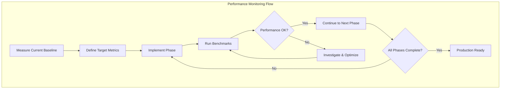

**Action Items:**

1. Measure current performance before starting rebuild
2. Define acceptable performance targets
3. Create automated performance test suite
4. Monitor performance after each phase

---

### 2. Database Migration & Rollback Strategy

**What's Missing:** No plan for handling existing data or potential schema changes

**Why It Matters:** Production deployments without rollback plans are high-risk. Existing data in receiving tables needs migration path. Schema changes require careful planning and testing.

**Recommended Addition:**

**Schema Change Assessment:**

- Review existing receiving_loads and receiving_lines tables
- Identify missing indexes that new query patterns may need
- Create database migration scripts for any schema updates
- Test all migrations on development database before production

**Data Migration Considerations:**

- Document count of in-progress receiving sessions
- Calculate size of historical data to preserve
- Create data validation scripts to verify migration correctness

**Rollback Plan:**

**Pre-Migration Backup:**

1. Full MySQL database dump of mtm_receiving_application database
2. Export all user sessions and preferences
3. Document current stored procedure versions

**Rollback Triggers (when to rollback):**

1. Critical bug discovered in production within 48 hours
2. Data loss or corruption detected
3. Performance degradation exceeding 50%

**Rollback Procedure:**

1. Restore MySQL database from pre-migration backup
2. Redeploy previous application version
3. Notify users of rollback reason and timeline

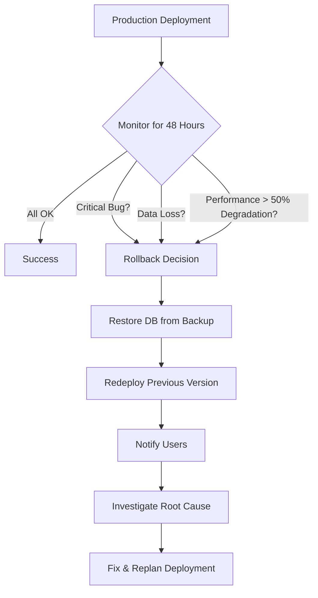

**Action Items:**

1. Create comprehensive backup before deployment
2. Test rollback procedure in staging environment
3. Document rollback decision criteria
4. Assign rollback decision authority

---

### 3. Security & Audit Trail Considerations

**What's Missing:** No discussion of security implications of new architecture

**Why It Matters:** Security and audit trails are constitutional requirements. The new MediatR pipeline provides an ideal location for centralized audit logging. Need to ensure sensitive data isn't logged and all critical operations are audited.

**Recommended Addition:**

**Sensitive Data Handling:**

- Ensure structured logging doesn't log personally identifiable information or credentials
- Verify FluentValidation rules cannot be bypassed
- Confirm stored procedures prevent SQL injection (already using stored procedures, but verify)

**Audit Trail Requirements:**

- All Insert, Update, and Delete commands logged with user context
- Structured logging includes UserId, SessionId, and Timestamp for all operations
- Critical operations (e.g., DeleteReceivingLine) require detailed audit trail

**MediatR Pipeline Audit Implementation:**
Create AuditBehavior that automatically logs all command executions with:

- User identifier who executed the command
- Timestamp of execution
- Command type and serialized command data
- Execution result (success/failure)

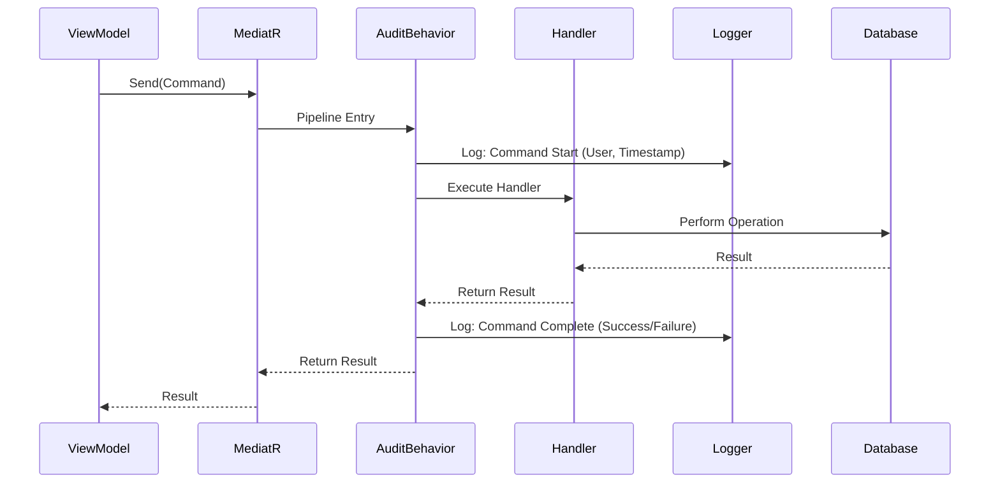

**Configuration Security:**

- Store connection strings in User Secrets, not in source code
- Restrict Serilog file paths to application data folder
- No hardcoded credentials in handlers or validators

**Action Items:**

1. Define sensitive data classification policy
2. Implement audit behavior in MediatR pipeline
3. Review all logging statements for sensitive data exposure
4. Create audit log retention policy

---

## Important Additions (Medium Impact)

### 4. Exception Handling Strategy for MediatR

**What's Missing:** No guidance on how to handle exceptions in handlers

**Why It Matters:** Consistent exception handling ensures predictable behavior. Without clear strategy, different handlers may handle exceptions differently, leading to inconsistent error messages and logging.

**Recommended Approaches:**

**Option 1: Try-Catch in Each Handler**
Each handler wraps its logic in try-catch block and returns failure result object instead of throwing exceptions. Provides fine-grained control over error handling per handler.

**Option 2: Global Exception Pipeline Behavior**
Create pipeline behavior that catches unhandled exceptions from all handlers and converts them to failure results. Provides consistency but less flexibility for handler-specific error handling.

**Option 3: Hybrid Approach (Recommended)**
Use try-catch in handlers for expected failures. Use global exception pipeline as safety net for unexpected exceptions.

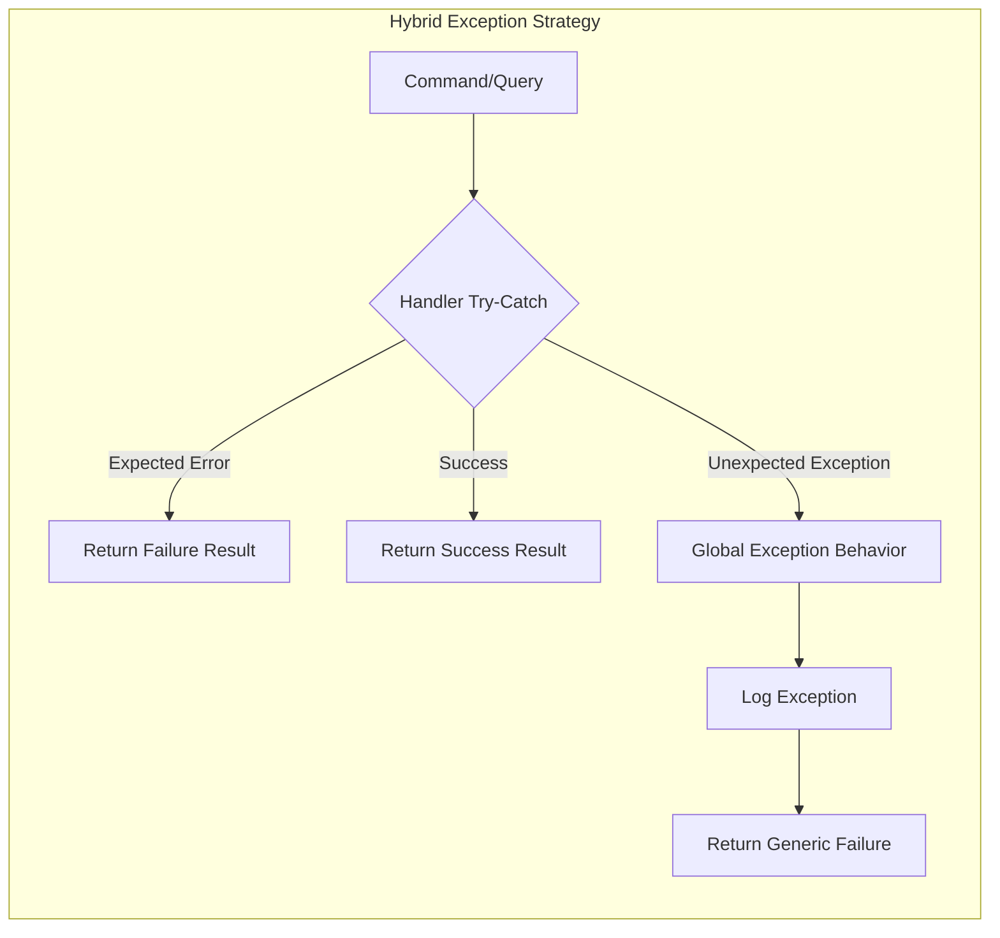

**Action Items:**

1. Define exception handling strategy
2. Document expected vs unexpected exceptions
3. Create exception handling templates for handlers
4. Test exception scenarios in unit tests

---

### 5. Backward Compatibility & Feature Flags

**What's Missing:** No plan for gradual rollout or A/B testing

**Why It Matters:** All-or-nothing deployments are risky. Feature flags allow safe, incremental rollout and easy rollback if issues discovered.

**Recommended Addition:**

**Phased Rollout Strategy:**

- Phase 1: Deploy with feature flag OFF (old services still functional)
- Phase 2: Enable for internal testing (10% of users)
- Phase 3: Enable for pilot users (50% of users)
- Phase 4: Full rollout (100% of users)

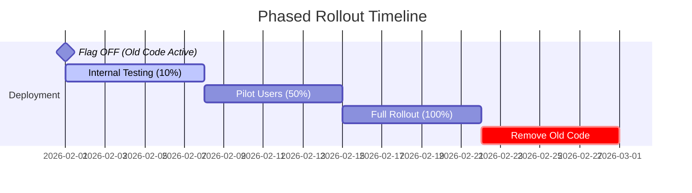

**Feature Flag Implementation:**
Create simple boolean flag that controls whether ViewModels use new MediatR path or old Service path. Allows real-time switching between implementations without redeployment.

**Migration Completion Criteria:**

- All ViewModels tested with MediatR path
- No regression bugs reported for one week
- Performance metrics within target ranges
- User feedback positive (above 80% satisfaction)

**Deprecation Timeline:**

- Week 1-2: Both code paths active, flag OFF by default
- Week 3-4: Flag ON for 50% of users, monitor metrics
- Week 5-6: Flag ON for 100%, mark old services as obsolete
- Week 7+: Remove old service code entirely

**Action Items:**

1. Implement feature flag infrastructure
2. Define rollout phases and success criteria
3. Create monitoring dashboard for A/B comparison
4. Document rollback procedure per phase

---

### 6. Observability & Monitoring

**What's Missing:** No discussion of production monitoring and metrics

**Why It Matters:** Can't improve what you don't measure. Observability is critical for identifying performance bottlenecks, error patterns, and user behavior in production.

**Recommended Addition:**

**Metrics to Track:**

- Handler execution time (average, 95th percentile, 99th percentile) for each handler
- Handler success rate (percentage of successful vs failed operations)
- Validation failure count by validation rule
- Data Access Object performance (query execution times per stored procedure)
- Error rate (errors per minute in production)

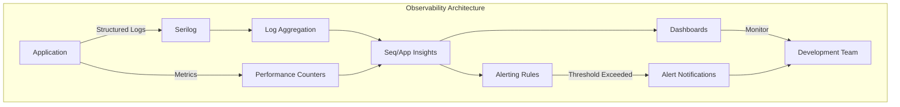

**Structured Logging Enrichers:**
Configure Serilog to automatically add context to all log entries:

- Machine name (which server generated the log)
- Thread ID (concurrency debugging)
- Application name and module name
- Environment (Development, Staging, Production)

**Dashboard Recommendations:**

- Use Seq (free for local development) to visualize Serilog logs
- Use Application Insights (Azure) for production telemetry and monitoring
- Create dashboards showing handler performance, error rates, user sessions

**Alerting Rules:**

- Alert if error rate exceeds 10 errors per minute
- Alert if handler 95th percentile exceeds 2 seconds
- Alert if validation failure rate exceeds 20%

**Action Items:**

1. Configure structured logging enrichers
2. Set up log aggregation tool (Seq or Application Insights)
3. Create performance dashboards
4. Define and configure alerting rules

---

## Nice-to-Have Additions (Low Impact)

### 7. CI/CD Pipeline Integration

**What's Missing:** No build/deploy automation guidance

**Why It Matters:** Manual builds lead to inconsistency and "works on my machine" issues. Automated CI/CD ensures every commit is tested and deployable.

**Recommended Addition:**

**Build Pipeline Components:**

- Automated restore of NuGet dependencies
- Compilation with warnings treated as errors
- Automated test execution
- Code coverage reporting
- Static code analysis

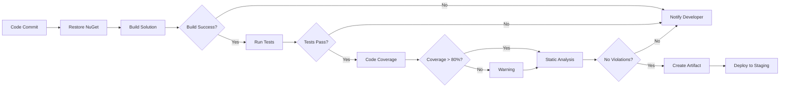

**Deployment Checklist:**

- Build succeeds without warnings
- All tests pass with 80%+ coverage
- Constitutional compliance checks pass
- Performance benchmarks within targets
- Security scan shows no vulnerabilities

**Action Items:**

1. Create build pipeline definition
2. Configure automated testing
3. Set up code coverage reporting
4. Integrate security scanning

---

### 8. Developer Onboarding Guide

**What's Missing:** No quick-start guide for new developers

**Why It Matters:** Clear onboarding reduces time-to-productivity and improves code quality by ensuring developers understand patterns before contributing.

**Recommended Addition:**

**First-Time Setup (15-minute checklist):**

**Prerequisites:**

- Visual Studio 2022 (version 17.8 or later)
- .NET 8 SDK installed
- MySQL 8.0 access (or connection to development database)

**Setup Steps:**

1. Clone repository
2. Restore NuGet packages via dotnet restore
3. Build solution via dotnet build
4. Run tests via dotnet test
5. Open in Visual Studio
6. Set startup project
7. Press F5 to run

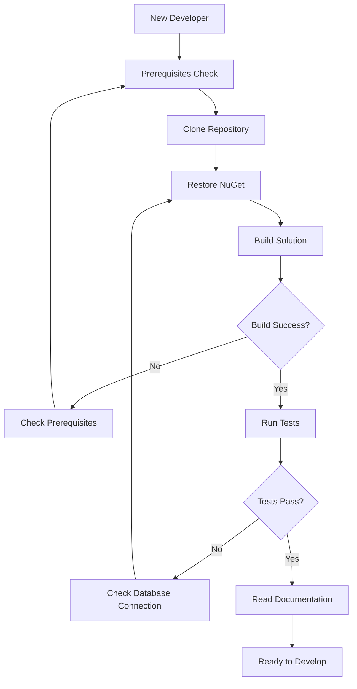

**Key Documents to Read First:**

1. Constitution - Core architectural principles
2. Module Architecture - Module-specific design decisions
3. Implementation Guide - This document
4. Copilot Instructions - Coding patterns and standards

**Common Development Tasks:**

**Adding New Handler:**

1. Create Query or Command class
2. Create corresponding Handler class
3. Register validator if needed (auto-discovered)
4. Add unit tests
5. Update ViewModel to use IMediator.Send

**Adding New Validator:**
Define validation rules in dedicated validator class inheriting from AbstractValidator

**Running Specific Tests:**
Use dotnet test with filter parameter to run subset of tests

**Action Items:**

1. Create onboarding checklist document
2. Record screen-share walkthrough video
3. Assign onboarding buddy for new developers
4. Collect feedback from first few onboarded developers

---

### 9. Code Review Checklist Template

**What's Missing:** No review criteria for new handlers and validators

**Why It Matters:** Consistent review criteria reduce defects and ensure code quality standards are maintained.

**Recommended Addition:**

**General Code Quality:**

- Code follows .editorconfig formatting rules
- No compiler warnings present
- XML documentation on all public APIs
- No TODO comments without corresponding task tracking

**MVVM Architecture Compliance:**

- ViewModels are partial classes
- ViewModels use ObservableProperty and RelayCommand attributes
- Views use compile-time binding (x:Bind)
- No business logic in XAML code-behind files

**MediatR Handler Standards:**

- Handler has single responsibility (one query OR one command)
- Handler includes structured logging
- Handler returns appropriate result type
- Handler includes exception handling if applicable
- Handler name follows naming pattern (VerbEntityHandler)

**FluentValidation Standards:**

- Validator exists for all command/query parameters
- Validator rules are comprehensive (not just NotEmpty checks)
- Validator includes meaningful error messages
- Validator is registered in dependency injection

**Testing Standards:**

- Unit tests exist for handler logic (with mocked dependencies)
- Unit tests exist for validator rules
- Integration tests for Data Access Object if new stored procedure
- Test coverage exceeds 80% for new code

**Documentation Standards:**

- README updated if public API changed
- Architecture document updated if design decision made
- Changelog entry added for this change

**Action Items:**

1. Create code review checklist template
2. Train team on review standards
3. Integrate checklist into pull request template
4. Track common review findings for improvement

---

### 10. Glossary of Terms

**What's Missing:** No glossary for domain-specific and architectural terminology

**Why It Matters:** Reduces onboarding confusion. New developers can reference glossary instead of interrupting team members for clarification.

**Recommended Addition:**

**Architecture Terms:**

- CQRS: Command Query Responsibility Segregation - separates read and write operations
- MediatR: In-process messaging library implementing mediator pattern
- Handler: Class that processes a specific query or command
- Pipeline Behavior: Cross-cutting concern applied to all handlers
- FluentValidation: Library for building strongly-typed validation rules

**Domain Terms:**

- Receiving Line: Individual item being received (corresponds to PO line)
- Receiving Load: Collection of receiving lines (represents shipment)
- Package Type: Container type (box, pallet, custom)
- Heat Lot: Batch identifier for materials (metallurgy traceability)
- PO Number: Purchase order identifier from Infor Visual ERP
- Part ID: Stock keeping unit or part number from Infor Visual

**Code Pattern Terms:**

- ObservableProperty: Source generator attribute for property change notification
- RelayCommand: Source generator attribute for ICommand implementation
- x:Bind: WinUI 3 compile-time data binding syntax
- Model_Dao_Result: Result object pattern for Data Access Object operations

**Action Items:**

1. Create glossary document
2. Keep glossary updated as project evolves
3. Link glossary from onboarding guide
4. Review glossary during team meetings

---

## Advanced Considerations (Expert Level)

### 11. Dependency Injection Scoping Strategy

**What's Missing:** No guidance on service lifetimes for MediatR handlers and dependencies

**Why It Matters:** Incorrect dependency injection scoping causes subtle bugs like stale data, memory leaks, or premature disposal of services.

**Key Concepts:**

**Singleton (Shared State, Stateless):**
Services that are created once and shared across entire application lifetime. Should be thread-safe and stateless.

**Examples:** Error Handler, Logging Utility (replaced by Serilog ILogger), Data Access Objects

**Transient (New Instance Every Time):**
Services that are created each time they're requested. Suitable for lightweight, stateless operations.

**Examples:** All ViewModels, All MediatR Handlers (default), All Validators

**Scoped (Not Applicable):**
Services that live for duration of a request scope. Not applicable in WinUI desktop applications (no HTTP request scope).

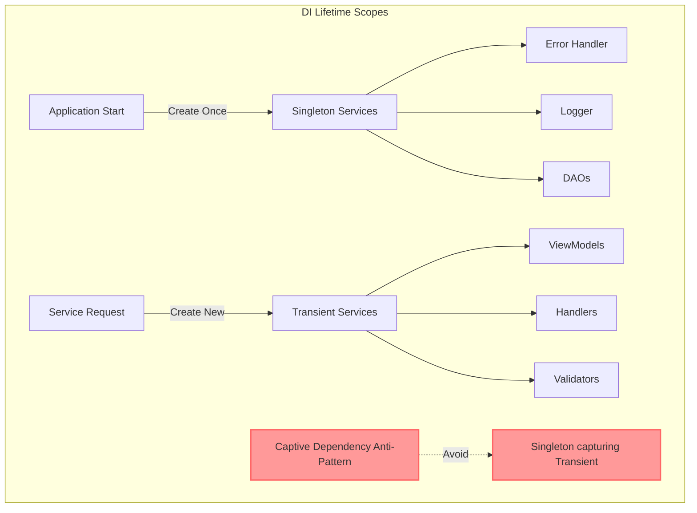

**Critical Anti-Pattern: Captive Dependency**
Singleton service capturing Transient dependency. This causes the Transient service to effectively become Singleton, violating its intended lifetime.

**Resolution:** Use IServiceProvider to resolve Transient dependencies on-demand instead of capturing in constructor.

**Action Items:**

1. Document service lifetime decisions
2. Review all dependency injection registrations
3. Test for captive dependency scenarios
4. Create unit test to verify correct lifetimes

---

### 12. Integration Testing Strategy for Handlers

**What's Missing:** No guidance on testing handlers that depend on database

**Why It Matters:** Integration tests verify that handlers work correctly with real database, catching issues that unit tests miss.

**Recommended Approaches:**

**Option A: Dedicated Test Database**
Create separate test database with same schema as production. Run integration tests against test database. Clean up test data after each test.

**Pros:** Tests run against real database engine, catches database-specific issues
**Cons:** Requires test database setup, slower than unit tests

**Option B: Transaction Rollback**
Run tests within database transaction, rollback after test completes. Leaves no test data in database.

**Pros:** Faster cleanup, no test data pollution
**Cons:** Some scenarios difficult to test (multi-transaction operations)

**Recommendation:** Use Option A with proper cleanup in test teardown methods.

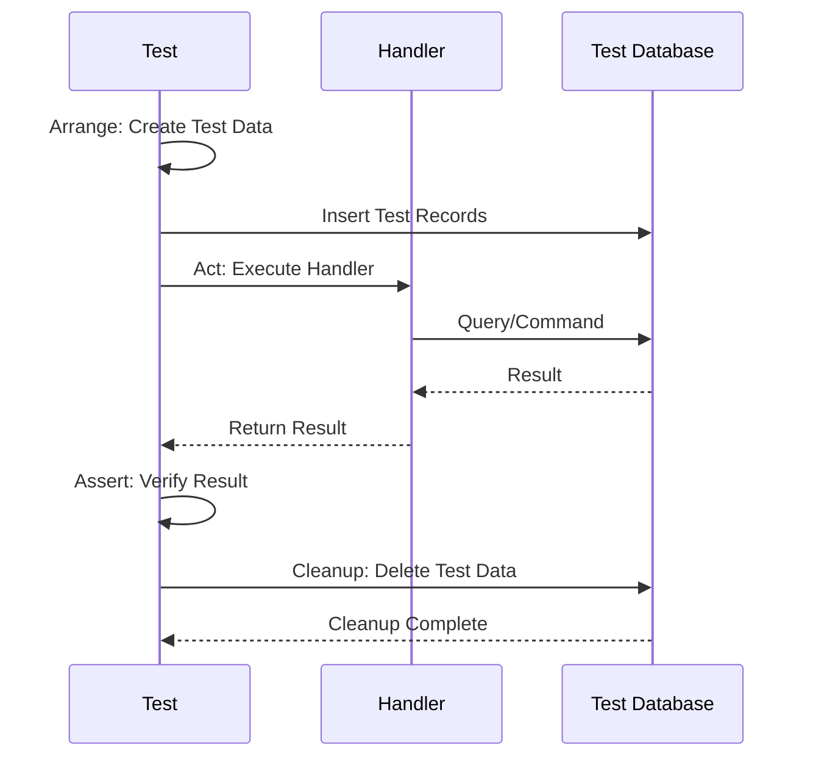

**Test Data Builders:**
Create builder pattern classes to simplify test data creation. Reduces boilerplate in test setup, makes tests more readable.

**Action Items:**

1. Set up dedicated test database
2. Create database initialization scripts
3. Implement test data builder pattern
4. Document integration test guidelines

---

## Impact Summary Table

| Enhancement | Impact Level | Implementation Effort | Priority Category |
|-------------|--------------|----------------------|-------------------|
| Performance Baselines | High | Medium | Critical |
| Database Migration Plan | High | High | Critical |
| Security & Audit Trail | High | Low | Critical |
| Exception Handling Strategy | Medium | Low | Important |
| Feature Flags | Medium | Medium | Important |
| Observability & Monitoring | Medium | Low | Important |
| CI/CD Pipeline | Low | High | Nice-to-Have |
| Developer Onboarding | Low | Low | Nice-to-Have |
| Code Review Checklist | Low | Low | Nice-to-Have |
| Glossary of Terms | Low | Low | Nice-to-Have |
| DI Scoping Strategy | Medium | Low | Advanced |
| Integration Testing | Medium | Medium | Advanced |

---

## Recommended Action Plan

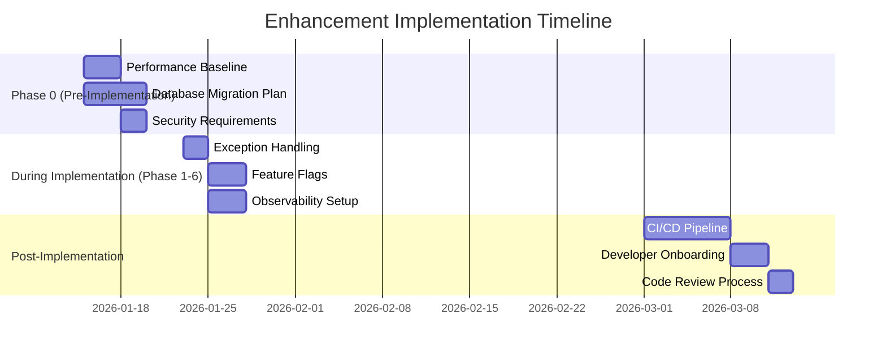

### Phase 0 (Pre-Implementation - Before Phase 1)

1. Add performance baseline measurements
2. Create database migration plan
3. Document security and audit requirements

### Phase 1-6 (During Implementation)

4. Implement exception handling strategy
5. Add feature flags for safe rollout
6. Configure observability and monitoring

### Post-Implementation

7. Set up CI/CD pipeline
8. Create developer onboarding guide
9. Establish code review process

---

## Decision Tracking

For each suggestion in this document, team should decide:

- **Accept:** Incorporate into implementation plan
- **Reject:** Document reason for rejection
- **Defer:** Schedule for future iteration

**Decision Log Template:**

| Enhancement | Decision | Rationale | Decided By | Date |
|-------------|----------|-----------|------------|------|
| Example | Accept | Critical for production | Team Lead | 2026-01-15 |

---

## Conclusion

The base implementation guide (MASTER_PROMPT.md) provides a solid foundation for rebuilding Module_Receiving. These suggestions represent enhancements that would further improve:

**Production Readiness:**

- Performance measurement and optimization
- Security and compliance requirements
- Monitoring and observability

**Team Scalability:**

- Developer onboarding and knowledge transfer
- Code review standards and quality assurance
- Automation and continuous integration

**Risk Mitigation:**

- Database migration and rollback procedures
- Feature flags for gradual rollout
- Comprehensive testing strategies

**Recommendation:** Incorporate Critical and Important enhancements before starting Phase 1. Add Nice-to-Have and Advanced items as the project matures and team gains experience with new patterns.

---

**End of Enhancement Suggestions**

