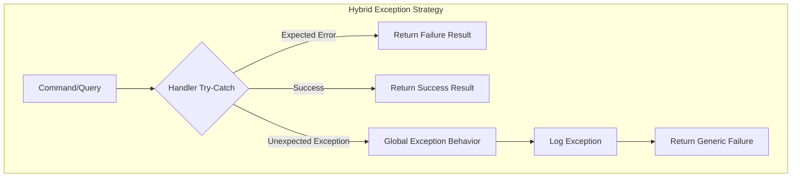
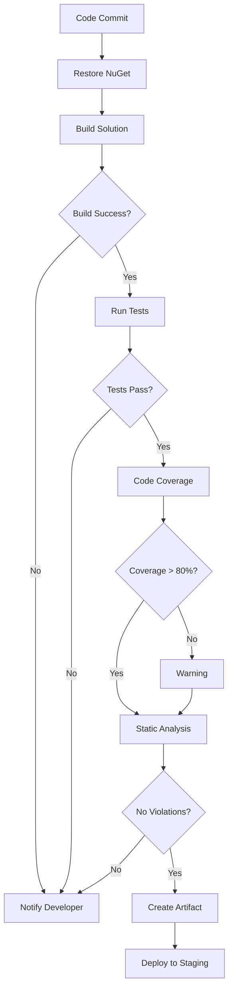

<style>
@media print {
  .page-break { page-break-after: always; }
  .keep-together { page-break-inside: avoid; }
  .avoid-break-before { page-break-before: avoid; }
  h1 { page-break-before: always; }
  h1:first-of-type { page-break-before: avoid; }
  h2 { page-break-after: avoid; }
  table { page-break-inside: avoid; margin: 1em 0; }
  pre, .mermaid { page-break-inside: avoid; margin: 1em 0; }
  
  /* Scale Mermaid diagrams to fit 8.5x11 page width */
  .mermaid, pre.mermaid {
    max-width: 100%;
    transform: scale(0.75);
    transform-origin: top left;
    margin-bottom: 2em;
  }
  
  /* Keep diagram containers properly sized */
  .keep-together {
    max-width: 100%;
    overflow: visible;
  }
}
</style>

# Module_Receiving Rebuild - Enhancement Suggestions

**Date:** January 15, 2026 | **Status:** Recommendations for Consideration

---

## Overview

This document identifies additional elements that could enhance the Module_Receiving rebuild to ensure a more comprehensive and production-ready implementation. Suggestions are organized by impact level and implementation complexity.

The base implementation guide (MASTER_PROMPT.md) is comprehensive and complete. These suggestions represent enhancements that would further improve robustness, reduce risk, and improve long-term maintainability.

<div class="page-break"></div>

## Critical Additions (High Impact)

### 1. Performance Baseline & Benchmarks

**What's Missing:** No performance baseline or target metrics defined

**Why It Matters:** Without performance metrics, there's no way to validate that the new architecture performs better than the old one. The MediatR pattern adds a small amount of overhead—this needs to be measured to ensure it doesn't negatively impact user experience.

**Recommended Addition:**

**Current State Baseline (to be measured before rebuild):**

- POEntry view load time
- Review view with 100 lines load time
- CSV export for 1000 lines duration
- Navigation between workflow steps duration

**Target Performance (Post-Rebuild):**

- POEntry view load time: under 200 milliseconds
- Review view with 100 lines: under 500 milliseconds
- CSV export for 1000 lines: under 3 seconds
- Navigation between workflow steps: under 100 milliseconds

**Performance Testing Strategy:**

- Use BenchmarkDotNet for handler performance measurement
- Use WinUI Performance Profiler for UI responsiveness
- Log database query execution times via structured logging
- Run performance test suite after each implementation phase
- Flag any performance degradation greater than 20%

_(See Diagram Appendix A: Performance Monitoring Flow - Page end of document)_

**Action Items:**

1. Measure current performance before starting rebuild
2. Define acceptable performance targets
3. Create automated performance test suite
4. Monitor performance after each phase

---

### 2. Database Migration & Rollback Strategy

**What's Missing:** No plan for handling existing data or potential schema changes

**Why It Matters:** Production deployments without rollback plans are high-risk. Existing data in receiving tables needs migration path. Schema changes require careful planning and testing.

**Recommended Addition:**

**Schema Change Assessment:**

- Review existing receiving_loads and receiving_lines tables
- Identify missing indexes that new query patterns may need
- Create database migration scripts for any schema updates
- Test all migrations on development database before production

**Data Migration Considerations:**

- Document count of in-progress receiving sessions
- Calculate size of historical data to preserve
- Create data validation scripts to verify migration correctness

**Rollback Plan:**

**Pre-Migration Backup:**

1. Full MySQL database dump of mtm_receiving_application database
2. Export all user sessions and preferences
3. Document current stored procedure versions

**Rollback Triggers (when to rollback):**

1. Critical bug discovered in production within 48 hours
2. Data loss or corruption detected
3. Performance degradation exceeding 50%

**Rollback Procedure:**

1. Restore MySQL database from pre-migration backup
2. Redeploy previous application version
3. Notify users of rollback reason and timeline

_(See Diagram Appendix B: Database Migration Rollback Flow - Page end of document)_

**Action Items:**

1. Create comprehensive backup before deployment
2. Test rollback procedure in staging environment
3. Document rollback decision criteria
4. Assign rollback decision authority

---

### 3. Security & Audit Trail Considerations

**What's Missing:** No discussion of security implications of new architecture

**Why It Matters:** Security and audit trails are constitutional requirements. The new MediatR pipeline provides an ideal location for centralized audit logging. Need to ensure sensitive data isn't logged and all critical operations are audited.

**Recommended Addition:**

**Sensitive Data Handling:**

- Ensure structured logging doesn't log personally identifiable information or credentials
- Verify FluentValidation rules cannot be bypassed
- Confirm stored procedures prevent SQL injection (already using stored procedures, but verify)

**Audit Trail Requirements:**

- All Insert, Update, and Delete commands logged with user context
- Structured logging includes UserId, SessionId, and Timestamp for all operations
- Critical operations (e.g., DeleteReceivingLine) require detailed audit trail

**MediatR Pipeline Audit Implementation:**
Create AuditBehavior that automatically logs all command executions with:

- User identifier who executed the command
- Timestamp of execution
- Command type and serialized command data
- Execution result (success/failure)

_(See Diagram Appendix C: Audit Trail Sequence - Page end of document)_

**Configuration Security:**

- Store connection strings in User Secrets, not in source code
- Restrict Serilog file paths to application data folder
- No hardcoded credentials in handlers or validators

**Action Items:**

1. Define sensitive data classification policy
2. Implement audit behavior in MediatR pipeline
3. Review all logging statements for sensitive data exposure
4. Create audit log retention policy

<div class="page-break"></div>

## Important Additions (Medium Impact)

### 4. Exception Handling Strategy for MediatR

**What's Missing:** No guidance on how to handle exceptions in handlers

**Why It Matters:** Consistent exception handling ensures predictable behavior. Without clear strategy, different handlers may handle exceptions differently, leading to inconsistent error messages and logging.

**Recommended Approaches:**

**Option 1: Try-Catch in Each Handler**
Each handler wraps its logic in try-catch block and returns failure result object instead of throwing exceptions. Provides fine-grained control over error handling per handler.

**Option 2: Global Exception Pipeline Behavior**
Create pipeline behavior that catches unhandled exceptions from all handlers and converts them to failure results. Provides consistency but less flexibility for handler-specific error handling.

**Option 3: Hybrid Approach (Recommended)**
Use try-catch in handlers for expected failures. Use global exception pipeline as safety net for unexpected exceptions.

<<<<<<< HEAD



=======
_(See Diagram Appendix D: Exception Handling Strategy - Page end of document)_
>>>>>>> 5d9f689 (Implement code changes to enhance functionality and improve performance)

**Action Items:**

1. Define exception handling strategy
2. Document expected vs unexpected exceptions
3. Create exception handling templates for handlers
4. Test exception scenarios in unit tests

---

### 5. Backward Compatibility & Feature Flags

**What's Missing:** No plan for gradual rollout or A/B testing

**Why It Matters:** All-or-nothing deployments are risky. Feature flags allow safe, incremental rollout and easy rollback if issues discovered.

**Recommended Addition:**

**Phased Rollout Strategy:**

- Phase 1: Deploy with feature flag OFF (old services still functional)
- Phase 2: Enable for internal testing (10% of users)
- Phase 3: Enable for pilot users (50% of users)
- Phase 4: Full rollout (100% of users)

_(See Diagram Appendix E: Phased Rollout Timeline - Page end of document)_

**Feature Flag Implementation:**
Create simple boolean flag that controls whether ViewModels use new MediatR path or old Service path. Allows real-time switching between implementations without redeployment.

**Migration Completion Criteria:**

- All ViewModels tested with MediatR path
- No regression bugs reported for one week
- Performance metrics within target ranges
- User feedback positive (above 80% satisfaction)

**Deprecation Timeline:**

- Week 1-2: Both code paths active, flag OFF by default
- Week 3-4: Flag ON for 50% of users, monitor metrics
- Week 5-6: Flag ON for 100%, mark old services as obsolete
- Week 7+: Remove old service code entirely

**Action Items:**

1. Implement feature flag infrastructure
2. Define rollout phases and success criteria
3. Create monitoring dashboard for A/B comparison
4. Document rollback procedure per phase

---

### 6. Observability & Monitoring

**What's Missing:** No discussion of production monitoring and metrics

**Why It Matters:** Can't improve what you don't measure. Observability is critical for identifying performance bottlenecks, error patterns, and user behavior in production.

**Recommended Addition:**

**Metrics to Track:**

- Handler execution time (average, 95th percentile, 99th percentile) for each handler
- Handler success rate (percentage of successful vs failed operations)
- Validation failure count by validation rule
- Data Access Object performance (query execution times per stored procedure)
- Error rate (errors per minute in production)

_(See Diagram Appendix F: Observability Architecture - Page end of document)_

**Structured Logging Enrichers:**
Configure Serilog to automatically add context to all log entries:

- Machine name (which server generated the log)
- Thread ID (concurrency debugging)
- Application name and module name
- Environment (Development, Staging, Production)

**Dashboard Recommendations:**

- Use Seq (free for local development) to visualize Serilog logs
- Use Application Insights (Azure) for production telemetry and monitoring
- Create dashboards showing handler performance, error rates, user sessions

**Alerting Rules:**

- Alert if error rate exceeds 10 errors per minute
- Alert if handler 95th percentile exceeds 2 seconds
- Alert if validation failure rate exceeds 20%

**Action Items:**

1. Configure structured logging enrichers
2. Set up log aggregation tool (Seq or Application Insights)
3. Create performance dashboards
4. Define and configure alerting rules

<div class="page-break"></div>

## Nice-to-Have Additions (Low Impact)

### 7. CI/CD Pipeline Integration

**What's Missing:** No build/deploy automation guidance

**Why It Matters:** Manual builds lead to inconsistency and "works on my machine" issues. Automated CI/CD ensures every commit is tested and deployable.

**Recommended Addition:**

**Build Pipeline Components:**

- Automated restore of NuGet dependencies
- Compilation with warnings treated as errors
- Automated test execution
- Code coverage reporting
- Static code analysis

<<<<<<< HEAD



=======
_(See Diagram Appendix G: CI/CD Pipeline Flow - Page end of document)_
>>>>>>> 5d9f689 (Implement code changes to enhance functionality and improve performance)

**Deployment Checklist:**

- Build succeeds without warnings
- All tests pass with 80%+ coverage
- Constitutional compliance checks pass
- Performance benchmarks within targets
- Security scan shows no vulnerabilities

**Action Items:**

1. Create build pipeline definition
2. Configure automated testing
3. Set up code coverage reporting
4. Integrate security scanning

---

### 8. Developer Onboarding Guide

**What's Missing:** No quick-start guide for new developers

**Why It Matters:** Clear onboarding reduces time-to-productivity and improves code quality by ensuring developers understand patterns before contributing.

**Recommended Addition:**

**First-Time Setup (15-minute checklist):**

**Prerequisites:**

- Visual Studio 2022 (version 17.8 or later)
- .NET 8 SDK installed
- MySQL 8.0 access (or connection to development database)

**Setup Steps:**

1. Clone repository
2. Restore NuGet packages via dotnet restore
3. Build solution via dotnet build
4. Run tests via dotnet test
5. Open in Visual Studio
6. Set startup project
7. Press F5 to run

_(See Diagram Appendix H: Developer Onboarding Flow - Page end of document)_

**Key Documents to Read First:**

1. Constitution - Core architectural principles
2. Module Architecture - Module-specific design decisions
3. Implementation Guide - This document
4. Copilot Instructions - Coding patterns and standards

**Common Development Tasks:**

**Adding New Handler:**

1. Create Query or Command class
2. Create corresponding Handler class
3. Register validator if needed (auto-discovered)
4. Add unit tests
5. Update ViewModel to use IMediator.Send

**Adding New Validator:**
Define validation rules in dedicated validator class inheriting from AbstractValidator

**Running Specific Tests:**
Use dotnet test with filter parameter to run subset of tests

**Action Items:**

1. Create onboarding checklist document
2. Record screen-share walkthrough video
3. Assign onboarding buddy for new developers
4. Collect feedback from first few onboarded developers

---

### 9. Code Review Checklist Template

**What's Missing:** No review criteria for new handlers and validators

**Why It Matters:** Consistent review criteria reduce defects and ensure code quality standards are maintained.

**Recommended Addition:**

**General Code Quality:**

- Code follows .editorconfig formatting rules
- No compiler warnings present
- XML documentation on all public APIs
- No TODO comments without corresponding task tracking

**MVVM Architecture Compliance:**

- ViewModels are partial classes
- ViewModels use ObservableProperty and RelayCommand attributes
- Views use compile-time binding (x:Bind)
- No business logic in XAML code-behind files

**MediatR Handler Standards:**

- Handler has single responsibility (one query OR one command)
- Handler includes structured logging
- Handler returns appropriate result type
- Handler includes exception handling if applicable
- Handler name follows naming pattern (VerbEntityHandler)

**FluentValidation Standards:**

- Validator exists for all command/query parameters
- Validator rules are comprehensive (not just NotEmpty checks)
- Validator includes meaningful error messages
- Validator is registered in dependency injection

**Testing Standards:**

- Unit tests exist for handler logic (with mocked dependencies)
- Unit tests exist for validator rules
- Integration tests for Data Access Object if new stored procedure
- Test coverage exceeds 80% for new code

**Documentation Standards:**

- README updated if public API changed
- Architecture document updated if design decision made
- Changelog entry added for this change

**Action Items:**

1. Create code review checklist template
2. Train team on review standards
3. Integrate checklist into pull request template
4. Track common review findings for improvement

---

### 10. Glossary of Terms

**What's Missing:** No glossary for domain-specific and architectural terminology

**Why It Matters:** Reduces onboarding confusion. New developers can reference glossary instead of interrupting team members for clarification.

**Recommended Addition:**

**Architecture Terms:**

- CQRS: Command Query Responsibility Segregation - separates read and write operations
- MediatR: In-process messaging library implementing mediator pattern
- Handler: Class that processes a specific query or command
- Pipeline Behavior: Cross-cutting concern applied to all handlers
- FluentValidation: Library for building strongly-typed validation rules

**Domain Terms:**

- Receiving Line: Individual item being received (corresponds to PO line)
- Receiving Load: Collection of receiving lines (represents shipment)
- Package Type: Container type (box, pallet, custom)
- Heat Lot: Batch identifier for materials (metallurgy traceability)
- PO Number: Purchase order identifier from Infor Visual ERP
- Part ID: Stock keeping unit or part number from Infor Visual

**Code Pattern Terms:**

- ObservableProperty: Source generator attribute for property change notification
- RelayCommand: Source generator attribute for ICommand implementation
- x:Bind: WinUI 3 compile-time data binding syntax
- Model_Dao_Result: Result object pattern for Data Access Object operations

**Action Items:**

1. Create glossary document
2. Keep glossary updated as project evolves
3. Link glossary from onboarding guide
4. Review glossary during team meetings

<div class="page-break"></div>

## Advanced Considerations (Expert Level)

### 11. Dependency Injection Scoping Strategy

**What's Missing:** No guidance on service lifetimes for MediatR handlers and dependencies

**Why It Matters:** Incorrect dependency injection scoping causes subtle bugs like stale data, memory leaks, or premature disposal of services.

**Key Concepts:**

**Singleton (Shared State, Stateless):**
Services that are created once and shared across entire application lifetime. Should be thread-safe and stateless.

**Examples:** Error Handler, Logging Utility (replaced by Serilog ILogger), Data Access Objects

**Transient (New Instance Every Time):**
Services that are created each time they're requested. Suitable for lightweight, stateless operations.

**Examples:** All ViewModels, All MediatR Handlers (default), All Validators

**Scoped (Not Applicable):**
Services that live for duration of a request scope. Not applicable in WinUI desktop applications (no HTTP request scope).

_(See Diagram Appendix I: Dependency Injection Scoping - Page end of document)_

**Critical Anti-Pattern: Captive Dependency**
Singleton service capturing Transient dependency. This causes the Transient service to effectively become Singleton, violating its intended lifetime.

**Resolution:** Use IServiceProvider to resolve Transient dependencies on-demand instead of capturing in constructor.

**Action Items:**

1. Document service lifetime decisions
2. Review all dependency injection registrations
3. Test for captive dependency scenarios
4. Create unit test to verify correct lifetimes

---

### 12. Integration Testing Strategy for Handlers

**What's Missing:** No guidance on testing handlers that depend on database

**Why It Matters:** Integration tests verify that handlers work correctly with real database, catching issues that unit tests miss.

**Recommended Approaches:**

**Option A: Dedicated Test Database**
Create separate test database with same schema as production. Run integration tests against test database. Clean up test data after each test.

**Pros:** Tests run against real database engine, catches database-specific issues
**Cons:** Requires test database setup, slower than unit tests

**Option B: Transaction Rollback**
Run tests within database transaction, rollback after test completes. Leaves no test data in database.

**Pros:** Faster cleanup, no test data pollution
**Cons:** Some scenarios difficult to test (multi-transaction operations)

**Recommendation:** Use Option A with proper cleanup in test teardown methods.

_(See Diagram Appendix J: Integration Testing Flow - Page end of document)_

**Test Data Builders:**
Create builder pattern classes to simplify test data creation. Reduces boilerplate in test setup, makes tests more readable.

**Action Items:**

1. Set up dedicated test database
2. Create database initialization scripts
3. Implement test data builder pattern
4. Document integration test guidelines

<div class="page-break"></div>

## Impact Summary Table

<div class="keep-together">

| Enhancement | Impact Level | Implementation Effort | Priority Category |
|-------------|--------------|----------------------|-------------------|
| Performance Baselines | High | Medium | Critical |
| Database Migration Plan | High | High | Critical |
| Security & Audit Trail | High | Low | Critical |
| Exception Handling Strategy | Medium | Low | Important |
| Feature Flags | Medium | Medium | Important |
| Observability & Monitoring | Medium | Low | Important |
| CI/CD Pipeline | Low | High | Nice-to-Have |
| Developer Onboarding | Low | Low | Nice-to-Have |
| Code Review Checklist | Low | Low | Nice-to-Have |
| Glossary of Terms | Low | Low | Nice-to-Have |
| DI Scoping Strategy | Medium | Low | Advanced |
| Integration Testing | Medium | Medium | Advanced |

</div>

<div class="page-break"></div>

## Recommended Action Plan


### Phase 0 (Pre-Implementation - Before Phase 1)

1. Add performance baseline measurements
2. Create database migration plan
3. Document security and audit requirements

### Phase 1-6 (During Implementation)

1. Implement exception handling strategy
2. Add feature flags for safe rollout
3. Configure observability and monitoring

### Post-Implementation

1. Set up CI/CD pipeline
2. Create developer onboarding guide

_(See Diagram Appendix K: Enhancement Implementation Timeline - Page end of document)_
<div class="page-break"></div>

## Decision Tracking

<div class="avoid-break-before">

## Decision Tracking

For each suggestion in this document, team should decide:

<div class="keep-together">

**Decision Log Template:**

| Enhancement | Decision | Rationale | Decided By | Date |
|-------------|----------|-----------|------------|------|
| Example | Accept | Critical for production | Team Lead | 2026-01-15 |

</div>

<div class="page-break"></div>nhancement | Decision | Rationale | Decided By | Date |
|-------------|----------|-----------|------------|------|
| Example | Accept | Critical for production | Team Lead | 2026-01-15 |

---

## Conclusion

The base implementation guide (MASTER_PROMPT.md) provides a solid foundation for rebuilding Module_Receiving. These suggestions represent enhancements that would further improve:

**Production Readiness:**

- Performance measurement and optimization
- Security and compliance requirements
- Monitoring and observability

**Team Scalability:**

- Developer onboarding and knowledge transfer
- Code review standards and quality assurance
- Automation and continuous integration

**Risk Mitigation:**

- Database migration and rollback procedures
- Feature flags for gradual rollout
- Comprehensive testing strategies

**Recommendation:** Incorporate Critical and Important enhancements before starting Phase 1. Add Nice-to-Have and Advanced items as the project matures and team gains experience with new patterns.

<div class="page-break"></div>

---

# DIAGRAM APPENDIX

## Diagram Appendix A: Performance Monitoring Flow

**Purpose:** Illustrates the iterative process of measuring, implementing, and validating performance throughout the rebuild to ensure the new architecture meets or exceeds baseline performance.

<div class="keep-together">


</div>

### Component Descriptions

**[1] Measure Current Baseline**

- **Purpose:** Establish quantitative starting point before any changes
- **Activities:** Run performance profiler, measure view load times, record database query durations, capture user interaction responsiveness
- **Output:** Baseline metrics document with concrete numbers (milliseconds, seconds, operations per second)

**[2] Define Target Metrics**

- **Purpose:** Set acceptable performance thresholds for post-rebuild application
- **Activities:** Review baseline, consult stakeholders, set realistic targets (typically baseline ± 10-20%)
- **Constraint:** Targets must be measurable and achievable with chosen architecture

**[3] Implement Phase**

- **Purpose:** Execute one implementation phase from main guide (Phase 1 through 6)
- **Duration:** 1-2 weeks depending on phase complexity
- **Output:** Working code committed to version control

**[4] Run Benchmarks**

- **Purpose:** Measure performance after phase completion
- **Tools:** BenchmarkDotNet for handler timing, WinUI Performance Profiler for UI responsiveness
- **Output:** Performance metrics for comparison to baseline and targets

**[5] Performance OK Decision Point**

- **Purpose:** Validate performance meets targets before proceeding
- **Criteria:** All metrics within target range, no degradation exceeding 20%
- **Decision:** Proceed to next phase OR investigate performance issues

**[6] Continue to Next Phase**

- **Purpose:** Advance to next implementation phase
- **Condition:** Performance validated, no blocking issues
- **Action:** Begin next phase implementation

**[7] Investigate & Optimize**

- **Purpose:** Identify and resolve performance bottlenecks
- **Activities:** Profile slow operations, review database queries, optimize handler logic, consider caching
- **Loop:** Returns to "Run Benchmarks" after optimization

**[8] All Phases Complete Decision Point**

- **Purpose:** Determine if all six implementation phases finished
- **Decision:** Continue implementing OR proceed to production readiness

**[9] Production Ready**

- **Purpose:** Final validation before deployment
- **Criteria:** All phases complete, all performance targets met, comprehensive testing passed
- **Outcome:** Application ready for production deployment

### Key Insights

**Why This Matters:**

- Prevents performance regressions from being discovered in production
- Provides objective data for architecture decisions
- Identifies bottlenecks early when they're easier to fix
- Validates that MediatR overhead is acceptable

**Recommended Frequency:**

- Measure baseline: Once before starting Phase 1
- Run benchmarks: After completing each of the 6 phases
- Full performance audit: Before production deployment

<div class="page-break"></div>

## Diagram Appendix B: Database Migration Rollback Flow

**Purpose:** Decision tree for production deployment monitoring and rollback procedure to minimize risk of data loss or prolonged downtime during Module_Receiving deployment.

<div class="keep-together">


</div>

### Component Descriptions

**[1] Production Deployment**

- **Purpose:** Deploy new Module_Receiving architecture to production environment
- **Prerequisites:** All tests passing, performance validated, database backup created
- **Timing:** Typically performed during low-usage window (evening or weekend)

**[2] Monitor for 48 Hours Decision Point**

- **Purpose:** Active surveillance period for deployment issues
- **Activities:** Watch error logs, monitor performance metrics, collect user feedback, verify data integrity
- **Duration:** 48 hours provides balance between catching issues and allowing rollback window

**[3] Success**

- **Purpose:** Deployment completed without issues
- **Criteria:** No critical bugs, no data loss, performance within acceptable range, user feedback positive
- **Next Steps:** Continue monitoring, plan removal of old code paths

**[4] Rollback Decision**

- **Purpose:** Centralized decision point for determining if rollback necessary
- **Authority:** Should be designated authority (Tech Lead, Product Owner, or senior developer)
- **Triggers:** Critical bug OR data loss OR severe performance degradation

**Rollback Trigger: Critical Bug**

- **Definition:** Bug that prevents core functionality (cannot receive items, cannot save data, application crashes)
- **Examples:** Unable to create receiving lines, database connection failures, data corruption
- **Severity:** Blocks primary user workflows

**Rollback Trigger: Data Loss**

- **Definition:** User data disappearing, incorrect data stored, or inability to retrieve saved information
- **Examples:** Receiving lines not saving, package data missing, historical records corrupted
- **Severity:** Highest priority - data integrity is paramount

**Rollback Trigger: Performance > 50% Degradation**

- **Definition:** Operation times exceed 50% longer than baseline measurements
- **Examples:** View load time 300ms vs 150ms baseline, query execution 3 seconds vs 1.5 seconds
- **Threshold:** 50% degradation significantly impacts user experience

**[5] Restore DB from Backup**

- **Purpose:** Return database to pre-deployment state
- **Process:** Execute MySQL restore from full backup created before deployment
- **Validation:** Verify data integrity after restore, confirm record counts match pre-deployment

**[6] Redeploy Previous Version**

- **Purpose:** Return application code to previous stable version
- **Process:** Deploy previous release from version control or artifact repository
- **Validation:** Confirm application starts, connects to database, core functions operational

**[7] Notify Users**

- **Purpose:** Communicate rollback and expected timeline
- **Channels:** Email, in-application notification, status page
- **Message:** Explain issue encountered, rollback completed, timeline for retry

**[8] Investigate Root Cause**

- **Purpose:** Understand what caused the deployment failure
- **Activities:** Review logs, reproduce issue in development, analyze performance data
- **Output:** Root cause analysis document

**[9] Fix & Replan Deployment**

- **Purpose:** Address root cause and prepare for second deployment attempt
- **Activities:** Implement fix, add regression tests, revalidate performance, create updated deployment plan
- **Timeline:** Determined by issue complexity

### Key Insights

**Why 48 Hours:**

- Catches most critical issues while still within acceptable rollback window
- Balances risk detection with operational overhead
- Long enough to see patterns in user behavior and edge cases

**Prevention Strategies:**

- Comprehensive testing in staging environment
- Feature flags for gradual rollout (see Diagram E)
- Performance baseline validation before deployment
- Database backup automation

<div class="page-break"></div>

## Diagram Appendix C: Audit Trail Sequence

**Purpose:** Sequence diagram showing how MediatR pipeline behavior automatically captures audit trail for all command executions, providing security compliance and troubleshooting capability.

<div class="keep-together">


</div>

### Component Descriptions

**[1] ViewModel**

- **Role:** User interface logic layer
- **Action:** Sends command to Mediator when user triggers operation (e.g., clicks "Save")
- **Responsibility:** Collects user input, initiates business operation

**[2] MediatR**

- **Role:** Request dispatcher and pipeline coordinator
- **Action:** Routes command through registered pipeline behaviors before reaching handler
- **Benefit:** Decouples ViewModel from pipeline behaviors (audit, logging, validation)

**[3] AuditBehavior (Pipeline Entry)**

- **Role:** Cross-cutting concern for audit trail capture
- **Action:** Intercepts command before handler execution
- **Pattern:** Wraps handler execution, runs before and after

**[4] Log: Command Start**

- **Role:** Capture audit entry at operation start
- **Data Logged:** User identifier, session ID, timestamp, command type, command parameters (excluding sensitive data)
- **Purpose:** Create audit trail of who initiated what operation when

**[5] Execute Handler**

- **Role:** Forward command to appropriate handler for business logic execution
- **Note:** Handler executes normally, unaware of audit behavior wrapping it

**[6] Handler**

- **Role:** Execute specific business operation
- **Action:** Performs single responsibility (e.g., InsertReceivingLine)
- **Dependency:** Injects Data Access Object for database operations

**[7] Perform Operation (Database)**

- **Role:** Execute stored procedure or query
- **Technology:** MySQL stored procedure execution
- **Result:** Success/failure with affected rows or error message

**[8] Result (Database → Handler)**

- **Role:** Return operation outcome to handler
- **Format:** Structured result object with success flag, data, or error message

**[9] Return Result (Handler → AuditBehavior)**

- **Role:** Handler returns result to audit behavior
- **Content:** Success/failure indication, any relevant data

**[10] Log: Command Complete**

- **Role:** Capture audit entry at operation completion
- **Data Logged:** Execution duration, success/failure status, error message if failed, affected record count
- **Purpose:** Complete audit trail showing operation outcome

**[11] Return Result (AuditBehavior → MediatR)**

- **Role:** Audit behavior returns result to Mediator after logging
- **Note:** Result unchanged, audit behavior is transparent to caller

**[12] Return Result (MediatR → ViewModel)**

- **Role:** Final result delivery to ViewModel
- **Action:** ViewModel updates UI based on success/failure

### Key Insights

**Automatic Audit Trail:**

- Every command automatically logged without developer intervention
- Consistent format across all operations
- No code duplication in handlers

**Security Compliance:**

- Provides "who did what when" for all state-changing operations
- Tamper-resistant logging to immutable log files
- Supports compliance requirements (SOX, HIPAA, GDPR audit requirements)

**Troubleshooting Value:**

- Reconstruct user actions leading to issues
- Identify performance bottlenecks (execution duration)
- Verify operations completed successfully in production

**Sensitive Data Handling:**

- Audit behavior must redact sensitive information before logging
- Examples: Don't log passwords, credit card numbers, personal health information
- Log command type and identifiers, not full payload

<div class="page-break"></div>

## Diagram Appendix D: Exception Handling Strategy

**Purpose:** Visualizes the hybrid exception handling approach combining handler-level try-catch for expected errors with global pipeline behavior for unexpected exceptions.

<div class="keep-together">


</div>

### Component Descriptions

**[1] Command/Query**

- **Role:** Incoming request from ViewModel via Mediator
- **Examples:** InsertReceivingLineCommand, GetPackagesByPoQuery
- **Entry Point:** Enters handler for processing

**[2] Handler Try-Catch Decision Point**

- **Role:** Handler executes business logic within try-catch block
- **Purpose:** Catch both expected and unexpected errors
- **Paths:** Expected error, success, or unexpected exception

**Expected Error Path:**

- **Definition:** Errors that are anticipated and handled explicitly
- **Examples:** Validation failure (PO number not found), business rule violation (duplicate receiving line), database constraint violation
- **Handling:** Catch specific exception types, create user-friendly error message, return failure result

**[3] Return Failure Result**

- **Role:** Structured result object indicating operation failed
- **Content:** Success=false, error message, severity level, optional error code
- **Benefit:** Consistent error format for ViewModel to display to user

**[4] Return Success Result**

- **Role:** Structured result object indicating operation succeeded
- **Content:** Success=true, any returned data, optional success message
- **Flow:** Normal path when operation completes without errors

**Unexpected Exception Path:**

- **Definition:** Errors that were not anticipated (programming bugs, infrastructure failures)
- **Examples:** Null reference exception, database connection timeout, out of memory error
- **Handling:** Not caught by handler try-catch, bubbles up to global pipeline behavior

**[5] Global Exception Behavior**

- **Role:** Safety net pipeline behavior that catches unhandled exceptions
- **Purpose:** Prevent exceptions from crashing application, provide consistent error response
- **Pattern:** Last-chance exception handler

**[6] Log Exception**

- **Role:** Capture full exception details for debugging
- **Data Logged:** Exception type, message, stack trace, handler name, command data
- **Severity:** Error or Critical level

**[7] Return Generic Failure**

- **Role:** Return safe error message to user
- **Message:** Generic error (avoid exposing stack traces or internal details to users)
- **Example:** "An unexpected error occurred. Please try again or contact support."

### Key Insights

**Why Hybrid Approach:**

- Expected errors: Handler has context to create meaningful error messages
- Unexpected errors: Global behavior prevents crashes and logs for debugging
- Balance: Flexibility for handler-specific handling with safety net for unforeseen issues

**Expected vs Unexpected:**

- **Expected:** Can be handled gracefully with user-actionable message
- **Unexpected:** Indicate programming defects that need fixing

**Implementation Guidance:**

- Handlers: Catch specific exception types that are expected (DbException, ValidationException)
- Global Behavior: Catch generic Exception type as last resort
- Testing: Write unit tests for both expected error paths and exception scenarios

**User Experience:**

- Expected errors: Show specific, helpful error messages
- Unexpected errors: Show generic error, log details for support team

<div class="page-break"></div>

## Diagram Appendix E: Phased Rollout Timeline

**Purpose:** Gantt chart showing recommended timeline for gradual feature rollout using feature flags to minimize risk and enable safe rollback.

<div class="keep-together">


</div>

### Phase Descriptions

**Milestone: Flag OFF (Old Code Active) - Day 0**

- **Purpose:** Deploy new code with feature flag disabled
- **State:** New handlers exist but are not called; old service code still active
- **Risk:** Minimal - new code deployed but not executed
- **Validation:** Deployment succeeds, application runs normally on old code path

**Phase 1: Internal Testing (10%) - Week 1**

- **Purpose:** Enable new MediatR architecture for internal development team only
- **Audience:** 10% of users (developers, QA team)
- **Activities:** Test all workflows, verify performance, collect feedback
- **Success Criteria:** Zero blocking bugs, performance within targets, positive team feedback

**Phase 2: Pilot Users (50%) - Week 2**

- **Purpose:** Expand to selected pilot users for real-world validation
- **Audience:** 50% of total user base (includes power users and diverse use cases)
- **Activities:** Monitor error rates, performance metrics, user feedback
- **Success Criteria:** Error rate under 2%, no data loss incidents, user satisfaction above 80%

**Phase 3: Full Rollout (100%) - Week 3**

- **Purpose:** Enable new architecture for all users
- **Audience:** 100% of user base
- **Activities:** Continue monitoring, be prepared for quick rollback if needed
- **Success Criteria:** Stable error rates, performance maintained, positive feedback trend

**Phase 4: Remove Old Code - Week 4**

- **Purpose:** Clean up deprecated service code
- **State:** Feature flag removed, only MediatR code path remains
- **Activities:** Delete old service classes, remove feature flag checks, update documentation
- **Note:** Mark as "critical" because this is point of no return (no easy rollback after code deletion)

### Key Insights

**Benefits of Phased Rollout:**

- **Risk Reduction:** Issues discovered with small user subset before full impact
- **Quick Rollback:** Feature flag can be toggled OFF instantly without redeployment
- **A/B Comparison:** Can compare metrics between old and new code paths
- **Confidence Building:** Gradual expansion builds team confidence

**Feature Flag Implementation:**

- Simple boolean configuration value
- Checked in ViewModel before sending request to Mediator vs Service
- Can be toggled remotely without application restart (configuration file or database setting)

**When to Rollback:**

- Phase 1: Any blocking bug discovered
- Phase 2: Error rate exceeds 5%, major functionality broken, performance degradation over 30%
- Phase 3: Critical bug affecting majority of users
- Phase 4: Cannot rollback easily after old code removed

**Timeline Flexibility:**

- Extend phases if issues discovered (better to delay than rush)
- Compress timeline if all validation passes early
- Recommended total: 4 weeks from deployment to full adoption

<div class="page-break"></div>

## Diagram Appendix F: Observability Architecture

**Purpose:** System diagram showing how structured logging, metrics collection, and alerting work together to provide production visibility and enable proactive issue detection.

<div class="keep-together">


</div>

### Component Descriptions

**[1] Application**

- **Role:** Module_Receiving application executing in production
- **Output:** Structured log entries and performance metrics
- **Instrumentation:** Serilog logging in all handlers and pipeline behaviors

**[2] Serilog (Structured Logs)**

- **Role:** Logging framework that captures semantic log data
- **Format:** JSON-structured log entries with properties (not plain text)
- **Example:** `{"Timestamp": "2026-01-15T10:30:00", "HandlerName": "InsertReceivingLineHandler", "UserId": "JDoe", "Duration": 45, "Success": true}`

**[3] Log Aggregation**

- **Role:** Collect logs from all application instances
- **Process:** Serilog writes to file sinks, aggregation tool reads files or receives HTTP posts
- **Benefit:** Centralized view of logs from multiple servers/instances

**[4] Seq/App Insights (Analysis Platform)**

- **Role:** Log storage, indexing, search, and visualization
- **Options:** Seq (self-hosted, free for development), Azure Application Insights (cloud, production)
- **Capabilities:** Full-text search, filter by properties, time-series analysis

**[5] Dashboards**

- **Role:** Visual representation of application health and performance
- **Widgets:** Error rate over time, handler execution times, validation failure counts, user activity graphs
- **Audience:** Development team, operations team, stakeholders

**[6] Alerting Rules**

- **Role:** Automated threshold monitoring with notifications
- **Examples:** Alert if error rate exceeds 10/minute, alert if p95 latency exceeds 2 seconds
- **Configuration:** Thresholds defined based on baseline measurements

**[7] Performance Counters (Metrics)**

- **Role:** Numeric measurements of application behavior
- **Examples:** Handler execution duration, database query time, memory usage, request count
- **Collection:** Logged via Serilog metrics or dedicated metrics library

**[8] Alert Notifications**

- **Role:** Immediate notification when threshold exceeded
- **Channels:** Email, Slack, Teams, SMS, PagerDuty
- **Content:** Which rule triggered, current value, threshold, link to dashboard

**[9] Development Team**

- **Role:** Human monitors and responders
- **Activities:** Review dashboards during business hours, respond to alerts, investigate anomalies
- **Benefit:** Proactive issue detection before users report problems

### Data Flow

**Normal Operation:**

1. Application executes handler
2. Serilog captures structured log entry with execution details
3. Performance counter records execution duration
4. Logs and metrics aggregated to central platform
5. Dashboards update with new data
6. Team monitors dashboards periodically

**Alert Scenario:**

1. Error rate suddenly increases
2. Alerting rule detects threshold exceeded
3. Alert notification sent to team
4. Team reviews dashboard for context
5. Team investigates root cause
6. Team deploys fix or rollback

### Key Insights

**Why Structured Logging:**

- Can query logs by property (e.g., "show all errors for user JDoe")
- Enables dashboards and charts (count errors by handler name)
- Better than plain text logs for analysis

**Recommended Metrics:**

- **Error Rate:** Errors per minute (target: under 5)
- **Handler Latency:** p50, p95, p99 execution time (target: p95 under 500ms)
- **Validation Failures:** Count by validation rule (identify common data quality issues)
- **Database Performance:** Query execution time per stored procedure

**Alerting Best Practices:**

- Set thresholds based on baseline + margin (e.g., baseline error rate 2/min, alert at 10/min)
- Avoid alert fatigue (too many alerts lead to ignoring)
- Include context in alerts (current value, historical trend, link to dashboard)

<div class="page-break"></div>

## Diagram Appendix G: CI/CD Pipeline Flow

**Purpose:** Automated build and deployment pipeline ensuring every code commit is tested, validated, and deployable, preventing "works on my machine" issues.

<div class="keep-together">


</div>

### Component Descriptions

**[1] Code Commit**

- **Trigger:** Developer pushes code to version control (Git)
- **Action:** Automated pipeline execution begins
- **Platform:** GitHub Actions, Azure DevOps, GitLab CI, or similar

**[2] Restore NuGet**

- **Purpose:** Download all project dependencies
- **Command:** `dotnet restore`
- **Duration:** 30-60 seconds (cached on subsequent runs)

**[3] Build Solution**

- **Purpose:** Compile all projects in solution
- **Command:** `dotnet build -c Release`
- **Options:** Warnings treated as errors to enforce code quality

**[4] Build Success Decision**

- **Purpose:** Verify compilation succeeded
- **Failure Causes:** Syntax errors, missing references, version conflicts
- **Next Steps:** Success continues to tests, failure notifies developer

**[5] Notify Developer**

- **Purpose:** Alert developer of pipeline failure
- **Channels:** Email, Slack, Teams, in-IDE notification
- **Content:** Which step failed, error message, link to build logs

**[6] Run Tests**

- **Purpose:** Execute all unit and integration tests
- **Command:** `dotnet test`
- **Scope:** ViewModels, handlers, validators, Data Access Objects

**[7] Tests Pass Decision**

- **Purpose:** Verify all tests passed
- **Failure Causes:** Regression bugs, new code not covered by tests, environment issues
- **Threshold:** 100% of tests must pass (zero tolerance for failing tests)

**[8] Code Coverage**

- **Purpose:** Measure percentage of code exercised by tests
- **Tool:** Coverlet, dotCover, or built-in coverage tools
- **Metric:** Line coverage, branch coverage

**[9] Coverage > 80% Decision**

- **Purpose:** Enforce minimum test coverage threshold
- **Threshold:** 80% is industry standard balance between quality and effort
- **Flexibility:** Warning allows build to continue but flags issue

**[10] Warning**

- **Purpose:** Flag coverage below threshold without failing build
- **Action:** Notify team, create work item to add tests
- **Rationale:** Balances quality with pragmatism (some legacy code may have lower coverage)

**[11] Static Analysis**

- **Purpose:** Automated code quality checks
- **Tools:** Roslyn analyzers, SonarQube, StyleCop
- **Checks:** Code style violations, security vulnerabilities, code smells, cyclomatic complexity

**[12] No Violations Decision**

- **Purpose:** Verify code meets quality standards
- **Violations:** Security issues (SQL injection, hardcoded secrets), style violations, maintainability issues
- **Action:** Fail build if critical violations, warn for minor issues

**[13] Create Artifact**

- **Purpose:** Package compiled application for deployment
- **Output:** Zip file, Docker image, NuGet package, or installer
- **Versioning:** Semantic versioning (major.minor.patch)

**[14] Deploy to Staging**

- **Purpose:** Automatically deploy to staging environment for final validation
- **Environment:** Staging should mirror production (same database schema, configuration)
- **Validation:** Smoke tests run in staging before promotion to production

### Key Insights

**Automation Benefits:**

- **Consistency:** Every commit tested the same way
- **Speed:** Immediate feedback (build completes in 5-10 minutes)
- **Confidence:** Can deploy any green build to production
- **Documentation:** Pipeline defines build process as code

**Failure Recovery:**

- Failed builds prevent bad code from reaching staging/production
- Developer notified immediately to fix issue
- Blocks pull request merge until build passes

**Continuous Deployment:**

- Can extend pipeline to automatically deploy staging builds to production
- Requires high test coverage and confidence in automation
- Typically gated by manual approval for production deployment

**Best Practices:**

- Run fast tests first (unit tests before integration tests)
- Fail fast (stop pipeline at first failure)
- Keep build time under 10 minutes for developer productivity
- Cache dependencies to speed up subsequent builds

<div class="page-break"></div>

## Diagram Appendix H: Developer Onboarding Flow

**Purpose:** Step-by-step workflow for new developers setting up local development environment, highlighting common issues and validation checkpoints.

<div class="keep-together">


</div>

### Component Descriptions

**[1] New Developer**

- **Starting Point:** Developer assigned to work on Module_Receiving
- **Goal:** Set up local development environment in under 15 minutes
- **Resources Needed:** Access to Git repository, development database, documentation

**[2] Prerequisites Check**

- **Purpose:** Verify required tools installed before proceeding
- **Required:** Visual Studio 2022 17.8+, .NET 8 SDK, MySQL 8.0 client
- **Validation:** Run `dotnet --version`, `mysql --version` in terminal
- **Action:** Install missing prerequisites before continuing

**[3] Clone Repository**

- **Purpose:** Download source code to local machine
- **Command:** `git clone <repository-url>`
- **Tip:** Use SSH keys for authentication (faster than password)

**[4] Restore NuGet**

- **Purpose:** Download all project dependencies
- **Command:** `dotnet restore` or let Visual Studio restore automatically
- **Duration:** 1-2 minutes for first restore

**[5] Build Solution**

- **Purpose:** Compile all projects
- **Command:** `dotnet build` or press Ctrl+Shift+B in Visual Studio
- **Expected Outcome:** Zero errors, zero warnings

**[6] Build Success Decision**

- **Purpose:** Validate environment correctly configured
- **Success:** All projects compile cleanly
- **Failure:** Missing dependencies, version conflicts, environment issues

**[7] Check Prerequisites (Failure Loop)**

- **Purpose:** Troubleshoot build failures
- **Common Issues:** Wrong .NET version, missing workloads in Visual Studio, proxy/firewall blocking NuGet
- **Action:** Verify prerequisites, update Visual Studio, clear NuGet cache
- **Loop:** Return to prerequisites check after fixes applied

**[8] Run Tests**

- **Purpose:** Validate environment can execute tests
- **Command:** `dotnet test` or use Test Explorer in Visual Studio
- **Expected:** All tests pass (green)

**[9] Tests Pass Decision**

- **Purpose:** Validate database connectivity and test infrastructure
- **Success:** 100% tests passing
- **Failure:** Database connection errors, missing test data, environment differences

**[10] Check Database Connection (Failure Loop)**

- **Purpose:** Troubleshoot test failures
- **Common Issues:** Database not running, wrong connection string, missing schema/stored procedures
- **Action:** Verify MySQL service running, check connection string in appsettings.json, run database setup scripts
- **Loop:** Return to NuGet restore after fixes (may need to rebuild)

**[11] Read Documentation**

- **Purpose:** Understand project architecture before coding
- **Documents:** Constitution, Implementation Guide, Module README, Copilot Instructions
- **Duration:** 30-60 minutes of reading
- **Benefit:** Prevents architectural violations and antipatterns

**[12] Ready to Develop**

- **State:** Environment validated, tests passing, documentation read
- **Next Steps:** Pick up first task from backlog, ask questions in team chat
- **Support:** Assign onboarding buddy for first week

### Common Onboarding Issues

**Issue 1: Build Fails with "SDK not found"**

- **Cause:** .NET 8 SDK not installed or wrong version
- **Solution:** Download from dot.net/download, restart Visual Studio

**Issue 2: Tests Fail with "Connection refused"**

- **Cause:** MySQL not running or connection string incorrect
- **Solution:** Start MySQL service, verify connection string matches local configuration

**Issue 3: NuGet Restore Times Out**

- **Cause:** Corporate proxy blocking NuGet.org
- **Solution:** Configure NuGet proxy settings, use internal package feed

**Issue 4: Project Won't Load in Visual Studio**

- **Cause:** Missing workload (e.g., .NET desktop development not installed)
- **Solution:** Run Visual Studio Installer, add required workloads

### Onboarding Checklist

- [ ] Prerequisites verified (Visual Studio, .NET SDK, MySQL client)
- [ ] Repository cloned successfully
- [ ] NuGet packages restored
- [ ] Solution builds with zero errors and warnings
- [ ] All tests passing (100% green)
- [ ] Database connection validated
- [ ] Constitution and implementation guide read
- [ ] Copilot instructions reviewed
- [ ] First simple task completed with team feedback
- [ ] Onboarding buddy assigned

### Time Estimates

- Prerequisites check: 5 minutes (if already installed) to 30 minutes (if installing)
- Clone and restore: 5 minutes
- Build and test: 10 minutes
- Documentation reading: 30-60 minutes
- **Total:** 50-105 minutes to productive first task

<div class="page-break"></div>

## Diagram Appendix I: Dependency Injection Scoping

**Purpose:** Visual guide to service lifetimes in dependency injection, highlighting the critical "captive dependency" anti-pattern to avoid.

<div class="keep-together">


</div>

### Service Lifetime Descriptions

**Singleton Services (Created Once)**

- **Lifetime:** Created once at application startup, shared for entire application lifetime
- **When to Use:** Stateless services, shared resources, expensive-to-create objects
- **Thread Safety:** MUST be thread-safe (multiple threads may call simultaneously)
- **Memory:** Lives in memory until application shuts down

**[1] Application Start**

- **Event:** Application first starts, DI container initialized
- **Action:** Singleton services instantiated and cached
- **Registration:** `services.AddSingleton<IMyService, MyService>()`

**[2] Singleton Services**

- **Container:** Cached instances reused for all requests
- **Benefit:** No creation overhead on each request
- **Risk:** Memory leaks if holding onto resources without disposal

**[3] Error Handler (Singleton Example)**

- **Rationale:** Shared error handling logic, stateless
- **Usage:** Injected into all ViewModels and handlers
- **Thread Safety:** Must be safe for concurrent error handling

**[4] Logger (Singleton Example)**

- **Rationale:** Serilog ILogger<T> is thread-safe and stateless
- **Usage:** Injected into all handlers for logging
- **Benefit:** Single logging configuration shared across application

**[5] DAOs (Singleton Example)**

- **Rationale:** Instance-based but stateless (connection string injected once)
- **Usage:** Injected into handlers for database operations
- **Thread Safety:** ADO.NET connections created per call, not shared

**Transient Services (Created Every Time)**

- **Lifetime:** New instance created each time service requested
- **When to Use:** Stateful services, lightweight objects, user-specific context
- **Memory:** Disposed after use (implements IDisposable if needed)
- **Performance:** Small creation overhead, but typically negligible

**[6] Service Request**

- **Event:** Component requests service from DI container
- **Action:** New instance created and returned
- **Disposal:** Automatically disposed when scope ends

**[7] Transient Services**

- **Container:** New instances created on each request
- **Benefit:** No state sharing between requests
- **Use Case:** Per-user or per-operation data

**[8] ViewModels (Transient Example)**

- **Rationale:** Each view gets its own ViewModel instance with its own state
- **Usage:** Created when navigating to view, disposed when navigating away
- **State:** Holds UI-specific data (observable properties, commands)

**[9] Handlers (Transient Example)**

- **Rationale:** Each command/query gets fresh handler instance
- **Usage:** MediatR creates handler for each request
- **State:** Typically stateless, but transient allows flexibility

**[10] Validators (Transient Example)**

- **Rationale:** FluentValidation creates validator instance per validation
- **Usage:** Automatically created by validation pipeline behavior
- **State:** Stateless, but transient is default for validators

**Captive Dependency Anti-Pattern (AVOID)**

- **Definition:** Singleton service captures Transient service in constructor
- **Problem:** Transient service effectively becomes Singleton (never disposed, same instance reused)
- **Example:**

  ```
  // WRONG: Singleton capturing Transient
  public class MySingletonService
  {
      private readonly MyTransientService _transient;
      public MySingletonService(MyTransientService transient)
      {
          _transient = transient; // BAD: captured forever
      }
  }
  ```

**[11] Singleton Capturing Transient (ANTI-PATTERN)**

- **Symptom:** Transient service never disposed, holds stale data
- **Impact:** Memory leaks, stale user context, security issues
- **Detection:** Unit tests that verify service lifetimes

**Resolution: Use IServiceProvider**

- **Approach:** Inject IServiceProvider into Singleton, resolve Transient on-demand
- **Example:**

  ```
  public class MySingletonService
  {
      private readonly IServiceProvider _services;
      public MySingletonService(IServiceProvider services)
      {
          _services = services;
      }
      public void DoWork()
      {
          using var transient = _services.GetRequiredService<MyTransientService>();
          // Use transient, then it gets disposed
      }
  }
  ```

### Decision Guide

**Choose Singleton When:**

- Service is completely stateless
- Service is expensive to create
- Service needs to be shared (e.g., cache, configuration)
- Service is thread-safe

**Choose Transient When:**

- Service holds per-request or per-user state
- Service is lightweight to create
- Service needs fresh instance each time
- Default for ViewModels and Handlers

**Scoped (Not Used in WinUI):**

- Scoped lifetime is for web applications (per HTTP request)
- WinUI desktop applications don't have request scope
- Don't use Scoped in this project

### Validation

**How to Verify Correct Lifetimes:**

1. Review all `services.Add` calls in App.xaml.cs
2. Ensure Singletons are stateless and thread-safe
3. Ensure Transients don't hold expensive resources
4. Check for captive dependency pattern (Singleton constructor injecting Transient)
5. Write integration test that resolves services multiple times and verifies new instances

<div class="page-break"></div>

## Diagram Appendix J: Integration Testing Flow

**Purpose:** Sequence diagram showing the arrange-act-assert pattern for integration tests that validate handler and Data Access Object behavior against real database.

<div class="keep-together">


</div>

### Test Phase Descriptions

**[1] Arrange: Create Test Data**

- **Purpose:** Set up test preconditions
- **Activities:** Create test objects, set property values, prepare expected outcomes
- **Pattern:** Test Data Builder pattern for readable test setup
- **Example:** Create receiving line object with test PO number, part ID, quantity

**[2] Insert Test Records (Database)**

- **Purpose:** Populate test database with known data
- **Method:** Use Data Access Object or direct SQL inserts
- **Tip:** Use unique identifiers (GUID, timestamp) to avoid collisions with other tests
- **Example:** Insert test receiving load, receiving lines, packages

**[3] Act: Execute Handler**

- **Purpose:** Perform the operation being tested
- **Pattern:** Call handler's Handle method with test command/query
- **Example:** `var result = await handler.Handle(new GetReceivingLinesQuery { LoadId = testLoadId })`

**[4] Query/Command (Handler → Database)**

- **Purpose:** Handler executes business logic against database
- **Technology:** Stored procedure execution via Data Access Object
- **Real Behavior:** Uses actual database connection, no mocks

**[5] Result (Database → Handler)**

- **Purpose:** Database returns operation outcome
- **Content:** Result set for queries, affected row count for commands, errors if failed

**[6] Return Result (Handler → Test)**

- **Purpose:** Handler returns structured result to test
- **Format:** `Model_Dao_Result` or `Model_Dao_Result<T>`

**[7] Assert: Verify Result**

- **Purpose:** Validate operation succeeded and data is correct
- **Assertions:** `result.IsSuccess` should be true, returned data matches expected values
- **Tool:** FluentAssertions for readable assertions
- **Example:**

  ```
  result.IsSuccess.Should().BeTrue();
  result.Data.Should().HaveCount(2);
  result.Data[0].PONumber.Should().Be("TEST-PO-001");
  ```

**[8] Cleanup: Delete Test Data**

- **Purpose:** Remove test data to leave database in clean state
- **Method:** DELETE statements targeting test records (use unique identifiers to avoid deleting real data)
- **Importance:** Prevents test data pollution, allows tests to run repeatedly
- **Pattern:** Use try-finally or IDisposable to ensure cleanup runs even if test fails

**[9] Cleanup Complete**

- **Purpose:** Verify test data removed
- **Validation:** Optional SELECT to confirm deletion
- **Result:** Database returned to pre-test state

### Integration Testing Strategies

**Strategy A: Dedicated Test Database (Recommended)**

- **Setup:** Separate MySQL database with same schema as production
- **Pros:** Isolated from development database, safe to delete all data between test runs
- **Cons:** Requires separate database server or instance
- **Initialization:** Run schema creation scripts, stored procedures, but no seed data

**Strategy B: Transaction Rollback**

- **Setup:** Wrap entire test in database transaction, rollback at end
- **Pros:** No cleanup code needed, faster than delete statements
- **Cons:** Some scenarios can't be tested (multi-transaction operations)
- **Pattern:**

  ```
  using var transaction = connection.BeginTransaction();
  // Run test
  transaction.Rollback(); // Always rollback
  ```

**Test Data Builders**

- **Purpose:** Create test objects with sensible defaults, allow overriding specific properties
- **Pattern:**

  ```
  var line = new ReceivingLineBuilder()
      .WithPONumber("TEST-001")
      .WithQuantity(10)
      .Build();
  ```

- **Benefit:** Reduces boilerplate, makes tests more readable

**Parallel Execution Considerations**

- **Challenge:** Multiple tests running simultaneously may conflict
- **Solution:** Use unique identifiers (GUID) for test data
- **Example:** `PONumber = $"TEST-{Guid.NewGuid()}"`

### Testing Checklist

**For Each Handler:**

- [ ] Happy path test (operation succeeds)
- [ ] Validation failure test (invalid input)
- [ ] Not found test (query for non-existent record)
- [ ] Constraint violation test (duplicate primary key)
- [ ] Database error test (connection failure, timeout)

**For Each Data Access Object:**

- [ ] Insert operation test
- [ ] Update operation test
- [ ] Delete operation test
- [ ] Query operation test (multiple result sets)
- [ ] Stored procedure error handling test

**Database Setup:**

- [ ] Test database created with schema matching production
- [ ] All stored procedures deployed to test database
- [ ] Connection string configured for test environment
- [ ] Test data cleanup strategy implemented

### Performance Considerations

- Integration tests slower than unit tests (database I/O)
- Run integration tests after unit tests pass (fail fast)
- Limit concurrent execution to avoid database contention
- Use database connection pooling for performance
- Expected integration test duration: 100-500ms per test

<div class="page-break"></div>

## Diagram Appendix K: Enhancement Implementation Timeline

**Purpose:** Gantt chart showing recommended scheduling of enhancement suggestions across three implementation phases to balance risk mitigation with development velocity.

<div class="keep-together">


</div>

### Timeline Phase Descriptions

**Phase 0: Pre-Implementation (Before Starting Phase 1 of Main Guide)**

- **Duration:** 1 week (5 business days)
- **Purpose:** Prepare foundation before writing code
- **Critical:** These must be completed before coding begins

**[1] Performance Baseline (3 days)**

- **Activities:** Profile current application, measure view load times, record database query durations
- **Output:** Baseline metrics document with concrete numbers
- **Importance:** Can't validate improvement without knowing starting point
- **Dependencies:** Access to production-like data, performance profiling tools

**[2] Database Migration Plan (5 days - starts simultaneously with baseline)**

- **Activities:** Analyze schema changes, create migration scripts, document rollback procedure
- **Output:** Migration runbook, rollback procedure, test plan
- **Importance:** Prevents data loss in production
- **Dependencies:** Database schema documentation, DBA consultation

**[3] Security Requirements (2 days - after baseline)**

- **Activities:** Define sensitive data policy, plan audit logging, review connection string storage
- **Output:** Security requirements document, audit trail specification
- **Importance:** Constitutional requirement, easier to build in than bolt on
- **Dependencies:** Security team consultation, compliance requirements

**During Implementation: Phase 1-6 (Main Guide Phases)**

- **Duration:** 4-6 weeks (from main implementation guide)
- **Purpose:** Build new architecture while adding enhancements
- **Overlap:** These enhancements integrated into main phases

**[4] Exception Handling (2 days - early in Phase 3)**

- **Activities:** Define handler exception strategy, create global exception behavior, document expected vs unexpected errors
- **Output:** Exception handling guide, pipeline behavior code, unit tests
- **Importance:** Consistent error handling across all handlers
- **Dependencies:** MediatR configured (Phase 1 complete)

**[5] Feature Flags (3 days - after exception handling)**

- **Activities:** Implement feature flag infrastructure, add flag checks to ViewModels, create configuration management
- **Output:** Feature flag code, configuration file, rollout plan
- **Importance:** Enables safe phased rollout
- **Dependencies:** Exception handling complete (need stable error handling before rollout)

**[6] Observability Setup (3 days - parallel with feature flags)**

- **Activities:** Configure Serilog enrichers, set up log aggregation (Seq), create initial dashboards, define alerting rules
- **Output:** Logging configuration, dashboard templates, alert thresholds
- **Importance:** Production visibility before deployment
- **Dependencies:** Structured logging implemented in handlers (Phase 3)

**Post-Implementation: After Phase 6 Complete**

- **Duration:** 2 weeks
- **Purpose:** Infrastructure for long-term maintainability
- **Priority:** Nice-to-have but high value

**[7] CI/CD Pipeline (7 days)**

- **Activities:** Create build pipeline definition, configure automated testing, set up code coverage reporting, integrate static analysis
- **Output:** Working CI/CD pipeline, deployment automation
- **Importance:** Prevents "works on my machine" issues
- **Dependencies:** All code complete, test suite comprehensive

**[8] Developer Onboarding (3 days - after CI/CD)**

- **Activities:** Document setup procedure, create onboarding checklist, record walkthrough video
- **Output:** Onboarding guide, setup scripts, video tutorial
- **Importance:** Reduces time-to-productivity for new team members
- **Dependencies:** CI/CD pipeline (validates environment setup)

**[9] Code Review Process (2 days - after onboarding)**

- **Activities:** Create review checklist template, train team on review standards, integrate into pull request workflow
- **Output:** Review checklist, team training, PR template
- **Importance:** Maintains code quality standards
- **Dependencies:** Onboarding guide (reviewers need understanding of patterns)

### Total Timeline Summary

- Phase 0 (Pre-Implementation): 1 week
- Phase 1-6 (Main Implementation): 5-6 weeks
- Post-Implementation: 2 weeks
- **Grand Total: 8-9 weeks** from project start to full completion with all enhancements

### Scheduling Flexibility

**Can Start Earlier:**

- Observability Setup can start in Phase 1 (as soon as Serilog configured)
- CI/CD Pipeline can start immediately (helps with development)

**Can Defer:**

- Developer Onboarding can wait until after first production deployment
- Code Review Process can evolve organically

**Cannot Skip:**

- Performance Baseline (needed for validation)
- Database Migration Plan (production risk too high)
- Security Requirements (constitutional requirement)
- Exception Handling (needed for consistent behavior)

### Resource Allocation

**Phase 0:** 1 developer + DBA + security consultant (part-time)
**During Implementation:** 1-2 developers focused on main guide phases
**Post-Implementation:** 1 developer + DevOps engineer (for CI/CD)

---

**End of Enhancement Suggestions**
