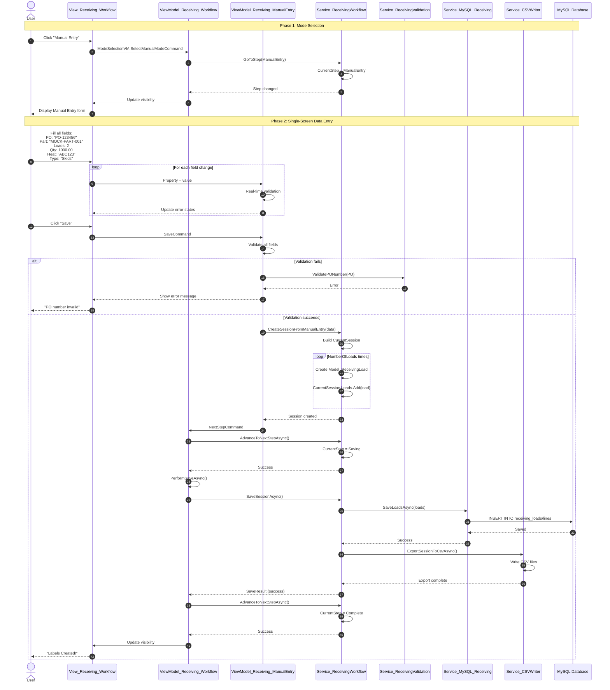
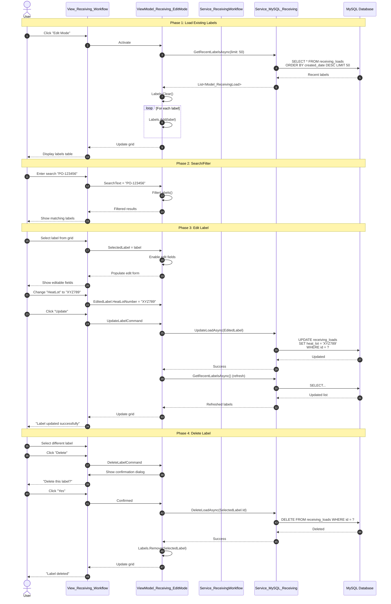

# Module_Receiving - Comprehensive Sequence Diagrams

## Overview
This document provides detailed sequence diagrams for all workflows in the Receiving Module. The diagrams show the complete interaction between user, views, viewmodels, services, and data layers.

---

## Workflow 1: Guided PO Receiving (Complete Flow)

```mermaid
sequenceDiagram
    autonumber
    
    actor User
    participant MainWindow as MainWindow
    participant WF_View as View_Receiving_Workflow
    participant WF_VM as ViewModel_Receiving_Workflow
    participant WF_Service as Service_ReceivingWorkflow
    participant SessionMgr as Service_SessionManager
    participant ValidationSvc as Service_ReceivingValidation
    participant InforSvc as Service_InforVisualConnect
    participant InforDAO as Dao_InforVisualConnection
    participant MySQLSvc as Service_MySQL_Receiving
    participant CSVSvc as Service_CSVWriter
    participant DB_MySQL as MySQL Database
    participant DB_Infor as Infor Visual (SQL Server)

    note over User, DB_Infor: Phase 0: Initialization & Configuration Check
    User->>MainWindow: Click "Receiving Labels"
    MainWindow->>WF_View: Navigate to Receiving Module
    WF_View->>WF_VM: Constructor (DI injection)
    WF_VM->>WF_Service: StartWorkflowAsync()
    WF_Service->>SessionMgr: LoadSessionAsync()
    SessionMgr->>DB_MySQL: SELECT * FROM receiving_session WHERE is_complete = 0
    
    alt Session Found
        DB_MySQL-->>SessionMgr: Existing session data
        SessionMgr-->>WF_Service: Session restored
        WF_Service->>WF_Service: CurrentStep = Review
    else No Session
        DB_MySQL-->>SessionMgr: No session
        SessionMgr-->>WF_Service: null
        WF_Service->>WF_Service: Check user default mode
        alt User has default mode
            WF_Service->>WF_Service: CurrentStep = (Guided/Manual/Edit)
        else No default mode
            WF_Service->>WF_Service: CurrentStep = ModeSelection
        end
    end
    
    WF_Service-->>WF_VM: Session initialized
    WF_VM->>WF_VM: StepChanged event fires
    WF_VM->>WF_View: Update visibility (ModeSelection visible)
    WF_View-->>User: Display Mode Selection screen

    note over User, DB_Infor: Phase 1: Mode Selection
    User->>WF_View: Clicks "Guided Workflow"
    WF_View->>WF_VM: ModeSelectionVM.SelectGuidedModeCommand
    WF_VM->>WF_Service: GoToStep(POEntry)
    WF_Service->>WF_Service: CurrentStep = POEntry
    WF_Service->>WF_Service: StepChanged event fires
    WF_Service-->>WF_VM: Event received
    WF_VM->>WF_View: Update visibility (POEntry visible)
    WF_View-->>User: Display PO Entry screen

    note over User, DB_Infor: Phase 2: PO Entry & Validation
    participant PO_VM as ViewModel_Receiving_POEntry
    
    User->>WF_View: Focus on PO TextBox
    
    alt Mock Data Enabled
        PO_VM->>PO_VM: InitializeAsync()
        PO_VM->>PO_VM: Check "UseInforVisualMockData" config
        PO_VM->>PO_VM: PoNumber = "PO-066868"
        PO_VM->>PO_VM: Auto-trigger LoadPOAsync()
        note right of PO_VM: [MOCK DATA MODE]<br/>Auto-fills default PO
    end
    
    User->>WF_View: Enter "66868"
    WF_View->>PO_VM: PoNumber property changes
    PO_VM->>PO_VM: OnPoNumberChanged validation
    PO_VM->>PO_VM: Format to "PO-066868"
    PO_VM->>PO_VM: IsLoadPOEnabled = true
    PO_VM-->>WF_View: Update UI state
    
    User->>WF_View: Click "Load PO"
    WF_View->>PO_VM: LoadPOCommand.Execute()
    PO_VM->>PO_VM: IsBusy = true
    
    alt Mock Data Mode
        PO_VM->>InforSvc: GetPOWithPartsAsync("PO-066868")
        InforSvc->>InforSvc: Check _useMockData flag
        InforSvc->>InforSvc: CreateMockPO("PO-066868")
        InforSvc-->>PO_VM: Mock PO with 2 parts
    else Live Data Mode
        PO_VM->>InforSvc: GetPOWithPartsAsync("PO-066868")
        InforSvc->>InforDAO: GetPOWithPartsAsync("PO-066868")
        InforDAO->>DB_Infor: SELECT po.*, po_detail.* WHERE po_num = ?
        DB_Infor-->>InforDAO: PO + Parts data
        InforDAO->>InforDAO: Map DataRows to Models
        InforDAO-->>InforSvc: Model_InforVisualPO
        InforSvc->>InforSvc: ConvertToServiceModel()
        InforSvc-->>PO_VM: Model_InforVisualPO with Parts
    end
    
    loop For each part
        PO_VM->>InforSvc: GetRemainingQuantityAsync(PO, PartID)
        alt Mock Data Mode
            InforSvc-->>PO_VM: 100 (mock value)
        else Live Data Mode
            InforSvc->>InforDAO: GetPOWithPartsAsync(PO)
            InforDAO->>DB_Infor: SELECT ordered_qty, received_qty
            DB_Infor-->>InforDAO: Quantities
            InforDAO-->>InforSvc: Calculated remaining
            InforSvc-->>PO_VM: Remaining quantity
        end
        PO_VM->>PO_VM: part.RemainingQuantity = value
        PO_VM->>PO_VM: Parts.Add(part)
    end
    
    PO_VM->>PO_VM: IsBusy = false
    PO_VM->>WF_Service: RaiseStatusMessage("PO loaded")
    PO_VM-->>WF_View: Update Parts list
    WF_View-->>User: Display parts grid
    
    User->>WF_View: Select part from grid
    WF_View->>PO_VM: SelectedPart = part
    PO_VM->>PO_VM: OnSelectedPartChanged()
    PO_VM->>WF_Service: CurrentPart = part
    PO_VM->>PO_VM: Auto-detect PackageType from PartID
    
    User->>WF_View: Click "Next"
    WF_View->>WF_VM: NextStepCommand
    WF_VM->>WF_Service: AdvanceToNextStepAsync()
    WF_Service->>WF_Service: Validate POEntry step
    WF_Service->>WF_Service: Check CurrentPONumber != null
    WF_Service->>WF_Service: Check CurrentPart != null
    WF_Service->>WF_Service: Update CurrentSession
    WF_Service->>WF_Service: CurrentStep = LoadEntry
    WF_Service-->>WF_VM: Success result
    WF_VM->>WF_View: Update visibility (LoadEntry visible)
    WF_View-->>User: Display Load Entry screen

    note over User, DB_Infor: Phase 3: Load Entry
    participant Load_VM as ViewModel_Receiving_LoadEntry
    
    User->>WF_View: Enter "3" (number of loads)
    WF_View->>Load_VM: NumberOfLoads = 3
    Load_VM->>WF_Service: NumberOfLoads = 3
    
    User->>WF_View: Click "Next"
    WF_View->>WF_VM: NextStepCommand
    WF_VM->>WF_Service: AdvanceToNextStepAsync()
    WF_Service->>ValidationSvc: ValidateNumberOfLoads(3)
    ValidationSvc-->>WF_Service: Valid
    WF_Service->>WF_Service: GenerateLoads()
    loop 3 times
        WF_Service->>WF_Service: Create Model_ReceivingLoad
        WF_Service->>WF_Service: CurrentSession.Loads.Add(load)
    end
    WF_Service->>WF_Service: CurrentStep = WeightQuantityEntry
    WF_Service-->>WF_VM: Success
    WF_VM->>WF_View: Update visibility
    WF_View-->>User: Display Weight/Quantity screen

    note over User, DB_Infor: Phase 4: Weight/Quantity Entry
    participant WQ_VM as ViewModel_Receiving_WeightQuantity
    
    loop For each load (3)
        User->>WF_View: Enter weight "1250.5"
        WF_View->>WQ_VM: Load.WeightQuantity = 1250.5
        WQ_VM->>WF_Service: Update CurrentSession.Loads[i]
    end
    
    User->>WF_View: Click "Next"
    WF_View->>WF_VM: NextStepCommand
    WF_VM->>WF_Service: AdvanceToNextStepAsync()
    loop For each load
        WF_Service->>ValidationSvc: ValidateWeightQuantity(load.WeightQuantity)
        ValidationSvc->>ValidationSvc: Check > 0
        ValidationSvc-->>WF_Service: Valid
    end
    WF_Service->>WF_Service: CurrentStep = HeatLotEntry
    WF_Service-->>WF_VM: Success
    WF_VM->>WF_View: Update visibility
    WF_View-->>User: Display Heat/Lot screen

    note over User, DB_Infor: Phase 5: Heat/Lot Entry
    participant HL_VM as ViewModel_Receiving_HeatLot
    
    loop For each load
        User->>WF_View: Enter "HEAT-12345"
        WF_View->>HL_VM: Load.HeatLotNumber = "HEAT-12345"
        HL_VM->>WF_Service: Update CurrentSession.Loads[i]
    end
    
    User->>WF_View: Click "Next"
    WF_View->>WF_VM: NextStepCommand
    WF_VM->>WF_Service: AdvanceToNextStepAsync()
    loop For each load
        WF_Service->>ValidationSvc: ValidateHeatLotNumber(load.HeatLotNumber)
        ValidationSvc->>ValidationSvc: Check not empty, <= 50 chars
        ValidationSvc-->>WF_Service: Valid
    end
    WF_Service->>WF_Service: CurrentStep = PackageTypeEntry
    WF_Service-->>WF_VM: Success
    WF_VM->>WF_View: Update visibility
    WF_View-->>User: Display Package Type screen

    note over User, DB_Infor: Phase 6: Package Type Entry
    participant PT_VM as ViewModel_Receiving_PackageType
    
    User->>WF_View: Select "Skids" from dropdown
    WF_View->>PT_VM: PackageType = "Skids"
    PT_VM->>WF_Service: Set package type on all loads
    loop For each load
        WF_Service->>WF_Service: load.PackageType = "Skids"
    end
    
    User->>WF_View: Click "Next"
    WF_View->>WF_VM: NextStepCommand
    WF_VM->>WF_Service: AdvanceToNextStepAsync()
    WF_Service->>WF_Service: CurrentStep = Review
    WF_Service-->>WF_VM: Success
    WF_VM->>WF_View: Update visibility
    WF_View-->>User: Display Review screen

    note over User, DB_Infor: Phase 7: Review & Save
    participant Rev_VM as ViewModel_Receiving_Review
    
    WF_View->>Rev_VM: Load current session
    Rev_VM->>WF_Service: GetCurrentSession()
    WF_Service-->>Rev_VM: CurrentSession with 3 loads
    Rev_VM->>Rev_VM: Display summary
    Rev_VM-->>WF_View: Show all loads in grid
    WF_View-->>User: Display review table
    
    User->>WF_View: Click "Save"
    WF_View->>WF_VM: NextStepCommand
    WF_VM->>WF_Service: AdvanceToNextStepAsync()
    WF_Service->>WF_Service: CurrentStep = Saving
    WF_Service-->>WF_VM: Success
    WF_VM->>WF_VM: StepChanged event fires
    WF_VM->>WF_VM: PerformSaveAsync() (via Dispatcher)
    
    note over WF_VM, DB_Infor: Saving Phase
    WF_VM->>WF_Service: SaveSessionAsync(progress callbacks)
    WF_Service->>WF_Service: UpdateProgress("Saving to MySQL...")
    WF_Service->>MySQLSvc: SaveLoadsAsync(CurrentSession.Loads)
    
    loop For each load
        MySQLSvc->>DB_MySQL: INSERT INTO receiving_loads (...)
        DB_MySQL-->>MySQLSvc: Load ID
        MySQLSvc->>DB_MySQL: INSERT INTO receiving_lines (...)
        DB_MySQL-->>MySQLSvc: Line ID
    end
    
    MySQLSvc-->>WF_Service: All loads saved
    WF_Service->>WF_Service: UpdateProgress("Exporting CSV...")
    
    par CSV Export
        WF_Service->>CSVSvc: ExportSessionToCsvAsync(CurrentSession)
        
        alt Network Path Available
            CSVSvc->>CSVSvc: Write to \\MTMDC\LabelView CSV Files\
            CSVSvc-->>WF_Service: Network CSV success
        else Network Unavailable
            CSVSvc->>CSVSvc: Write to %APPDATA%\MTM_Receiving_Application\
            CSVSvc-->>WF_Service: Local CSV success (warning)
        end
    and Infor Visual Validation
        WF_Service->>ValidationSvc: CheckSameDayReceivingAsync(PO, Part, Today)
        ValidationSvc->>InforSvc: GetSameDayReceivingQuantityAsync(PO, Part, Today)
        
        alt Mock Data Mode
            InforSvc-->>ValidationSvc: 0 (no same-day receiving)
        else Live Data Mode
            InforSvc->>InforDAO: Query receiving transactions
            InforDAO->>DB_Infor: SELECT SUM(qty) FROM rcpt_detail WHERE...
            DB_Infor-->>InforDAO: Same-day quantity
            InforDAO-->>InforSvc: Total quantity
            InforSvc-->>ValidationSvc: Same-day total
        end
        
        alt Same-day receiving found
            ValidationSvc-->>WF_Service: Warning result
            WF_Service->>WF_Service: Log warning (non-blocking)
        else No same-day receiving
            ValidationSvc-->>WF_Service: Success
        end
    end
    
    WF_Service->>SessionMgr: MarkSessionCompleteAsync()
    SessionMgr->>DB_MySQL: UPDATE receiving_session SET is_complete = 1
    DB_MySQL-->>SessionMgr: Updated
    SessionMgr-->>WF_Service: Success
    
    WF_Service->>WF_Service: UpdateProgress("Complete!")
    WF_Service-->>WF_VM: SaveResult (success)
    WF_VM->>WF_VM: LastSaveResult = result
    WF_VM->>WF_Service: AdvanceToNextStepAsync()
    WF_Service->>WF_Service: CurrentStep = Complete
    WF_Service-->>WF_VM: Success
    WF_VM->>WF_View: Update visibility (Complete visible)
    WF_View-->>User: Display "Labels Created Successfully!"
    
    User->>WF_View: Click "Create More Labels"
    WF_View->>WF_VM: RestartWorkflowCommand
    WF_VM->>WF_Service: ResetWorkflowAsync()
    WF_Service->>WF_Service: CurrentSession = new()
    WF_Service->>WF_Service: CurrentStep = ModeSelection
    WF_Service-->>WF_VM: Reset complete
    WF_VM->>WF_View: Update visibility
    WF_View-->>User: Back to Mode Selection
```



---

## Workflow 2: Manual Entry (Fast Path)



---

## Workflow 3: Edit Mode (Modify Existing Labels)



---

## Data Flow Summary

### Database Operations
- **MySQL (Application DB)**: Full CRUD operations
  - `receiving_session` table: Workflow state persistence
  - `receiving_loads` table: Package/load records
  - `receiving_lines` table: Line-item details
  - All operations via stored procedures

- **Infor Visual (SQL Server)**: **READ ONLY**
  - PO validation: `po` table
  - Parts lookup: `po_detail` table
  - Remaining quantity: Calculated from `ordered_qty - received_qty`
  - Same-day receiving: `rcpt_detail` table
  - Connection string **must include** `ApplicationIntent=ReadOnly`

### CSV Export
- **Primary Path**: Network share `\\MTMDC\LabelView CSV Files\`
- **Fallback Path**: Local `%APPDATA%\MTM_Receiving_Application\`
- **Format**: One row per load with all metadata
- **Non-blocking**: Runs in background, failure doesn't block workflow

### Validation Gates
1. **PO Entry**: PO format, part selection required
2. **Load Entry**: NumberOfLoads >= 1, <= 99
3. **Weight/Quantity**: Value > 0 for each load
4. **Heat/Lot**: Not empty, <= 50 chars
5. **Review**: Sum(quantities) vs. PO ordered quantity (warning only)

---

## Mock Data Behavior

When `appsettings.json` has `"UseInforVisualMockData": true`:

1. **Auto-fill PO**: `ViewModel_Receiving_POEntry.InitializeAsync()`
   - Reads `DefaultMockPONumber` from config
   - Sets `PoNumber = "PO-066868"`
   - Auto-triggers `LoadPOAsync()` after 500ms delay

2. **Mock PO Data**: `Service_InforVisualConnect.CreateMockPO()`
   ```csharp
   PONumber: "PO-066868"
   Vendor: "MOCK_VENDOR"
   Status: "O" (Open)
   Parts:
     - PartID: "MOCK-PART-001", Qty: 100, Remaining: 50
     - PartID: "MOCK-PART-002", Qty: 50, Remaining: 10
   ```

3. **Mock Part Data**: Used for Non-PO items
   - Returns generic part with `RemainingQuantity = 100`

4. **Mock Same-Day Check**: Always returns `0` (no duplicate receiving)

---

## Error Handling Patterns

### ViewModel Layer
```csharp
try {
    IsBusy = true;
    var result = await _service.OperationAsync();
    if (result.IsSuccess) {
        // Success path
    } else {
        _errorHandler.ShowUserError(result.ErrorMessage);
    }
} catch (Exception ex) {
    _errorHandler.HandleException(ex, Enum_ErrorSeverity.Medium);
} finally {
    IsBusy = false;
}
```

### Service Layer
- Returns `Model_Dao_Result<T>` or `Model_Dao_Result`
- Never throws exceptions to UI layer
- Logs all operations via `IService_LoggingUtility`

### DAO Layer
- Returns `Model_Dao_Result<T>` with `IsSuccess` flag
- Catches SQL exceptions, returns failure result
- Uses stored procedures exclusively for MySQL

---

**Version**: 2.0  
**Last Updated**: 2025-01-06  
**Mock Data Mode**: Enabled (for development)
