# Module_Routing - Comprehensive Sequence Diagrams

## Overview
This document provides detailed sequence diagrams for all workflows in the Routing Module. The diagrams show complete interaction between user, views, viewmodels, services, and data layers with dual-database architecture (MySQL + Infor Visual).

---

## Workflow 1: Label Wizard - Complete PO-Based Flow

```mermaid
sequenceDiagram
    autonumber
    
    actor User
    participant MainWindow as MainWindow
    participant ModeView as RoutingModeSelectionView
    participant ModeVM as RoutingModeSelectionViewModel
    participant WizardView as RoutingWizardContainerView
    participant ContainerVM as RoutingWizardContainerViewModel
    participant Step1View as RoutingWizardStep1View
    participant Step1VM as RoutingWizardStep1ViewModel
    participant Step2View as RoutingWizardStep2View
    participant Step2VM as RoutingWizardStep2ViewModel
    participant Step3View as RoutingWizardStep3View
    participant Step3VM as RoutingWizardStep3ViewModel
    participant RoutingSvc as RoutingService
    participant InforSvc as RoutingInforVisualService
    participant InforDAO as Dao_InforVisualPO
    participant RecipientSvc as RoutingRecipientService
    participant UsageSvc as RoutingUsageTrackingService
    participant LabelDAO as Dao_RoutingLabel
    participant HistoryDAO as Dao_RoutingLabelHistory
    participant RecipientDAO as Dao_RoutingRecipient
    participant UsageDAO as Dao_RoutingUsageTracking
    participant DB_MySQL as MySQL Database
    participant DB_Infor as Infor Visual (SQL Server)

    note over User, DB_Infor: Phase 0: Navigation to Routing Module
    User->>MainWindow: Click "Routing Labels"
    MainWindow->>ModeView: Navigate to Routing Module
    ModeView->>ModeVM: Constructor (DI injection)
    ModeVM-->>ModeView: ViewModel initialized
    ModeView-->>User: Display mode selection (Wizard/Manual/Edit)

    note over User, DB_Infor: Phase 1: Mode Selection - Choose Wizard
    User->>ModeView: Click "Label Wizard"
    ModeView->>ModeVM: NavigateToWizardCommand
    ModeVM->>ModeView: Navigate to WizardContainer
    ModeView->>WizardView: Load view
    WizardView->>ContainerVM: Constructor
    ContainerVM->>ContainerVM: CurrentStep = 1
    ContainerVM->>Step1VM: Initialize Step 1 ViewModel
    ContainerVM-->>WizardView: Container initialized
    WizardView->>Step1View: Display Step 1
    Step1View->>Step1VM: Activate
    
    note over Step1VM, DB_Infor: Mock Data Auto-Fill Feature
    Step1VM->>Step1VM: InitializeAsync()
    Step1VM->>Step1VM: Check config "UseInforVisualMockData"
    
    alt Mock Data Enabled
        Step1VM->>Step1VM: Read "DefaultMockPONumber" from config
        Step1VM->>Step1VM: PoNumber = "PO-066868"
        Step1VM->>Step1VM: StatusMessage = "[MOCK DATA] Auto-filled PO"
        Step1VM->>Step1VM: Wait 500ms for UI update
        Step1VM->>Step1VM: Auto-trigger ValidatePOAsync()
        note right of Step1VM: [MOCK DATA MODE]<br/>PO auto-filled and validated
    else Mock Data Disabled
        Step1VM->>Step1VM: StatusMessage = "Enter PO number or select OTHER"
    end
    
    Step1View-->>User: Display PO entry form (with auto-filled PO if mock mode)

    note over User, DB_Infor: Phase 2: Step 1 - PO Entry & Validation
    
    alt User Manual Entry (if not auto-filled)
        User->>Step1View: Enter "66868"
        Step1View->>Step1VM: PoNumber = "66868"
        Step1VM->>Step1VM: Format and validate
        Step1VM-->>Step1View: Update display
    end
    
    User->>Step1View: Click "Validate PO"
    Step1View->>Step1VM: ValidatePOCommand
    Step1VM->>Step1VM: IsBusy = true
    Step1VM->>Step1VM: StatusMessage = "Validating PO..."
    
    Step1VM->>InforSvc: ValidatePoNumberAsync("PO-066868")
    
    alt Mock Data Mode
        InforSvc->>InforSvc: Check _useMockData flag = true
        InforSvc->>InforSvc: Log "[MOCK DATA MODE] Validating PO"
        InforSvc-->>Step1VM: Result.Data = true (always valid)
    else Live Data Mode
        InforSvc->>InforDAO: CheckConnectionAsync()
        InforDAO->>DB_Infor: SELECT 1 (connection test)
        
        alt Connection Success
            DB_Infor-->>InforDAO: Connection OK
            InforDAO-->>InforSvc: Connection valid
            InforSvc->>InforDAO: ValidatePOAsync("PO-066868")
            InforDAO->>DB_Infor: SELECT COUNT(*) FROM po WHERE po_num = ?
            DB_Infor-->>InforDAO: PO exists
            InforDAO-->>InforSvc: Valid = true
            InforSvc-->>Step1VM: Result.Data = true
        else Connection Failed
            DB_Infor-->>InforDAO: Connection error
            InforDAO-->>InforSvc: Connection failed
            InforSvc->>InforSvc: Graceful degradation: return true (allow operation)
            InforSvc-->>Step1VM: Result.Data = true (with warning logged)
        end
    end
    
    alt PO Valid
        Step1VM->>Step1VM: StatusMessage = "PO valid - fetching line items..."
        Step1VM->>InforSvc: GetPoLinesAsync("PO-066868")
        
        alt Mock Data Mode
            InforSvc->>InforSvc: Check _useMockData flag = true
            InforSvc->>InforSvc: Create mock lines
            InforSvc->>InforSvc: Build List<Model_InforVisualPOLine>
            Note right of InforSvc: Mock Line 1:<br/>Part: MOCK-PART-001<br/>Qty Ordered: 100<br/>Qty Received: 0
            Note right of InforSvc: Mock Line 2:<br/>Part: MOCK-PART-002<br/>Qty Ordered: 50<br/>Qty Received: 10
            InforSvc-->>Step1VM: Result.Data = mockLines (2 lines)
        else Live Data Mode
            InforSvc->>InforDAO: GetLinesAsync("PO-066868")
            InforDAO->>DB_Infor: SELECT po_detail.* WHERE po_num = ? AND site_ref = '002'
            DB_Infor-->>InforDAO: PO line data
            InforDAO->>InforDAO: Map DataRows to Model_InforVisualPOLine
            InforDAO-->>InforSvc: List<Model_InforVisualPOLine>
            InforSvc-->>Step1VM: Result.Data = lines
        end
        
        Step1VM->>Step1VM: PoLines.Clear()
        loop For each line
            Step1VM->>Step1VM: PoLines.Add(line)
        end
        
        alt Lines Found
            Step1VM->>Step1VM: StatusMessage = "Found {count} line(s)"
            Step1VM-->>Step1View: Update DataGrid
            Step1View-->>User: Display PO lines table
        else No Lines
            Step1VM->>Step1VM: StatusMessage = "PO valid but no open lines"
            Step1VM->>Step1VM: Show error dialog
            Step1View-->>User: "No lines available for this PO"
        end
        
    else PO Invalid
        Step1VM->>Step1VM: Show "PO Not Found" dialog
        Step1View-->>User: ContentDialog: "PO not found. Treat as OTHER?"
        
        alt User Chooses "Yes - OTHER"
            User->>Step1View: Click "Yes, treat as OTHER"
            Step1View->>Step1VM: Switch to OTHER mode
            Step1VM->>Step1VM: SwitchToOtherModeAsync()
            Step1VM->>Step1VM: IsOtherMode = true
            Step1VM->>Step1VM: PoLines.Clear()
            Step1VM-->>Step1View: Show OTHER reasons dropdown
            Step1View-->>User: Display OTHER mode UI
        else User Chooses "No - Retry"
            User->>Step1View: Click "No, try again"
            Step1View->>Step1VM: Reset
            Step1VM->>Step1VM: PoNumber = ""
            Step1VM->>Step1VM: StatusMessage = "Enter a valid PO number"
            Step1View-->>User: Clear form, ready for new entry
        end
    end
    
    Step1VM->>Step1VM: IsBusy = false

    note over User, DB_Infor: Phase 3: Step 1 - Line Selection & Navigation
    User->>Step1View: Click row in DataGrid
    Step1View->>Step1VM: SelectedPOLine = line
    Step1VM->>Step1VM: OnSelectedPOLineChanged()
    Step1VM->>Step1VM: ProceedToStep2Command.NotifyCanExecuteChanged()
    Step1VM-->>Step1View: Enable "Next" button
    
    User->>Step1View: Click "Next"
    Step1View->>Step1VM: ProceedToStep2Command
    Step1VM->>Step1VM: CanProceedToStep2() validation
    Step1VM->>ContainerVM: Update shared state
    ContainerVM->>ContainerVM: SelectedPOLine = line
    ContainerVM->>ContainerVM: FinalQuantity = (int)line.QuantityOrdered
    ContainerVM->>ContainerVM: NavigateToStep2()
    ContainerVM->>ContainerVM: CurrentStep = 2
    ContainerVM->>ContainerVM: StatusMessage = "Select recipient"
    ContainerVM-->>WizardView: Update step visibility
    WizardView->>Step2View: Display Step 2
    Step2View-->>User: Show recipient selection

    note over User, DB_Infor: Phase 4: Step 2 - Recipient Selection with Personalization
    participant Step2VM as RoutingWizardStep2ViewModel
    
    Step2View->>Step2VM: Activate
    Step2VM->>Step2VM: IsBusy = true
    Step2VM->>Step2VM: StatusMessage = "Loading recipients..."
    
    par Load All Recipients
        Step2VM->>RecipientSvc: GetAllRecipientsAsync()
        RecipientSvc->>RecipientDAO: GetAllRecipientsAsync()
        RecipientDAO->>DB_MySQL: CALL sp_routing_recipients_get_all()
        DB_MySQL-->>RecipientDAO: All active recipients
        RecipientDAO-->>RecipientSvc: List<Model_RoutingRecipient>
        RecipientSvc-->>Step2VM: AllRecipients
        
        Step2VM->>Step2VM: AllRecipients.Clear()
        loop For each recipient
            Step2VM->>Step2VM: AllRecipients.Add(recipient)
        end
    and Load Frequent Recipients (Personalization)
        Step2VM->>UsageSvc: GetFrequentRecipientsAsync(employeeNumber, topN: 5)
        UsageSvc->>UsageDAO: GetTopRecipientsForUserAsync(empNum, 5)
        UsageDAO->>DB_MySQL: CALL sp_routing_usage_tracking_get_top_for_user(?, ?)
        DB_MySQL-->>UsageDAO: Top 5 recipients by usage count
        UsageDAO-->>UsageSvc: List<Model_RoutingUsageTracking>
        UsageSvc->>UsageSvc: Map to recipient IDs
        UsageSvc->>RecipientSvc: GetRecipientsByIdsAsync(recipientIds)
        RecipientSvc->>RecipientDAO: GetRecipientsByIdsAsync(ids)
        RecipientDAO->>DB_MySQL: SELECT * FROM routing_recipients WHERE id IN (?)
        DB_MySQL-->>RecipientDAO: Recipient details
        RecipientDAO-->>RecipientSvc: List<Model_RoutingRecipient>
        RecipientSvc-->>UsageSvc: Recipients with details
        UsageSvc-->>Step2VM: FrequentRecipients
        
        Step2VM->>Step2VM: FrequentRecipients.Clear()
        loop For each frequent recipient
            Step2VM->>Step2VM: FrequentRecipients.Add(recipient)
        end
    end
    
    Step2VM->>Step2VM: IsBusy = false
    Step2VM->>Step2VM: StatusMessage = "Select a recipient"
    Step2VM-->>Step2View: Update UI
    Step2View-->>User: Display:<br/>- Quick buttons (top 5 frequent)<br/>- Full dropdown (all recipients)
    
    alt User Selects from Quick Buttons
        User->>Step2View: Click "Production - Assembly" quick button
        Step2View->>Step2VM: SelectRecipientCommand(recipient)
        Step2VM->>Step2VM: SelectedRecipient = recipient
    else User Selects from Dropdown
        User->>Step2View: Select from "All Recipients" dropdown
        Step2View->>Step2VM: SelectedRecipient = recipient
    end
    
    Step2VM->>Step2VM: OnSelectedRecipientChanged()
    Step2VM->>Step2VM: ProceedToStep3Command.NotifyCanExecuteChanged()
    Step2VM-->>Step2View: Enable "Next" button
    
    User->>Step2View: Click "Next"
    Step2View->>Step2VM: ProceedToStep3Command
    Step2VM->>ContainerVM: Update shared state
    ContainerVM->>ContainerVM: SelectedRecipient = recipient
    ContainerVM->>ContainerVM: NavigateToStep3()
    ContainerVM->>ContainerVM: CurrentStep = 3
    ContainerVM->>ContainerVM: StatusMessage = "Review label details"
    ContainerVM-->>WizardView: Update step visibility
    WizardView->>Step3View: Display Step 3
    Step3View-->>User: Show review summary

    note over User, DB_Infor: Phase 5: Step 3 - Review & Create Label
    
    Step3View->>Step3VM: Activate
    Step3VM->>ContainerVM: Read shared state
    ContainerVM-->>Step3VM: SelectedPOLine, SelectedRecipient, FinalQuantity
    Step3VM->>Step3VM: Build summary display
    Step3VM-->>Step3View: Populate review fields
    Step3View-->>User: Display:<br/>- PO: PO-066868, Line: 1<br/>- Part: MOCK-PART-001<br/>- Description: Mock Part 1 Description<br/>- Recipient: Production - Assembly<br/>- Quantity: 100
    
    User->>Step3View: Click "Create Label"
    Step3View->>ContainerVM: CreateLabelCommand
    ContainerVM->>ContainerVM: IsBusy = true
    ContainerVM->>ContainerVM: StatusMessage = "Creating label..."
    
    ContainerVM->>ContainerVM: Build Model_RoutingLabel
    Note right of ContainerVM: Label data:<br/>PONumber: "PO-066868"<br/>LineNumber: "1"<br/>Description: "Mock Part 1 Description"<br/>RecipientId: 3<br/>Quantity: 100<br/>CreatedBy: 1234<br/>CreatedDate: Now
    
    ContainerVM->>RoutingSvc: CreateLabelAsync(label)
    
    rect rgb(255, 245, 245)
        note right of RoutingSvc: Validation Phase
        RoutingSvc->>RoutingSvc: ValidateAndCheckDuplicatesAsync(label)
        RoutingSvc->>RoutingSvc: ValidateLabel(label)
        RoutingSvc->>RoutingSvc: Check PONumber not empty
        RoutingSvc->>RoutingSvc: Check RecipientId > 0
        RoutingSvc->>RoutingSvc: Check Quantity > 0
        
        RoutingSvc->>RecipientSvc: ValidateRecipientExistsAsync(RecipientId)
        RecipientSvc->>RecipientDAO: GetRecipientByIdAsync(3)
        RecipientDAO->>DB_MySQL: CALL sp_routing_recipients_get_by_id(?)
        DB_MySQL-->>RecipientDAO: Recipient record
        RecipientDAO-->>RecipientSvc: Model_RoutingRecipient
        RecipientSvc-->>RoutingSvc: Valid = true
        
        RoutingSvc->>RoutingSvc: CheckDuplicateLabelAsync(PO, Line, RecipientId, Today)
        RoutingSvc->>LabelDAO: CheckDuplicateAsync(params)
        LabelDAO->>DB_MySQL: CALL sp_routing_labels_check_duplicate(?, ?, ?, ?)
        DB_MySQL-->>LabelDAO: No duplicate found
        LabelDAO-->>RoutingSvc: Exists = false
        
        RoutingSvc-->>RoutingSvc: Validation success
    end
    
    rect rgb(240, 255, 240)
        note right of RoutingSvc: Database Transaction
        RoutingSvc->>LabelDAO: InsertLabelAsync(label)
        LabelDAO->>DB_MySQL: CALL sp_routing_labels_insert(PONumber, LineNumber, Description, RecipientId, Quantity, CreatedBy)
        DB_MySQL->>DB_MySQL: BEGIN TRANSACTION
        DB_MySQL->>DB_MySQL: INSERT INTO routing_labels (...)
        DB_MySQL->>DB_MySQL: SET @new_id = LAST_INSERT_ID()
        DB_MySQL->>DB_MySQL: COMMIT
        DB_MySQL-->>LabelDAO: New label ID = 42
        LabelDAO-->>RoutingSvc: Result.Data = 42
        
        RoutingSvc->>RoutingSvc: label.Id = 42
    end
    
    rect rgb(245, 245, 255)
        note right of RoutingSvc: Background Tasks (Non-Blocking)
        RoutingSvc->>RoutingSvc: ExecuteBackgroundTasks(label, 42)
        RoutingSvc->>RoutingSvc: Task.Run(async () => {...})
        
        par CSV Export
            RoutingSvc->>RoutingSvc: ExportLabelToCsvAsync(label)
            RoutingSvc->>RoutingSvc: Acquire _csvFileLock semaphore
            RoutingSvc->>RoutingSvc: Read config: CsvExportPath
            
            alt Network Path Available
                RoutingSvc->>RoutingSvc: csvPath = "\\MTMDC\LabelView CSV Files\Routing\"
                RoutingSvc->>RoutingSvc: Write CSV file with retry logic
                RoutingSvc->>RoutingSvc: Log success
            else Network Unavailable
                RoutingSvc->>RoutingSvc: Fallback to LocalCsvExportPath
                RoutingSvc->>RoutingSvc: csvPath = "%APPDATA%\MTM_Receiving_Application\Routing\"
                RoutingSvc->>RoutingSvc: Write CSV file locally
                RoutingSvc->>RoutingSvc: Log warning (network unavailable)
            end
            
            RoutingSvc->>RoutingSvc: Release _csvFileLock semaphore
        and Usage Tracking (Personalization)
            RoutingSvc->>UsageSvc: IncrementUsageCountAsync(CreatedBy, RecipientId)
            UsageSvc->>UsageDAO: IncrementUsageAsync(1234, 3)
            UsageDAO->>DB_MySQL: CALL sp_routing_usage_tracking_increment(?, ?)
            DB_MySQL->>DB_MySQL: INSERT INTO routing_usage_tracking<br/>ON DUPLICATE KEY UPDATE usage_count = usage_count + 1
            DB_MySQL-->>UsageDAO: Updated
            UsageDAO-->>UsageSvc: Success
            UsageSvc->>UsageSvc: Log success
        and History Logging
            RoutingSvc->>HistoryDAO: InsertHistoryAsync(labelId, "CREATED", details)
            HistoryDAO->>DB_MySQL: CALL sp_routing_label_history_insert(?, ?, ?)
            DB_MySQL->>DB_MySQL: INSERT INTO routing_label_history (...)
            DB_MySQL-->>HistoryDAO: History ID
            HistoryDAO-->>RoutingSvc: Success
        end
    end
    
    RoutingSvc-->>ContainerVM: Result.Data = 42 (label ID)
    ContainerVM->>ContainerVM: IsBusy = false
    ContainerVM->>ContainerVM: StatusMessage = "Label created successfully!"
    ContainerVM->>ContainerVM: Show success dialog
    ContainerVM-->>WizardView: Display ContentDialog
    WizardView-->>User: "Label #42 Created Successfully!"
    
    User->>WizardView: Click "OK"
    WizardView->>ContainerVM: Reset wizard
    ContainerVM->>ContainerVM: CurrentStep = 1
    ContainerVM->>ContainerVM: Clear all selections
    ContainerVM-->>WizardView: Reset to Step 1
    WizardView->>Step1View: Display Step 1
    Step1View-->>User: Ready for next label

    note over User, DB_Infor: Optional: Navigate Back or Exit
    User->>WizardView: Click "Cancel" or "Back to Mode Selection"
    WizardView->>ModeView: Navigate back
    ModeView-->>User: Display mode selection
```

---

## Workflow 2: Label Wizard - OTHER (Non-PO) Flow


---

## Workflow 3: Manual Entry (Fast Path)


---

## Workflow 4: Edit Mode (Modify Existing Labels)

```mermaid
sequenceDiagram
    autonumber
    
    actor User
    participant EditView as RoutingEditModeView
    participant EditVM as RoutingEditModeViewModel
    participant RoutingSvc as RoutingService
    participant LabelDAO as Dao_RoutingLabel
    participant HistoryDAO as Dao_RoutingLabelHistory
    participant DB_MySQL as MySQL Database

    note over User, DB_MySQL: Phase 1: Load Existing Labels
    User->>EditView: Navigate to Edit Mode
    EditView->>EditVM: Activate
    EditVM->>EditVM: IsBusy = true
    EditVM->>RoutingSvc: GetRecentLabelsAsync(limit: 100)
    RoutingSvc->>LabelDAO: GetRecentLabelsAsync(100, offset: 0)
    LabelDAO->>DB_MySQL: CALL sp_routing_labels_get_recent(?, ?)
    DB_MySQL-->>LabelDAO: Recent labels with recipient names (JOIN)
    LabelDAO-->>RoutingSvc: List<Model_RoutingLabel>
    RoutingSvc-->>EditVM: Labels
    
    EditVM->>EditVM: Labels.Clear()
    loop For each label
        EditVM->>EditVM: Labels.Add(label)
    end
    EditVM->>EditVM: IsBusy = false
    EditVM-->>EditView: Update DataGrid
    EditView-->>User: Display labels table (100 rows)

    note over User, DB_MySQL: Phase 2: Search/Filter
    User->>EditView: Enter search "PO-123456"
    EditView->>EditVM: SearchText = "PO-123456"
    EditVM->>EditVM: ApplyFilters()
    EditVM->>EditVM: Filter Labels collection
    EditVM-->>EditView: Update DataGrid
    EditView-->>User: Show filtered results

    note over User, DB_MySQL: Phase 3: Edit Label
    User->>EditView: Click row in DataGrid
    EditView->>EditVM: SelectedLabel = label
    EditVM->>EditVM: Enable edit panel
    EditVM-->>EditView: Populate edit fields
    EditView-->>User: Show editable fields (Quantity, Recipient, Description)
    
    User->>EditView: Change Quantity to "75"
    EditView->>EditVM: EditedLabel.Quantity = 75
    
    User->>EditView: Click "Update"
    EditView->>EditVM: UpdateLabelCommand
    EditVM->>EditVM: Validate changes
    EditVM->>RoutingSvc: UpdateLabelAsync(EditedLabel, employeeNumber)
    
    RoutingSvc->>LabelDAO: GetLabelByIdAsync(labelId)
    LabelDAO->>DB_MySQL: CALL sp_routing_labels_get_by_id(?)
    DB_MySQL-->>LabelDAO: Original label
    LabelDAO-->>RoutingSvc: Original
    
    RoutingSvc->>RoutingSvc: ValidateLabel(EditedLabel)
    RoutingSvc->>LabelDAO: UpdateLabelAsync(EditedLabel)
    LabelDAO->>DB_MySQL: CALL sp_routing_labels_update(id, PONumber, LineNumber, Description, RecipientId, Quantity)
    DB_MySQL->>DB_MySQL: UPDATE routing_labels SET ... WHERE id = ?
    DB_MySQL-->>LabelDAO: Updated
    LabelDAO-->>RoutingSvc: Success
    
    RoutingSvc->>RoutingSvc: GetLabelChanges(Original, Edited)
    RoutingSvc->>RoutingSvc: Detect changed fields
    
    loop For each changed field
        RoutingSvc->>HistoryDAO: InsertHistoryAsync(labelId, "EDITED", field, oldValue, newValue)
        HistoryDAO->>DB_MySQL: CALL sp_routing_label_history_insert(...)
        DB_MySQL-->>HistoryDAO: History record created
        HistoryDAO-->>RoutingSvc: Success
    end
    
    RoutingSvc-->>EditVM: Update success
    EditVM->>RoutingSvc: GetRecentLabelsAsync() (refresh)
    RoutingSvc->>LabelDAO: GetRecentLabelsAsync()
    LabelDAO->>DB_MySQL: SELECT...
    DB_MySQL-->>LabelDAO: Updated list
    LabelDAO-->>RoutingSvc: Labels
    RoutingSvc-->>EditVM: Refreshed list
    EditVM-->>EditView: Update DataGrid
    EditView-->>User: "Label updated successfully"

    note over User, DB_MySQL: Phase 4: View History
    User->>EditView: Click "View History"
    EditView->>EditVM: ViewHistoryCommand(labelId)
    EditVM->>RoutingSvc: GetLabelHistoryAsync(labelId)
    RoutingSvc->>HistoryDAO: GetHistoryForLabelAsync(labelId)
    HistoryDAO->>DB_MySQL: CALL sp_routing_label_history_get_for_label(?)
    DB_MySQL-->>HistoryDAO: All history records for label
    HistoryDAO-->>RoutingSvc: List<Model_RoutingLabelHistory>
    RoutingSvc-->>EditVM: History
    EditVM->>EditVM: Show history dialog
    EditVM-->>EditView: Display history popup
    EditView-->>User: Show audit trail:<br/>- CREATED (User: 1234, Date: 2025-01-05)<br/>- EDITED (Quantity: 50 → 75, User: 5678, Date: 2025-01-06)

    note over User, DB_MySQL: Phase 5: Delete Label
    User->>EditView: Select label, click "Delete"
    EditView->>EditVM: DeleteLabelCommand
    EditVM->>EditView: Show confirmation dialog
    EditView-->>User: "Delete this label? This cannot be undone."
    User->>EditView: Click "Yes"
    EditView->>EditVM: Confirmed
    EditVM->>RoutingSvc: DeleteLabelAsync(labelId, employeeNumber)
    RoutingSvc->>HistoryDAO: InsertHistoryAsync(labelId, "DELETED", employeeNumber)
    HistoryDAO->>DB_MySQL: INSERT INTO routing_label_history (...)
    DB_MySQL-->>HistoryDAO: History logged
    HistoryDAO-->>RoutingSvc: Success
    
    RoutingSvc->>LabelDAO: DeleteLabelAsync(labelId)
    LabelDAO->>DB_MySQL: CALL sp_routing_labels_delete(?)
    DB_MySQL->>DB_MySQL: DELETE FROM routing_labels WHERE id = ?
    DB_MySQL-->>LabelDAO: Deleted
    LabelDAO-->>RoutingSvc: Success
    RoutingSvc-->>EditVM: Delete success
    EditVM->>EditVM: Labels.Remove(SelectedLabel)
    EditVM-->>EditView: Update DataGrid
    EditView-->>User: "Label deleted"
```



---

## Data Flow Summary

### Database Architecture

#### MySQL (Application Database) - Full CRUD
- **routing_labels**: Core label records
  - PO number, line number, description
  - Recipient ID (FK to routing_recipients)
  - Quantity, created_by, created_date
  
- **routing_recipients**: Department/location destinations
  - Name, description, is_active

- **routing_usage_tracking**: Personalization data
  - Employee number, recipient ID, usage count
  - Enables "frequently used" quick buttons

- **routing_label_history**: Audit trail
  - Action type (CREATED, EDITED, DELETED)
  - Changed fields, old/new values
  - Employee number, timestamp

- **routing_other_reasons**: Non-PO reasons (future)
  - Reason codes (RETURNED, SAMPLE, etc.)

#### Infor Visual (SQL Server) - READ ONLY
- **po**: Purchase order master
- **po_detail**: PO line items
  - Part number, description, quantities
  - **Warehouse filter**: `site_ref = '002'` (mandatory)
- Connection string **must include**: `ApplicationIntent=ReadOnly;TrustServerCertificate=True`

### CSV Export
- **Network Path**: `\\MTMDC\LabelView CSV Files\Routing\`
- **Fallback Path**: `%APPDATA%\MTM_Receiving_Application\Routing\`
- **Concurrency**: Semaphore-based locking (fixes race condition)
- **Retry Logic**: 3 attempts with 500ms delay
- **Non-blocking**: Runs in background, failure logged but doesn't block UI

### Personalization System
1. **Usage Tracking**: Increments on label creation
2. **Frequent Recipients**: Top 5 by usage_count per employee
3. **Quick Buttons**: Step 2 displays frequent recipients as buttons
4. **Threshold**: Configurable in `appsettings.json` (default: 20 uses)

---

## Mock Data Configuration

### Enable Mock Data
In `appsettings.json`:
```json
{
  "AppSettings": {
    "UseInforVisualMockData": true,
    "Environment": "Development",
    "DefaultMockPONumber": "PO-066868"
  }
}
```

### Mock Data Behavior

1. **Auto-Fill PO** (`RoutingWizardStep1ViewModel.InitializeAsync()`):
   - Reads `DefaultMockPONumber` from config
   - Sets `PoNumber = "PO-066868"`
   - Auto-triggers `ValidatePOAsync()` after 500ms delay
   - Status message: `"[MOCK DATA] Auto-filled PO: PO-066868"`

2. **Mock PO Validation** (`RoutingInforVisualService.ValidatePoNumberAsync()`):
   - Always returns `true` (valid)
   - Logs `"[MOCK DATA MODE] Validating PO {poNumber}"`

3. **Mock PO Lines** (`RoutingInforVisualService.GetPoLinesAsync()`):
   ```csharp
   Line 1:
     PONumber: "PO-066868"
     LineNumber: "1"
     PartID: "MOCK-PART-001"
     Description: "Mock Part 1 Description"
     QuantityOrdered: 100
     QuantityReceived: 0
     VendorName: "MOCK VENDOR"
   
   Line 2:
     PONumber: "PO-066868"
     LineNumber: "2"
     PartID: "MOCK-PART-002"
     Description: "Mock Part 2 Description"
     QuantityOrdered: 50
     QuantityReceived: 10
     VendorName: "MOCK VENDOR"
   ```

4. **Mock Single Line** (`RoutingInforVisualService.GetPoLineAsync()`):
   - Returns mock line with `PartID = "MOCK-PART-{lineNumber}"`

5. **Graceful Degradation**:
   - If Infor Visual connection fails in live mode, service returns `true` (allow operation)
   - Logs warning, doesn't block user workflow

---

## Error Handling Patterns

### ViewModel Layer
```csharp
try {
    IsBusy = true;
    StatusMessage = "Processing...";
    var result = await _service.OperationAsync();
    if (result.IsSuccess) {
        StatusMessage = "Success!";
    } else {
        await _errorHandler.ShowUserErrorAsync(result.ErrorMessage, "Error", "Operation");
    }
} catch (Exception ex) {
    _errorHandler.HandleException(ex, Enum_ErrorSeverity.Medium, "Operation", "ViewModel");
} finally {
    IsBusy = false;
}
```

### Service Layer
- Returns `Model_Dao_Result<T>` with `IsSuccess` flag
- Never throws exceptions to ViewModel
- Logs via `IService_LoggingUtility.LogInfoAsync/LogErrorAsync`
- Background tasks catch and log exceptions without failing main operation

### DAO Layer
- Returns `Model_Dao_Result<T>` from all methods
- Catches SQL exceptions, returns failure result
- Uses stored procedures exclusively for MySQL
- Logs via injected `IService_LoggingUtility`

### Validation Gates
1. **Step 1 (PO Entry)**:
   - PO format validation (regex or OTHER mode)
   - Line selection required
   
2. **Step 2 (Recipient)**:
   - Recipient must exist in database
   - RecipientId > 0

3. **Step 3 (Review)**:
   - Duplicate label check (same PO/Line/Recipient/Date)
   - Quantity > 0

4. **Manual Entry**:
   - All fields required
   - Real-time validation on TextChanged

---

## Configuration Reference

### appsettings.json - RoutingModule Section
```json
{
  "RoutingModule": {
    "CsvExportPath": "\\\\MTMDC\\LabelView CSV Files\\Routing\\",
    "LocalCsvExportPath": "%APPDATA%\\MTM_Receiving_Application\\Routing\\",
    "EnableValidation": true,
    "DefaultMode": "WIZARD",
    "PersonalizationThreshold": 20,
    "QuickAddButtonCount": 5,
    "HistoryPageSize": 100,
    "CsvRetryAttempts": 3,
    "CsvRetryDelayMs": 500
  }
}
```

### Constants (`Constant_Routing.cs`)
- `DEFAULT_CSV_PATH`
- `DEFAULT_LOCAL_CSV_PATH`
- `MAX_PO_NUMBER_LENGTH = 20`
- `MAX_DESCRIPTION_LENGTH = 200`

---

## Key Differences from Receiving Module

| Feature | Receiving Module | Routing Module |
|---------|------------------|----------------|
| **Workflow Type** | Linear multi-step wizard | 3-step simplified wizard |
| **Primary Use Case** | Material receiving with weight/heat/lot tracking | Internal routing labels (no quantities tracked) |
| **PO Requirement** | Can be Non-PO (checkbox toggle) | Can be OTHER (separate workflow) |
| **Personalization** | Package type auto-detection | Frequent recipients quick buttons |
| **CSV Format** | Complex multi-line per load | Simple one-row per label |
| **History Tracking** | Session-based (restorable) | Label-level audit trail (CREATED/EDITED/DELETED) |
| **Database Writes** | MySQL + CSV export | MySQL + CSV export + usage tracking |
| **Edit Mode** | Full workflow edit | Grid-based quick edit |

---

**Version**: 2.0  
**Last Updated**: 2025-01-06  
**Mock Data Mode**: Enabled (for development)  
**Auto-Fill PO**: Enabled when `UseInforVisualMockData = true`
