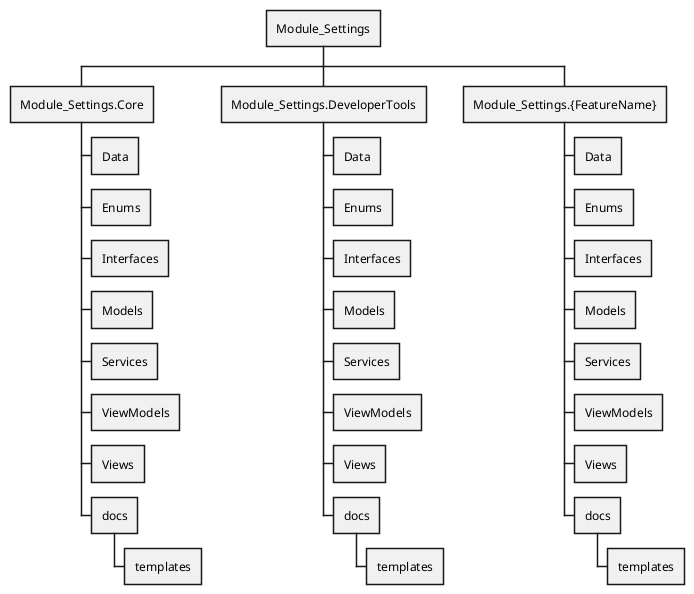

# Module_Settings - Mock File Structure (Template)

This mock structure defines the required layout for the new Core Settings system and future feature-specific settings modules. Use this as the canonical structure during implementation.

## PlantUML WBS (Required Structure)

## Notes

- Module_Settings.Core is the only Core Settings implementation.
- Module_Settings.DeveloperTools houses the DB Test tool and other core developer-only tooling.
- Module_Settings.{FeatureName} is the required pattern for feature-specific settings modules.
- Each module must include the same subfolder schema for consistency.
- Feature modules must own their settings UI and inventory documentation.
- Use templates in this folder for new feature settings work:
  - Feature Settings Implementation Guide
  - Settable Objects Inventory Template
