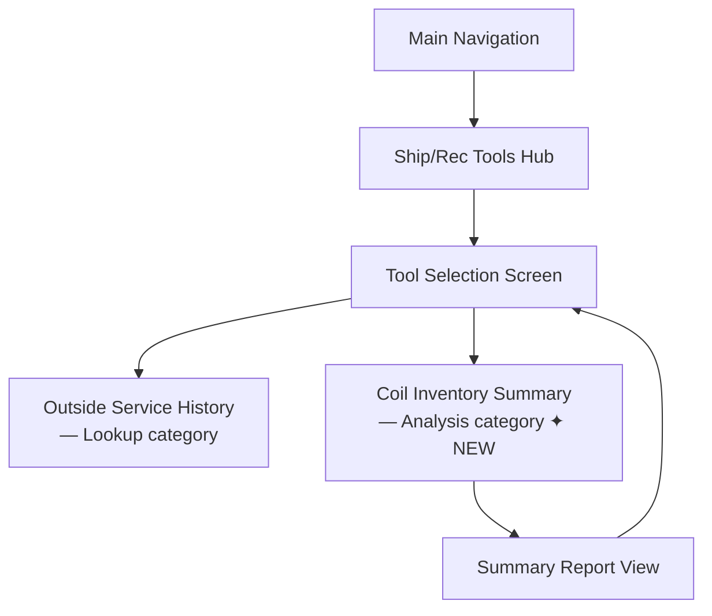
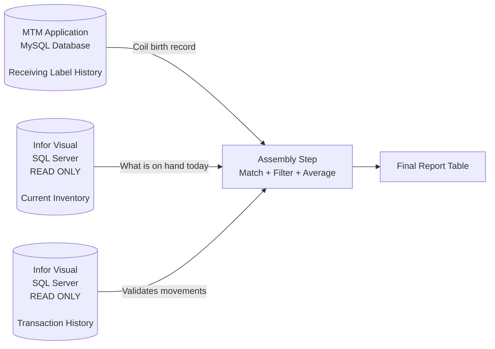
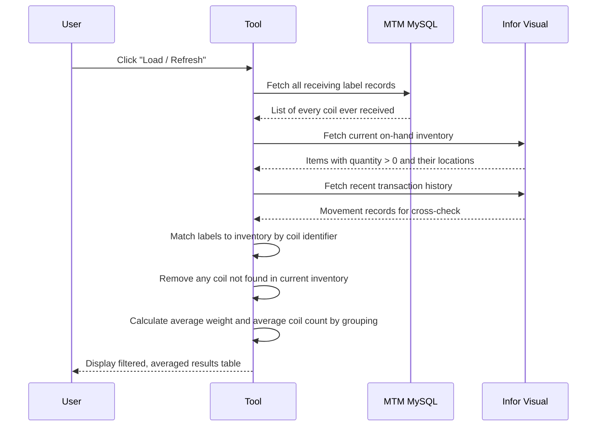
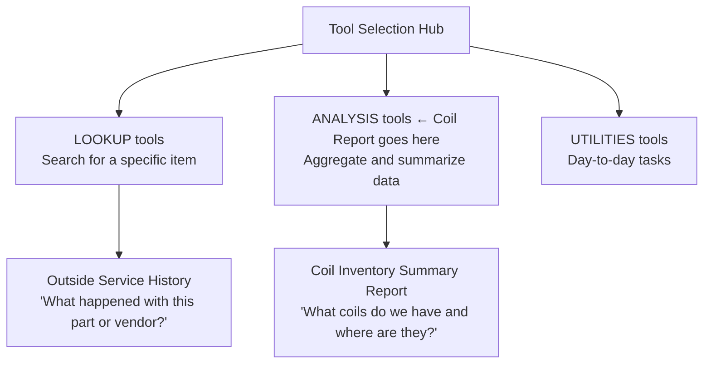

# Coil Inventory Summary Report — Implementation Plan
**Document Status:** Updated — Partial Answers from Schema Research  
**Last Updated:** 2026-03-06  
**Author:** GitHub Copilot  
**Target Module:** Ship/Rec Tools  
**Schema Verified:** 2026-03-06 — `CR_PART_LOCATION`, `INVENTORY_TRANS`, `PART_SITE` confirmed via `MTMFG_Schema_ColumnDetails.csv` and `MTMFG_Schema_Views.csv`

---

## 1. What Is This?

A new read-only reporting tool that sits inside the existing **Ship/Rec Tools** section of the application. When a user opens it, they get a live summary of every coil currently in the building — where it is, how much is left, and what a typical coil in that group weighs. The report assembles information from two separate data systems and presents it as a single, sortable list.

---

## 2. Purpose & Business Value

### What Problem Does This Solve?

Warehouse staff currently have no single view that shows all coils in the building, their locations, and how much material remains. They must look up individual parts in Infor Visual and cross-reference against paper logs or the MTM receiving history. This tool eliminates that manual cross-referencing and gives a live, filtered, at-a-glance summary.

### Who Will Use This?

| User | How They Use It |
|---|---|
| **Warehouse personnel** | Locate a specific coil and confirm how much is left before cutting or staging |
| **Inventory planners** | Assess total available stock against open orders or production schedules |
| **Customer service** | Check availability of a material before committing to a customer request |
| **Supervisors** | Monitor inventory levels and coil distribution across warehouse locations |

### Why It Belongs in Ship/Rec Tools

The Ship/Rec Tools hub already serves warehouse and receiving staff who deal with coil material daily. The Coil Inventory Summary is a natural extension — it summarises the stock that was received through the same workflow.

---

## 3. Where It Lives in the Application

The application already has a "Ship/Rec Tools" hub where users pick from a menu of utility tools. The existing tool in that hub is the **Outside Service Provider History** lookup. The Coil Inventory Summary Report would appear as a second card on that same selection screen, in the **Analysis** category (since it summarizes trends and stock levels rather than looking up a single item).



---

## 4. What the Tool Will Return

When loaded, the tool produces a table. Each row represents one coil (or one coil-at-location combination if a coil spans multiple bins). The columns are:

| Column | What It Means |
|---|---|
| **Coil Identifier** | The unique label or tag that identifies this specific coil within the facility |
| **Current Quantity** | How much of this coil remains (in whatever unit — pounds, feet, etc.) |
| **Storage Location** | The warehouse bin, zone, or aisle/position where the coil is sitting right now |
| **Average Weight** | The typical weight of coils that share this material type or specification |
| **Average Coil Count** | The typical number of individual coils found in this type of location |

The list will be sortable by any column and refreshable on demand. It will also show a status indicator (loading, success, or error) so users always know if they are looking at current data.

### Expected Output — Sample Row Layout

```
Coil Label # | Part ID    | Qty Remaining | Warehouse | Location | Avg Weight | Avg Count
-------------+------------+---------------+-----------+----------+------------+----------
REC-12345    | 12-288-GS  |    2,500 lbs  |   WH-01   |  A-12-03 | 2,450 lbs  |   1.2
REC-12346    | 12-288-GS  |    1,800 lbs  |   WH-01   |  B-05-11 | 2,450 lbs  |   1.2
REC-12347    | 14-410-HR  |    3,200 lbs  |   WH-02   |  A-12-05 | 3,100 lbs  |   1.8
```

> **Note on location columns:** Infor Visual stores warehouse and location as two separate fields (`WAREHOUSE_ID` + `LOCATION_ID`, each nvarchar(15)). The UI will display them in two columns — or optionally concatenated as `WH-01 / A-12-03` — pending the answer to Q6.

---

## 5. The Three Data Sources

The report draws on three separate sources and combines them before displaying anything.



| Source | Lives In | Confirmed Table/View | Used For |
|---|---|---|---|
| Receiving Label History | MTM MySQL database | `receiving_label_history` (MySQL) | Proves the coil entered the facility; provides the original identity, weight, and specification |
| Current Inventory | Infor Visual (read-only) | **`CR_PART_LOCATION`** (SQL Server VIEW — confirmed) | Tells us the coil is still here, where it is (warehouse + location), and how much remains |
| Transaction History | Infor Visual (read-only) | **`INVENTORY_TRANS`** (SQL Server base table — ~3.5M rows) | Validates the current status and can reveal if a coil was moved or partially consumed |

> **Schema note (verified 2026-03-06 via `MTMFG_Schema_Views.csv` and `MTMFG_Schema_ColumnDetails.csv`):**
> - `CR_PART_LOCATION` is one of only **two actual SQL Server views** in the MTMFG database (the other is `SYSUSERAUTH`). It provides bin-level stock: `ID` (Part ID), `WAREHOUSE_ID`, `LOCATION_ID`, `QTY`, `COMMITTED_QTY`, `STATUS`, `LOCKED`. This is the correct source for current on-hand at a specific location.
> - `PART_SITE` (a base table, NOT a view) provides **site-level** totals only (`QTY_ON_HAND`, `QTY_AVAILABLE_ISS`, `QTY_COMMITTED`). It has `PRIMARY_WHS_ID` and `PRIMARY_LOC_ID` as preferred defaults, but **does not break down quantity by bin**. Use `CR_PART_LOCATION` for bin-level detail.
> - `INVENTORY_TRANS` has `WAREHOUSE_ID` + `LOCATION_ID` (both nvarchar 15), `PART_ID`, `QTY`, `TRANSACTION_DATE`, `SITE_ID`, `TYPE`, `CLASS`, and importantly a `PIECE_COUNT` column (decimal 20,8) that may be useful for the average coil count metric. At ~3.5M rows it is one of the largest tables — queries must filter on indexed columns.

---

## 6. How the Data Is Assembled (Step-by-Step)



---

## 7. Business Rules

These rules define exactly what appears in the report and how edge cases are handled. They are drawn from the business documentation and must be confirmed before implementation.

### What Counts as "In Stock"?

- Coils with `QTY > 0` in `CR_PART_LOCATION` (the authoritative on-hand source).
- Coils in available locations — i.e., where `CR_PART_LOCATION.LOCKED = 'N'` and `CR_PART_LOCATION.STATUS` is not a hold or quarantine code.
- Coils not fully allocated to pending shipments (i.e., `QTY > COMMITTED_QTY` is preferred, but show actual `QTY` in the report regardless — pending confirmation).

### Partial Coils

- Any coil with remaining quantity > 0 is included.
- Report shows **actual remaining quantity** (`CR_PART_LOCATION.QTY`), not the original received quantity.
- Optionally flag rows where remaining is less than some threshold (future enhancement).

### What Defines a Unique Coil?

- Each receiving label (`load_number` in MySQL) represents one unique coil as it entered the facility.
- The same material from different receipts = different coils.
- Splitting a coil creates a new receiving label (and therefore a new unique identifier).

### Grouping for Averages

| Metric | Grouping | Calculation |
|---|---|---|
| **Average Weight** | Group all receiving labels by `part_id` | `AVG(received_weight)` across all labels in the group (including consumed coils, to give a planning-representative value) |
| **Average Coil Count** | Group receiving label history by storage location | `AVG(count of labels per location)` — or, if `PIECE_COUNT` from `INVENTORY_TRANS` is usable, prefer that |

> The exact grouping criteria for averages (Part ID alone, or Part ID + gauge/width/grade) must be confirmed with Planning/Operations (see Q8).

### Rows Per Report

Pending answer to Q6, the default design is **one row per Part-Location combination** from `CR_PART_LOCATION` — with the matching receiving label number and averages joined in. If multiple labels match the same part, they contribute to the average but do not create multiple rows (unless Q6 is resolved otherwise).

---

## 8. Assumptions Made During Planning

The following assumptions are based on how the existing system works. Each one should be confirmed before implementation begins.

| # | Assumption | Basis |
|---|---|---|
| A1 | The link between a receiving label in MySQL and the Infor Visual inventory record is the **Part ID** field (the material specification identifier). There is no per-coil unique key shared by both systems. | The receiving label stores a `part_id`; Infor Visual inventory is also organized by part number. |
| A2 | Infor Visual tracks inventory at two levels: **site-level** in `PART_SITE` (one row per Part + Site, no bin breakdown) and **bin-level** in `CR_PART_LOCATION` (one row per Part + Warehouse + Location). The report will use `CR_PART_LOCATION` for bin-level quantities and locations. Multiple rows for the same part at different bins are possible and will be shown as separate report rows. | Verified from `MTMFG_Schema_ColumnDetails.csv` and `MTMFG_Schema_Views.csv` — 2026-03-06. |
| A3 | The "coil identifier" shown in the report will be the **receiving label number** from the MTM system, not a separate physical coil tag. The label number is the closest thing to a per-coil unique identifier available in both systems. | `load_number` is the label number in the MySQL records. |
| A4 | "Current quantity" comes from **Infor Visual**, not from recalculating the MySQL records. Infor Visual is the system of record for what is actually on the floor. | Infor Visual is authoritative for on-hand balances. |
| A5 | The warehouse site in Infor Visual is **"002"** (the default site configured throughout the application). | `InforVisualDefaults.DefaultSiteId = "002"`. |
| A6 | "Average weight" is computed by grouping receiving labels by **Part ID** and averaging the recorded weight across all labels in that group — living or consumed. This gives a representative weight for planning, not just current coils. | The spec says "group by material specification." |
| A7 | "Average coil count" means the average number of distinct receiving label records associated with a single storage location, across the history of that location. | The spec says "typical number of individual coils per location." |
| A8 | ✅ **CONFIRMED (2026-03-06):** The bin-level inventory source is the SQL Server view **`CR_PART_LOCATION`** — one of only two actual views in MTMFG. Columns: `ID` (Part ID, nvarchar 30), `WAREHOUSE_ID` (nvarchar 15), `LOCATION_ID` (nvarchar 15), `QTY` (decimal 20,8), `COMMITTED_QTY` (decimal 20,8), `STATUS` (nchar 1), `LOCKED` (nchar 1), `HOLD_REASON_ID` (nvarchar 15). | Verified via `MTMFG_Schema_Views.csv` — 2026-03-06. |
| A9 | This tool is **read-only in both directions** — no data is written to either MySQL or Infor Visual. | Consistent with application-wide rules for Infor Visual (read-only) and the reporting intent of this tool. |
| A10 | Coils with a quantity of zero are **excluded** from the report. The report reflects only items physically present and available. | From the business rules in the spec: "quantity greater than zero." |

---

## 9. Clarification Questions

The following questions need answers from the business or data team before implementation can proceed with confidence.

### Data Structure Questions

> **Q1 — Coil Identity Bridge:**  
> In Infor Visual, is there any field on the inventory or transaction record that directly matches back to the MTM receiving label number (`load_number`)? Or is Part ID the only linking field?  
> *Impact: High — determines how precisely we can match individual coils vs. summarizing by part.*

> **Q2 — Inventory Table Name:** ✅ **ANSWERED (2026-03-06)**  
> The correct source is the SQL Server view **`CR_PART_LOCATION`** (`dbo.CR_PART_LOCATION`). It provides bin-level stock: `ID` (Part ID), `WAREHOUSE_ID`, `LOCATION_ID`, `QTY`, `COMMITTED_QTY`, `STATUS`, `LOCKED`. Note: `PART_SITE` provides site-level totals only and does **not** contain bin-level breakdown — do not use it as the primary inventory source for this report.  
> *Resolved via `MTMFG_Schema_Views.csv` and `MTMFG_Schema_ColumnDetails.csv`.*

> **Q3 — Location Format:** ✅ **ANSWERED (2026-03-06)**  
> Location is stored as **two separate fields**: `WAREHOUSE_ID` (nvarchar 15) and `LOCATION_ID` (nvarchar 15). Both are present in `CR_PART_LOCATION` and `INVENTORY_TRANS`. The `LOCATION` base table (keyed by `ID` + `WAREHOUSE_ID`) holds a human-readable `DESCRIPTION` (nvarchar 80) if needed. For display, the UI should show these as two separate columns or concatenate them (e.g., `WH-01 / A-12-03`). There is no single-field combined location code in the schema.  
> *Resolved via `MTMFG_Schema_ColumnDetails.csv` — 2026-03-06.*

> **Q4 — Transaction Table Name:** ✅ **ANSWERED (2026-03-06)**  
> The transaction history table is **`INVENTORY_TRANS`** (`dbo.INVENTORY_TRANS`). Key columns: `PART_ID` (nvarchar 30), `WAREHOUSE_ID`, `LOCATION_ID` (both nvarchar 15), `QTY` (decimal 20,8), `PIECE_COUNT` (decimal 20,8 — potential source for coil count metric), `TRANSACTION_DATE` (datetime), `TYPE` (nchar 1), `CLASS` (nchar 1), `SITE_ID` (nvarchar 15), `PURC_ORDER_ID`. **Performance warning**: ~3.5M rows (third-largest table in MTMFG). All queries against `INVENTORY_TRANS` must filter on `SITE_ID` and `PART_ID` and include a date range or `TOP` clause. Never query without a tight `WHERE` filter.  
> *Resolved via `MTMFG_Schema_ColumnDetails.csv` and `MTMFG_Schema_TableRowCounts.csv` — 2026-03-06.*

### Business Logic Questions

> **Q5 — Coil Identifier in the UI:**  
> When a warehouse employee looks at the report, what identifier do they expect to see for a coil? The MTM label number, the Part ID, or something else (e.g., a heat lot number, a physical tag on the coil)?  
> *Impact: High — this determines the primary display key for every row.*

> **Q6 — One Row Per Label vs. One Row Per Part-Location:**  
> Should the report show one row per receiving label (one row per coil physically received), or one row per Part-Location combination (aggregated)?  
> Example: If three labels of the same part sit in the same bin, is that 3 rows or 1 row?  
> *Impact: High — determines the entire grain of the report.*

> **Q7 — Partially Consumed Coils:**  
> If a coil was received at 3,000 lbs but only 1,200 lbs remain, should the row show the original weight, the remaining quantity, or both?  
> *Impact: Medium — affects what "current quantity" means on screen.*

> **Q8 — Grouping for Averages:**  
> The spec mentions grouping coils by "material specification" for average weight. Is this equivalent to grouping by Part ID alone, or does it require additional fields like gauge, width, or grade?  
> *Impact: Medium — determines how meaningful the average is.*

> **Q9 — Performance Tolerance:**  
> The spec says "under 5 seconds." How many receiving label records are in the MySQL database today, and how many active inventory records are in Infor Visual? (Rough order of magnitude.)  
> *Impact: Medium — may require pre-filtering or caching strategies.*

> **Q10 — Export / Print:**  
> Is export to a spreadsheet file a requirement for the first release, or a future enhancement?  
> *Impact: Low-Medium — can be added later but easier to design for from the start.*

---

## 10. Tool Categorization

The existing tool (Outside Service History) is in the **Lookup** category — you provide a search term and get back specific records for that item.

The Coil Inventory Summary Report is different: it loads all current inventory automatically with no search term required, aggregates across records, and computes summary statistics. This makes it an **Analysis** tool in the existing category scheme.



---

## 11. User Workflow


### Refresh Frequency

| Mode | Behaviour |
|---|---|
| **On-demand** | User clicks "Refresh" button to pull latest data |
| **Automatic** | Optional: refresh every N minutes while the tool is open (configurable in settings) |
| **Scheduled** | Future enhancement: pre-generate overnight for a fast morning view |

---

## 12. Performance Considerations

### Data Volume Expectations

| Source | Estimated Size | Notes |
|---|---|---|
| `CR_PART_LOCATION` (Visual) | Hundreds to low thousands of rows | Already filtered to active parts with stock; fast |
| `INVENTORY_TRANS` (Visual) | ~3.5M rows | **Must** filter on `SITE_ID` + `PART_ID` + date range before joining |
| MySQL receiving label history | Thousands to tens of thousands | Filter to coil-type parts using `part_type` |

### Processing Approach

1. **Filter early on the Visual side**: Start with `CR_PART_LOCATION WHERE QTY > 0` to get the small working set of active inventory rows. Do not start from `INVENTORY_TRANS`.
2. **Use `INVENTORY_TRANS` only for cross-validation**: The report's current quantities come from `CR_PART_LOCATION`, not recalculated from transaction history. Query `INVENTORY_TRANS` only if movement validation is needed, and always filter by `SITE_ID` and `PART_ID` and limit to recent transactions.
3. **Calculate averages in the service layer**: Group MySQL receiving labels by `part_id` in memory (or in SQL) after filtering. Do not perform cross-database JOINs — fetch each source independently and assemble in C#.
4. **Consider caching averaged weight**: Average weight per Part ID is computed from historical MySQL records that change slowly. Cache the result for the session; do not recompute on every refresh.
5. **`INVENTORY_TRANS` requires indexed filters**: Always include `SITE_ID = @siteId` and `PART_ID = @partId` in any `INVENTORY_TRANS` query. The `TOP (@MaxResults)` clause is mandatory. See `MTMFG_Schema_Indexes.csv` for indexed columns.

### Success Target

Initial load (first "Refresh") should complete in **under 5 seconds** for the expected inventory volume. If it exceeds this, apply the caching strategy for averages and/or add a progress indicator with partial streaming.

---

## 13. Future Enhancements

The following are explicitly **out of scope for the first release** but should be kept in mind during design so they can be added without major rework.

| Enhancement | Description |
|---|---|
| **Aging analysis** | Show how long each coil has been in stock (days since receiving label date) |
| **Usage trends** | Visualise whether coils are being consumed evenly or sitting idle |
| **Alert thresholds** | Notify when coil counts for a part drop below a configured minimum |
| **Visual warehouse mapping** | Display coil locations on a warehouse layout diagram |
| **Forecasting** | Predict when coils will be depleted based on historical consumption rate |
| **Export** | Export the current report view to XLSX or CSV for offline use |
| **Scheduled overnight pre-generation** | Pre-build the report in the background for a fast morning load |
| **Drill-down** | Click a row to see the full receiving label history and transaction trail for that coil |

---

## 14. Success Criteria

This feature is considered complete when all of the following are true:

- [ ] Users can view all current coils with their warehouse and location in **under 5 seconds**.
- [ ] Quantities displayed in the report match physical inventory counts within tolerance.
- [ ] Average weight calculations provide useful planning information (not null or obviously wrong).
- [ ] The report is sortable by every column.
- [ ] The tool is accessible from the Ship/Rec Tools hub under the Analysis category.
- [ ] The status indicator (loading / success / error) is visible at all times.
- [ ] Zero-quantity rows are excluded.
- [ ] Locked or held locations are visually distinct (or excluded — per business rule confirmation).
- [ ] The tool reads both data sources correctly and handles the case where one source is unavailable (shows a clear error, does not silently show partial data).
- [ ] No data is written to either MySQL or Infor Visual.

---

## 15. Plan of Attack (Implementation Phases)

Before any work starts, the clarification questions above (especially Q1–Q6) must be answered. The plan below assumes those answers are in hand.

### Phase 1 — Data Validation
Confirm the Infor Visual table names and field structures by running test queries directly against the MTMFG database. Verify that a Part ID from a MySQL receiving label can be matched to an Infor Visual inventory record. Establish the exact column names for quantity and location.

### Phase 2 — Data Query Design
Design the two Infor Visual queries (current inventory, transaction history) and the MySQL query (receiving labels). Write them as standalone queries first and validate the output manually. Confirm row counts are reasonable and performance is acceptable.

### Phase 3 — Model Design
Define what a single row in the report looks like as a data structure. Map each column to its source field. Decide how averages are calculated and confirm the grouping logic.

### Phase 4 — Service Layer
Add the Coil Inventory queries to the existing Infor Visual data layer (read-only). Add a MySQL query for receiving label history that returns the fields needed for the join. Create a new service responsible for assembling the three sources into the final report rows.

### Phase 5 — Tool Registration
Register the new tool in the tool hub under the Analysis category with an appropriate icon and description.

### Phase 6 — User Interface
Build the report screen following the same layout pattern as the Outside Service History tool: a header, a status bar, and a sortable data grid. Add a Refresh button and a loading indicator.

### Phase 7 — Wiring and Navigation
Connect the new tool to the main navigation controller (the same "show/hide" approach used for the existing tool). Register all new components with the dependency injection container.

### Phase 8 — Validation
Manually compare report output against a physical inventory count or a known Infor Visual inventory report to verify accuracy. Check edge cases: empty inventory, zero-quantity coils, coils with no matching receiving label.

---

## 16. Risk Register

| Risk | Likelihood | Impact | Mitigation |
|---|---|---|---|
| ~~Infor Visual inventory table name is unknown or uses a custom view~~ | ~~High~~ | ~~High~~ | ✅ **RESOLVED 2026-03-06**: Use `CR_PART_LOCATION` (SQL Server view, confirmed in `MTMFG_Schema_Views.csv`) |
| No per-coil link exists between MySQL and Infor Visual (only Part ID) | Medium | High | Report at Part-Location grain rather than individual label grain; note this to stakeholders |
| Infor Visual query is slow on large inventory datasets | Medium | Medium | Filter to on-hand only (quantity > 0) first; consider caching averages separately |
| "Average coil count" is not meaningful without knowing the grain | Medium | Low | Defer or make it optional if the grouping definition cannot be agreed upon |
| MySQL receiving label history is very large and slows join | Low | Medium | Filter MySQL to only coil-type parts using `part_type` field |

---

## 17. Open Items Tracker

| Item | Owner | Status |
|---|---|---|
| Confirm Infor Visual inventory table name | Data Team / DBA | ✅ **RESOLVED** — `CR_PART_LOCATION` (SQL Server view) |
| Confirm transaction table name | DBA | ✅ **RESOLVED** — `INVENTORY_TRANS` (~3.5M rows; always filter by `SITE_ID` + `PART_ID`) |
| Confirm location field format in Infor Visual | DBA | ✅ **RESOLVED** — Two fields: `WAREHOUSE_ID` (nvarchar 15) + `LOCATION_ID` (nvarchar 15); join `LOCATION` table for human-readable description |
| Confirm whether per-coil link exists beyond Part ID | Business Analyst | Open |
| Define "coil identifier" for the UI | Warehouse Supervisor | Open |
| Define row grain (per label vs. per Part-Location) | Business Analyst | Open |
| Agree on "average" grouping criteria | Planning / Operations | Open |

---

*This document should be reviewed and the open items resolved before any implementation work begins. Once questions are answered, update this document and proceed to Phase 1.*
