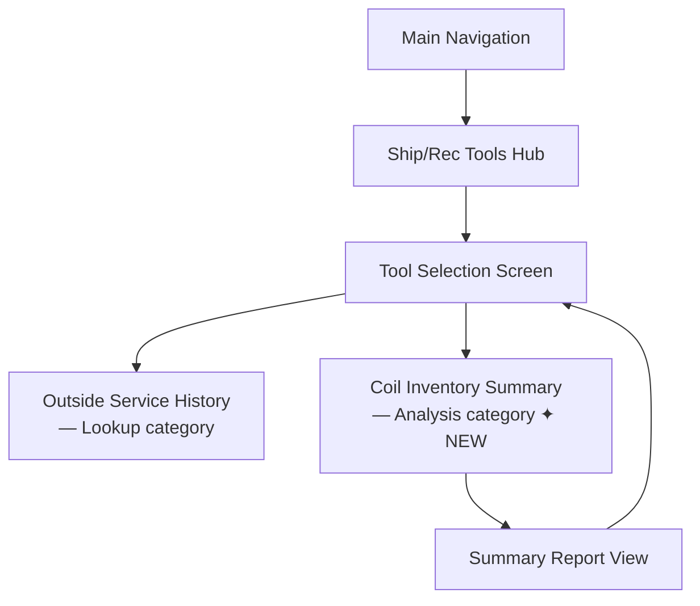
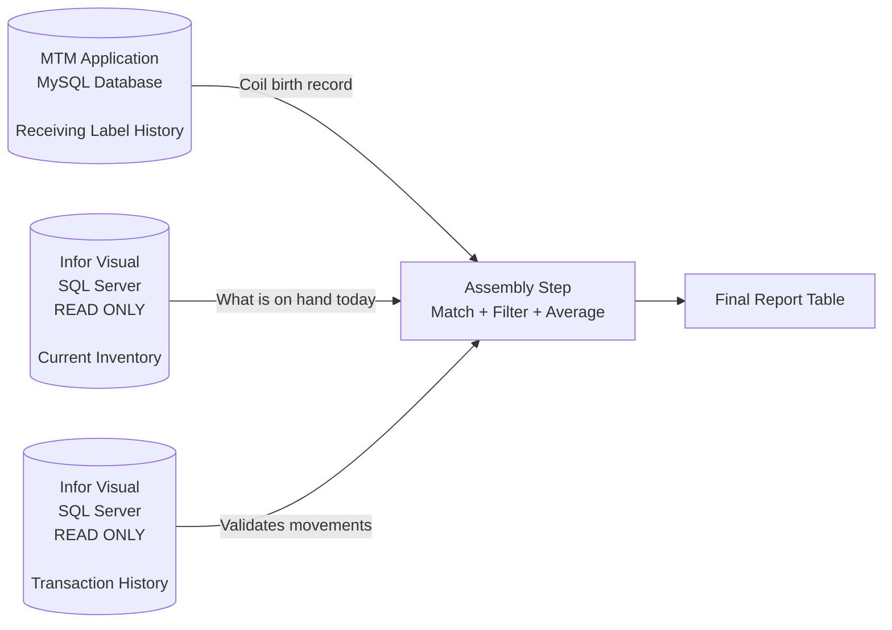
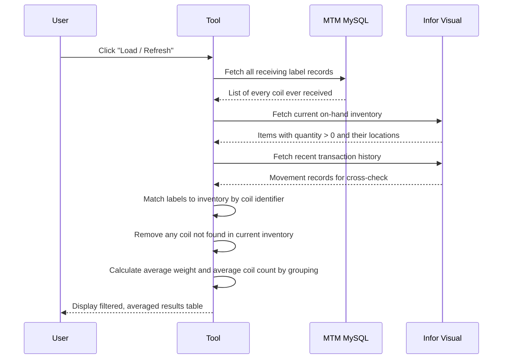
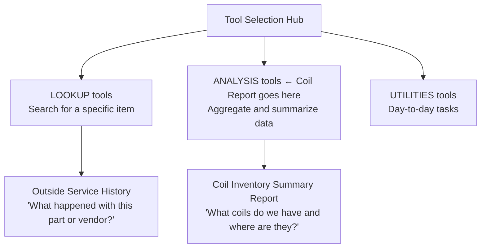
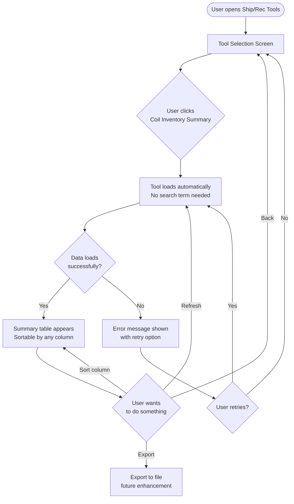

# Coil Inventory Summary Report — Implementation Plan
**Document Status:** Draft for Review  
**Last Updated:** 2025-07-14  
**Author:** GitHub Copilot (review pass prior to implementation)  
**Target Module:** Ship/Rec Tools

---

## 1. What Is This?

A new read-only reporting tool that sits inside the existing **Ship/Rec Tools** section of the application. When a user opens it, they get a live summary of every coil currently in the building — where it is, how much is left, and what a typical coil in that group weighs. The report assembles information from two separate data systems and presents it as a single, sortable list.

---

## 2. Where It Lives in the Application

The application already has a "Ship/Rec Tools" hub where users pick from a menu of utility tools. The existing tool in that hub is the **Outside Service Provider History** lookup. The Coil Inventory Summary Report would appear as a second card on that same selection screen, in the **Analysis** category (since it summarizes trends and stock levels rather than looking up a single item).

---

## 3. What the Tool Will Return

When loaded, the tool produces a table. Each row represents one coil (or one coil-at-location combination if a coil spans multiple bins). The columns are:

| Column | What It Means |
|---|---|
| **Coil Identifier** | The unique label or tag that identifies this specific coil within the facility |
| **Current Quantity** | How much of this coil remains (in whatever unit — pounds, feet, etc.) |
| **Storage Location** | The warehouse bin, zone, or aisle/position where the coil is sitting right now |
| **Average Weight** | The typical weight of coils that share this material type or specification |
| **Average Coil Count** | The typical number of individual coils found in this type of location |

The list will be sortable by any column and refreshable on demand. It will also show a status indicator (loading, success, or error) so users always know if they are looking at current data.

---

## 4. The Three Data Sources

The report draws on three separate sources and combines them before displaying anything.

| Source | Lives In | Used For |
|---|---|---|
| Receiving Label History | MTM MySQL database | Proves the coil entered the facility; provides the original identity, weight, and specification |
| Current Inventory | Infor Visual (read-only) | Tells us the coil is still here, where it is, and how much remains |
| Transaction History | Infor Visual (read-only) | Validates the current status and can reveal if a coil was moved or partially consumed |

---

## 5. How the Data Is Assembled (Step-by-Step)

---

## 6. Assumptions Made During Planning

The following assumptions are based on how the existing system works. Each one should be confirmed before implementation begins.

| # | Assumption | Basis |
|---|---|---|
| A1 | The link between a receiving label in MySQL and the Infor Visual inventory record is the **Part ID** field (the material specification identifier). There is no per-coil unique key shared by both systems. | The receiving label stores a `part_id`; Infor Visual inventory is also organized by part number. |
| A2 | Infor Visual tracks inventory at the **Part + Location** level — meaning it aggregates all coils of the same part in the same bin rather than tracking each physical coil individually. | Standard Infor Visual behavior for inventory management. |
| A3 | The "coil identifier" shown in the report will be the **receiving label number** from the MTM system, not a separate physical coil tag. The label number is the closest thing to a per-coil unique identifier available in both systems. | `load_number` is the label number in the MySQL records. |
| A4 | "Current quantity" comes from **Infor Visual**, not from recalculating the MySQL records. Infor Visual is the system of record for what is actually on the floor. | Infor Visual is authoritative for on-hand balances. |
| A5 | The warehouse site in Infor Visual is **"002"** (the default site configured throughout the application). | `InforVisualDefaults.DefaultSiteId = "002"`. |
| A6 | "Average weight" is computed by grouping receiving labels by **Part ID** and averaging the recorded weight across all labels in that group — living or consumed. This gives a representative weight for planning, not just current coils. | The spec says "group by material specification." |
| A7 | "Average coil count" means the average number of distinct receiving label records associated with a single storage location, across the history of that location. | The spec says "typical number of individual coils per location." |
| A8 | The Infor Visual database contains a standard inventory table (or view) that provides quantity on hand and bin/location for each part. The exact table name needs to be confirmed by querying the MTMFG database directly. | Assumed from standard Infor Visual schema; not yet verified in this codebase. |
| A9 | This tool is **read-only in both directions** — no data is written to either MySQL or Infor Visual. | Consistent with application-wide rules for Infor Visual (read-only) and the reporting intent of this tool. |
| A10 | Coils with a quantity of zero are **excluded** from the report. The report reflects only items physically present and available. | From the business rules in the spec: "quantity greater than zero." |

---

## 7. Clarification Questions

The following questions need answers from the business or data team before implementation can proceed with confidence.

### Data Structure Questions

> **Q1 — Coil Identity Bridge:**  
> In Infor Visual, is there any field on the inventory or transaction record that directly matches back to the MTM receiving label number (`load_number`)? Or is Part ID the only linking field?  
> *Impact: High — determines how precisely we can match individual coils vs. summarizing by part.*

> **Q2 — Inventory Table Name:**  
> What is the exact Infor Visual table (or view) that holds current on-hand quantities and warehouse locations for the MTMFG database? Is it `INVENTORY`, `PART_SITE`, a custom view, or something else?  
> *Impact: High — without this we cannot write the inventory query.*

> **Q3 — Location Format:**  
> How is a "storage location" represented in Infor Visual? Is it a single field (e.g., `A-12-03`), or separate fields for zone, aisle, and bin that need to be combined?  
> *Impact: Medium — affects how we display and sort the location column.*

> **Q4 — Transaction Table Name:**  
> What is the Infor Visual table that holds inventory movement/transaction history (receipts, issues, transfers)? Is it `TRANSACTION`, `INVENTORY_TRANSACTION`, or a different name?  
> *Impact: Medium — needed for cross-validation of coil movement.*

### Business Logic Questions

> **Q5 — Coil Identifier in the UI:**  
> When a warehouse employee looks at the report, what identifier do they expect to see for a coil? The MTM label number, the Part ID, or something else (e.g., a heat lot number, a physical tag on the coil)?  
> *Impact: High — this determines the primary display key for every row.*

> **Q6 — One Row Per Label vs. One Row Per Part-Location:**  
> Should the report show one row per receiving label (one row per coil physically received), or one row per Part-Location combination (aggregated)?  
> Example: If three labels of the same part sit in the same bin, is that 3 rows or 1 row?  
> *Impact: High — determines the entire grain of the report.*

> **Q7 — Partially Consumed Coils:**  
> If a coil was received at 3,000 lbs but only 1,200 lbs remain, should the row show the original weight, the remaining quantity, or both?  
> *Impact: Medium — affects what "current quantity" means on screen.*

> **Q8 — Grouping for Averages:**  
> The spec mentions grouping coils by "material specification" for average weight. Is this equivalent to grouping by Part ID alone, or does it require additional fields like gauge, width, or grade?  
> *Impact: Medium — determines how meaningful the average is.*

> **Q9 — Performance Tolerance:**  
> The spec says "under 5 seconds." How many receiving label records are in the MySQL database today, and how many active inventory records are in Infor Visual? (Rough order of magnitude.)  
> *Impact: Medium — may require pre-filtering or caching strategies.*

> **Q10 — Export / Print:**  
> Is export to a spreadsheet file a requirement for the first release, or a future enhancement?  
> *Impact: Low-Medium — can be added later but easier to design for from the start.*

---

## 8. Tool Categorization

The existing tool (Outside Service History) is in the **Lookup** category — you provide a search term and get back specific records for that item.

The Coil Inventory Summary Report is different: it loads all current inventory automatically with no search term required, aggregates across records, and computes summary statistics. This makes it an **Analysis** tool in the existing category scheme.

---

## 9. User Workflow

---

## 10. Plan of Attack (Implementation Phases)

Before any work starts, the clarification questions above (especially Q1–Q6) must be answered. The plan below assumes those answers are in hand.

### Phase 1 — Data Validation
Confirm the Infor Visual table names and field structures by running test queries directly against the MTMFG database. Verify that a Part ID from a MySQL receiving label can be matched to an Infor Visual inventory record. Establish the exact column names for quantity and location.

### Phase 2 — Data Query Design
Design the two Infor Visual queries (current inventory, transaction history) and the MySQL query (receiving labels). Write them as standalone queries first and validate the output manually. Confirm row counts are reasonable and performance is acceptable.

### Phase 3 — Model Design
Define what a single row in the report looks like as a data structure. Map each column to its source field. Decide how averages are calculated and confirm the grouping logic.

### Phase 4 — Service Layer
Add the Coil Inventory queries to the existing Infor Visual data layer (read-only). Add a MySQL query for receiving label history that returns the fields needed for the join. Create a new service responsible for assembling the three sources into the final report rows.

### Phase 5 — Tool Registration
Register the new tool in the tool hub under the Analysis category with an appropriate icon and description.

### Phase 6 — User Interface
Build the report screen following the same layout pattern as the Outside Service History tool: a header, a status bar, and a sortable data grid. Add a Refresh button and a loading indicator.

### Phase 7 — Wiring and Navigation
Connect the new tool to the main navigation controller (the same "show/hide" approach used for the existing tool). Register all new components with the dependency injection container.

### Phase 8 — Validation
Manually compare report output against a physical inventory count or a known Infor Visual inventory report to verify accuracy. Check edge cases: empty inventory, zero-quantity coils, coils with no matching receiving label.

---

## 11. Risk Register

| Risk | Likelihood | Impact | Mitigation |
|---|---|---|---|
| Infor Visual inventory table name is unknown or uses a custom view | High | High | Ask the data team; run a schema query against MTMFG to find candidate tables |
| No per-coil link exists between MySQL and Infor Visual (only Part ID) | Medium | High | Report at Part-Location grain rather than individual label grain; note this to stakeholders |
| Infor Visual query is slow on large inventory datasets | Medium | Medium | Filter to on-hand only (quantity > 0) first; consider caching averages separately |
| "Average coil count" is not meaningful without knowing the grain | Medium | Low | Defer or make it optional if the grouping definition cannot be agreed upon |
| MySQL receiving label history is very large and slows join | Low | Medium | Filter MySQL to only coil-type parts using `part_type` field |

---

## 12. Open Items Tracker

| Item | Owner | Status |
|---|---|---|
| Confirm Infor Visual inventory table name | Data Team / DBA | Open |
| Confirm whether per-coil link exists beyond Part ID | Business Analyst | Open |
| Define "coil identifier" for the UI | Warehouse Supervisor | Open |
| Define row grain (per label vs. per Part-Location) | Business Analyst | Open |
| Confirm location field format in Infor Visual | DBA | Open |
| Agree on "average" grouping criteria | Planning / Operations | Open |

---

*This document should be reviewed and the open items resolved before any implementation work begins. Once questions are answered, update this document and proceed to Phase 1.*
