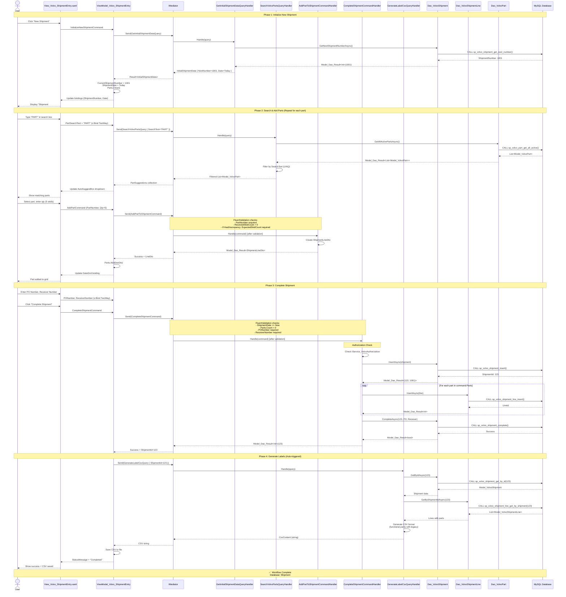

# Complete Shipment Entry Workflow (New Shipment)

**User Story**: US1 - Volvo Shipment Entry with CQRS  
**Scenario**: User creates a new shipment from scratch, adds parts, and completes it

## End-to-End Flow

## Key CQRS Components

### Queries Used

1. **GetInitialShipmentDataQuery** → Gets next shipment number for the day
2. **SearchVolvoPartsQuery** → Real-time part search for autocomplete
3. **GenerateLabelCsvQuery** → Produces label CSV file

### Commands Used  

1. **AddPartToShipmentCommand** → Adds part to in-memory collection (validation only)
2. **CompleteShipmentCommand** → Persists shipment, lines, marks complete, triggers label/email

### Validation Rules

**AddPartToShipmentCommand**:

- `PartNumber` required
- `ReceivedSkidCount > 0`
- If `HasDiscrepancy = true`: `ExpectedSkidCount` and `DiscrepancyNote` required

**CompleteShipmentCommand**:

- `ShipmentDate <= DateTime.Now`
- `Parts.Count > 0`
- `PONumber` required and not empty
- `ReceiverNumber` required and not empty
- User must have "Complete Shipments" authorization

### Database Operations

**Stored Procedures Called**:

1. `sp_volvo_shipment_get_next_number()` - Get next sequential number
2. `sp_volvo_part_get_all_active()` - Get active parts for search
3. `sp_volvo_shipment_insert()` - Insert shipment header
4. `sp_volvo_shipment_line_insert()` - Insert each line (looped)
5. `sp_volvo_shipment_complete()` - Update status, add PO/Receiver
6. `sp_volvo_shipment_get_by_id()` - Retrieve for label generation
7. `sp_volvo_shipment_line_get_by_shipment()` - Get lines for labels

### Success Criteria

✅ Shipment created with status='Completed'  
✅ All parts saved to `volvo_shipment_lines` table  
✅ CSV labels generated matching legacy format byte-for-byte  
✅ No direct ViewModel→DAO calls (all through IMediator)  
✅ FluentValidation enforces business rules  
✅ Authorization checked before completion
