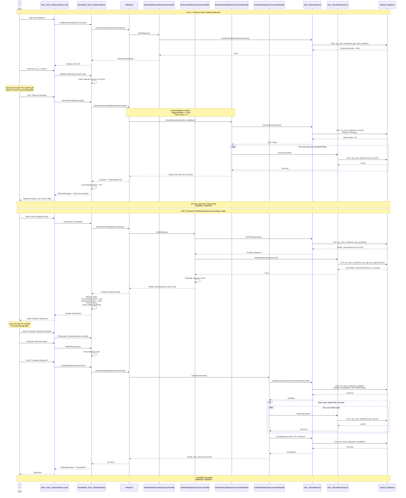

# Pending Shipment Save & Resume Workflow

**User Story**: US1 - Volvo Shipment Entry with CQRS  
**Scenario**: User starts a shipment, saves it as pending (no PO yet), then resumes it later to complete

## End-to-End Flow

## Key CQRS Components

### Queries Used

1. **GetInitialShipmentDataQuery** → Gets next shipment number (new flow)
2. **GetPendingShipmentQuery** → Retrieves saved pending shipment (resume flow)

### Commands Used

1. **SavePendingShipmentCommand** → Saves incomplete shipment with status='Pending'
2. **CompleteShipmentCommand** → Updates pending shipment to 'Completed', adds PO/Receiver

### Validation Rules

**SavePendingShipmentCommand**:

- `ShipmentDate <= DateTime.Now`
- `Parts.Count > 0` (must have at least 1 part)
- NO requirement for PO/Receiver (that's the point of pending)

**CompleteShipmentCommand**:

- Same as regular completion
- If `ShipmentId` is provided, updates existing shipment instead of inserting new

### State Management

**ViewModel Tracks**:

- `CurrentShipmentId` (null for new, set after save/resume)
- `IsResumedShipment` (flag to determine Insert vs Update)
- `Parts` collection (in-memory until saved)

**Database States**:

1. **New Shipment**: No DB record, parts in VM memory only
2. **Pending**: `status='Pending'`, shipment + lines in DB, no PO/Receiver
3. **Completed**: `status='Completed'`, has PO/Receiver, immutable

### Database Operations

**Stored Procedures Called**:

**Save Flow**:

1. `sp_volvo_shipment_insert()` - Insert with status='Pending'
2. `sp_volvo_shipment_line_insert()` - Insert each line

**Resume Flow**:
3. `sp_volvo_shipment_get_pending()` - Get latest pending for user
4. `sp_volvo_shipment_line_get_by_shipment()` - Get associated lines

**Complete Flow**:
5. `sp_volvo_shipment_update()` - Update if resuming (optional)
6. `sp_volvo_shipment_line_insert()` - Insert any new lines added during resume
7. `sp_volvo_shipment_complete()` - Mark as completed, add PO/Receiver

### Business Rules

✅ **Only ONE pending shipment per user allowed** (enforced by `GetPendingAsync()`)  
✅ **Pending shipments can be edited** (add/remove parts before completion)  
✅ **Completed shipments are immutable** (cannot go back to pending)  
✅ **Resume happens automatically** on app launch (if pending exists)  
✅ **User can choose to discard pending** and start new instead

### Success Criteria

✅ Shipment saved mid-workflow without PO/Receiver  
✅ State restored perfectly after app restart  
✅ All parts preserved in database during pending state  
✅ Transition from Pending → Completed is atomic  
✅ No data loss during save/resume cycle
