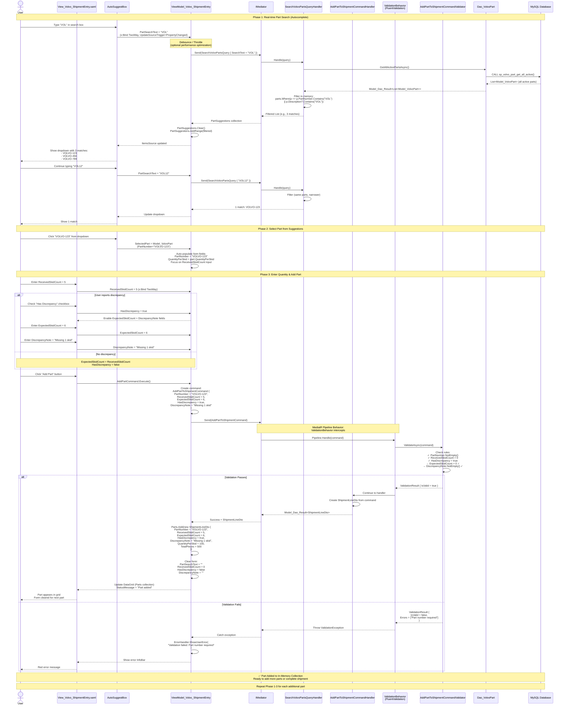

# Part Search & Add Workflow (Real-time)

**User Story**: US1 - Volvo Shipment Entry with CQRS  
**Scenario**: User types in part search box, gets autocomplete suggestions, selects a part to add

## End-to-End Flow



## Key CQRS Components

### Queries Used

**SearchVolvoPartsQuery**

- **Request**: `{ SearchText: string }`
- **Response**: `Model_Dao_Result<List<Model_VolvoPart>>`
- **Handler**: `SearchVolvoPartsQueryHandler`
- **DAO**: `Dao_VolvoPart.GetAllActivePartsAsync()`
- **Filter**: Client-side LINQ after fetching all active parts

### Commands Used

**AddPartToShipmentCommand**

- **Request**: `{ PartNumber, ReceivedSkidCount, ExpectedSkidCount?, HasDiscrepancy, DiscrepancyNote? }`
- **Response**: `Model_Dao_Result<ShipmentLineDto>`
- **Handler**: `AddPartToShipmentCommandHandler`
- **Validator**: `AddPartToShipmentCommandValidator`
- **Effect**: Creates DTO for in-memory collection (no DB write until Complete/Save)

### Validation Rules (AddPartToShipmentCommandValidator)

```csharp
RuleFor(x => x.PartNumber)
    .NotEmpty().WithMessage("Part number is required");

RuleFor(x => x.ReceivedSkidCount)
    .GreaterThan(0).WithMessage("Received skid count must be greater than 0");

When(x => x.HasDiscrepancy, () => 
{
    RuleFor(x => x.ExpectedSkidCount)
        .GreaterThan(0).WithMessage("Expected skid count required for discrepancies");
    
    RuleFor(x => x.DiscrepancyNote)
        .NotEmpty().WithMessage("Discrepancy note required when reporting discrepancy");
});
```

### Performance Optimization Strategies

**Option 1: Debouncing** (Current Recommendation)

- Wait 300ms after user stops typing before sending query
- Prevents excessive queries while typing fast

**Option 2: Caching**

- Cache `GetAllActivePartsAsync()` result for 5 minutes
- Filter cached list client-side for instant suggestions
- Trade-off: Stale data vs performance

**Option 3: Server-side Search**

- Modify DAO to accept search parameter
- Database executes `WHERE part_number LIKE '%{search}%'`
- Better for large datasets (1000+ parts)

**Current Implementation**: Option 1 (Debouncing recommended in ViewModel)

### UI/UX Patterns

**AutoSuggestBox Configuration**:

```xml
<AutoSuggestBox
    Text="{x:Bind ViewModel.PartSearchText, Mode=TwoWay, UpdateSourceTrigger=PropertyChanged}"
    ItemsSource="{x:Bind ViewModel.PartSuggestions, Mode=OneWay}"
    TextMemberPath="PartNumber"
    PlaceholderText="Search part number..."
    QuerySubmitted="AutoSuggestBox_QuerySubmitted" />
```

**DataGrid Binding**:

```xml
<DataGrid ItemsSource="{x:Bind ViewModel.Parts, Mode=OneWay}">
    <DataGrid.Columns>
        <DataGridTextColumn Header="Part" Binding="{Binding PartNumber}" />
        <DataGridTextColumn Header="Received" Binding="{Binding ReceivedSkidCount}" />
        <DataGridTextColumn Header="Expected" Binding="{Binding ExpectedSkidCount}" />
        <DataGridTemplateColumn Header="Discrepancy">
            <DataTemplate>
                <TextBlock Text="{Binding DiscrepancyNote}" Foreground="Red" 
                           Visibility="{Binding HasDiscrepancy}" />
            </DataTemplate>
        </DataGridTemplateColumn>
    </DataGrid.Columns>
</DataGrid>
```

### State Management

**In-Memory (ViewModel)**:

- `Parts` collection grows as user adds parts
- No database writes until "Complete" or "Save Pending"
- Can remove parts before saving (`RemovePartFromShipmentCommand`)

**Benefits**:

- Fast user experience (no DB round-trips per add)
- Easy to undo/edit before committing
- Atomic save on completion

### Success Criteria

✅ Search results appear < 300ms after typing stops  
✅ Autocomplete shows relevant parts as user types  
✅ Validation prevents invalid part additions  
✅ Discrepancy fields required only when checkbox checked  
✅ DataGrid updates immediately after add  
✅ Parts stored in memory until explicit save/complete  
✅ No direct ViewModel→DAO calls (all through IMediator)
