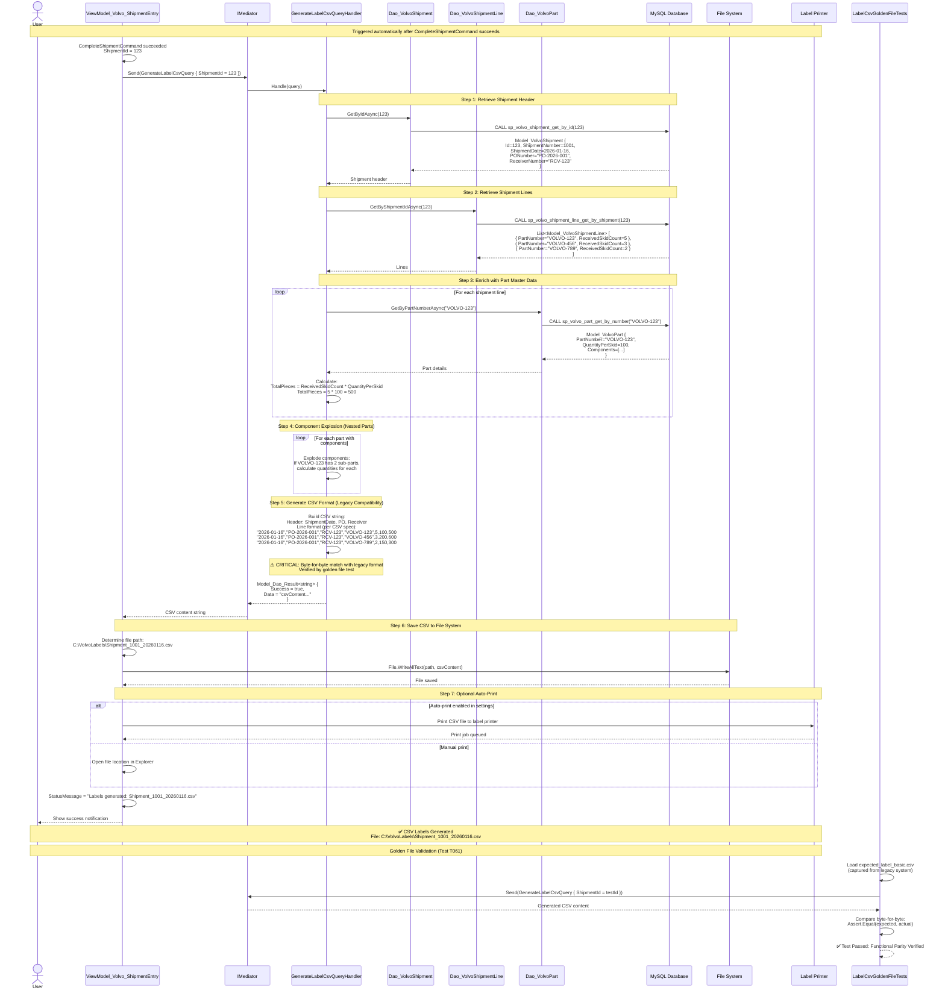

# Label Generation Workflow (CSV Export)

**User Story**: US1 - Volvo Shipment Entry with CQRS  
**Scenario**: After shipment completion, system auto-generates CSV labels for printing

## End-to-End Flow



## CSV Format Specification

### Header Row (Optional)

```csv
ShipmentDate,PONumber,ReceiverNumber,PartNumber,SkidCount,QuantityPerSkid,TotalPieces,DiscrepancyNote
```

### Data Rows (Per Part)

```csv
"2026-01-16","PO-2026-001","RCV-123","VOLVO-123",5,100,500,""
"2026-01-16","PO-2026-001","RCV-123","VOLVO-456",3,200,600,"Missing 1 skid"
```

### Field Descriptions

| Field | Type | Source | Calculation |
|-------|------|--------|-------------|
| ShipmentDate | Date | Shipment header | ISO 8601 format |
| PONumber | String | Shipment header | From completing user input |
| ReceiverNumber | String | Shipment header | From completing user input |
| PartNumber | String | Shipment line | Direct from part entry |
| SkidCount | Integer | Shipment line | ReceivedSkidCount |
| QuantityPerSkid | Integer | Part master data | From `volvo_parts` table |
| TotalPieces | Integer | Calculated | SkidCount × QuantityPerSkid |
| DiscrepancyNote | String | Shipment line | Only if HasDiscrepancy=true |

### Component Explosion Logic

**Example**: Part `VOLVO-ASSY-001` is an assembly with 3 components

**Part Master Data**:

```
VOLVO-ASSY-001 (Assembly)
├── VOLVO-COMP-A (Qty: 2 per assembly)
├── VOLVO-COMP-B (Qty: 4 per assembly)
└── VOLVO-COMP-C (Qty: 1 per assembly)
```

**If received 5 skids of VOLVO-ASSY-001 @ 10 assemblies/skid**:

- Total assemblies: 5 × 10 = 50
- VOLVO-COMP-A pieces: 50 × 2 = 100
- VOLVO-COMP-B pieces: 50 × 4 = 200
- VOLVO-COMP-C pieces: 50 × 1 = 50

**CSV Output** (4 rows for 1 received part):

```csv
"2026-01-16","PO-123","RCV-456","VOLVO-ASSY-001",5,10,50,""
"2026-01-16","PO-123","RCV-456","VOLVO-COMP-A",0,0,100,"Component of VOLVO-ASSY-001"
"2026-01-16","PO-123","RCV-456","VOLVO-COMP-B",0,0,200,"Component of VOLVO-ASSY-001"
"2026-01-16","PO-123","RCV-456","VOLVO-COMP-C",0,0,50,"Component of VOLVO-ASSY-001"
```

## Key CQRS Components

### Query Used

**GenerateLabelCsvQuery**

- **Request**: `{ ShipmentId: int }`
- **Response**: `Model_Dao_Result<string>` (CSV content)
- **Handler**: `GenerateLabelCsvQueryHandler`
- **No Command**: Read-only operation, no database writes

### Handler Responsibilities

1. **Retrieve Data**:
   - Shipment header (PO, Receiver, Date)
   - Shipment lines (Parts, Quantities)
   - Part master data (QuantityPerSkid, Components)

2. **Calculate Totals**:
   - `TotalPieces = ReceivedSkidCount × QuantityPerSkid`
   - Recursive component explosion for assemblies

3. **Format CSV**:
   - Match legacy format EXACTLY (byte-for-byte)
   - Handle special characters (commas, quotes in notes)
   - Windows line endings (`\r\n`)

4. **Return String**:
   - No file I/O in handler (handler returns string)
   - ViewModel responsible for saving to disk

### Functional Parity Requirements

**Legacy System Calculation**:

```csharp
// Old code (pre-CQRS)
foreach (var part in parts)
{
    var totalPieces = part.ReceivedSkidCount * part.QuantityPerSkid;
    csvLines.Add($"{date},{po},{receiver},{part.PartNumber},{part.ReceivedSkidCount},{part.QuantityPerSkid},{totalPieces}");
}
```

**CQRS Handler Must Match**:

```csharp
// New code (CQRS)
public async Task<Model_Dao_Result<string>> Handle(GenerateLabelCsvQuery request, CancellationToken cancellationToken)
{
    // Same calculation logic
    // Same CSV format
    // Verified by golden file test
}
```

### Golden File Testing (T061)

**Purpose**: Ensure 100% functional parity with legacy label generation

**Test Setup**:

1. Capture CSV from legacy system for known shipment
2. Save as `Module_Volvo.Tests/GoldenFiles/expected_label_basic.csv`
3. Create same shipment data in test database
4. Call `GenerateLabelCsvQuery` with test shipment ID
5. Compare byte-for-byte with golden file

**Verification Code**:

```csharp
[Fact]
public async Task GenerateLabelCsvQuery_ProducesByteForByteMatch_WithExpectedLabelBasicCsv()
{
    // Arrange
    var expectedCsv = File.ReadAllText("GoldenFiles/expected_label_basic.csv");
    var query = new GenerateLabelCsvQuery { ShipmentId = TestShipmentId };
    
    // Act
    var result = await _mediator.Send(query);
    
    // Assert
    result.IsSuccess.Should().BeTrue();
    result.Data.Should().Be(expectedCsv); // Exact string match
}
```

### File System Conventions

**File Path Pattern**:

```
C:\VolvoLabels\Shipment_{ShipmentNumber}_{YYYYMMDD}.csv
```

**Examples**:

- `C:\VolvoLabels\Shipment_1001_20260116.csv`
- `C:\VolvoLabels\Shipment_1002_20260116.csv`

**Directory Creation**:

- Auto-create `C:\VolvoLabels\` if doesn't exist
- Configurable via `appsettings.json`:

  ```json
  {
    "Volvo": {
      "LabelOutputPath": "C:\\VolvoLabels"
    }
  }
  ```

### Error Handling

**Potential Failures**:

1. Shipment not found → Return failure result
2. No lines for shipment → Return failure (shouldn't happen if validation works)
3. Part master data missing → Return failure (data integrity issue)
4. File write permission denied → Show error to user, log event

**Handler Never Throws**:

```csharp
catch (Exception ex)
{
    return Model_Dao_Result_Factory.Failure<string>(
        $"Error generating labels: {ex.Message}", ex);
}
```

### Success Criteria

✅ CSV format matches legacy byte-for-byte (golden file test passes)  
✅ Component explosion calculations match legacy system  
✅ Discrepancy notes appear correctly in CSV  
✅ File saved to configured directory  
✅ Handler is pure query (no side effects)  
✅ ViewModel handles file I/O (separation of concerns)  
✅ Multi-skid calculations accurate  
✅ Special characters escaped properly in CSV
