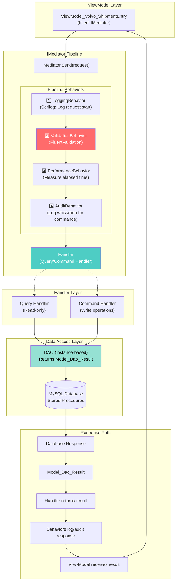
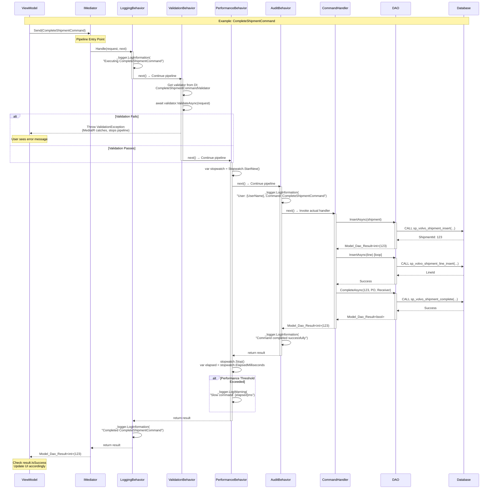
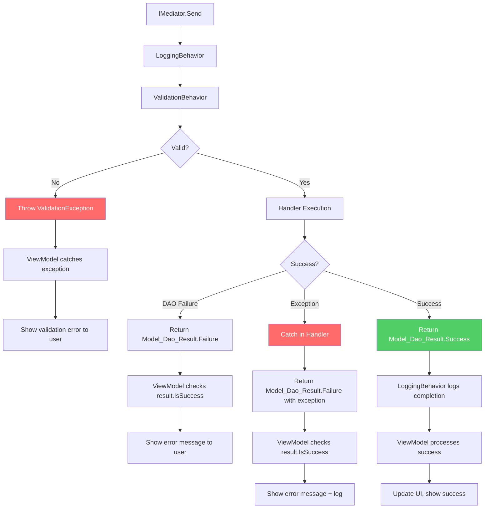

# CQRS Pipeline Flow (MediatR Behaviors)

**Feature**: Module_Volvo CQRS Modernization  
**Purpose**: Show how MediatR pipeline behaviors intercept every request/command

## MediatR Pipeline Architecture



## Detailed Pipeline Flow



## Pipeline Behavior Details

### 1️⃣ LoggingBehavior (Always Runs First)

**Purpose**: Structured logging for all requests

**Implementation**:

```csharp
public class LoggingBehavior<TRequest, TResponse> : IPipelineBehavior<TRequest, TResponse>
    where TRequest : IRequest<TResponse>
{
    private readonly ILogger<LoggingBehavior<TRequest, TResponse>> _logger;

    public async Task<TResponse> Handle(TRequest request, RequestHandlerDelegate<TResponse> next, CancellationToken cancellationToken)
    {
        var requestName = typeof(TRequest).Name;
        _logger.LogInformation("Handling {RequestName}", requestName);
        
        var response = await next();
        
        _logger.LogInformation("Handled {RequestName}", requestName);
        return response;
    }
}
```

**Logs Produced**:

```
[2026-01-16 10:30:15] INFO Handling CompleteShipmentCommand
[2026-01-16 10:30:15] INFO Handled CompleteShipmentCommand
```

### 2️⃣ ValidationBehavior (FluentValidation)

**Purpose**: Validate commands BEFORE execution

**Implementation**:

```csharp
public class ValidationBehavior<TRequest, TResponse> : IPipelineBehavior<TRequest, TResponse>
    where TRequest : IRequest<TResponse>
{
    private readonly IEnumerable<IValidator<TRequest>> _validators;

    public async Task<TResponse> Handle(TRequest request, RequestHandlerDelegate<TResponse> next, CancellationToken cancellationToken)
    {
        if (!_validators.Any())
            return await next();

        var context = new ValidationContext<TRequest>(request);
        var validationResults = await Task.WhenAll(_validators.Select(v => v.ValidateAsync(context, cancellationToken)));
        var failures = validationResults.SelectMany(r => r.Errors).Where(f => f != null).ToList();

        if (failures.Any())
            throw new ValidationException(failures);

        return await next();
    }
}
```

**Validation Rules Applied**:

- `CompleteShipmentCommandValidator`
- `AddPartToShipmentCommandValidator`
- `SavePendingShipmentCommandValidator`
- (8 total validators in Module_Volvo)

**Result**:

- ✅ Valid: Pipeline continues to next behavior
- ❌ Invalid: Throws `ValidationException`, pipeline stops, ViewModel catches exception

### 3️⃣ PerformanceBehavior (Monitoring)

**Purpose**: Detect slow commands/queries (>500ms threshold)

**Implementation**:

```csharp
public class PerformanceBehavior<TRequest, TResponse> : IPipelineBehavior<TRequest, TResponse>
    where TRequest : IRequest<TResponse>
{
    private readonly ILogger<PerformanceBehavior<TRequest, TResponse>> _logger;
    private const int ThresholdMs = 500;

    public async Task<TResponse> Handle(TRequest request, RequestHandlerDelegate<TResponse> next, CancellationToken cancellationToken)
    {
        var stopwatch = Stopwatch.StartNew();
        var response = await next();
        stopwatch.Stop();

        var elapsed = stopwatch.ElapsedMilliseconds;
        if (elapsed > ThresholdMs)
        {
            var requestName = typeof(TRequest).Name;
            _logger.LogWarning("Long running request: {RequestName} ({ElapsedMs}ms)", requestName, elapsed);
        }

        return response;
    }
}
```

**Logs Produced** (if slow):

```
[2026-01-16 10:30:16] WARN Long running request: CompleteShipmentCommand (1250ms)
```

### 4️⃣ AuditBehavior (Commands Only)

**Purpose**: Log WHO executed WHICH command WHEN

**Implementation**:

```csharp
public class AuditBehavior<TRequest, TResponse> : IPipelineBehavior<TRequest, TResponse>
    where TRequest : IRequest<TResponse>
{
    private readonly ILogger<AuditBehavior<TRequest, TResponse>> _logger;
    private readonly IService_UserSessionManager _sessionManager;

    public async Task<TResponse> Handle(TRequest request, RequestHandlerDelegate<TResponse> next, CancellationToken cancellationToken)
    {
        var requestName = typeof(TRequest).Name;
        
        // Only audit commands (writes), not queries (reads)
        if (requestName.EndsWith("Command"))
        {
            var userName = _sessionManager.GetCurrentUser();
            _logger.LogInformation("User {UserName} executing {CommandName}", userName, requestName);
        }

        var response = await next();
        return response;
    }
}
```

**Logs Produced**:

```
[2026-01-16 10:30:15] INFO User JDoe executing CompleteShipmentCommand
```

## Pipeline Registration (App.xaml.cs)

**Dependency Injection Setup**:

```csharp
public static void ConfigureServices(IServiceCollection services)
{
    // MediatR with auto-discovery
    services.AddMediatR(cfg =>
    {
        cfg.RegisterServicesFromAssembly(typeof(App).Assembly);
        
        // Pipeline behaviors (ORDER MATTERS!)
        cfg.AddBehavior(typeof(IPipelineBehavior<,>), typeof(LoggingBehavior<,>));
        cfg.AddBehavior(typeof(IPipelineBehavior<,>), typeof(ValidationBehavior<,>));
        cfg.AddBehavior(typeof(IPipelineBehavior<,>), typeof(PerformanceBehavior<,>));
        cfg.AddBehavior(typeof(IPipelineBehavior<,>), typeof(AuditBehavior<,>));
    });

    // FluentValidation validators
    services.AddValidatorsFromAssembly(typeof(App).Assembly);
}
```

## Benefits of Pipeline Architecture

### ✅ Cross-Cutting Concerns Centralized

- All logging in one place
- All validation in one place
- All performance monitoring in one place
- All audit trails in one place

### ✅ Handlers Stay Focused

```csharp
// Handler ONLY does business logic
public async Task<Model_Dao_Result<int>> Handle(CompleteShipmentCommand request, CancellationToken cancellationToken)
{
    // No logging code
    // No validation code
    // No audit code
    // Just business logic!
    
    var result = await _shipmentDao.InsertAsync(...);
    return result;
}
```

### ✅ Consistent Behavior Across All Requests

- Every command gets validated
- Every command gets logged
- Every command gets audited
- Every slow operation gets flagged

### ✅ Easy to Add New Behaviors

```csharp
// Example: Add caching behavior for queries
services.AddBehavior(typeof(IPipelineBehavior<,>), typeof(CachingBehavior<,>));
```

## Error Handling in Pipeline



## Constitutional Compliance

**Principle III: CQRS + Mediator First** ✅

- All ViewModel operations go through `IMediator`
- No direct ViewModel→Service calls
- No direct ViewModel→DAO calls
- Pipeline behaviors enforce cross-cutting concerns

**Principle V: Validation & Structured Logging** ✅

- FluentValidation via `ValidationBehavior`
- Structured logging via Serilog in `LoggingBehavior`
- Performance monitoring via `PerformanceBehavior`
- Audit trails via `AuditBehavior`

## Testing the Pipeline

**Unit Test** (Test Handler in Isolation):

```csharp
[Fact]
public async Task CompleteShipmentCommandHandler_ShouldSucceed()
{
    // Arrange: Mock DAOs, skip pipeline
    var handler = new CompleteShipmentCommandHandler(_mockDao, ...);
    
    // Act: Call handler directly (no pipeline)
    var result = await handler.Handle(command, CancellationToken.None);
    
    // Assert
    result.IsSuccess.Should().BeTrue();
}
```

**Integration Test** (Test Full Pipeline):

```csharp
[Fact]
public async Task CompleteShipmentCommand_ShouldPassThroughPipeline()
{
    // Arrange: Real MediatR with behaviors
    var mediator = GetConfiguredMediator();
    
    // Act: Send through full pipeline
    var result = await mediator.Send(command);
    
    // Assert: Check logs, validation, audit
    _loggerMock.Verify(x => x.LogInformation(It.IsAny<string>(), It.IsAny<object[]>()), Times.AtLeastOnce);
}
```
