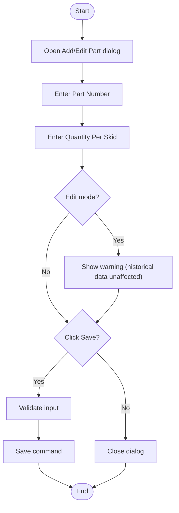

# Volvo Part Add/Edit Dialog Workflow

## Diagram (Mermaid)

## User-Friendly Steps

1. The Add/Edit dialog opens from Settings.
2. Enter a Part Number and a Quantity Per Skid.
3. In edit mode, you’ll see a warning that historical shipments are unchanged.
4. Click Save to store the part, or Cancel to exit.

## Required Info for Fixing Incorrect Workflows

| Step | UI / Action | Command | Validator Rules (Actual) | Data Path | Actual Data (from code) |
|---|---|---|---|---|---|
| Add | Save (Add Part) | AddVolvoPartCommand | PartNumber required; QuantityPerSkid > 0 | ViewModel: ViewModel_Volvo_Settings.AddPartAsync | PartNumber TextBox max length 50; QuantityPerSkid min 0 max 10000 |
| Edit | Save (Edit Part) | UpdateVolvoPartCommand | PartNumber required; QuantityPerSkid > 0 | ViewModel: ViewModel_Volvo_Settings.EditPartAsync | Edit warning: "Changes to quantity will NOT affect past shipments" |
