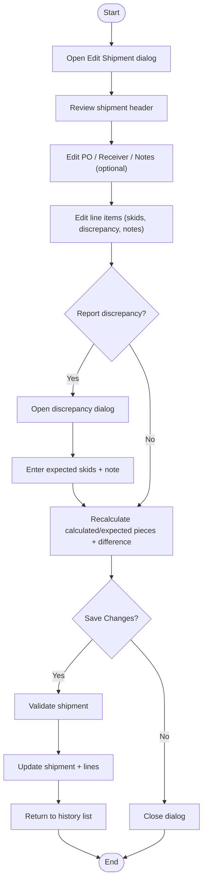

# Volvo Shipment Edit Dialog Workflow

## Diagram (Mermaid)

## User-Friendly Steps

1. From History, select a shipment and click Edit.
2. Update header values like PO, Receiver, or Notes.
3. Adjust line item counts as needed. Use Report Discrepancy to enter expected skids and a note.
4. Click Save Changes to apply updates or Cancel to discard.

## Required Info for Fixing Incorrect Workflows

| Step | UI / Action | Command | Validator Rules (Actual) | Data Path | Actual Data (from code) |
|---|---|---|---|---|---|
| Discrepancy entry | Report/Remove Discrepancy button | n/a | ExpectedSkidCount > 0; DiscrepancyNote required when reporting | View: VolvoShipmentEditDialog | Modal collects expected skids + note; remove prompts for confirmation |
| Edit shipment | Save Changes | UpdateShipmentCommand | ShipmentId > 0; ShipmentDate ≤ now; Parts not empty; Notes ≤ 1000; PONumber ≤ 50; ReceiverNumber ≤ 50; each part: PartNumber required, ReceivedSkidCount > 0 | Validator: UpdateShipmentCommandValidator; ViewModel: ViewModel_Volvo_History.EditAsync | Changing ReceivedSkids updates CalculatedPieceCount; ExpectedSkids updates ExpectedPieceCount and PieceDifference |
