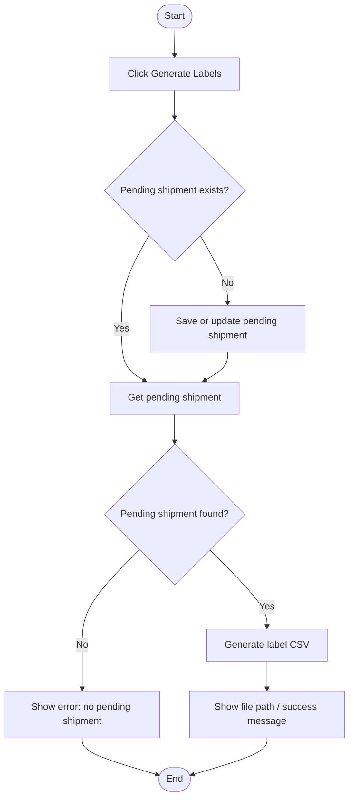

# Volvo Generate Labels Workflow

## Diagram (Mermaid)

## User-Friendly Steps

1. Click Generate Labels.
2. If the shipment isn’t saved yet, it’s saved as pending first (or updated if one already exists).
3. The system generates a CSV file for LabelView.
4. A success message shows the file path.

## Required Info for Fixing Incorrect Workflows

| Step | UI / Action | Command / Query | Validator Rules (Actual) | Handler / Data Path | Actual Data (from code) |
|---|---|---|---|---|---|
| Generate Labels | Generate Labels button | GenerateLabelCsvQuery | n/a | ViewModel: ViewModel_Volvo_ShipmentEntry.GenerateLabelsAsync | If HasPendingShipment is false, SaveShipmentInternalAsync runs first (updates existing pending if found) |
| Fetch pending | Internal | GetPendingShipmentQuery | n/a | ViewModel: GenerateLabelsAsync | Uses Environment.UserName; requires pending shipment ID |
| Create CSV | Internal | GenerateLabelCsvQuery | n/a | Handler: GenerateLabelCsvQueryHandler | Success message includes CSV file path |
