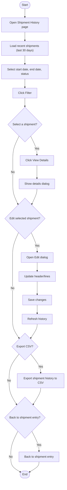

# Volvo Shipment History Workflow

## Diagram (Mermaid)

## User-Friendly Steps

1. Open Volvo Shipment History to see recent shipments.
2. Set your date range and status filter, then click Filter.
3. Select a shipment to view details.
4. Click View Details to see header and line items.
5. Click Edit to change shipment data, then save.
6. Click Export CSV to download the filtered list.
7. Use Back to return to the entry screen.

## Required Info for Fixing Incorrect Workflows

| Step | UI / Action | Command / Query | Validator Rules (Actual) | Handler / Data Path | Actual Data (from code) |
|---|---|---|---|---|---|
| Load recent | OnPageLoaded → LoadRecentShipmentsAsync | GetRecentShipmentsQuery | n/a | ViewModel: ViewModel_Volvo_History.LoadRecentShipmentsAsync | Default start date = now - 30 days |
| Filter | Filter button | GetShipmentHistoryQuery | n/a | ViewModel: FilterAsync | Status options: All, Pending PO, Completed |
| View details | View Details button | GetShipmentDetailQuery | n/a | ViewModel: ViewDetailAsync | Shows PO, Receiver, Status, Notes, and line counts |
| Edit shipment | Edit button | UpdateShipmentCommand | ShipmentId > 0; ShipmentDate ≤ now; Parts not empty; Notes ≤ 1000; PONumber ≤ 50; ReceiverNumber ≤ 50; each part: PartNumber required, ReceivedSkidCount > 0 | Validator: UpdateShipmentCommandValidator; ViewModel: EditAsync | Uses VolvoShipmentEditDialog; updates lines via UpdateShipmentCommand |
| Export | Export CSV button | ExportShipmentsQuery | n/a | ViewModel: ExportAsync | Uses StartDate, EndDate, StatusFilter |
