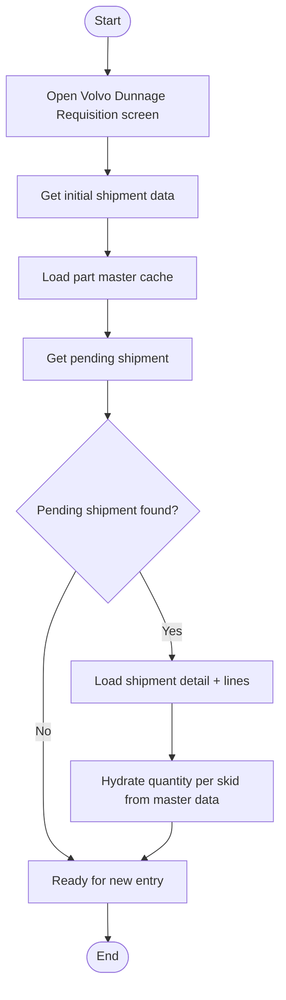

# Volvo Shipment Entry Initial Load & Pending Resume Workflow

## Diagram (Mermaid)

## User-Friendly Steps

1. Open the Volvo Dunnage Requisition screen.
2. The system loads today’s date and the next shipment number.
3. The system loads part master data for quantity-per-skid lookups.
4. If a pending shipment exists, it’s loaded and hydrated with quantity-per-skid values.
5. If none exists, the screen is ready for a new shipment.

## Required Info for Fixing Incorrect Workflows

| Step | UI / Action | Command / Query | Validator Rules (Actual) | Handler / Data Path | Actual Data (from code) |
|---|---|---|---|---|---|
| Initial data | Page load | GetInitialShipmentDataQuery | n/a | ViewModel: ViewModel_Volvo_ShipmentEntry.InitializeAsync | Sets ShipmentDate and ShipmentNumber |
| Load parts cache | Page load | GetAllVolvoPartsQuery | n/a | ViewModel: InitializeAsync | Caches part master data for quantity-per-skid hydration |
| Check pending | Page load | GetPendingShipmentQuery | n/a | ViewModel: InitializeAsync | If found, sets HasPendingShipment true |
| Load details | Internal | GetShipmentDetailQuery | n/a | ViewModel: LoadPendingShipmentAsync | Loads shipment header and lines, then hydrates quantity per skid |
