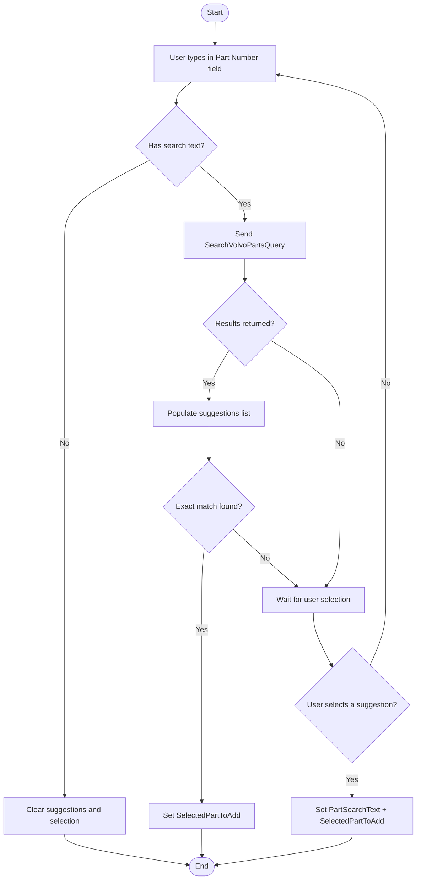

# Volvo Part Search (AutoSuggest) Workflow

## Diagram (Mermaid)

## User-Friendly Steps

1. Start typing in the Part Number field.
2. Suggestions appear as you type.
3. Select the correct part from the list.
4. The selection is used when you add the part to the shipment.

## Required Info for Fixing Incorrect Workflows

| Step | UI / Action | Command / Query | Validator Rules (Actual) | Handler / Data Path | Actual Data (from code) |
|---|---|---|---|---|---|
| Type in Part Number | AutoSuggestBox text change | SearchVolvoPartsQuery | n/a | ViewModel: ViewModel_Volvo_ShipmentEntry.UpdatePartSuggestions | MaxResults = 20; empty text clears SuggestedParts and SelectedPartToAdd |
| Select suggestion | AutoSuggestBox suggestion chosen | n/a | n/a | ViewModel: ViewModel_Volvo_ShipmentEntry.OnPartSuggestionChosen | Sets PartSearchText and SelectedPartToAdd |
| Exact match | After search | n/a | n/a | ViewModel: UpdatePartSuggestions | Exact match sets SelectedPartToAdd automatically |
