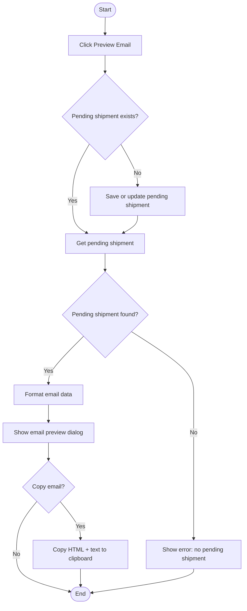

# Volvo Preview Email Workflow

## Diagram (Mermaid)

## User-Friendly Steps
1. Click Preview Email.
2. If the shipment isn’t saved yet, it’s saved as pending first (or updated if one already exists).
3. The system formats the email content.
4. A preview dialog shows recipients, subject, discrepancies, and requested lines.
5. Click Copy to put the formatted email on your clipboard.

## Required Info for Fixing Incorrect Workflows
| Step | UI / Action | Command / Query | Validator Rules (Actual) | Handler / Data Path | Actual Data (from code) |
|---|---|---|---|---|---|
| Preview Email | Preview Email button | FormatEmailDataQuery | n/a | ViewModel: ViewModel_Volvo_ShipmentEntry.PreviewEmailAsync | If HasPendingShipment is false, SaveShipmentInternalAsync runs first (updates existing pending if found) |
| Fetch pending | Internal | GetPendingShipmentQuery | n/a | ViewModel: PreviewEmailAsync | Uses Environment.UserName; requires pending shipment ID |
| Format email | Internal | FormatEmailDataQuery | n/a | Handler: FormatEmailDataQueryHandler | Builds subject, discrepancies, requested lines |
| Show preview | Dialog | n/a | n/a | ViewModel: ShowEmailPreviewDialogAsync | Recipients from settings: email_to_recipients, email_cc_recipients |
