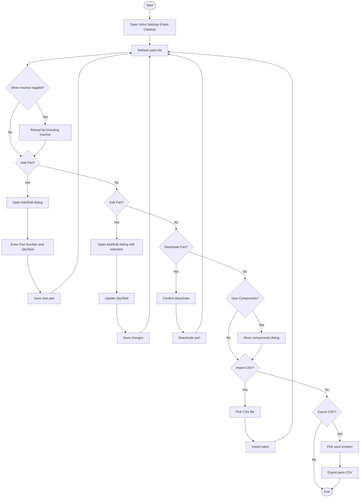

# Volvo Parts Master Data Workflow

## Diagram (Mermaid)

## Inconsistencies

Is there an Activate Part? branch, to activate a deactivated part?

## User-Friendly Steps
1. Open Volvo Settings to manage the parts catalog.
2. Use Refresh to load the latest parts.
3. Toggle Show Inactive if you need to see inactive parts.
4. Add Part to create a new part number with its quantity per skid.
5. Edit Part to adjust an existing part’s quantity per skid.
6. Deactivate removes a part from active lists (history remains intact).
7. View Components shows any component definitions for the selected part.
8. Import CSV to bulk-add/update parts, Export CSV to download the current list.

## Required Info for Fixing Incorrect Workflows
| Step | UI / Action | Command / Query | Validator Rules (Actual) | Handler / Data Path | Actual Data (from code) |
|---|---|---|---|---|---|
| Refresh list | Refresh button | GetAllVolvoPartsQuery | n/a | ViewModel: ViewModel_Volvo_Settings.RefreshAsync | ShowInactive controls IncludeInactive |
| Add part | Add Part button | AddVolvoPartCommand | PartNumber required; QuantityPerSkid > 0 | Validator: AddVolvoPartCommandValidator | Dialog: VolvoPartAddEditDialog; PartNumber max 50 in dialog |
| Edit part | Edit Part button | UpdateVolvoPartCommand | PartNumber required; QuantityPerSkid > 0 | Validator: UpdateVolvoPartCommandValidator | Dialog warns: "Changes to quantity will NOT affect past shipments" |
| Deactivate | Deactivate button | DeactivateVolvoPartCommand | PartNumber required | Validator: DeactivateVolvoPartCommandValidator | Confirmation dialog message in ViewModel |
| View components | View Components | GetPartComponentsQuery | n/a | ViewModel: ViewComponentsAsync | Displays list of component part numbers and quantity |
| Import CSV | Import CSV button | ImportPartsCsvCommand | CsvFilePath required | Validator: ImportPartsCsvCommandValidator | Uses FileOpenPicker; supports .csv |
| Export CSV | Export CSV button | ExportPartsCsvQuery | n/a | ViewModel: ExportCsvAsync | Suggested file name: volvo_parts_yyyyMMdd.csv |
