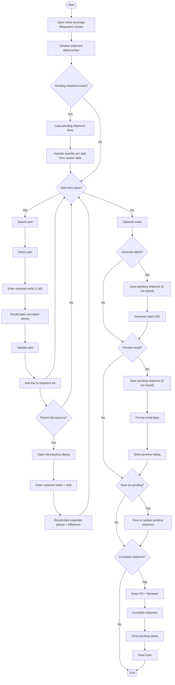

# Volvo Dunnage Shipment Entry Workflow

## Diagram (Mermaid)

## Things to fix

- Resolved: Search for parts only occurs when Add more parts = Yes.
- Resolved: Completing shipment clears pending status (status updated to completed).

## User-Friendly Steps

1. Open the Volvo Dunnage Requisition screen. The app auto-fills today’s date and the next shipment number.
2. If a pending shipment already exists, it loads automatically and hydrates quantity-per-skid values from master data.
3. Start typing a part number and pick it from the suggestions.
4. Enter how many skids you received (must be between 1 and 99).
5. Click Add Part. Repeat for each part you received.
6. If needed, click Report Discrepancy to enter expected skids and a note.
7. (Optional) Add notes for this shipment.
8. If you need labels, click Generate Labels. If the shipment isn’t saved yet, it will save first.
9. If you need to email Purchasing, click Preview Email. It will save first if needed, then show a formatted preview.
10. Click Save as Pending to pause and finish later.
11. When you have PO and Receiver numbers, click Complete Shipment to finalize and clear the form.

## Required Info for Fixing Incorrect Workflows

| Step | UI / Action | Command / Query | Validator Rules (Actual) | Handler / Data Path | Actual Data (from code) |
|---|---|---|---|---|---|
| Initialize screen | OnLoaded → InitializeAsync | GetInitialShipmentDataQuery, GetPendingShipmentQuery, GetAllVolvoPartsQuery | n/a | ViewModel: ViewModel_Volvo_ShipmentEntry.InitializeAsync | Loads part master cache; auto-sets ShipmentDate/ShipmentNumber; loads pending if found and hydrates quantity per skid |
| Add part | Add Part button | AddPartToShipmentCommand | PartNumber required, max 50; ReceivedSkidCount > 0; if HasDiscrepancy then ExpectedSkidCount > 0 and DiscrepancyNote required (max 500) | Validator: AddPartToShipmentCommandValidator; ViewModel: AddPart | CalculatedPieceCount = QuantityPerSkid × ReceivedSkidCount; ReceivedSkidsToAdd range 1–99; duplicate part blocked |
| Remove part | Remove Part button | RemovePartFromShipmentCommand | n/a | ViewModel: RemovePart | Removes selected line |
| Save pending | Save as Pending | SavePendingShipmentCommand | ShipmentDate required ≤ now; Parts not empty; Notes ≤ 1000 | Validator: SavePendingShipmentCommandValidator; Handler: SavePendingShipmentCommandHandler | If pending exists, updates it and replaces lines; otherwise inserts new pending shipment |
| Generate labels | Generate Labels | GenerateLabelCsvQuery | n/a | ViewModel: GenerateLabelsAsync | Requires pending shipment ID; shows file path |
| Preview email | Preview Email | FormatEmailDataQuery | n/a | ViewModel: PreviewEmailAsync | Uses settings: email_to_recipients, email_cc_recipients |
| Complete shipment | Complete Shipment | CompleteShipmentCommand | ShipmentDate required ≤ now; Parts not empty; PONumber required ≤ 50; ReceiverNumber required ≤ 50; Notes ≤ 1000 | Validator: CompleteShipmentCommandValidator; Handler: CompleteShipmentCommandHandler | Requires pending shipment to exist; PO + Receiver required in dialog; pending status cleared on completion |
| Discrepancy entry | Report/Remove Discrepancy button | n/a | ExpectedSkidCount > 0; DiscrepancyNote required when reporting | ViewModel: ViewModel_Volvo_ShipmentEntry.ToggleDiscrepancyAsync | Modal collects expected skids + note; remove prompts for confirmation |
| UI fields | Shipment Date/Number, Notes | n/a | n/a | View: View_Volvo_ShipmentEntry | Received Skids updates CalculatedPieceCount; Expected Skids updates ExpectedPieceCount and PieceDifference |
