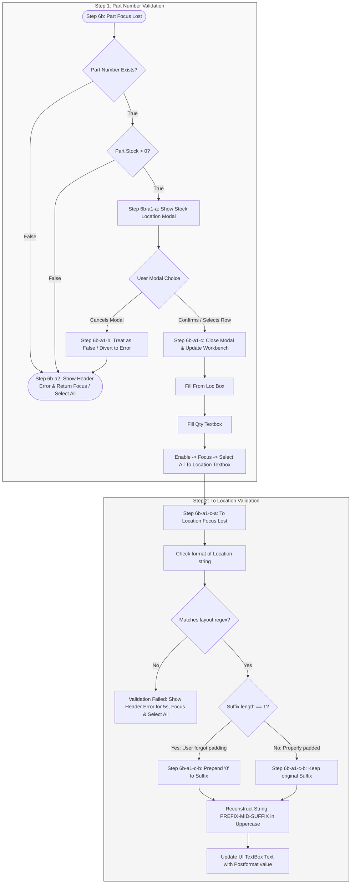

# Reformat Project Task List

> Scope: `Module_Scanner` reformat. File references below point at the current module
> implementation (Workbench view, Workbench viewmodel, validation service). All checkboxes
> remain open — nothing is complete yet.

## Module_Scanner Audit
- [ ] 1) Verify if the app properly locks out user inputs while automation is occurring.
    - **Files to update/add:** `Module_Scanner/Services/Service_ScannerExecution.cs`, `Module_Scanner/Services/Service_ScannerInputEngine.cs`, `Module_Scanner/ViewModels/ViewModel_Scanner_Workbench.cs`, `Module_Scanner/Views/View_Scanner_Workbench.xaml`
- [ ] 2) Check if tests exist to validate this input lockout functionality.
    - **Files to update/add:** `MTM_Receiving_Application.Tests/Integration/Module_Scanner/`
- [ ] 2b) Create asynchronous integration tests verifying elements toggle `Enabled = false` during active automated background processes.
    - **Files to update/add:** `MTM_Receiving_Application.Tests/Integration/Module_Scanner/` (new `WorkbenchInputLockout` fixture)

## Core Feature Removals
- [ ] 3) Remove the "Start Draft" button (spec references it as "Save Draft") and all underlying functionality.
    - **Files to update/add:** `Module_Scanner/Views/View_Scanner_Workbench.xaml` (footer button), `Module_Scanner/ViewModels/ViewModel_Scanner_Workbench.cs` (`StartDraftSessionCommand` / `StartDraftSessionAsync`), `Module_Scanner/Services/Service_ScannerWorkflow.cs` (draft-session creation), `Module_Scanner/Data/Dao_ScannerBatchSession.cs`
- [ ] 4) Remove the "Save For Later" button and all underlying functionality.
    - **Files to update/add:** `Module_Scanner/Views/View_Scanner_Workbench.xaml` (footer button), `Module_Scanner/ViewModels/ViewModel_Scanner_Workbench.cs` (`BuildRunSnapshotCommand`)

## UI & Layout Adjustments
- [ ] 5) Fix "Manage Item" modal window size (content is currently cut off on the UI).
    - **Files to update/add:** `Module_Scanner/Views/View_Scanner_ManageItemsDialog.xaml`
- [ ] 6) Update Workbench inputs to the following baseline state:
    - **Files to update/add:** `Module_Scanner/Views/View_Scanner_Workbench.xaml`, `Module_Scanner/ViewModels/ViewModel_Scanner_Workbench.cs`
    - **Part Number:** Editable. (`PartIdLookupControl`)
    - **From Location:** Read-Only at all times. (bound to `ViewModel.NewFromLocation`)
    - **To Location:** Read-Only at all times and Disabled. (bound to `ViewModel.NewToLocation`)
    - **Quantity:** Read-Only at all times. (`QuantityTextBox`, bound to `ViewModel.NewQuantity`)
    - **Add Button:** Disabled. (`AddDraftItemCommand`)

---

## Part Number Validation Workflow (Step 6b)

### Full Sequential Workflow Diagram (Step 1 -> Step 2)


### [Step 6b] Part Focus Lost & Validation
* When the user enters a **Part Number** and focus is lost, validate if the part number exists.

#### [Step 6b-a1] Case A: Part Number Exists & Has Stock

**Files to update/add:** `Module_Scanner/ViewModels/ViewModel_Scanner_Workbench.cs` (`FromLocationInventoryPickerRequested` event), `Module_Scanner/Views/View_Scanner_Workbench.xaml.cs` (`OnFromLocationInventoryPickerRequestedAsync` — `ContentDialog` picker).

* **[Step 6b-a1-a] Display Modal Window:** Show a modal listing all current locations holding `> 0` on hand.
  * Each row must include a **Quantity Textbox** auto-filled with the full quantity of that location.
  * Allow editing of this textbox as the user types, validating the value in real-time.
  * Enforce boundaries instantly: cannot go below `0` or above the location's maximum quantity. An entered value of `0` is treated as a valid choice (0 unit transfer).
* **[Step 6b-a1-b] User Cancels Modal:** Treat as if the part number had no stock. Divert immediately to **[Step 6b-a2]**.
* **[Step 6b-a1-c] Close Modal / Confirm Action:** Perform the following automatic updates back on the main Workbench view:
  1. Fill **From Loc** box with the location selected by the user.
  2. Fill **Qty** textbox with the quantity value from the selected row.
  3. Enable -> Focus -> Select All on the **To Location** textbox.

#### [Step 6b-a2] Case B: Part Number Has No Stock / Invalid

**Files to update/add:** `Module_Scanner/Views/View_Scanner_Workbench.xaml` (header/status error `TextBlock`), `Module_Scanner/ViewModels/ViewModel_Scanner_Workbench.cs` (`HeaderErrorText`, `IsHeaderErrorVisible`, `ClearHeaderError`).

1. Show an inline error message in the **Workbench header/status area** stating that the part number does not have any quantity in-house. 
2. Clear the error message automatically after a **5-second timeout**, or early if the user starts typing a new Part Number.
3. Return focus to the **Part lookup control** (`PartIdLookupControl`) and execute a **Select All**.

---

## To Location Focus Lost Workflow (Step 6b-a1-c-a)

**Files to update/add:** `Module_Scanner/Views/View_Scanner_Workbench.xaml`, `Module_Scanner/Views/View_Scanner_Workbench.xaml.cs` (`ToLocationTextBox_LostFocus`), `Module_Scanner/ViewModels/ViewModel_Scanner_Workbench.cs` (`ValidateToLocationAsync`), `Module_Scanner/Services/Service_ScannerValidation.cs` (`FormatLocation`).

* **[Step 6b-a1-c-a] Format Verification:** When focus is lost on the **To Location** textbox, parse and check the format of the location string.
  * If validation fails, do not use blocking modal popups. Print the error message directly inside the **Workbench header/status area** with an automatic **5-second clearing timeout**.
* **[Step 6b-a1-c-b] Sanitation Logic:** Use the following reference tables to automatically sanitize and fix improper user formatting layouts:

### Standard 2-Digit Padded Group

| User Variant | Example User Input (Preformat) | Should Return (Postformat) |
| :--- | :--- | :--- |
| **User Variant** <br> *The structural pattern of letters (L), numbers (N), and hyphens typed by the user.* | **Example User Input (Preformat)** <br> *A real-world example of raw, unformatted text entered into the location field.* | **Should Return (Postformat)** <br> *The final, cleaned up, and standardized string saved to the database.* |
| **L-LN-NN** | `V-A0-01` | `V-A0-01` |
| **LL-LN-NN** | `VA-A0-01` | `VA-A0-01` |
| **LL-LNN** | `VA-A001` | `VA-A0-01` |
| **L-LNN** | `V-A001` | `V-A0-01` |
| **LLN-NN** | `VAA0-01` | `VA-A0-01` |
| **LN-NN** | `VA0-01` | `V-A0-01` |
| **LLNNN** | `VAA001` | `VA-A0-01` |
| **LNNN** | `VA001` | `V-A0-01` |

### Unpadded Group (Auto-Corrected & Padded)

| User Variant | Example User Input (Preformat) | Should Return (Postformat) |
| :--- | :--- | :--- |
| **User Variant** <br> *The structural pattern where the user forgot to add a leading zero to the final section.* | **Example User Input (Preformat)** <br> *The raw input string containing a single trailing digit instead of two.* | **Should Return (Postformat)** <br> *The normalized string with the missing zero automatically added and hyphens inserted.* |
| **L-LN-N** | `V-A0-1` | `V-A0-01` |
| **LL-LN-N** | `VA-A0-1` | `VA-A0-01` |
| **LL-LN** | `VA-A01` | `VA-A0-01` |
| **L-LN** | `V-A01` | `V-A0-01` |
| **LLN-N** | `VAA0-1` | `VA-A0-01` |
| **LN-N** | `VA0-1` | `V-A0-01` |
| **LLNN** | `VAA01` | `VA-A0-01` |
| **LNN** | `VA01` | `V-A0-01` |

---

### Implementation Reference (C# Location Format Sanitizer)

> The canonical implementation already exists in the codebase — prefer it over a new helper:
> `Service_ScannerValidation.FormatLocation(string)` (file:
> `Module_Scanner/Services/Service_ScannerValidation.cs`) delegates to
> `Strategy_SharedLocationLookup.ApplyFormatting` (file:
> `Module_Shared/Services/Lookup/Strategy_SharedLocationLookup.cs`).
>
> The sample below documents the sanitization algorithm that resolves all 16 layout
> variations. The original trailing `\$` and `\$"` escapes were corrected to `$` so the
> sample is valid C# (in a verbatim string `\$` matches a literal dollar sign, not the
> end-of-string anchor).

```csharp
using System;
using System.Text.RegularExpressions;

public static class LocationParser
{
    private static readonly Regex LocationRegex = new Regex(
        @"^(?<prefix>[A-Za-z]{1,2})-?(?<mid>[A-Za-z][0-9])-?(?<suffix>[0-9]{1,2})$",
        RegexOptions.Compiled
    );

    public static string SanitizeLocationFormat(string rawInput)
    {
        if (string.IsNullOrWhiteSpace(rawInput)) return null;

        string input = rawInput.Trim();
        Match match = LocationRegex.Match(input);

        if (!match.Success) return null;

        string prefix = match.Groups["prefix"].Value.ToUpper();
        string mid    = match.Groups["mid"].Value.ToUpper();
        string suffix = match.Groups["suffix"].Value;

        if (suffix.Length == 1)
        {
            suffix = "0" + suffix;
        }

        return $"{prefix}-{mid}-{suffix}";
    }
}
```

### UI Integration Reference (WinUI 3 MVVM, Non-Blocking Error Loop)

Bind the Workbench to the viewmodel for the non-blocking header warning requirement. Keep
business logic in `ViewModel_Scanner_Workbench.cs`; the code-behind only handles focus and
selection.

**View (`Module_Scanner/Views/View_Scanner_Workbench.xaml`):**

```xaml
<!-- To Location input: baseline read-only + disabled until a valid source resolves -->
<TextBox
    Grid.Column="2"
    Header="To Loc"
    IsReadOnly="{x:Bind ViewModel.IsToLocationReadOnly, Mode=OneWay}"
    IsEnabled="{x:Bind ViewModel.IsToLocationEnabled, Mode=OneWay}"
    LostFocus="ToLocationTextBox_LostFocus"
    Text="{x:Bind ViewModel.NewToLocation, Mode=TwoWay, UpdateSourceTrigger=PropertyChanged}" />

<!-- Non-blocking header/status error area (5-second auto-clear) -->
<TextBlock
    Text="{x:Bind ViewModel.HeaderErrorText, Mode=OneWay}"
    Visibility="{x:Bind ViewModel.IsHeaderErrorVisible, Mode=OneWay, Converter={StaticResource BooleanToVisibilityConverter}}" />
```

**Code-behind (`Module_Scanner/Views/View_Scanner_Workbench.xaml.cs`) — focus/selection only:**

```csharp
private async void ToLocationTextBox_LostFocus(object sender, RoutedEventArgs e)
{
    if (sender is not TextBox toLocBox)
    {
        return;
    }

    ViewModel.NewToLocation = toLocBox.Text;

    // Returns true when the format is valid; on failure re-focus and select all.
    bool isValid = await ViewModel.ValidateToLocationAsync();
    if (!isValid)
    {
        toLocBox.Focus(FocusState.Programmatic);
        toLocBox.SelectAll();
    }
}
```

**Viewmodel (`Module_Scanner/ViewModels/ViewModel_Scanner_Workbench.cs`) — logic and the
5-second auto-clear timer:**

```csharp
[ObservableProperty]
private string _headerErrorText = string.Empty;

[ObservableProperty]
private bool _isHeaderErrorVisible;

[ObservableProperty]
private bool _isToLocationReadOnly = true;

[ObservableProperty]
private bool _isToLocationEnabled;

private CancellationTokenSource? _headerErrorTokenSource;

public async Task<bool> ValidateToLocationAsync()
{
    string rawValue = NewToLocation?.Trim() ?? string.Empty;

    // Existing viewmodel method that delegates to Service_ScannerValidation.FormatLocation.
    string sanitized = FormatLocation(rawValue);

    if (!string.IsNullOrEmpty(sanitized))
    {
        NewToLocation = sanitized;
        return true;
    }

    // Cancel any pending auto-clear so a newer error wins.
    _headerErrorTokenSource?.Cancel();
    _headerErrorTokenSource = new CancellationTokenSource();

    HeaderErrorText = "Invalid location layout entered. Please check your format.";
    IsHeaderErrorVisible = true;

    try
    {
        await Task.Delay(TimeSpan.FromSeconds(5), _headerErrorTokenSource.Token);
        HeaderErrorText = string.Empty;
        IsHeaderErrorVisible = false;
    }
    catch (TaskCanceledException)
    {
        // Superseded by a newer input/error evaluation loop.
    }

    return false;
}

// Call when the operator resumes typing a new Part Number to clear the warning early.
public void ClearHeaderError()
{
    _headerErrorTokenSource?.Cancel();
    HeaderErrorText = string.Empty;
    IsHeaderErrorVisible = false;
}
```
