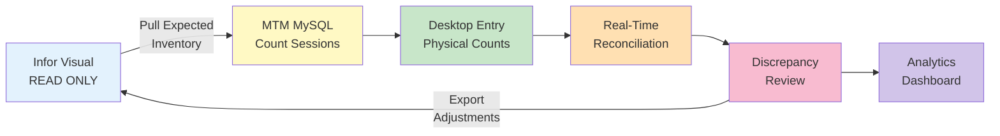
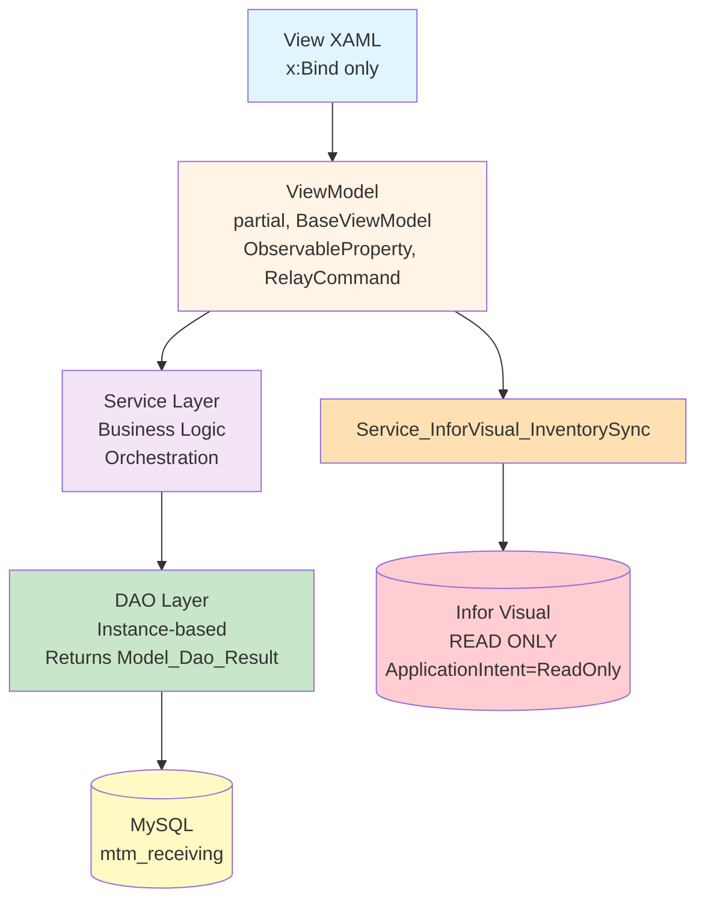

# Module_InventoryCounting - Specification

**Version:** 1.0  
**Date:** January 19, 2026  
**Status:** Planning / Design Phase  
**Module:** Module_InventoryCounting

---

## Executive Summary

This specification outlines the development of a new **Inventory Counting** module for the MTM Receiving Application. The module replaces the current manual workflow (Infor Visual → Crystal Report → Manual Count → Google Sheets → Manual Corrections) with an integrated, real-time cycle counting system.

### Goals

1. **Eliminate Double Entry**: Capture physical counts directly in the application
2. **Real-Time Reconciliation**: See discrepancies immediately during counting
3. **Infor Visual Integration**: Pull expected inventory data (READ-ONLY), export adjustments
4. **Audit Trail**: Track who counted what, when, and all discrepancy resolutions
5. **Analytics Dashboard**: Trending, accuracy metrics, problem area identification

### Current Workflow Analysis

**Existing Pain Points:**

- ❌ Crystal Report → Google Sheets: Double data entry
- ❌ No real-time visibility during counting
- ❌ Manual report generation and analysis
- ❌ No integration back to Infor Visual
- ❌ Limited audit trail
- ❌ Difficult to track corrections over time

**Proposed Solution:**



---

## Architecture Overview

---

## Architecture Overview

### MVVM Structure (Constitutional Compliance)

Following the project's strict MVVM architecture:

```
Module_InventoryCounting/
├── Contracts/
│   └── Services/
│       ├── IService_Counting_Session.cs
│       ├── IService_Counting_Reconciliation.cs
│       └── IService_InforVisual_InventorySync.cs
├── Data/
│   ├── Dao_CountSession.cs                    // Instance-based DAO
│   ├── Dao_PhysicalCount.cs                   // Instance-based DAO
│   └── Dao_Discrepancy.cs                     // Instance-based DAO
├── Models/
│   ├── Model_CountSession.cs
│   ├── Model_PhysicalCount.cs
│   ├── Model_ExpectedInventory.cs
│   └── Model_Discrepancy.cs
├── Services/
│   ├── Service_Counting_Session.cs
│   ├── Service_Counting_Reconciliation.cs
│   └── Service_InforVisual_InventorySync.cs
├── ViewModels/
│   ├── ViewModel_Counting_Session.cs          // partial class, BaseViewModel
│   ├── ViewModel_Counting_Entry.cs            // partial class
│   ├── ViewModel_Counting_Reconciliation.cs   // partial class
│   └── ViewModel_Counting_Dashboard.cs        // partial class
└── Views/
    ├── View_Counting_Session.xaml             // x:Bind only
    ├── View_Counting_Entry.xaml               // x:Bind only, touch-friendly
    ├── View_Counting_Reconciliation.xaml      // x:Bind only
    └── View_Counting_Dashboard.xaml           // x:Bind only
```

### Layer Responsibilities



**Critical Constraints:**

- ⚠️ **NEVER write to Infor Visual** - Only SELECT queries (ApplicationIntent=ReadOnly)
- ✅ **All MySQL operations use stored procedures** - No raw SQL in C#
- ✅ **All ViewModels are partial classes** - Required for CommunityToolkit.Mvvm
- ✅ **Views use x:Bind, NOT Binding** - Compile-time binding
- ✅ **DAOs are Instance-Based** - Registered as Singletons in DI
- ✅ **DAOs return Model_Dao_Result** - Never throw exceptions

---

## Database Schema

### MySQL Tables (mtm_receiving database)

#### Table: `tbl_count_sessions`

Tracks individual counting sessions.

```sql
CREATE TABLE IF NOT EXISTS tbl_count_sessions (
    SessionID INT PRIMARY KEY AUTO_INCREMENT,
    SessionName VARCHAR(100) NOT NULL,
    SessionType ENUM('full', 'cycle', 'spot') DEFAULT 'cycle',
    CreatedBy VARCHAR(50) NOT NULL,
    StartedAt DATETIME NOT NULL DEFAULT CURRENT_TIMESTAMP,
    CompletedAt DATETIME NULL,
    ApprovedAt DATETIME NULL,
    ApprovedBy VARCHAR(50) NULL,
    Status ENUM('draft', 'in_progress', 'completed', 'approved', 'cancelled') DEFAULT 'draft',
    Notes TEXT,
    TotalExpectedItems INT DEFAULT 0,
    TotalCountedItems INT DEFAULT 0,
    TotalDiscrepancies INT DEFAULT 0,
    INDEX idx_status (Status),
    INDEX idx_created_by (CreatedBy),
    INDEX idx_started_at (StartedAt)
) ENGINE=InnoDB DEFAULT CHARSET=utf8mb4;
```

#### Table: `tbl_expected_inventory`

Snapshot of expected inventory from Infor Visual at session creation.

```sql
CREATE TABLE IF NOT EXISTS tbl_expected_inventory (
    ExpectedID INT PRIMARY KEY AUTO_INCREMENT,
    SessionID INT NOT NULL,
    PartID VARCHAR(20) NOT NULL,
    PartDescription VARCHAR(100),
    Location VARCHAR(20) NOT NULL,
    ExpectedQty DECIMAL(10,2) NOT NULL,
    UnitOfMeasure VARCHAR(10),
    LastUpdatedInERP DATETIME,
    FOREIGN KEY (SessionID) REFERENCES tbl_count_sessions(SessionID) ON DELETE CASCADE,
    INDEX idx_session (SessionID),
    INDEX idx_part_location (PartID, Location)
) ENGINE=InnoDB DEFAULT CHARSET=utf8mb4;
```

#### Table: `tbl_physical_counts`

Actual physical counts entered by users.

```sql
CREATE TABLE IF NOT EXISTS tbl_physical_counts (
    CountID INT PRIMARY KEY AUTO_INCREMENT,
    SessionID INT NOT NULL,
    PartID VARCHAR(20) NOT NULL,
    Location VARCHAR(20) NOT NULL,
    ActualQty DECIMAL(10,2) NOT NULL,
    UnitOfMeasure VARCHAR(10),
    CountedBy VARCHAR(50) NOT NULL,
    CountedAt DATETIME NOT NULL DEFAULT CURRENT_TIMESTAMP,
    DeviceInfo VARCHAR(100),
    Notes TEXT,
    FOREIGN KEY (SessionID) REFERENCES tbl_count_sessions(SessionID) ON DELETE CASCADE,
    INDEX idx_session (SessionID),
    INDEX idx_part_location (PartID, Location),
    INDEX idx_counted_by (CountedBy)
) ENGINE=InnoDB DEFAULT CHARSET=utf8mb4;
```

#### Table: `tbl_count_discrepancies`

Calculated discrepancies between expected and actual counts.

```sql
CREATE TABLE IF NOT EXISTS tbl_count_discrepancies (
    DiscrepancyID INT PRIMARY KEY AUTO_INCREMENT,
    SessionID INT NOT NULL,
    PartID VARCHAR(20) NOT NULL,
    IssueType VARCHAR(50) NOT NULL,  -- 'qty_variance', 'missing_item', 'extra_item', 'location_mismatch'
    ExpectedLocation VARCHAR(20),
    ActualLocation VARCHAR(20),
    ExpectedQty DECIMAL(10,2),
    ActualQty DECIMAL(10,2),
    Variance DECIMAL(10,2),
    VariancePercent DECIMAL(5,2),
    Status ENUM('open', 'under_review', 'resolved', 'accepted') DEFAULT 'open',
    ReviewedBy VARCHAR(50) NULL,
    ReviewedAt DATETIME NULL,
    Resolution TEXT,
    AdjustmentExported BOOLEAN DEFAULT FALSE,
    ExportedAt DATETIME NULL,
    FOREIGN KEY (SessionID) REFERENCES tbl_count_sessions(SessionID) ON DELETE CASCADE,
    INDEX idx_session (SessionID),
    INDEX idx_status (Status),
    INDEX idx_issue_type (IssueType)
) ENGINE=InnoDB DEFAULT CHARSET=utf8mb4;
```

### Infor Visual Integration (READ-ONLY)

**Source Tables/Views:**

- `VISUAL.dbo.inv_mast` - Inventory master (part info)
- `VISUAL.dbo.inv_loc` - Inventory by location
- `VISUAL.dbo.location` - Location master

**Integration Requirements:**

- Connection string MUST include `ApplicationIntent=ReadOnly`
- Query should join `inv_loc`, `inv_mast`, and `location` tables
- Filter for `qty_on_hand > 0` to exclude empty locations
- Return fields: part ID, location, quantity on hand, unit of measure, part description, location name
- Results should be ordered by location and part
- Use existing `Helper_Database_InforVisual` or similar helper class for execution

---

## Stored Procedures (MySQL)

### SP: `sp_count_session_create`

**Purpose:** Create new counting session and capture expected inventory snapshot.

```sql
DELIMITER $$

CREATE PROCEDURE sp_count_session_create(
    IN p_session_name VARCHAR(100),
    IN p_session_type VARCHAR(20),
    IN p_created_by VARCHAR(50),
    OUT p_session_id INT
)
BEGIN
    INSERT INTO tbl_count_sessions (
        SessionName, SessionType, CreatedBy, Status
    ) VALUES (
        p_session_name, p_session_type, p_created_by, 'draft'
    );
    
    SET p_session_id = LAST_INSERT_ID();
END$$

DELIMITER ;
```

### SP: `sp_physical_count_insert`

**Purpose:** Record individual physical count entry.

```sql
DELIMITER $$

CREATE PROCEDURE sp_physical_count_insert(
    IN p_session_id INT,
    IN p_part_id VARCHAR(20),
    IN p_location VARCHAR(20),
    IN p_actual_qty DECIMAL(10,2),
    IN p_unit_of_measure VARCHAR(10),
    IN p_counted_by VARCHAR(50),
    IN p_notes TEXT
)
BEGIN
    INSERT INTO tbl_physical_counts (
        SessionID, PartID, Location, ActualQty, UnitOfMeasure,
        CountedBy, Notes
    ) VALUES (
        p_session_id, p_part_id, p_location, p_actual_qty, p_unit_of_measure,
        p_counted_by, p_notes
    );
END$$

DELIMITER ;
```

### SP: `sp_count_discrepancies_calculate`

**Purpose:** Calculate discrepancies for a session.

```sql
DELIMITER $$

CREATE PROCEDURE sp_count_discrepancies_calculate(
    IN p_session_id INT
)
BEGIN
    -- Clear existing discrepancies
    DELETE FROM tbl_count_discrepancies WHERE SessionID = p_session_id;
    
    -- Quantity variances (items counted but qty different)
    INSERT INTO tbl_count_discrepancies (
        SessionID, PartID, IssueType,
        ExpectedLocation, ActualLocation,
        ExpectedQty, ActualQty, Variance, VariancePercent
    )
    SELECT 
        e.SessionID,
        e.PartID,
        'qty_variance' AS IssueType,
        e.Location AS ExpectedLocation,
        p.Location AS ActualLocation,
        e.ExpectedQty,
        p.ActualQty,
        (p.ActualQty - e.ExpectedQty) AS Variance,
        ROUND(((p.ActualQty - e.ExpectedQty) / NULLIF(e.ExpectedQty, 0)) * 100, 2) AS VariancePercent
    FROM tbl_expected_inventory e
    INNER JOIN tbl_physical_counts p 
        ON e.SessionID = p.SessionID 
        AND e.PartID = p.PartID 
        AND e.Location = p.Location
    WHERE e.SessionID = p_session_id
      AND ABS(e.ExpectedQty - p.ActualQty) > 0.01;
    
    -- Missing items (expected but not counted)
    INSERT INTO tbl_count_discrepancies (
        SessionID, PartID, IssueType,
        ExpectedLocation, ExpectedQty, ActualQty, Variance
    )
    SELECT 
        e.SessionID,
        e.PartID,
        'missing_item' AS IssueType,
        e.Location AS ExpectedLocation,
        e.ExpectedQty,
        0 AS ActualQty,
        -e.ExpectedQty AS Variance
    FROM tbl_expected_inventory e
    LEFT JOIN tbl_physical_counts p 
        ON e.SessionID = p.SessionID 
        AND e.PartID = p.PartID 
        AND e.Location = p.Location
    WHERE e.SessionID = p_session_id
      AND p.CountID IS NULL;
    
    -- Extra items (counted but not expected)
    INSERT INTO tbl_count_discrepancies (
        SessionID, PartID, IssueType,
        ActualLocation, ExpectedQty, ActualQty, Variance
    )
    SELECT 
        p.SessionID,
        p.PartID,
        'extra_item' AS IssueType,
        p.Location AS ActualLocation,
        0 AS ExpectedQty,
        p.ActualQty,
        p.ActualQty AS Variance
    FROM tbl_physical_counts p
    LEFT JOIN tbl_expected_inventory e 
        ON p.SessionID = e.SessionID 
        AND p.PartID = e.PartID 
        AND p.Location = e.Location
    WHERE p.SessionID = p_session_id
      AND e.ExpectedID IS NULL;
      
    -- Update session totals
    UPDATE tbl_count_sessions
    SET TotalDiscrepancies = (
        SELECT COUNT(*) FROM tbl_count_discrepancies WHERE SessionID = p_session_id
    )
    WHERE SessionID = p_session_id;
END$$

DELIMITER ;
```

---

## Data Models

### Model_CountSession

**Properties:**

- SessionID (int) - Primary key
- SessionName (string) - User-friendly session name
- SessionType (string) - Values: "full", "cycle", "spot"
- CreatedBy (string) - Username of session creator
- StartedAt (DateTime) - Session start timestamp
- CompletedAt (DateTime?) - Session completion timestamp (nullable)
- ApprovedAt (DateTime?) - Approval timestamp (nullable)
- ApprovedBy (string?) - Username of approver (nullable)
- Status (string) - Values: "draft", "in_progress", "completed", "approved", "cancelled"
- Notes (string?) - Session notes (nullable)
- TotalExpectedItems (int) - Count of expected inventory items
- TotalCountedItems (int) - Count of physically counted items
- TotalDiscrepancies (int) - Count of discrepancies found

### Model_ExpectedInventory

**Properties:**

- ExpectedID (int) - Primary key
- SessionID (int) - Foreign key to count session
- PartID (string) - Part number from Infor Visual
- PartDescription (string?) - Part description (nullable)
- Location (string) - Warehouse location code
- ExpectedQty (decimal) - Expected quantity from Infor Visual
- UnitOfMeasure (string?) - Unit of measure (nullable)
- LastUpdatedInERP (DateTime?) - Last ERP update timestamp (nullable)

### Model_PhysicalCount

**Properties:**

- CountID (int) - Primary key
- SessionID (int) - Foreign key to count session
- PartID (string) - Part number counted
- Location (string) - Physical location where counted
- ActualQty (decimal) - Actual quantity counted
- UnitOfMeasure (string?) - Unit of measure (nullable)
- CountedBy (string) - Username of counter
- CountedAt (DateTime) - Timestamp of count
- DeviceInfo (string?) - Device used for counting (nullable)
- Notes (string?) - Count notes (nullable)

### Model_Discrepancy

**Properties:**

- DiscrepancyID (int) - Primary key
- SessionID (int) - Foreign key to count session
- PartID (string) - Part number with discrepancy
- IssueType (string) - Values: "qty_variance", "missing_item", "extra_item", "location_mismatch"
- ExpectedLocation (string?) - Expected location (nullable)
- ActualLocation (string?) - Actual location (nullable)
- ExpectedQty (decimal?) - Expected quantity (nullable)
- ActualQty (decimal?) - Actual quantity (nullable)
- Variance (decimal?) - Quantity variance (nullable)
- VariancePercent (decimal?) - Variance percentage (nullable)
- Status (string) - Values: "open", "under_review", "resolved", "accepted"
- ReviewedBy (string?) - Username of reviewer (nullable)
- ReviewedAt (DateTime?) - Review timestamp (nullable)
- Resolution (string?) - Resolution notes (nullable)
- AdjustmentExported (bool) - Whether exported to ERP
- ExportedAt (DateTime?) - Export timestamp (nullable)

---

## Service Layer Implementation

### IService_Counting_Session

**Required Methods:**

- `CreateSessionAsync(sessionName, sessionType, createdBy)` → Returns session ID
- `GetSessionAsync(sessionId)` → Returns session details
- `GetAllSessionsAsync()` → Returns all sessions
- `UpdateSessionStatusAsync(sessionId, newStatus)` → Updates status
- `CompleteSessionAsync(sessionId)` → Marks session complete
- `ApproveSessionAsync(sessionId, approvedBy)` → Marks session approved

**Implementation Requirements:**

- Inject `Dao_CountSession` and `IService_LoggingUtility`
- Validate inputs (session name required, created by required)
- Log all operations with descriptive messages
- Return `Model_Dao_Result<T>` types
- Delegate database operations to DAO layer

### IService_InforVisual_InventorySync

**Required Methods:**

- `GetExpectedInventoryAsync(sessionId, locationFilter?, partFilter?)` → Returns expected inventory from Infor Visual
- `ExportAdjustmentsAsync(sessionId)` → Exports discrepancy adjustments

**Implementation Requirements:**

- Connection string MUST include `ApplicationIntent=ReadOnly`
- Pull data from Infor Visual tables: `inv_loc`, `inv_mast`, `location`
- Support optional filtering by location and part
- Map Infor Visual data to `Model_ExpectedInventory`
- Save snapshot to MySQL via `Dao_ExpectedInventory`
- Log count of items pulled and any errors
- For export: Generate CSV or use integration table (DO NOT write directly to Infor Visual)
- Return appropriate `Model_Dao_Result` types

### IService_Counting_Reconciliation

**Required Methods:**

- `CalculateDiscrepanciesAsync(sessionId)` → Compares expected vs actual
- `GetDiscrepanciesBySessionAsync(sessionId)` → Returns all discrepancies
- `ResolveDiscrepancyAsync(discrepancyId, resolution, reviewedBy)` → Updates discrepancy status

**Implementation Requirements:**

- Compare expected inventory with physical counts
- Identify: quantity variances, missing items, extra items, location mismatches
- Calculate variance amounts and percentages
- Call stored procedure `sp_count_discrepancies_calculate`
- Return calculated discrepancies

---

## DAO Layer Implementation

### Dao_CountSession

**Architecture:** Instance-based (NOT static)

**Required Methods:**

- `CreateSessionAsync(sessionName, sessionType, createdBy)` → Calls `sp_count_session_create`, returns session ID
- `GetSessionByIdAsync(sessionId)` → Calls `sp_count_session_get_by_id`
- `GetAllSessionsAsync()` → Calls `sp_count_session_get_all`
- `UpdateSessionStatusAsync(sessionId, newStatus)` → Calls `sp_count_session_update_status`
- `CompleteSessionAsync(sessionId)` → Calls `sp_count_session_complete`
- `ApproveSessionAsync(sessionId, approvedBy)` → Calls `sp_count_session_approve`

**Implementation Requirements:**

- Accept connection string in constructor (throw if null)
- Use `Helper_Database_StoredProcedure` for all database operations
- Map parameters to stored procedure inputs
- Return `Model_Dao_Result<T>` types
- NEVER throw exceptions - return failure results
- Handle OUTPUT parameters for ID returns
- Use try-catch to wrap unexpected errors

### Dao_PhysicalCount

**Required Methods:**

- `InsertPhysicalCountAsync(Model_PhysicalCount)` → Calls `sp_physical_count_insert`
- `GetCountsBySessionAsync(sessionId)` → Returns all counts for session
- `GetCountsByLocationAsync(sessionId, location)` → Returns counts filtered by location
- `UpdateCountAsync(Model_PhysicalCount)` → Updates existing count
- `DeleteCountAsync(countId)` → Removes count entry

### Dao_Discrepancy

**Required Methods:**

- `GetDiscrepanciesBySessionAsync(sessionId)` → Returns all discrepancies
- `UpdateDiscrepancyStatusAsync(discrepancyId, status, reviewedBy, resolution)` → Updates status
- `MarkAsExportedAsync(discrepancyId)` → Sets export flags

### Dao_ExpectedInventory

**Required Methods:**

- `InsertExpectedInventoryAsync(Model_ExpectedInventory)` → Saves Infor Visual snapshot
- `GetExpectedBySessionAsync(sessionId)` → Returns expected inventory for session

**Common DAO Patterns:**

- All DAOs MUST be instance-based with connection string in constructor
- All DAOs MUST return `Model_Dao_Result` or `Model_Dao_Result<T>`
- All DAOs MUST use stored procedures (via `Helper_Database_StoredProcedure`)
- All DAOs MUST catch exceptions and return failure results (never throw)
- Register all DAOs as Singletons in DI container

---

## ViewModel Layer Implementation

### ViewModel_Counting_Session

**Properties (using `[ObservableProperty]`):**

- `Sessions` (ObservableCollection<Model_CountSession>) - All counting sessions
- `CurrentSession` (Model_CountSession?) - Active session
- `SessionName` (string) - Input for new session name
- `SessionType` (string) - Selected session type
- `FilterText` (string) - Search filter

**Commands (using `[RelayCommand]`):**

- `LoadSessionsAsync()` - Retrieve all sessions from service
- `CreateSessionAsync()` - Create new counting session, pull expected inventory
- `StartSessionAsync(sessionId)` - Mark session as in progress
- `CompleteSessionAsync(sessionId)` - Mark session complete, trigger reconciliation
- `ApproveSessionAsync(sessionId)` - Final approval
- `CancelSessionAsync(sessionId)` - Cancel session
- `ViewDiscrepanciesAsync(sessionId)` - Navigate to discrepancy view

**Dependencies:**

- `IService_Counting_Session`
- `IService_InforVisual_InventorySync`
- `IService_ErrorHandler` (from base)
- `IService_LoggingUtility` (from base)

**Implementation Requirements:**

- Inherit from `ViewModel_Shared_Base`
- Set `IsBusy = true` during async operations
- Update `StatusMessage` with operation progress
- Validate inputs before service calls
- Handle errors with `_errorHandler.HandleException()`
- Log all operations
- Clear form fields after successful creation

### ViewModel_Counting_Entry

**Purpose:** Tablet-optimized physical count entry

**Properties:**

- `CurrentLocation` (string) - Current warehouse location
- `CurrentPartID` (string) - Part being counted
- `ExpectedItems` (ObservableCollection<Model_ExpectedInventory>) - Expected at location
- `CoilWeights` (ObservableCollection<decimal>) - Individual coil weights
- `TotalWeight` (decimal) - Calculated total
- `VarianceText` (string) - Display variance vs expected
- `NewCoilWeight` (decimal) - Input for adding coil

**Commands:**

- `AddCoilCommand` - Add coil weight to list
- `RemoveCoilCommand(index)` - Remove coil from list
- `SaveAndNextCommand` - Save count, move to next location

**UI Requirements:**

- Real-time variance calculation
- Color-coded variance indicators

### ViewModel_Counting_Reconciliation

**Properties:**

- `Discrepancies` (ObservableCollection<Model_Discrepancy>) - All discrepancies
- `FilteredDiscrepancies` - Filtered by status/type
- `SelectedDiscrepancy` (Model_Discrepancy?) - Currently selected
- `ResolutionNotes` (string) - Input for resolution

**Commands:**

- `LoadDiscrepanciesAsync(sessionId)` - Load all discrepancies
- `FilterByStatusCommand(status)` - Filter display
- `ResolveDiscrepancyAsync()` - Mark discrepancy as resolved
- `AcceptDiscrepancyAsync()` - Accept variance
- `ExportAdjustmentsAsync()` - Generate export file

### ViewModel_Counting_Dashboard

**Properties:**

- `AccuracyMetrics` - Accuracy percentage over time
- `TopDiscrepancyParts` - Parts with most issues
- `TopDiscrepancyLocations` - Locations with most issues
- `RecentSessions` - Recent counting sessions
- `TrendData` - Historical accuracy trends

**Commands:**

- `LoadDashboardDataAsync()` - Load analytics
- `ExportReportCommand()` - Export analytics to PDF/Excel

**Common ViewModel Patterns:**

- All ViewModels MUST be partial classes
- All ViewModels MUST inherit from `ViewModel_Shared_Base`
- Use `[ObservableProperty]` for bindable properties
- Use `[RelayCommand]` for commands
- Inject services via constructor
- Handle errors with `_errorHandler.HandleException()`
- Log operations with `_logger`
- Set `IsBusy` during async operations
- Update `StatusMessage` for user feedback

---

## View Layer Implementation

### UI Mockups

#### Mockup 1: Session Management View (Desktop)

```
┌─────────────────────────────────────────────────────────────────────────────────┐
│ MTM Inventory Counting - Session Management                          [_][□][×] │
├─────────────────────────────────────────────────────────────────────────────────┤
│                                                                                 │
│  ┌─ Create New Session ────────────────────────────────────────────────────┐   │
│  │                                                                          │   │
│  │  Session Name:  [January 2026 Cycle Count________________]              │   │
│  │                                                                          │   │
│  │  Session Type:  (•) Cycle Count  ( ) Full Count  ( ) Spot Check         │   │
│  │                                                                          │   │
│  │              [ Create Session & Pull Expected Inventory ]               │   │
│  │                                                                          │   │
│  └──────────────────────────────────────────────────────────────────────────┘   │
│                                                                                 │
│  ┌─ Active & Recent Sessions ──────────────────────────────────────────────┐   │
│  │                                                                          │   │
│  │  Search: [_________________]  Status: [All Sessions ▼]                  │   │
│  │                                                                          │   │
│  │  ┌────────┬─────────────────────┬──────────┬────────┬──────────┬───────┐ │  │
│  │  │ ID     │ Session Name        │ Created  │ Status │ Items    │ Disc. │ │  │
│  │  ├────────┼─────────────────────┼──────────┼────────┼──────────┼───────┤ │  │
│  │  │ 00023  │ Dec 2025 Cycle Ct   │ 12/15/25 │ ✓ Appr │ 345/345  │   12  │ │  │
│  │  │ 00024  │ Spot Check: Area 3  │ 01/05/26 │ ✓ Appr │  89/89   │    3  │ │  │
│  │  │ 00025 ►│ Jan 2026 Cycle Ct   │ 01/18/26 │ ⚡ Prog│ 187/423  │    -  │ │  │
│  │  │ 00026  │ Weekend Spot Count  │ 01/19/26 │ ⭘ Draft│   0/156  │    -  │ │  │
│  │  └────────┴─────────────────────┴──────────┴────────┴──────────┴───────┘ │  │
│  │                                                                          │   │
│  │  Selected: Session #00025 - Jan 2026 Cycle Count                        │   │
│  │                                                                          │   │
│  │  [ Start Counting ]  [ View Details ]  [ View Discrepancies ]  [Export] │   │
│  │                                                                          │   │
│  └──────────────────────────────────────────────────────────────────────────┘   │
│                                                                                 │
│  Status: Ready                                            User: jsmith         │
└─────────────────────────────────────────────────────────────────────────────────┘
```

#### Mockup 2: Physical Count Entry View (Desktop)

```
┌─────────────────────────────────────────────────────────────────────────┐
│ [≡] Session: Jan 2026 Cycle Count           Progress: 187/423  [×] │
├─────────────────────────────────────────────────────────────────────────┤
│                                                                         │
│   ┌─ Location ──────────────────────────────────────────────────┐      │
│   │                                                              │      │
│   │        Location: [ A-15-03                          ]       │      │
│   │                                                              │      │
│   └──────────────────────────────────────────────────────────────┘      │
│                                                                         │
│   ┌─ Expected at this Location ─────────────────────────────────┐      │
│   │                                                              │      │
│   │  ╔═══════════════════════════════════════════════════════╗  │      │
│   │  ║ Part: STEEL-304-COIL                                  ║  │      │
│   │  ║ Expected: 12,450 lbs                                  ║  │      │
│   │  ╚═══════════════════════════════════════════════════════╝  │      │
│   │                                                              │      │
│   │  ┌───────────────────────────────────────────────────────┐  │      │
│   │  │ Part: STEEL-316-COIL                                  │  │      │
│   │  │ Expected: 8,920 lbs                                   │  │      │
│   │  └───────────────────────────────────────────────────────┘  │      │
│   │                                                              │      │
│   └──────────────────────────────────────────────────────────────┘      │
│                                                                         │
│   ┌─ Physical Count ────────────────────────────────────────────┐      │
│   │                                                              │      │
│   │         Part ID: [ STEEL-304-COIL              ]            │      │
│   │                                                              │      │
│   │    ┌─ Coil Weights ────────────────────────────────┐        │      │
│   │    │  • 2,850 lbs     [ × ]                        │        │      │
│   │    │  • 3,120 lbs     [ × ]                        │        │      │
│   │    │  • 2,945 lbs     [ × ]                        │        │      │
│   │    │  • 3,680 lbs     [ × ]                        │        │      │
│   │    └───────────────────────────────────────────────┘        │      │
│   │                                                              │      │
│   │     New Coil Weight:  [                ] lbs                │      │
│   │                                                              │      │
│   │                    [ ➕ Add Coil ]                           │      │
│   │                                                              │      │
│   └──────────────────────────────────────────────────────────────┘      │
│                                                                         │
│   ┌─ Summary ───────────────────────────────────────────────────┐      │
│   │                                                              │      │
│   │  Total Actual Weight:         12,595 lbs                    │      │
│   │  Expected Weight:             12,450 lbs                    │      │
│   │                                                              │      │
│   │  Variance:  +145 lbs (+1.2%)  🟢 Within Tolerance          │      │
│   │                                                              │      │
│   └──────────────────────────────────────────────────────────────┘      │
│                                                                         │
│                                                                         │
│        ┌──────────────────────────────────────────────┐                │
│        │      💾 Save & Next Location                 │                │
│        └──────────────────────────────────────────────┘                │
│                                                                         │
│        [ ✏️ Add Notes ]                                                 │
│                                                                         │
└─────────────────────────────────────────────────────────────────────────┘
```

#### Mockup 3: Discrepancy Reconciliation View

```
┌─────────────────────────────────────────────────────────────────────────────────┐
│ MTM Inventory Counting - Discrepancy Review: Jan 2026 Cycle Count    [_][□][×] │
├─────────────────────────────────────────────────────────────────────────────────┤
│                                                                                 │
│  ┌─ Session Summary ───────────────────────────────────────────────────────┐   │
│  │  Total Items: 423  │  Counted: 423  │  Discrepancies: 18  │  Open: 12   │   │
│  └──────────────────────────────────────────────────────────────────────────┘   │
│                                                                                 │
│  ┌─ Filters ───────────────────────────────────────────────────────────────┐   │
│  │  Status: [Open ▼]  Type: [All Issues ▼]  Part: [______]  Location: [__]│   │
│  └──────────────────────────────────────────────────────────────────────────┘   │
│                                                                                 │
│  ┌─ Discrepancies ─────────────────────────────────────────────────────────┐   │
│  │                                                                          │   │
│  │  ┌──────┬───────────┬──────────┬──────────┬──────────┬─────────┬──────┐ │  │
│  │  │ ID   │ Part      │ Location │ Expected │ Actual   │ Variance│ Type │ │  │
│  │  ├──────┼───────────┼──────────┼──────────┼──────────┼─────────┼──────┤ │  │
│  │  │ 0452 │ STL-304   │ A-15-03  │ 12,450 lb│ 12,595 lb│ +145 lb │ 🟡 Qty│ │  │
│  │  │ 0453 │ STL-316   │ A-15-03  │  8,920 lb│  8,920 lb│    0 lb │ ✓    │ │  │
│  │  │ 0454►│ ALM-6061  │ B-08-12  │  5,600 lb│  4,850 lb│ -750 lb │ 🔴 Qty│ │  │
│  │  │ 0455 │ CPR-110   │ C-22-05  │  1,200 lb│  1,200 lb│    0 lb │ ✓    │ │  │
│  │  │ 0456 │ STL-430   │ D-03-18  │      - lb│  2,100 lb│   +100% │ 🔴 Ext│ │  │
│  │  │ 0457 │ BRS-360   │ E-11-09  │  3,400 lb│      - lb│   -100% │ 🔴 Mis│ │  │
│  │  └──────┴───────────┴──────────┴──────────┴──────────┴─────────┴──────┘ │  │
│  │                                                                          │   │
│  └──────────────────────────────────────────────────────────────────────────┘   │
│                                                                                 │
│  ┌─ Discrepancy Details: #0454 ────────────────────────────────────────────┐   │
│  │                                                                          │   │
│  │  Part: ALM-6061 (Aluminum 6061 Coil)                                    │   │
│  │  Location: B-08-12                                                       │   │
│  │  Issue Type: Quantity Variance                                           │   │
│  │                                                                          │   │
│  │  Expected:  5,600 lbs  (from Infor Visual, last updated 01/15/26)       │   │
│  │  Actual:    4,850 lbs  (counted by: mwilson, 01/18/26 14:23)            │   │
│  │  Variance:  -750 lbs (-13.4%) 🔴 EXCEEDS THRESHOLD                      │   │
│  │                                                                          │   │
│  │  Notes: "Found 3 coils, weights verified twice"                         │   │
│  │                                                                          │   │
│  │  ┌─ Resolution ─────────────────────────────────────────────────────┐   │   │
│  │  │                                                                  │   │   │
│  │  │  Action: (•) Adjust Infor Visual  ( ) Recount  ( ) Accept       │   │   │
│  │  │                                                                  │   │   │
│  │  │  Resolution Notes:                                               │   │   │
│  │  │  ┌──────────────────────────────────────────────────────────┐   │   │   │
│  │  │  │ One coil was scrapped last week but not removed from     │   │   │   │
│  │  │  │ system. Physical count is correct. Will adjust ERP.      │   │   │   │
│  │  │  └──────────────────────────────────────────────────────────┘   │   │   │
│  │  │                                                                  │   │   │
│  │  │              [ ✓ Resolve & Mark for Export ]                     │   │   │
│  │  │                                                                  │   │   │
│  │  └──────────────────────────────────────────────────────────────────┘   │   │
│  │                                                                          │   │
│  └──────────────────────────────────────────────────────────────────────────┘   │
│                                                                                 │
│  [ Previous ]  [ Next ]        [ Export Adjustments to CSV ]      [ Approve ]  │
│                                                                                 │
└─────────────────────────────────────────────────────────────────────────────────┘
```

#### Mockup 4: Analytics Dashboard View

```
┌─────────────────────────────────────────────────────────────────────────────────┐
│ MTM Inventory Counting - Analytics Dashboard                         [_][□][×] │
├─────────────────────────────────────────────────────────────────────────────────┤
│                                                                                 │
│  ┌─ Summary Metrics ────────────────────────────────────────────────────────┐  │
│  │                                                                          │  │
│  │   ┌──────────────┐  ┌──────────────┐  ┌──────────────┐  ┌─────────────┐ │  │
│  │   │  Accuracy    │  │   Sessions   │  │ Total Disc.  │  │   Avg Time  │ │  │
│  │   │   📊 97.3%   │  │   📅   24    │  │   ⚠️  156    │  │  ⏱️ 4.2 hrs │ │  │
│  │   │  Last 30 Days│  │  This Month  │  │  Last Month  │  │  Per Session│ │  │
│  │   └──────────────┘  └──────────────┘  └──────────────┘  └─────────────┘ │  │
│  │                                                                          │  │
│  └──────────────────────────────────────────────────────────────────────────┘  │
│                                                                                 │
│  ┌─ Accuracy Trend (Last 6 Months) ────────────────────────────────────────┐  │
│  │                                                                          │  │
│  │  100% ┤                                          ●                       │  │
│  │   98% ┤                      ●           ●                               │  │
│  │   96% ┤          ●                                       ●               │  │
│  │   94% ┤                                                          ●       │  │
│  │   92% ┤  ●                                                               │  │
│  │   90% ┤                                                                  │  │
│  │       └──────┬───────┬───────┬───────┬───────┬───────┬────              │  │
│  │            Aug    Sep    Oct    Nov    Dec    Jan   Feb                 │  │
│  │                                                                          │  │
│  └──────────────────────────────────────────────────────────────────────────┘  │
│                                                                                 │
│  ┌─ Top 5 Parts by Discrepancy Count ──────┐ ┌─ Top 5 Problem Locations ──┐  │
│  │                                          │ │                            │  │
│  │  STL-304-COIL    ████████████  18       │ │  A-15  ███████████  15     │  │
│  │  ALM-6061        █████████     13       │ │  B-08  ████████     11     │  │
│  │  STL-316-COIL    ███████        9       │ │  D-22  ██████        8     │  │
│  │  CPR-110         ████            6       │ │  C-11  ████          5     │  │
│  │  BRS-360         ███             4       │ │  E-03  ███           4     │  │
│  │                                          │ │                            │  │
│  └──────────────────────────────────────────┘ └────────────────────────────┘  │
│                                                                                 │
│  ┌─ Recent Sessions ────────────────────────────────────────────────────────┐  │
│  │                                                                          │  │
│  │  ┌────────┬─────────────────────┬──────────┬──────────┬─────────┬──────┐ │ │
│  │  │ ID     │ Session Name        │ Date     │ Accuracy │ Disc.   │ Time │ │ │
│  │  ├────────┼─────────────────────┼──────────┼──────────┼─────────┼──────┤ │ │
│  │  │ 00025  │ Jan 2026 Cycle Ct   │ 01/18/26 │  96.2%   │   18    │ 4.1h │ │ │
│  │  │ 00024  │ Spot Check: Area 3  │ 01/05/26 │  98.9%   │    3    │ 1.2h │ │ │
│  │  │ 00023  │ Dec 2025 Cycle Ct   │ 12/15/25 │  97.8%   │   12    │ 3.8h │ │ │
│  │  │ 00022  │ Full Count Q4       │ 12/01/25 │  95.1%   │   45    │ 8.5h │ │ │
│  │  └────────┴─────────────────────┴──────────┴──────────┴─────────┴──────┘ │ │
│  │                                                                          │  │
│  └──────────────────────────────────────────────────────────────────────────┘  │
│                                                                                 │
│  [ 📊 Export Dashboard Report ]     [ 📧 Email Report ]     [ 🖨️ Print ]       │
│                                                                                 │
└─────────────────────────────────────────────────────────────────────────────────┘
```

---

### View_Counting_Session.xaml

**Purpose:** Desktop interface for session management

**Layout:**

- Header: Session name input, create button
- Main: DataGrid of all sessions with filters
- Actions: Start, Complete, Approve, View Discrepancies buttons

**Binding Requirements:**

- ALL bindings MUST use `x:Bind` (NOT `Binding`)
- Set appropriate `Mode` (OneWay, TwoWay, OneTime)
- Use `UpdateSourceTrigger=PropertyChanged` for TextBox TwoWay bindings
- Bind button `IsEnabled` to `IsBusy` with `InverseBoolConverter`

### View_Counting_Entry.xaml

**Purpose:** Physical count entry interface

**Layout:**

- Session header (session name, progress)
- Location input
- Expected items display
- Part input
- Coil weight entry with running total
- Real-time variance display
- Save button

**UI Requirements:**

- Color-coded variance (green/red/yellow)
- ScrollViewer for content areas

### View_Counting_Reconciliation.xaml

**Purpose:** Review and resolve discrepancies

**Layout:**

- Filter controls (by status, issue type)
- Discrepancy list with details
- Resolution input area
- Export controls

### View_Counting_Dashboard.xaml

**Purpose:** Analytics and reporting

**Layout:**

- Summary cards (accuracy %, total sessions, discrepancies)
- Charts (accuracy trend, top problem areas)
- Recent sessions table
- Export report button

**Common View Patterns:**

- NO business logic in code-behind
- Use `x:Bind` exclusively
- Use `WindowHelper_WindowSizeAndStartupLocation.SetWindowSize(1400, 900)` in code-behind constructor
- Use appropriate converters from `Module_Core/Converters/`
- Follow WinUI 3 best practices

---

## Dependency Injection Registration

**In App.xaml.cs ConfigureServices:**

**DAOs (as Singletons):**

```
var connectionString = Helper_Database_Variables.GetConnectionString();
services.AddSingleton(sp => new Dao_CountSession(connectionString));
services.AddSingleton(sp => new Dao_PhysicalCount(connectionString));
services.AddSingleton(sp => new Dao_Discrepancy(connectionString));
services.AddSingleton(sp => new Dao_ExpectedInventory(connectionString));
```

**Services (as Singletons or Transient):**

```
services.AddSingleton<IService_Counting_Session, Service_Counting_Session>();
services.AddSingleton<IService_Counting_Reconciliation, Service_Counting_Reconciliation>();
services.AddSingleton<IService_InforVisual_InventorySync, Service_InforVisual_InventorySync>();
```

**ViewModels (as Transient):**

```
services.AddTransient<ViewModel_Counting_Session>();
services.AddTransient<ViewModel_Counting_Entry>();
services.AddTransient<ViewModel_Counting_Reconciliation>();
services.AddTransient<ViewModel_Counting_Dashboard>();
```

---

## Additional Stored Procedures Required

### sp_count_session_get_by_id

**Purpose:** Retrieve single session by ID
**Parameters:** `p_session_id` (INT)
**Returns:** Single row from `tbl_count_sessions`

### sp_count_session_get_all

**Purpose:** Retrieve all sessions
**Parameters:** None
**Returns:** All rows from `tbl_count_sessions` ordered by `StartedAt DESC`

### sp_count_session_update_status

**Purpose:** Update session status
**Parameters:** `p_session_id` (INT), `p_new_status` (VARCHAR)
**Logic:** Update `Status` field, set `CompletedAt` if status is 'completed'

### sp_count_session_complete

**Purpose:** Mark session complete
**Parameters:** `p_session_id` (INT)
**Logic:** Set `Status = 'completed'`, `CompletedAt = NOW()`

### sp_count_session_approve

**Purpose:** Approve completed session
**Parameters:** `p_session_id` (INT), `p_approved_by` (VARCHAR)
**Logic:** Set `Status = 'approved'`, `ApprovedAt = NOW()`, `ApprovedBy = p_approved_by`

### sp_expected_inventory_insert

**Purpose:** Save expected inventory snapshot
**Parameters:** All fields from `tbl_expected_inventory`
**Logic:** Simple INSERT

### sp_discrepancy_update_status

**Purpose:** Update discrepancy resolution
**Parameters:** `p_discrepancy_id`, `p_status`, `p_reviewed_by`, `p_resolution`
**Logic:** Update status, set `ReviewedAt`, `ReviewedBy`, `Resolution`

---

## Testing Strategy

### Unit Tests

**DAO Tests:**

- Test all CRUD operations
- Verify stored procedure parameter mapping
- Test error handling (invalid inputs, connection failures)
- Verify `Model_Dao_Result` returns

**Service Tests:**

- Mock DAO dependencies
- Test business logic validation
- Verify logging calls
- Test error propagation

**ViewModel Tests:**

- Mock service dependencies
- Test command execution
- Verify property change notifications
- Test error handling

### Integration Tests

**Database Integration:**

- Test against real MySQL database
- Verify stored procedures work correctly
- Test transaction handling
- Test cascade deletes

**Infor Visual Integration:**

- Test READ-ONLY queries
- Verify data mapping
- Test connection string with `ApplicationIntent=ReadOnly`
- Test filtering and sorting

---

## Implementation Phases

### Phase 1: Database Foundation (Week 1)

- Create MySQL tables
- Write all stored procedures
- Test with sample data
- Document table relationships

### Phase 2: Data Layer (Week 1-2)

- Implement all DAO classes
- Write unit tests for DAOs
- Test stored procedure integration

### Phase 3: Service Layer (Week 2)

- Implement service interfaces
- Add Infor Visual integration
- Write service unit tests
- Test reconciliation logic

### Phase 4: ViewModel Layer (Week 3)

- Implement all ViewModels
- Add property bindings
- Implement commands
- Write ViewModel tests

### Phase 5: View Layer (Week 3-4)

- Create XAML views
- Implement entry view interface
- Test user interactions

### Phase 6: Integration & Testing (Week 4)

- End-to-end testing
- Performance testing
- User acceptance testing
- Documentation

---

## Migration from Current Process

### Data Migration

1. **Historical Sessions:** Import past Google Sheets data (optional)
2. **Baseline Inventory:** Initial sync from Infor Visual
3. **User Training:** Document new workflow

### Parallel Run Period

- Run both systems simultaneously for 2-4 count cycles
- Compare results for accuracy
- Gather user feedback
- Refine UI based on real usage

### Cutover Plan

1. Complete final parallel count
2. Export all adjustments from new system
3. Verify in Infor Visual
4. Decommission Google Sheets process
5. Full production rollout

---

## Success Metrics

**Quantitative:**

- Time to complete count cycle (reduce by 50%)
- Data entry errors (reduce to near zero)
- Time to reconciliation (real-time vs days)
- User adoption rate (100% within 1 month)

**Qualitative:**

- User satisfaction (survey)
- Ease of use on tablets
- Accuracy of discrepancy detection
- Audit trail completeness

---

## Future Enhancements

### Phase 2 Features

- Mobile app (iOS/Android) for non-Windows devices
- AI-powered discrepancy prediction
- Advanced analytics (ML for problem areas)
- Integration with warehouse management system
- RFID tag support

### Phase 3 Features

- Direct write-back to Infor Visual (if permissions granted)
- Multi-warehouse support
- Role-based access control
- Custom report builder

---

## Appendices

### Appendix A: Glossary

- **Cycle Count:** Regular periodic inventory verification
- **Full Count:** Complete wall-to-wall inventory
- **Spot Count:** Random sample verification
- **Variance:** Difference between expected and actual quantity
- **Discrepancy:** Any variance exceeding tolerance threshold

### Appendix B: References

- MTM Receiving Application Constitution: `.specify/memory/constitution.md`
- MVVM Pattern Guide: `.github/instructions/mvvm-pattern.instructions.md`
- DAO Pattern Guide: `.github/instructions/dao-pattern.instructions.md`
- Infor Visual Integration: `docs/InforVisual/`

### Appendix C: Support

- **Technical Questions:** Contact development team
- **Database Schema Changes:** Coordinate with DBA
- **Infor Visual Access:** Contact IT Security

---
