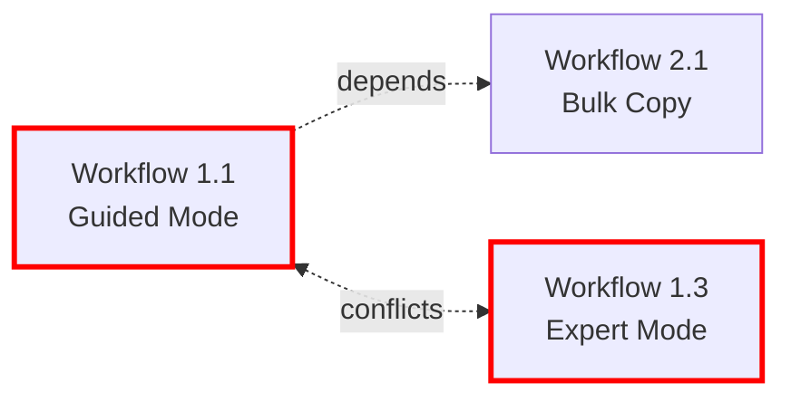

# Brainstorming Session: Mermaid Automation System

**Session Date**: 2026-01-24  
**Facilitator**: Carson (Brainstorming Coach Agent)  
**Participant**: John Koll  
**Session Type**: Strategic Implementation Planning

---

## Session Overview

**Topic:** Mermaid Diagram Auto-Generation from Structured User Story Format

**Goals:**
1. Eliminate manual Mermaid diagram creation entirely
2. Speed up specification writing workflow
3. Improve consistency across all diagrams
4. Make workflow updates automatically propagate to diagrams
5. **CRITICAL**: Integrate seamlessly with existing `.specify` tooling (MermaidProcessor.ps1, etc.)
6. **SUCCESS CRITERIA**: System flawlessly generates new mermaid charts into spec.md just by reading user stories
7. **SUCCESS CRITERIA**: All speckit agents know how to read and create the new user story format properly

### Context Guidance

**Existing Infrastructure Analysis:**

John has a sophisticated `.specify` system already in place:

- ✅ **MermaidProcessor.ps1**: Master orchestrator with Parse, ApplyNamespaces, Validate, ProcessAll actions
- ✅ **MermaidParser.ps1**: Diagram extraction and node analysis
- ✅ **MermaidNamespacer.ps1**: W{US}_{WF}_ prefix application system (ALREADY WORKING!)
- ✅ **MermaidValidator.ps1**: Quality validation engine
- ✅ **FileBackupManager.ps1**: Sophisticated backup/restore system
- ✅ **Templates**: spec-template.md, tasks-template.md, checklist-template.md
- ✅ **Speckit Agents**: Existing agent ecosystem for spec creation

**Critical Insight from John:**
> "Integration with existing tools - cannot compromise"
> "SUCCESS = Flawless generation + speckit agent compatibility"

**The Real Challenge:**
The original YAML-based implementation plan is OVERTHINKING this! John already has 80% of the infrastructure. We don't need to build a massive YAML parser system - we need to:

1. Define a **simple, parseable user story format** that speckit agents can create
2. Create a **NEW script module** that generates Mermaid syntax from that format
3. **Integrate with existing MermaidProcessor.ps1** pipeline (not replace it!)
4. Update speckit agents to understand the format

---

## Session Setup - Initial Analysis

### What We're NOT Doing (Anti-Pattern Identification)

❌ **OVERTHINKING IT**: Full YAML workflow parser with complex schema  
❌ **REPLACING EXISTING TOOLS**: The MermaidProcessor.ps1 ecosystem works!  
❌ **COMPLEX FORMAT**: If speckit agents can't easily generate it, it fails  

### What We SHOULD Be Doing (Breakthrough Insight)

✅ **LEVERAGE EXISTING**: Extend MermaidProcessor.ps1 with a new "Generate" action  
✅ **SIMPLE FORMAT**: Structured markdown that's trivial for AI agents to create  
✅ **INTEGRATION FOCUS**: New generator → feeds into → existing namespace/validation pipeline  

---

## Brainstorming Approach Selection

John, before we dive deep into generating 100+ ideas, I want to validate my initial analysis above.

**I'm sensing that the original YAML plan is solving a problem that doesn't exist.** Your existing tools are already doing the heavy lifting for:
- Namespace management (MermaidNamespacer.ps1)
- Validation (MermaidValidator.ps1)
- File management (FileBackupManager.ps1)

**The REAL problem is**: How do we get from "user story description" → "valid Mermaid syntax" → "feed into existing pipeline"?

**MY HYPOTHESIS**: We need a **lightweight, markdown-embedded workflow definition format** that:
1. Speckit agents can easily generate (they're great at structured markdown)
2. A new PowerShell script can parse
3. Generates raw Mermaid syntax
4. Feeds into your existing MermaidProcessor.ps1 for namespace/validation

**Am I reading the situation correctly, or do you see it differently?**

Before we pick a brainstorming technique, let's make sure we're solving the RIGHT problem. What's your gut reaction to this analysis?

---

## Technique Selection

**Approach:** AI-Recommended Techniques  
**Analysis Context:** Mermaid Diagram Auto-Generation with focus on integration with existing .specify infrastructure

**Recommended Technique Sequence:**

### Phase 1: First Principles Thinking (Creative)
**Purpose:** Strip to essentials - eliminate YAML complexity assumption  
**Duration:** 15 minutes  
**Why recommended:** Rebuild solution from fundamental requirements, not inherited complexity  
**Expected outcome:** Identify irreducible core data that must flow from user story → Mermaid

### Phase 2: Constraint Mapping (Deep)
**Purpose:** Reality check - distinguish real vs imagined constraints  
**Duration:** 15 minutes  
**Why recommended:** Map actual technical boundaries (PowerShell parsing, agent capabilities, MermaidProcessor.ps1 integration)  
**Expected outcome:** Clear understanding of true limitations and unexpected opportunities

### Phase 3: SCAMPER Method (Structured)
**Purpose:** Integration leverage - enhance existing tools instead of rebuilding  
**Duration:** 15 minutes  
**Why recommended:** Systematically explore how to extend MermaidProcessor.ps1 with minimal changes  
**Expected outcome:** Specific integration approach that delivers maximum impact with minimum work

**Total Session Time:** 45 minutes  
**Session Philosophy:** Pragmatic simplicity through systematic deconstruction

---

## Phase 1: First Principles Thinking - Strip to Essentials

**TECHNIQUE ACTIVATED** ⚡

### Core Question Framework

Let's rebuild this solution from FUNDAMENTAL TRUTHS, ignoring all inherited assumptions.

---

### **FIRST PRINCIPLES ANSWERS FROM JOHN** ✅

**Question 1: What is ACTUALLY happening?**

**FUNDAMENTAL TRUTH:**

```
speckit.specify.agent.md generates user stories
    ↓
Agent writes BOTH normal user story AND structured workflow data
    ↓
PowerShell script parses structured data → generates raw Mermaid syntax
    ↓
MermaidProcessor.ps1 applies namespaces & validates
```

**IRREDUCIBLE TRANSFORMATION:**
"Structured workflow metadata → Mermaid diagram syntax"

---

**Question 2: What DATA must exist?**

**ESSENTIAL DATA POINTS (from John):**
1. ✅ **Workflow ID**: `{UserStory#}.{Workflow}` (e.g., 1.1, 1.2, 2.1)
2. ✅ **Title**: Workflow description
3. ✅ **Direction**: TD (top-down) or LR (left-right)
4. ✅ **Node Name**: Identifier for each step
5. ✅ **Node Shape**: Mermaid shape syntax (stadium, rect, diamond, etc.)
6. ✅ **Node Text**: Label that appears in the diagram
7. ✅ **Connection Data**: Which nodes connect to which

**KEY INSIGHT:** This is the MINIMAL set. Nothing more needed!

---

**Question 3: What can AI agents EASILY produce?**

**CRITICAL INSIGHT FROM JOHN:**
❌ **AI agents are NOT good at generating raw Mermaid syntax directly**
✅ **AI agents ARE good at structured markdown formats**

**SOLUTION:**
- Agent generates user story (as usual)
- Agent ALSO generates structured metadata section underneath
- Format must be "strictly parsable" by PowerShell regex

---

**Question 4: What does PowerShell parse EASILY?**

**FROM JOHN:**
✅ **Simple regex patterns** - PowerShell's strength
✅ **Preset variables** - Easy to work with
✅ **Line-by-line processing** - Natural for PowerShell

**ANTI-PATTERN:**
❌ Complex YAML/JSON parsing with nested structures

---

**Question 5: The SIMPLEST solution**

**JOHN'S ANSWER:**
"speckit agent generates a spec.md file with normally formatted user stories, and under each one places a **strictly parsable format** of the same story that a script can then turn into a diagram"

**ARCHITECTURE:**

```
spec.md structure:
  User Story 1 (normal markdown)
    ↓
  [WORKFLOW_DATA] section (parsable format)
    ↓
  [Generated Mermaid diagram goes here]
```

---

### **BREAKTHROUGH SYNTHESIS** 💡

**THE REAL SOLUTION IS SIMPLE:**

1. **Modify speckit.specify.agent.md** (step 5a) to generate structured workflow data instead of manual Mermaid
2. **Create MermaidGenerator.ps1** to parse that structured data → generate raw Mermaid syntax
3. **Integrate with existing MermaidProcessor.ps1** to apply namespaces and validate

**NO YAML. NO COMPLEX PARSERS. JUST STRUCTURED MARKDOWN.**

---

## Phase 2: Constraint Mapping - Reality Check

**TECHNIQUE ACTIVATED** ⚡

Now that we know the core transformation, let's map REAL vs IMAGINED constraints to find the optimal format.

### **Constraint Category 1: AI Agent Capabilities**

**What can speckit.specify.agent.md ACTUALLY generate reliably?**

Based on the agent file #file:speckit.specify.agent.md, I can see it already generates:
- ✅ Structured markdown (headers, lists, tables)
- ✅ User stories with numbered scenarios
- ✅ Complex acceptance criteria
- ✅ Currently tries to generate raw Mermaid (step 5a) - but you said agents struggle with this!

**REAL CONSTRAINTS:**
- Agents need clear patterns to follow
- Must be simple enough to not require "perfect" syntax
- Should leverage what agents already do well (tables, lists, headers)

**IMAGINED CONSTRAINTS WE CAN KILL:**
- ❌ "Must be valid YAML" - NOT NEEDED!
- ❌ "Must be complex structured format" - SIMPLER IS BETTER!
- ❌ "Must capture every edge case" - Just core data points!

---

### **Constraint Category 2: PowerShell Parsing**

**What's TRIVIAL vs PAINFUL for PowerShell to parse?**

**TRIVIAL (regex-friendly patterns):**

```powershell
# Delimiter-based parsing
- Lines starting with specific markers: <!-- WORKFLOW_START -->
- Simple key-value: "WorkflowID: 1.1"
- Tables with consistent structure
- Section markers with regex: "^### Workflow \d+\.\d+:"
```

**PAINFUL (avoid these):**

```powershell
# Complex nested structures
- Multi-level YAML indentation
- JSON with variable nesting
- XML parsing
- Context-dependent syntax
```

**REAL CONSTRAINTS:**
- Format must have clear delimiters for regex
- Should be line-based or block-based
- Prefer tables/lists over free-form text

**OPPORTUNITIES:**
- PowerShell LOVES markdown tables (easy to parse rows/columns)
- Simple comment markers work great: `<!-- WORKFLOW_DATA_START -->`
- Preset variables can be regex-extracted easily

---

### **Constraint Category 3: Integration with MermaidProcessor.ps1**

**What does your existing pipeline need?**

Looking at your existing infrastructure:
- MermaidProcessor.ps1 expects to find Mermaid code blocks
- MermaidNamespacer.ps1 adds W{US}_{WF}_ prefixes to node IDs
- MermaidValidator.ps1 checks syntax

**REAL CONSTRAINTS:**
- Generated Mermaid must fit into existing code blocks
- Node IDs must follow pattern that MermaidNamespacer can prefix
- Must validate against existing rules

**IMAGINED CONSTRAINTS WE CAN KILL:**
- ❌ "Generator must create fully namespaced IDs" - NO! Let existing tools do it!
- ❌ "Must validate during generation" - NO! MermaidValidator already does this!

**INTEGRATION POINTS:**

```
MermaidGenerator.ps1:
  Input: Structured workflow data
  Output: Raw Mermaid syntax (simple node IDs)
  
MermaidProcessor.ps1 -Action ProcessAll:
  Applies namespaces
  Validates syntax
  Creates backups
```

---

### **Format Design Brainstorm** 💡

Based on constraints, here are **3 FORMAT OPTIONS** - which feels right?

**OPTION A: Markdown Table Format**

```markdown
## User Story 1 Workflow Data

### Workflow 1.1: Complete 3-Step Guided Workflow

**Direction:** TD

| Node | Type | Shape | Label |
|------|------|-------|-------|
| Start | start | stadium | User selects<br/>Guided Mode |
| Step1 | process | rect | Step 1: Order & Part Selection |
| ValidateStep1 | decision | diamond | Step 1<br/>valid? |
| End | end | stadium | Workflow complete |

**Connections:**

| From | To | Label |
|------|---------|-------|
| Start | Step1 | |
| Step1 | ValidateStep1 | |
| ValidateStep1 | ShowErrors | No |
| ValidateStep1 | ClickNext | Yes |
```

**OPTION B: Simple Key-Value Blocks**

```markdown
## User Story 1 Workflow Data

<!-- WORKFLOW_START: 1.1 -->
WORKFLOW: 1.1
TITLE: Complete 3-Step Guided Workflow
DIRECTION: TD

NODE: Start
TYPE: start
SHAPE: stadium
LABEL: User selects Guided Mode

NODE: Step1
TYPE: process
SHAPE: rect
LABEL: Step 1: Order & Part Selection

CONNECTION: Start -> Step1
CONNECTION: Step1 -> ValidateStep1
CONNECTION: ValidateStep1 -> ShowErrors [No]
CONNECTION: ValidateStep1 -> ClickNext [Yes]
<!-- WORKFLOW_END: 1.1 -->
```

**OPTION C: Hybrid Table + List**

```markdown
## User Story 1 Workflow Data

### Workflow 1.1: Complete 3-Step Guided Workflow
**Direction:** TD

**Nodes:**
- `Start` (stadium): "User selects Guided Mode"
- `Step1` (rect): "Step 1: Order & Part Selection"
- `ValidateStep1` (diamond): "Step 1 valid?"
- `End` (stadium): "Workflow complete"

**Flow:**
- Start → Step1
- Step1 → ValidateStep1
- ValidateStep1 --[No]--> ShowErrors
- ValidateStep1 --[Yes]--> ClickNext
```

---

### **JOHN - WHICH FORMAT SPEAKS TO YOU?**

Consider:
1. **Which is easiest for AI agents to generate correctly?**
2. **Which is simplest for PowerShell to parse with regex?**
3. **Which is most readable for humans reviewing the spec?**

**Vote:** Option A / B / C, or suggest a hybrid?

**Or point out if I'm STILL overcomplicating it!** 🎯

---

### **DECISION: OPTION B - SIMPLE KEY-VALUE BLOCKS** ✅

**Why Option B is perfect:**
- ✅ **Ultra-parsable**: Simple regex patterns `^NODE:`, `^TYPE:`, etc.
- ✅ **Comment markers**: `<!-- WORKFLOW_START: 1.1 -->` makes block extraction trivial
- ✅ **Line-based**: PowerShell's sweet spot - line-by-line processing
- ✅ **AI-friendly**: Very clear, repetitive pattern for agents to follow
- ✅ **Delimiter-based**: Clear start/end markers for each workflow
- ✅ **No ambiguity**: Each line has one purpose

**Format Specification:**

```markdown
<!-- WORKFLOW_START: {UserStory}.{Workflow} -->
WORKFLOW: {UserStory}.{Workflow}
TITLE: {Workflow description}
DIRECTION: {TD|LR|RL|BT}
DEPENDS_ON: {Workflow IDs this depends on, comma-separated or NONE}
CONFLICTS_WITH: {Workflow IDs this conflicts with, comma-separated or NONE}
INTERACTION: {How this relates to other workflows - free text}

NODE: {NodeName}
TYPE: {start|process|decision|end}
SHAPE: {stadium|rect|diamond|etc}
LABEL: {Node display text}

NODE: {NodeName}
TYPE: {type}
SHAPE: {shape}
LABEL: {label}

CONNECTION: {FromNode} -> {ToNode}
CONNECTION: {FromNode} -> {ToNode} [{Label}]
<!-- WORKFLOW_END: {UserStory}.{Workflow} -->
```

**NEW CRITICAL FIELDS ADDED:**

1. **DEPENDS_ON:** Workflows that must complete first
   - Example: `DEPENDS_ON: 1.1, 1.2` (Workflow 2.1 requires 1.1 and 1.2 to be done)
   - Example: `DEPENDS_ON: NONE` (Independent workflow)

2. **CONFLICTS_WITH:** Workflows that cannot coexist or contradict this one
   - Example: `CONFLICTS_WITH: 3.6` (Workflow 1.1 conflicts with 3.6)
   - Example: `CONFLICTS_WITH: NONE` (No conflicts)

3. **INTERACTION:** Free-text description of relationships
   - Example: `INTERACTION: Extends workflow 1.1 by adding bulk operations`
   - Example: `INTERACTION: Conflicts with 3.6 because both modify same data simultaneously`
   - Example: `INTERACTION: Alternative path to 2.1 - user chooses one or the other`

**Why This Matters:**

**For Humans:**
- Understand workflow dependencies at a glance
- Identify potential conflicts during spec review
- Plan implementation order (build 1.1 before 2.1)

**For AI/Validation:**
- Detect when workflows contradict each other
- Validate that dependent workflows exist
- Warn when generating diagrams for conflicting workflows
- Suggest implementation sequence

**For Documentation:**
- Auto-generate workflow dependency graphs
- Create interaction matrices showing relationships
- Flag conflicting acceptance scenarios

**Constraint Satisfaction:**
- **AI Agent**: Clear pattern to replicate, no complex nesting
- **PowerShell**: Regex heaven - `if ($line -match '^NODE: (.+)') { }`
- **Human-readable**: Still understandable when reviewing specs
- **Integration**: Comment blocks easily extracted without affecting markdown rendering

---

## Phase 3: SCAMPER Method - Integration Leverage

**TECHNIQUE ACTIVATED** ⚡

Now that we have the format, let's use SCAMPER to figure out HOW to integrate this with minimal changes to your existing tools.

### **SCAMPER Lens 1: SUBSTITUTE**

**Question:** What can we REPLACE in the existing workflow to add generation?

**Current Flow:**

```
speckit.specify.agent.md (step 5a) 
  → Manually creates Mermaid diagrams
  → Writes to spec.md
```

**Substitution Idea:**

```
speckit.specify.agent.md (step 5a) 
  → Generates WORKFLOW_DATA blocks instead
  → Writes to spec.md
  → MermaidGenerator.ps1 parses blocks → creates raw Mermaid
  → MermaidProcessor.ps1 applies namespaces
```

**BREAKTHROUGH:** Replace manual Mermaid generation with structured data generation!

---

### **SCAMPER Lens 2: COMBINE**

**Question:** What existing pieces can we MERGE to create the solution?

**Existing Components:**
- `MermaidProcessor.ps1` - Master orchestrator
- `MermaidParser.ps1` - Extracts diagrams
- `MermaidNamespacer.ps1` - Applies prefixes
- `MermaidValidator.ps1` - Validates syntax
- `speckit.specify.agent.md` - Generates specs

**Combination Ideas:**

**IDEA 1:** Add `-Action Generate` to MermaidProcessor.ps1

```powershell
.\MermaidProcessor.ps1 -FilePath "spec.md" -Action Generate
  → Finds WORKFLOW_DATA blocks
  → Calls New-MermaidDiagram.ps1
  → Inserts generated Mermaid
  → Then runs ProcessAll (namespace + validate)
```

**IDEA 2:** Combine generation + processing in one command

```powershell
.\MermaidProcessor.ps1 -FilePath "spec.md" -Action GenerateAndProcess
  → Parse WORKFLOW_DATA
  → Generate Mermaid
  → Apply namespaces
  → Validate
  → Insert into spec.md
  → Create backup
```

**Which combination feels right?**

---

### **SCAMPER Lens 3: ADAPT**

**Question:** How can we ADAPT existing patterns to work with the new format?

**Existing Pattern in MermaidNamespacer.ps1:**
- Already finds nodes in Mermaid syntax
- Already applies W{US}_{WF}_ prefixes
- Already handles connections

**Adaptation:**

```
WORKFLOW_DATA says: "WORKFLOW: 1.1"
  → Generator uses simple IDs: Start, Step1, ValidateStep1
  → Generator creates: Start([User selects mode]) --> Step1[Step 1]
  → MermaidNamespacer.ps1 transforms to: W1_1_Start([...]) --> W1_1_Step1[...]
```

**NO CHANGES needed to MermaidNamespacer.ps1!** It already does exactly what we need!

---

### **SCAMPER Lens 4: MODIFY**

**Question:** What MINIMAL changes unlock this capability?

**Changes Required:**

**1. Modify `speckit.specify.agent.md` (step 5a):**

```diff
- Generate Mermaid workflow diagrams manually
+ Generate WORKFLOW_DATA blocks using Option B format
+ Include comment markers for parsing
```

**2. Create NEW: `MermaidGenerator.ps1`**

```powershell
# New standalone script
# Input: spec.md with WORKFLOW_DATA blocks
# Output: Raw Mermaid syntax (simple IDs)
# Does NOT modify namespaces (lets existing tools handle it)
```

**3. Modify `MermaidProcessor.ps1`:**

```diff
+ Add 'Generate' to ValidateSet for -Action parameter
+ Add Invoke-MermaidGeneration function
+ Wire up to call MermaidGenerator.ps1 when -Action Generate
```

**4. NO changes needed:**
- ❌ MermaidNamespacer.ps1 - works as-is
- ❌ MermaidValidator.ps1 - works as-is
- ❌ FileBackupManager.ps1 - works as-is

---

### **SCAMPER Lens 5: PUT TO OTHER USE**

**Question:** Can existing tools serve a NEW purpose?

**Insight:** MermaidParser.ps1 could ALSO parse WORKFLOW_DATA blocks!

```powershell
# Extend MermaidParser.ps1 to have:
function Get-WorkflowDataBlocks {
    # Extract <!-- WORKFLOW_START --> ... <!-- WORKFLOW_END --> blocks
    # Return hashtable with workflow metadata
}
```

Then MermaidGenerator.ps1 just calls `Get-WorkflowDataBlocks` and converts to Mermaid!

---

### **SCAMPER Lens 6: ELIMINATE**

**Question:** What can we REMOVE from the original plan?

**KILL LIST:**
- ❌ YAML parser - NOT NEEDED
- ❌ Complex schema validation - Simple regex is enough
- ❌ New infrastructure - Use existing MermaidProcessor pipeline
- ❌ Template system - Direct generation is simpler
- ❌ Separate validation - MermaidValidator.ps1 already exists
- ❌ Custom namespace system - MermaidNamespacer.ps1 already exists

**What's LEFT:** Just two simple scripts!
1. `MermaidGenerator.ps1` - Parse WORKFLOW_DATA → generate Mermaid
2. Modified `speckit.specify.agent.md` - Generate WORKFLOW_DATA instead of Mermaid

---

### **SCAMPER Lens 7: REVERSE**

**Question:** What if we flipped the process?

**Normal thinking:** "Agent generates perfect Mermaid"

**REVERSED:** "Agent generates dumb structured data, PowerShell makes it smart"

**This is EXACTLY what we're doing!**
- Agent: Worry ONLY about structured data (easy)
- PowerShell: Handle ALL the Mermaid complexity (what it's good at)

**Another reversal:** "What if diagrams update FROM user stories?"

Currently: Manually sync diagrams when user stories change

**Reversed flow:**

```
User story updated
  → WORKFLOW_DATA updated by agent
  → Run: MermaidProcessor.ps1 -Action Generate
  → Diagrams automatically regenerate
```

**AUTO-SYNC achieved!** ✅

---

## **FINAL INTEGRATION ARCHITECTURE** 🎯

Based on SCAMPER analysis, here's the MINIMAL solution:

### **Component Changes:**

**1. speckit.specify.agent.md (Modified)**
- Step 5a: Generate WORKFLOW_DATA blocks (Option B format)
- Include comment markers for each workflow
- Place after user story, before where diagram will go

**2. MermaidGenerator.ps1 (NEW - ~150 lines)**

```powershell
# Parse WORKFLOW_DATA blocks
# Generate raw Mermaid syntax
# Insert into spec.md at correct locations
```

**3. MermaidProcessor.ps1 (Modified - add 15 lines)**

```powershell
# Add -Action 'Generate' option
# Call MermaidGenerator.ps1
# Then run existing ProcessAll pipeline
```

**4. MermaidParser.ps1 (Modified - add 30 lines)**

```powershell
# Add Get-WorkflowDataBlocks function
# Extract and parse WORKFLOW_DATA comment blocks
```

### **Workflow:**

```
USER RUNS: /speckit.specify "Add feature XYZ"
  ↓
speckit.specify.agent.md generates spec.md with:
  - Normal user stories
  - WORKFLOW_DATA blocks (Option B format)
  ↓
USER RUNS: .\MermaidProcessor.ps1 -FilePath "spec.md" -Action Generate
  ↓
MermaidGenerator.ps1:
  - Parses WORKFLOW_DATA blocks
  - Generates raw Mermaid (simple node IDs)
  - Inserts into spec.md
  ↓
MermaidNamespacer.ps1: (automatic via ProcessAll)
  - Applies W{US}_{WF}_ prefixes
  ↓
MermaidValidator.ps1: (automatic via ProcessAll)
  - Validates syntax
  ↓
RESULT: Perfect namespaced, validated Mermaid diagrams!
```

### **Total Code to Write:**
- 1 new script: MermaidGenerator.ps1 (~150 lines)
- 3 small modifications: speckit agent, MermaidProcessor, MermaidParser (~50 lines total)

**Total: ~200 lines of PowerShell to unlock auto-generation!**

---

### **BONUS INSIGHT: Workflow Relationship Tracking** 🔗

**John's Critical Addition:**
> "Both myself and the AI need to know if and how separate workflows interact with each other. Does workflow 1.1 conflict with 3.6? If so, how?"

**Solution Integrated into Format:**

**Example WORKFLOW_DATA with relationships:**

```markdown
<!-- WORKFLOW_START: 1.1 -->
WORKFLOW: 1.1
TITLE: Complete 3-Step Guided Workflow
DIRECTION: TD
DEPENDS_ON: NONE
CONFLICTS_WITH: 1.3
INTERACTION: Main happy path - conflicts with 1.3 (expert mode) because user can't use both simultaneously

NODE: Start
TYPE: start
SHAPE: stadium
LABEL: User selects Guided Mode
...
<!-- WORKFLOW_END: 1.1 -->

<!-- WORKFLOW_START: 1.3 -->
WORKFLOW: 1.3
TITLE: Expert Mode Single-Screen Entry
DIRECTION: LR
DEPENDS_ON: NONE
CONFLICTS_WITH: 1.1
INTERACTION: Alternative to 1.1 - expert users skip wizard, use single screen instead

NODE: Start
TYPE: start
SHAPE: stadium
LABEL: User selects Expert Mode
...
<!-- WORKFLOW_END: 1.3 -->

<!-- WORKFLOW_START: 2.1 -->
WORKFLOW: 2.1
TITLE: Bulk Load Copy Operations
DIRECTION: TD
DEPENDS_ON: 1.1
CONFLICTS_WITH: NONE
INTERACTION: Extends 1.1 by adding bulk copy functionality on Step 2 - requires 1.1 foundation

NODE: Start
TYPE: start
SHAPE: stadium
LABEL: User completes Step 1
...
<!-- WORKFLOW_END: 2.1 -->
```

**Validation Rules MermaidGenerator.ps1 Can Enforce:**

1. **Dependency Check:**
   - If Workflow 2.1 says `DEPENDS_ON: 1.1`, verify workflow 1.1 exists
   - Warn if dependency is missing: "⚠️ Workflow 2.1 depends on 1.1, but 1.1 not found"

2. **Conflict Detection:**
   - If 1.1 says `CONFLICTS_WITH: 1.3` and 1.3 says `CONFLICTS_WITH: 1.1`, validate bidirectional
   - Warn if conflict is one-way: "⚠️ Workflow 1.1 conflicts with 1.3, but 1.3 doesn't declare conflict"

3. **Circular Dependency Check:**
   - Detect cycles: 1.1 → 2.1 → 3.1 → 1.1 ❌
   - Error if found: "❌ Circular dependency detected: 1.1 → 2.1 → 3.1 → 1.1"

4. **Implementation Order Suggestion:**
   - Parse all DEPENDS_ON relationships
   - Generate topological sort: "Suggested build order: 1.1, 1.2, 2.1, 2.2, 3.1"

**Bonus Feature: Auto-Generate Workflow Relationship Diagram**

```powershell
.\MermaidProcessor.ps1 -FilePath "spec.md" -Action GenerateWorkflowMap
```

Output:


**Benefits:**

✅ **For Spec Authors:** Understand workflow ecosystem at a glance  
✅ **For Implementers:** Know build order and conflict zones  
✅ **For Reviewers:** Spot logical inconsistencies ("Why does 2.1 depend on 1.1 but conflict with 1.2?")  
✅ **For AI:** Validate acceptance scenarios don't contradict each other

---

## **SESSION COMPLETE** 🎉

**John, we just nailed it with workflow relationships!**
