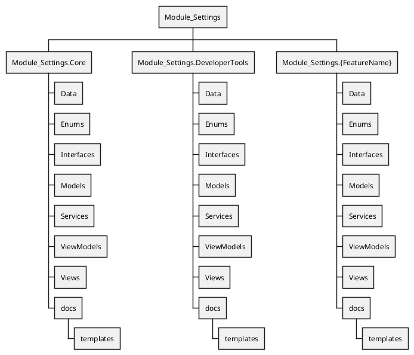

# Tech-Spec: Core Settings Module Recreation

**Created:** 2026-01-17

## Overview

### Problem Statement

The existing Module_Settings was created before the app became fully modular. It must be replaced with a new Core Settings Module that provides shared storage, validation, audit logging, caching, and developer tooling for settings that affect multiple modules. Feature modules must own their own settings files and UI and only rely on Core Settings for read/write access.

### Solution

Rebuild Module_Settings as a core infrastructure module using CQRS (MediatR), FluentValidation, Serilog, and instance-based DAOs backed by MySQL stored procedures. Provide a dedicated Settings Window with its own navigation hub for global settings (system/user, roles/privileges, core UI, DB/logging, shared file locations) and developer tooling. Remove all legacy settings UI and integration points, achieve a green build, then implement the new system.

### Scope

**In Scope:**

- Core/global settings affecting multiple modules (system settings, user settings, roles/privileges, core UI theme, core DB settings, core logging settings, shared file location settings)
- Settings metadata, validation, auditing, caching
- Core Settings Window (separate from MainWindow navigation)
- Developer DB test tooling in core settings
- Documentation for feature-module settings creation (templates + guide)

**Out of Scope:**

- Any feature-module settings UI or ViewModels
- Feature-module business settings (receiving/dunnage/routing/volvo/reporting)
- Application shell navigation changes beyond launching the Settings Window
- Data migration of old settings (delete old files, no migration)
- Reporting execution or sync workflows

## Context for Development

### Codebase Patterns

- Strict MVVM (ViewModel -> Service/Mediator -> DAO -> DB)
- Instance-based DAOs returning Model_Dao_Result (no exceptions)
- Stored procedures only for MySQL
- x:Bind for all XAML
- ViewModels are partial and use CommunityToolkit.Mvvm
- ViewModels typically inherit ViewModel_Shared_Base and use IService_ErrorHandler + IService_LoggingUtility
- DI registrations are centralized in App.xaml.cs
- New windows should call WindowHelper_WindowSizeAndStartupLocation.SetWindowSize(1400, 900)

### Codebase Scan Findings

- Main settings entry point is the NavigationView Settings button in MainWindow; current handler has a TODO to navigate settings.
- Main window currently navigates to Module_Settings.Views.View_Settings_DatabaseTest for the DB test tool.
- App.xaml.cs registers legacy settings views (View_Settings_Workflow, View_Settings_ModeSelection, View_Settings_DunnageMode, View_Settings_Placeholder) but they are commented out.
- ViewModel_Settings_DatabaseTest uses instance-based DAOs directly (legacy pattern) and inherits ViewModel_Shared_Base.
- No project-context.md found in repo.
- No other code references to View_Settings_* were found outside MainWindow/App.xaml.cs (other mentions are in docs/_bmad memory files).

## PlantUML WBS (Required Structure) - Required File Structure

### Files to Reference

| File | Purpose |
| ---- | ------- |
| specs/005-settings-system-redesign/SPECIFICATION.md | Source for settings schema, RBAC, audit/logging patterns to adapt for core/global scope |
| docs/Module_Prep/MASTER_PROMPT.md | Module rebuild guidance and documentation requirements |
| AGENTS.md | Project constraints and patterns (window sizing, MVVM rules) |
| docs/source-tree-analysis.md | Existing module layout references for Module_Settings |
| Module_Volvo/docs/copilot/SETTABLE_OBJECTS.md | Reference pattern for settings inventory documentation (to generalize) |
| MainWindow.xaml | NavigationView with Settings button entry point |
| MainWindow.xaml.cs | Settings selection handler and DB test navigation |
| App.xaml.cs | DI registration pattern and legacy settings view registrations |
| Module_Settings/ViewModels/ViewModel_Settings_DatabaseTest.cs | Existing DB test view pattern (to recreate in DeveloperTools) |
| Module_Settings/Views/View_Settings_DatabaseTest.xaml | Existing DB test view UI (to recreate in DeveloperTools) |
| Module_Settings/docs/templates/MOCK_FILE_STRUCTURE.md | Required module layout template |

### Technical Decisions

- Core Settings UI is a separate Window with its own NavigationView and ViewModel (no reuse of MainWindow context control)
- Settings Window launches from the MainWindow NavigationView Settings button (IsSettingsSelected)
- Delete all legacy settings UI/files; green build before implementing new system
- Any existing module settings integration with old Module_Settings should be commented/TODOed for later refactor
- Core exposes a thin service facade; MediatR and FluentValidation remain internal to Module_Settings
- Core exposes a thin service facade; MediatR and FluentValidation remain internal to Module_Settings.Core only
- Core Settings ViewModels use IMediator internally; external modules call the facade (no IMediator exposure)
- Feature modules must maintain their own settings inventory using a template stored in Module_Settings/docs/templates
- Core vs Feature boundary is enforced: Core only hosts global settings and tooling; feature modules own their settings UI and domain keys
- Settings Window UX must be discoverable but isolated; use standard WinUI 3 styling and no shared navigation context
- Settings Window must set size via WindowHelper_WindowSizeAndStartupLocation.SetWindowSize(1400, 900)
- No new dependencies beyond MediatR, FluentValidation, and Serilog unless explicitly approved
- Metadata registry is code-first primary with optional manifest fallback; DB-only metadata is not preferred
- File structure must follow the Module_Settings.Core + Module_Settings.DeveloperTools + Module_Settings.{FeatureName} pattern, each with the same subfolder schema (Data/Models/Services/ViewModels/Views/Enums/Interfaces)
- DB Test tool lives in Module_Settings.DeveloperTools
- Manifest fallback behavior: on missing setting, write manifest default to DB and use it for session; on corrupted value, prompt user (setting name + expected type + returned type), reset to manifest default in DB, and use manifest value for session
- Manifest defaults file: Module_Settings.Core/Defaults/settings.manifest.json (versioned, JSON schema documented in the Feature Settings Guide)
- Manifest defaults file: Module_Settings.Core/Defaults/settings.manifest.json (versioned, JSON schema documented in the Feature Settings Guide)
- Cache strategy: in-memory per-session cache keyed by {category,key,userId}; invalidate on write; no TTL unless approved
- Cache strategy: cache scope uses {scope,category,key,userId?}; system scope omits userId; user scope requires userId
- Roles/privileges source: core settings schema includes roles + user-role mapping; handlers use IService_UserSessionManager for current user context and do not touch SQL Server
- Window single-instance behavior: keep a single Settings Window instance stored in a shared service; if already open, bring to front and focus (do not create a new instance)
- Namespaces: MTM_Receiving_Application.Module_Settings.Core.* and MTM_Receiving_Application.Module_Settings.DeveloperTools.*; update registrations accordingly
- Encryption approach: use .NET built-in cryptography (no new packages). Store encryption key in DPAPI-protected local app data; support manual rotation via admin dialog
- Corrupted/missing setting prompt channel: defer to post-startup using notification service + dialog once UI is ready

### Architecture Decision Records (ADRs)

- **ADR-001:** Core Settings uses a separate Settings Window with its own NavigationView and ViewModel.
- **ADR-002:** No migration. Delete legacy settings files, achieve green build, then implement new settings system.
- **ADR-003:** Code-first metadata registry for settings definitions (feature modules register keys/defaults/types).
- **ADR-004:** Core UI scope is limited to global categories only (system/user/roles/theme/db/logging/shared paths).
- **ADR-005:** Settable Objects Inventory template lives in Module_Settings/docs/templates and is mandatory for feature modules.
- **ADR-006:** Manifest fallback behavior is permitted to self-heal missing/corrupt settings at runtime.

## Implementation Plan

### Tasks

- [x] Task 1: Capture legacy DB test reference before deletion (hard gate)
  - File: Module_Settings/ViewModels/ViewModel_Settings_DatabaseTest.cs, Module_Settings/Views/View_Settings_DatabaseTest.xaml
  - Action: Document the existing DB test workflow (screenshots or notes) for use during recreation.
  - Notes: This preserves intent before deletion. Do not proceed to Task 2 until captured.
  - Capture (2026-01-17) — Legacy DB Test Reference:
    - ViewModel wiring:
      - ViewModel name: ViewModel_Settings_DatabaseTest (inherits ViewModel_Shared_Base)
      - Direct DAO dependencies (legacy): Dao_SystemSettings, Dao_UserSettings, Dao_PackageType, Dao_PackageTypeMappings, Dao_RoutingRule, Dao_ScheduledReport, Dao_SettingsAuditLog
      - Commands: RunAllTestsCommand, ExportResultsCommand, LoadAuditLogCommand
      - SelectedTab values: "Schema", "StoredProcedures", "DAOs", "Logs" (tab switching via code-behind)
    - RunAllTests flow:
      - TestConnectionAsync → TestTablesAsync → TestStoredProceduresAsync → TestDaosAsync
      - Populates summary counters: TablesValidated/TotalTables (7), StoredProceduresTested/TotalStoredProcedures (41), SettingsSeeded, DaosTested/TotalDaos (7)
      - Logs to LogMessages and InfoBar status via ShowStatus
    - Tables validated (hardcoded list + details):
      - settings_universal ("79 rows | 18 columns | 3 indexes")
      - settings_personal ("0 rows | 5 columns | 1 unique constraint")
      - dunnage_types ("5 rows | 5 columns | 2 unique constraints")
      - routing_home_locations ("3 rows | 7 columns | 1 index on priority")
      - reporting_scheduled_reports ("2 rows | 8 columns | 2 indexes")
      - receiving_package_type_mapping ("15 rows | 4 columns | 2 indexes")
      - settings_activity ("0 rows | 8 columns | 2 indexes")
    - Stored procedures validated (existence checks only):
      - System settings: sp_Settings_System_GetAll, sp_Settings_System_GetByCategory, sp_Settings_System_GetByKey, sp_Settings_System_UpdateValue,
        sp_Settings_System_ResetToDefault, sp_Settings_System_SetLocked
      - User settings: sp_Settings_User_Get, sp_Settings_User_Set, sp_Settings_User_GetAllForUser, sp_Settings_User_Reset, sp_Settings_User_ResetAll
      - Dunnage types: sp_Dunnage_Types_GetAll, sp_Dunnage_Types_GetById, sp_Dunnage_Types_Insert, sp_Dunnage_Types_Update, sp_Dunnage_Types_Delete,
        sp_Dunnage_Types_GetUsageCount
      - Package type mappings: sp_Receiving_PackageTypeMappings_GetAll, sp_Receiving_PackageTypeMappings_GetByPrefix, sp_Receiving_PackageTypeMappings_Insert,
        sp_Receiving_PackageTypeMappings_Update, sp_Receiving_PackageTypeMappings_Delete
      - Routing rules: sp_Settings_RoutingRule_GetAll, sp_Settings_RoutingRule_GetById, sp_Settings_RoutingRule_FindMatch, sp_Settings_RoutingRule_GetByPartNumber,
        sp_Settings_RoutingRule_Insert, sp_Settings_RoutingRule_Update, sp_Settings_RoutingRule_Delete
      - Scheduled reports: sp_Settings_ScheduledReport_GetAll, sp_Settings_ScheduledReport_GetActive, sp_Settings_ScheduledReport_GetById, sp_Settings_ScheduledReport_GetDue,
        sp_Settings_ScheduledReport_Insert, sp_Settings_ScheduledReport_Update, sp_Settings_ScheduledReport_UpdateLastRun, sp_Settings_ScheduledReport_ToggleActive,
        sp_Settings_ScheduledReport_Delete
      - Audit log: sp_Settings_AuditLog_Get, sp_Settings_AuditLog_GetBySetting, sp_Settings_AuditLog_GetByUser
    - DAO tests (GetAll / lightweight reads):
      - Dao_SystemSettings.GetAllAsync (also sets SettingsSeeded/AllCategoriesSeeded)
      - Dao_UserSettings.GetAllForUserAsync(1)
      - Dao_PackageType.GetAllAsync
      - Dao_RoutingRule.GetAllAsync
      - Dao_ScheduledReport.GetAllAsync
      - Dao_PackageTypeMappings.GetAllAsync
      - Dao_SettingsAuditLog.GetAsync(settingId, 10) after Dao_SystemSettings.GetAllAsync
    - Export results:
      - Writes JSON + log + CSVs to %LocalAppData%\MTM_Receiving_Application\Exports\SettingsDbTest\SettingsDbTest_{timestamp}.*
    - View UI (legacy):
      - Header with title + subtitle; "Refresh All Tests" button (F5)
      - Cards: Connection, Tables, Stored Procedures, Data Seeding, DAO Tests
      - Tabs: Schema (tables list), SP Tests (procedure list + duration), DAO Tests (status), Logs (runtime log + audit log)
      - Logs tab includes "Load Audit Log" button
      - Footer: total test duration + Export Results + Close (Close has no command in legacy)
      - View code-behind sets ViewModel before InitializeComponent; OnLoaded runs RunAllTestsCommand; manual tab switching via button click handlers
- [x] Task 2: Purge legacy Module_Settings and reach green build
  - File: Module_Settings/**
  - Action: Delete legacy Settings Views/ViewModels/Services/Interfaces/Enums/Data/Models (old workflow, mode selection, dunnage mode, placeholder, old DAOs/models). Keep only new Module_Settings.Core/DeveloperTools structure to be rebuilt.
  - Notes: Comment/TODO any feature-module references to old settings APIs before deleting; if needed, add temporary stubs to keep build green.
- [x] Task 3: Update MainWindow settings entry point
  - File: MainWindow.xaml.cs
  - Action: When `IsSettingsSelected`, launch the separate Core Settings Window (single-instance behavior). Remove any in-frame settings navigation.
  - Notes: Use `WindowHelper_WindowSizeAndStartupLocation.SetWindowSize(1400, 900)` for the Settings Window.
- [x] Task 4: DI cleanup and new registrations
  - File: App.xaml.cs
  - Action: Remove legacy Module_Settings registrations. Register Core Settings Window, Core Settings ViewModels/Services/DAOs, and DeveloperTools DB Test View/ViewModel.
  - Notes: No DI structure changes beyond new registrations.
- [x] Task 5: Establish Module_Settings.Core structure and metadata registry
  - File: Module_Settings.Core/**, Module_Settings.Core/Defaults/settings.manifest.json
  - Action: Create Core module folders (Data/Enums/Interfaces/Models/Services/ViewModels/Views/docs/templates) and implement code-first settings metadata registry.
  - Notes: Manifest JSON includes key, default, dataType, scope, permissionLevel, isSensitive, validationRules.
- [x] Task 6: Define schema + stored procedures for Core Settings
  - File: Database/Schemas/settings_core_schema.sql, Database/StoredProcedures/Settings/sp_SettingsCore.sql
  - Action: Create tables for settings_universal, settings_personal, settings_activity, settings_roles, settings_user_roles; add core CRUD + audit procedures.
  - Notes: Must be idempotent and stored-procedure only.
- [x] Task 7: Implement Core settings data contracts and DAOs
  - File: Module_Settings.Core/Models/*, Module_Settings.Core/Data/*
  - Action: Create models for system/user settings, metadata, audit log, roles; implement instance-based DAOs using stored procedures only.
  - Notes: DAOs return Model_Dao_Result and never throw.
- [x] Task 8: Implement CQRS handlers, validators, and pipeline behaviors
  - File: Module_Settings.Core/Services/**, Module_Settings.Core/Validators/**
  - Action: Add MediatR handlers for get/set/reset, audit behavior, validation behavior, and safe logging (no secrets).
  - Notes: Enforce permission checks in handlers.
- [x] Task 9: Build Core Settings Window and pages
  - File: Module_Settings.Core/Views/**, Module_Settings.Core/ViewModels/**
  - Action: Create Settings Window shell with NavigationView and global pages (System, Users/Privileges, UI Theme, Database, Logging, Shared Paths).
  - Notes: Use x:Bind, no code-behind logic beyond wiring; isolated from MainWindow nav context. Users/Privileges page is Core-only and must not access SQL Server.
- [x] Task 10: Recreate DeveloperTools DB Test tool
  - File: Module_Settings.DeveloperTools/Views/**, Module_Settings.DeveloperTools/ViewModels/**
  - Action: Re-implement DB test workflow and redesign UI from scratch using the existing DB test as reference.
  - Notes: New namespace/module; do not relocate old files. Debug menu should open this new view.
- [x] Task 11: Manifest fallback flow
  - File: Module_Settings.Core/Services/**
  - Action: Implement startup setting resolution: DB → manifest default on missing → prompt and reset on corrupted value.
  - Notes: Prompt must include setting name, intended type, returned type.
- [x] Task 12: Documentation and templates
  - File: Module_Settings/docs/templates/**
  - Action: Add Feature Settings Implementation Guide, Settable Objects Inventory template, and mock file structure.
  - Notes: Must match Module_Settings.Core + Module_Settings.DeveloperTools + Module_Settings.{FeatureName} layout.
- [x] Task 13: Tests
  - File: MTM_Receiving_Application.Tests/**
  - Action: Add unit tests for validators/handlers and integration tests for DAOs.
  - Notes: Include tests for audit/validation pipeline behaviors and single-instance Settings Window behavior.
- [x] Task 14: Dependency verification
  - File: MTM_Receiving_Application.csproj
  - Action: Verify MediatR/FluentValidation/Serilog package references; request approval only if missing.

### Acceptance Criteria

- [ ] AC 1: Given legacy Module_Settings files are removed, when the app builds, then the solution compiles and runs (green state).
- [ ] AC 2: Given a user clicks the Settings button in MainWindow, when invoked, then a separate Core Settings Window opens (single instance) with NavigationView.
- [ ] AC 3: Given a core setting is missing in DB, when the app loads, then the manifest default is written to DB and used for the session.
- [ ] AC 4: Given a core setting value is corrupted, when the app loads, then the user is prompted with setting name + expected type + returned type, and the setting resets to manifest default.
- [ ] AC 5: Given valid permissions, when a setting is changed, then validation runs, audit logs are recorded, and cache is invalidated.
- [ ] AC 6: Given the DB Test tool is accessed (debug menu), when opened, then the DeveloperTools DB Test view is displayed (new implementation).
- [ ] AC 6a: Given the DB Test tool is accessed, when opened, then it routes to Module_Settings.DeveloperTools (not Module_Settings.Views).
- [ ] AC 7: Given feature modules need settings UI, when implemented, then they follow Module_Settings.{FeatureName} structure and use the inventory template.
- [ ] AC 8: Given new docs are required, when the spec is complete, then templates exist under Module_Settings/docs/templates.
- [ ] AC 9: Given the Settings Window is already open, when Settings is selected again, then the existing window is focused instead of a new one.
- [ ] AC 10: Given a sensitive setting is stored, when viewed, then the value is masked and only changeable via a dedicated dialog.

## Additional Context

### Dependencies

- MediatR, FluentValidation, Serilog (Module_Settings internal; no new packages unless approved)
- MySQL stored procedures (core settings + audit)
- Manifest defaults file (module-local, versioned)
- Built-in .NET cryptography for sensitive settings encryption (no new packages)

### Testing Strategy

- Unit tests for validators and handlers that use interface-only dependencies
- Integration tests for handlers/DAOs that use concrete DAOs or DB access
- Manual tests: Settings button opens separate window; missing/corrupt setting fallback flow; DB Test tool launches in debug builds
- Manual tests: repeat Settings button to confirm single-instance behavior; verify masked display + change dialog for sensitive settings
- Follow testing strategy instructions for classification and naming

### Notes

- Core/global categories must be explicitly listed and frozen in the spec
- No migration of existing settings; removal precedes rebuild
- Settings inventory template should mirror the SETTABLE_OBJECTS pattern in a generic, module-agnostic form
- If any potentially module-specific setting is discovered, confirm with the user before designating it as out of scope
- Purpose first principle: Core Settings exists for global safety and consistency; anything module-specific requires user confirmation before exclusion
- Lessons learned from prior redesign: keep RBAC/lock-unlock/audit/validation; avoid multi-module UI inside Core Settings
- Startup resolution flow: App loads → get setting from DB → if missing, write manifest default to DB and use for session → if corrupted, prompt user with setting name + expected type + returned type, reset to manifest default in DB, use manifest value for session
- Definition of "recreate": capture the existing workflow intent, then redesign the UI and re-implement from scratch (no direct relocation).
- Single-instance behavior for Settings Window should focus existing window if already open.
- Inventory template is documentation-only; registry uses code-first definitions with optional manifest fallback.

### Pre-mortem Risks & Mitigations

- **Risk:** Scope creep turns Core Settings into a platform.
  - **Mitigation:** Hard boundary section + acceptance gates for global-only categories.
- **Risk:** App fails to build after deleting legacy settings.
  - **Mitigation:** Comment/TODO any legacy integration points and verify green build before rebuild.
- **Risk:** Settings Window becomes a second app shell.
  - **Mitigation:** Isolated window, single-instance behavior, limited navigation scope.
- **Risk:** Feature module settings drift without consistent documentation.
  - **Mitigation:** Enforce Settable Objects Inventory template + feature settings guide.

### Failure Modes & Handling

- **Missing setting key:** Return failure result and log; do not crash UI.
- **Validation failures:** Block write, show inline error; no silent fallback.
- **Sensitive value exposure:** Mask in UI; use change-password dialog for secrets.
- **Cache staleness:** Invalidate on write; avoid stale overrides.
- **Privilege escalation risk:** Enforce permission checks in handlers; audit every write; never log raw secrets.
