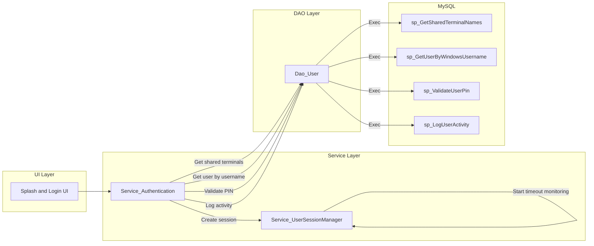
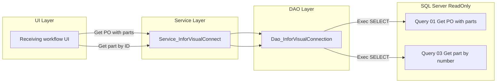
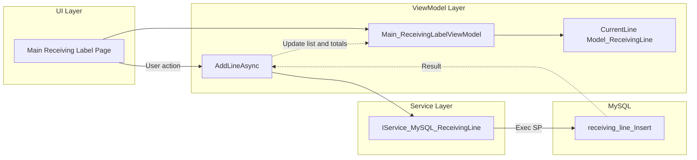

# Module_Core - Module Documentation

## Table of Contents

1. [Module Overview](#module-overview)
2. [Mermaid Workflow Diagrams](#mermaid-workflow-diagrams)
3. [User Interaction Lifecycle](#user-interaction-lifecycle)
4. [Code Inventory](#code-inventory)
5. [Database Schema Details](#database-schema-details)
6. [Module Dependencies & Integration](#module-dependencies--integration)
7. [Common Patterns & Code Examples](#common-patterns--code-examples)

---

## Module Overview

### Purpose

Module_Core is the shared foundation layer for the MTM Receiving Application. It provides:

- Authentication + session management (including shared terminal detection)
- Cross-cutting services (logging, error handling, help, windowing, startup)
- Database connectivity boundaries (Infor Visual read-only access)
- Landing/placeholder “Main” pages and label-entry ViewModels that bridge into feature modules

### Business Value

- Standardizes and centralizes authentication, logging, error handling, and session timeout behavior.
- Provides a safe, read-only gateway to Infor Visual ERP (SQL Server) for PO/part validation and lookup.
- Reduces duplicated logic across feature modules (Receiving, Dunnage, Routing, Volvo).

### Key Workflows

1) **Authentication and session management**

- Entry point: Splash/Login UI (implemented in Module_Shared) orchestrating calls into `IService_Authentication` and `IService_UserSessionManager`
- Primary services:
  - `Service_Authentication` (Windows username + PIN login, workstation detection)
  - `Service_UserSessionManager` (timeout monitoring)
- Primary DAO and stored procedures:
  - `Dao_User` → `sp_GetUserByWindowsUsername`, `sp_ValidateUserPin`, `sp_GetSharedTerminalNames`, `sp_LogUserActivity`

1) **Infor Visual PO and part lookup (read-only)**

- Entry point: Receiving workflows (Module_Receiving) call into `IService_InforVisual`
- Primary services:
  - `Service_InforVisualConnect` → `Dao_InforVisualConnection`
- Queries:
  - `Database/InforVisualScripts/Queries/01_GetPOWithParts.sql`
  - `Database/InforVisualScripts/Queries/03_GetPartByNumber.sql`

1) **Receiving label entry (Core landing -> Receiving service)**

- Entry point: `Main_ReceivingLabelPage` (currently implemented as a placeholder page)
- Primary ViewModel: `Main_ReceivingLabelViewModel`
- Primary service dependency:
  - `IService_MySQL_ReceivingLine` (implementation in Module_Receiving)

### Integration Points

**Dependencies (What Module_Core uses):**

- Module_Receiving models and services (e.g., receiving label viewmodels depend on receiving services)
- Module_Dunnage models/services (e.g., help and dunnage-related flows)
- Microsoft.Data.SqlClient for Infor Visual read-only queries

**Dependents (What uses Module_Core):**

- Nearly all feature modules depend on Core contracts/services: Module_Receiving, Module_Dunnage, Module_Routing, Module_Settings, Module_Shared, Module_Reporting, Module_Volvo

**Events published/subscribed:**

- `IService_UserSessionManager.SessionTimedOut` event is raised when a session times out.

### Architecture Compliance

✅ **Generally aligned with MTM patterns:**

- Clear separation of concerns: service contracts in `Module_Core/Contracts/Services/`
- Infor Visual access is implemented via SQL queries and is intended to be read-only.

⚠️ **Deviations detected (important):**

- **Raw SQL in MySQL DAO:** `Dao_User.IsPinUniqueAsync` / `Dao_User.IsWindowsUsernameUniqueAsync` use direct `SELECT COUNT(*)` instead of stored-procedure-only.
- **Infor Visual site enforcement is not guaranteed at query level:** multiple Infor Visual SQL files have the `SITE_ID = '002'` filter commented out. This increases risk of cross-site results if a PO/part exists in other sites.

---

## Mermaid Workflow Diagrams

Diagrams are split by user journey to stay under the node limit.

### Workflow 1: Authentication and Session Management

### Workflow 2: Infor Visual PO and Part Lookup

### Workflow 3: Receiving Label Entry (Core bridge)

---

## User Interaction Lifecycle

### Workflow: Authentication and Session Management

**Forward Flow (User Action → Database):**

1. **User Action:** Application starts; splash/login UI needs to determine whether to prompt for PIN.
2. **Workstation classification:** `IService_Authentication.DetectWorkstationTypeAsync()` calls `Dao_User.GetSharedTerminalNamesAsync()` to determine shared vs personal terminal.
3. **Authentication method:**
   - Personal workstation: `AuthenticateByWindowsUsernameAsync(windowsUsername)` → `sp_GetUserByWindowsUsername`
   - Shared terminal: `AuthenticateByPinAsync(username, pin)` → `sp_ValidateUserPin`
4. **Audit trail:** success/failure events are logged via `LogUserActivityAsync(...)` → `sp_LogUserActivity`.
5. **Session:** `IService_UserSessionManager.CreateSession(...)` creates the session and begins timeout monitoring.

**Return Flow (Database → UI):**

- Stored procedure results return a user record (or empty), which becomes `Model_AuthenticationResult.Success` or `.Error`.

### Workflow: Infor Visual PO and Part Lookup

**Forward Flow (User Action → Database):**

1. **User Action:** User enters PO or Part in Receiving workflow.
2. **Service call:** Receiving ViewModel calls `IService_InforVisual.GetPOWithPartsAsync(poNumber)` or `GetPartByIDAsync(partId)`.
3. **DAO execution:** `Dao_InforVisualConnection` loads the query via `Helper_SqlQueryLoader.LoadAndPrepareQuery(...)` and executes on SQL Server.

**Return Flow:**

- Flat row results are mapped into `List<Model_Core.Models.InforVisual.Model_InforVisualPO>` then converted into a hierarchical `Module_Receiving.Models.Model_InforVisualPO` by `Service_InforVisualConnect`.

---

## Code Inventory

A full inventory (services/interfaces, DAOs, ViewModels, Views, converters, helpers) is in:

- `_bmad/_memory/docent-sidecar/knowledge/Module_Core-CodeInventory.md`

This split avoids “Line Limit Reached” during document generation.

---

## Database Schema Details

A detailed DB mapping (MySQL stored procedures and Infor Visual SQL queries) is in:

- `_bmad/_memory/docent-sidecar/knowledge/Module_Core-Database.md`

---

## Module Dependencies & Integration

### Cross-module dependencies

- **Module_Core → Module_Receiving**
  - Core ViewModels reference Receiving models/services.
  - Infor Visual service returns receiving-oriented models after conversion.

- **Module_Core → Module_Dunnage**
  - Help service references dunnage workflow steps.
  - Core DB service `Service_MySQL_Dunnage` orchestrates Dunnage DAOs.

### Infrastructure dependencies

- SQL Server: Microsoft.Data.SqlClient
- MySQL: stored procedures under `Database/StoredProcedures/` (auth, receiving, dunnage)

---

## Common Patterns & Code Examples

### Pattern: Stored-procedure-first MySQL access

- Most MySQL access is done via stored procedures (see `Database/StoredProcedures/Authentication/*`).

### Pattern: Centralized error handling

- `IService_ErrorHandler` provides logging + optional UI dialog display.

### Pattern: Session timeout monitoring

- `Service_UserSessionManager` creates a repeating dispatcher timer and raises `SessionTimedOut`.

### Pattern: Infor Visual read-only isolation

- Infor Visual access uses SQL query files loaded via `Helper_SqlQueryLoader`.

---

## Notes and Gaps

- Several “Main” pages are currently placeholders and direct users to feature module workflows.
- For Infor Visual, consider enforcing `SITE_ID = '002'` at query level (or via a required filter) to prevent cross-site data.
- For MySQL authentication DAOs, consider replacing raw SQL uniqueness checks with stored procedures to align with the project constitution.
