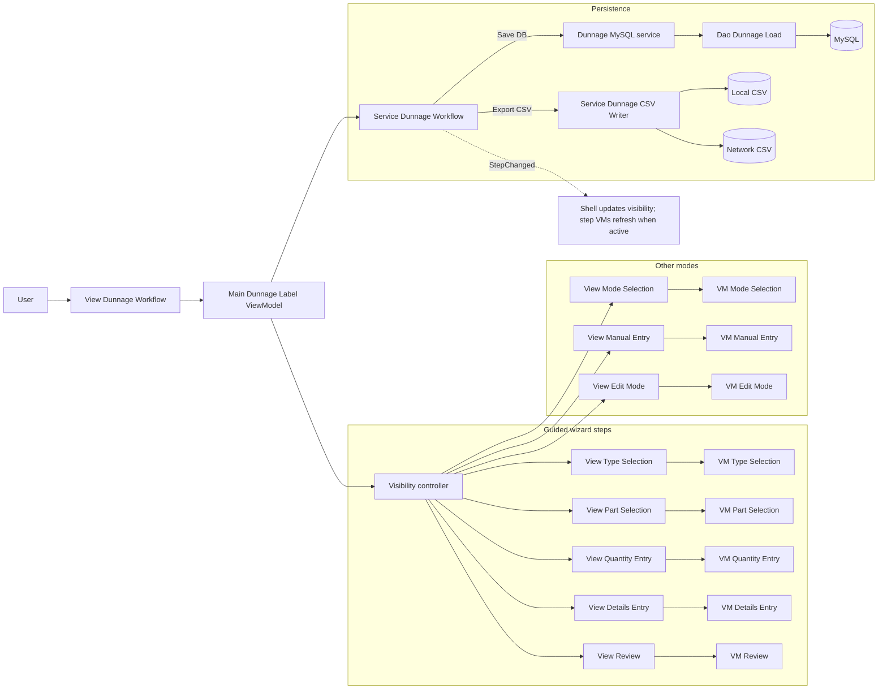
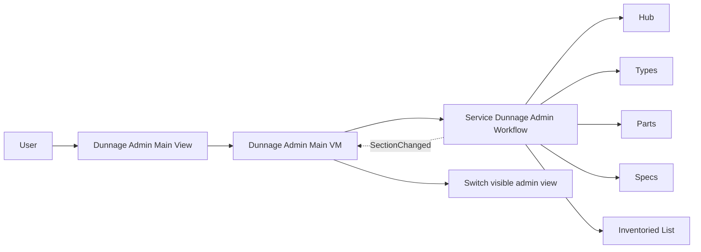

# Module_Dunnage - Module Documentation

## Table of Contents

1. [Module Overview](#module-overview)
2. [Mermaid Workflow Diagrams](#mermaid-workflow-diagrams)
3. [User Interaction Lifecycle](#user-interaction-lifecycle)
4. [Code Inventory](#code-inventory)
5. [Database Schema Details](#database-schema-details)
6. [Module Dependencies & Integration](#module-dependencies--integration)
7. [Common Patterns & Code Examples](#common-patterns--code-examples)

---

## Module Overview

### Purpose

Module_Dunnage implements dunnage label entry workflows plus a Dunnage Admin area for maintaining the dunnage master data.

- Label entry: Guided wizard (Type → Part → Quantity → Details → Review/Save)
- Label entry: Manual entry (bulk grid)
- Label entry: Edit mode (modify existing loads)
- Admin: 4-section management hub (Types, Parts, Specs, Inventoried List)

### Primary Entry Point

- `View_Dunnage_WorkflowView.xaml` hosts all step views and shows/hides them via boolean visibility flags owned by `Main_DunnageLabelViewModel`.

### Core State Machine

- `Service_DunnageWorkflow` is the step coordinator.
- Current step is `Enum_DunnageWorkflowStep`.
- Step changes are published via `StepChanged` and observed by the shell ViewModel to switch visibility.

### Notable Behaviors

- **Default mode auto-skip:** on workflow start, if the current user has a default dunnage mode (`guided` / `manual` / `edit`), the workflow service navigates directly to that step.
- **Save pipeline order:** `Service_DunnageWorkflow.SaveSessionAsync` saves to DB first, then exports CSV.
- **CSV export:** `Service_DunnageCSVWriter` writes RFC 4180 CSV (UTF-8, CRLF) to local path, then best-effort to network path.
- **Add Another (from Review):** saves a CSV-only backup, clears transient selections, then returns to Type Selection while preserving reviewed loads.

### Architecture Compliance (Highlights)

✅ Strong points

- Workflow state and validation gates are centralized in `Service_DunnageWorkflow`.
- CSV export implementation is explicit about formatting and network failure handling.

⚠️ Deviations detected (worth tracking)

- `View_Dunnage_WorkflowView.xaml.cs` contains navigation logic (Back/Next/Save&Review) and uses service locator (`App.GetService<T>()`).
- `ViewModel_Dunnage_ModeSelection` and `ViewModel_Dunnage_Review` use service locator to reach other ViewModels to clear inputs.

---

## Mermaid Workflow Diagrams

### Workflow 1: Dunnage Label Entry (Shell → Workflow Service → Save)

### Workflow 2: Dunnage Admin Navigation (Section Workflow)

---

## User Interaction Lifecycle

### A) Guided Wizard

1. Workflow starts in Mode Selection, unless the user has a default dunnage mode (auto-skip).
2. Guided path steps:
   - Type Selection
   - Part Selection
   - Quantity Entry
   - Details Entry (PO number, location, specs)
   - Review (single view or table view; Save; Add Another)
3. Save uses `Service_DunnageWorkflow.SaveSessionAsync`:
   - Save to DB
   - Export CSV (local + best-effort network)

### B) Manual Entry

- Manual Entry uses a bulk grid to add/edit loads.
- Save typically delegates to workflow save/CSV export methods.

### C) Edit Mode

- Edit Mode focuses on loading existing loads, filtering/selecting, editing, and persisting updates.

### D) Admin Workflow

- Admin uses `Service_DunnageAdminWorkflow` to navigate between the Hub and four management sections.
- Admin workflow blocks navigation when unsaved changes exist (`IsDirty`).

---

## Code Inventory

See: [_bmad/_memory/docent-sidecar/knowledge/Module_Dunnage-CodeInventory.md](../docent-sidecar/knowledge/Module_Dunnage-CodeInventory.md)

---

## Database Schema Details

See: [_bmad/_memory/docent-sidecar/knowledge/Module_Dunnage-Database.md](../docent-sidecar/knowledge/Module_Dunnage-Database.md)

---

## Module Dependencies & Integration

### Key Dependencies

- MySQL stored-procedure access via `Helper_Database_StoredProcedure`.
- User identity + default mode via `IService_UserSessionManager`.
- User preferences updates via `IService_UserPreferences`.

---

## Common Patterns & Code Examples

### Visibility Switching

- `Main_DunnageLabelViewModel` hides all views then enables the active step flag when `Service_DunnageWorkflow.StepChanged` fires.

### CSV Export Formatting

- CSV is RFC 4180 (CRLF line endings, quoting when needed).
- Network export is best-effort; local export is the success anchor.
