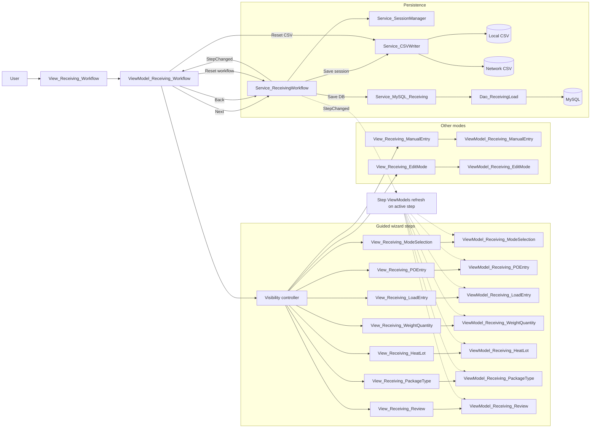

# Module_Receiving - Module Documentation

## Table of Contents

1. [Module Overview](#module-overview)
2. [Mermaid Workflow Diagrams](#mermaid-workflow-diagrams)
3. [User Interaction Lifecycle](#user-interaction-lifecycle)
4. [Code Inventory](#code-inventory)
5. [Database Schema Details](#database-schema-details)
6. [Module Dependencies & Integration](#module-dependencies--integration)
7. [Common Patterns & Code Examples](#common-patterns--code-examples)

---

## Module Overview

### Purpose

Module_Receiving implements the primary receiving workflows:

- Guided wizard-style receiving (PO + Part selection → loads → weight/qty → heat/lot → package type → review → save)
- Manual entry grid for bulk data entry
- Edit Mode for modifying existing loads (from in-memory session, CSV, or DB history)

### Primary Entry Point

- `View_Receiving_Workflow.xaml` is the orchestration shell.
  - It hosts child views and toggles their visibility based on the workflow step.
  - It presents global navigation (Back/Next), Reset CSV, Mode Selection, and contextual Help.

### Core State Machine

- `Service_ReceivingWorkflow` is the step/state coordinator.
- Step changes are published via `StepChanged` and observed by:
  - `ViewModel_Receiving_Workflow` (global visibility switching)
  - Step ViewModels (refresh their local view state when their step becomes active)

### Notable Behaviors

- **Session persistence:** `Service_SessionManager` saves and loads session state from `%APPDATA%\MTM_Receiving_Application\session.json`.
- **Save pipeline:** `Service_ReceivingWorkflow.SaveSessionAsync` saves CSV first, then saves to MySQL. Local CSV failure is treated as critical.
- **Network CSV is best-effort:** Network path failures are warnings; local CSV + DB success drives overall success.

### Architecture Compliance (Highlights)

✅ Strong points

- Workflow is centralized in `Service_ReceivingWorkflow` with step gating and validation.
- Views are primarily declarative, using `x:Bind` for ViewModel bindings.

⚠️ Deviations detected (worth tracking)

- `Dao_CarrierDeliveryLabel` is `static` and uses a setter to inject an error handler.
- `Service_ReceivingWorkflow` uses `App.GetService<T>()` (service locator) to read the current user’s default mode.
- Several grids use runtime `Binding` (not `x:Bind`). This is usually required for `DataGrid` column bindings, but it’s still a pattern deviation to monitor.

---

## Mermaid Workflow Diagrams

### Guided Receiving Workflow (UI → VM → Workflow Service)

---

## User Interaction Lifecycle

### A) Guided Wizard

1. `View_Receiving_Workflow` starts on Mode Selection (or auto-skips if user default mode is present).
2. Mode Selection view triggers `GoToStep` for Guided/Manual/Edit.
3. Guided path collects:
   - PO and part selection (Infor Visual read-only lookups)
   - number of loads to generate
   - per-load weight/qty
   - per-load heat/lot
   - per-load packages-per-load and a shared package type
4. Review step provides a single-entry view or a table view.
5. Save moves to Saving step; `ViewModel_Receiving_Workflow` dispatches the save.
6. Complete view shows success/failure and allows Start New Entry or Reset CSV.

### B) Manual Entry

- Manual entry uses an editable grid, supports Add/Remove rows and AutoFill.
- Save delegates to the workflow Save step (`AdvanceToNextStepAsync` moves to Saving).

### C) Edit Mode

- Edit Mode focuses on loading existing loads, filtering, selecting rows, and saving changes.
- Supports loading from:
  - Current in-memory session
  - Current labels CSV
  - History (DB date-range queries)

### D) Reset CSV Safety Flow

- `ResetCSVCommand` prompts the user.
- The app attempts to save to DB first (`SaveToDatabaseOnlyAsync`).
- If DB save fails, it prompts again before deleting CSV files.

---

## Code Inventory

See: [_bmad/_memory/docent-sidecar/knowledge/Module_Receiving-CodeInventory.md](../docent-sidecar/knowledge/Module_Receiving-CodeInventory.md)

---

## Database Schema Details

See: [_bmad/_memory/docent-sidecar/knowledge/Module_Receiving-Database.md](../docent-sidecar/knowledge/Module_Receiving-Database.md)

---

## Module Dependencies & Integration

### Key Dependencies

- Infor Visual read-only data access is consumed via `IService_InforVisual` (implemented in Module_Core).
- MySQL writes for receiving loads are done via `Service_MySQL_Receiving` (Module_Core) + `Dao_ReceivingLoad` (Module_Receiving).
- CSV read/write is handled in-module by `Service_CSVWriter`.

### UI Composition

- `View_Receiving_Workflow` hosts the step views concurrently and toggles visibility via boolean flags.
- A contextual help button calls `IService_Help.ShowContextualHelpAsync` with the current workflow step.

---

## Common Patterns & Code Examples

### Step-Driven Visibility Switching

- The workflow service emits `StepChanged`.
- The workflow ViewModel responds by hiding all step views, then setting only the current step’s flag to visible.

### Save Dispatch Pattern

- When the service step changes to Saving, the workflow ViewModel dispatches `PerformSaveAsync` via `IService_Dispatcher.TryEnqueue`.
- This avoids blocking the UI thread and ensures the save is executed on the UI dispatcher.

---

## Notes

- This module’s AM output is intentionally split into companion docs to avoid the historical “Line Limit Reached” problem when documenting inventories and stored-procedure mappings.
