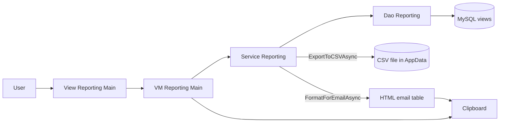

# Module_Reporting - Module Documentation

## Table of Contents

1. [Module Overview](#module-overview)
2. [Mermaid Workflow Diagrams](#mermaid-workflow-diagrams)
3. [User Interaction Lifecycle](#user-interaction-lifecycle)
4. [Code Inventory](#code-inventory)
5. [Database Schema Details](#database-schema-details)
6. [Module Dependencies & Integration](#module-dependencies--integration)
7. [Known Deviations & Notes](#known-deviations--notes)

---

## Module Overview

### Purpose

Module_Reporting provides an End-of-Day reporting surface that aggregates activity across multiple modules:

- Receiving
- Dunnage
- Routing
- Volvo (initially a placeholder view)

Core capabilities:

- Date range filtering
- Availability check (record counts per module)
- Report generation per module (loads data into a unified row model)
- CSV export saved under `%APPDATA%\MTM_Receiving_Application\Reports\`
- HTML email formatting and clipboard copy

### Primary UI Entry Point

- `View_Reporting_Main.xaml` is the single-page UI for all reporting operations.

### Key Layers

- `ViewModel_Reporting_Main` drives date range selection, module selection, commands, and holds the unified report output list.
- `Service_Reporting` orchestrates module-specific fetch, PO normalization (Receiving/Routing), CSV export, and email formatting.
- `Dao_Reporting` executes **read-only** SQL queries against MySQL reporting views (`vw_*_history`).

---

## Mermaid Workflow Diagrams

### Workflow: EoD Reporting (Check → Generate → Export/Copy)

---

## User Interaction Lifecycle

1. Choose date range.
2. Click **Check Availability**:
   - Queries counts per module and disables modules with zero records.
3. Select modules via checkboxes.
4. Generate report for a single module:
   - Loads unified `Model_ReportRow` data and updates the current module name.
5. Export to CSV:
   - Writes module-specific columns to a timestamped CSV in AppData.
6. Copy Email Format:
   - Builds an HTML table (alternating row colors, optional date grouping) and places it on the clipboard.

---

## Code Inventory

See: [_bmad/_memory/docent-sidecar/knowledge/Module_Reporting-CodeInventory.md](../docent-sidecar/knowledge/Module_Reporting-CodeInventory.md)

---

## Database Schema Details

See: [_bmad/_memory/docent-sidecar/knowledge/Module_Reporting-Database.md](../docent-sidecar/knowledge/Module_Reporting-Database.md)

---

## Module Dependencies & Integration

- The unified row model is owned by Module_Core: `Module_Core/Models/Reporting/Model_ReportRow.cs`.
- The reporting service contract is owned by Module_Core: `Module_Core/Contracts/Services/IService_Reporting.cs`.
- Reporting depends on deployment of MySQL views defined in `Database/Schemas/views_01_create_reporting_views.sql`.

---

## Known Deviations & Notes

- `Dao_Reporting` uses raw SQL SELECT queries against **database views** for reporting. This is intentionally read-only but differs from the typical “stored procedures only” MySQL rule used for application CRUD.
- `view_volvo_history` is documented as a placeholder view (counts currently forced to 0 in availability checks).
