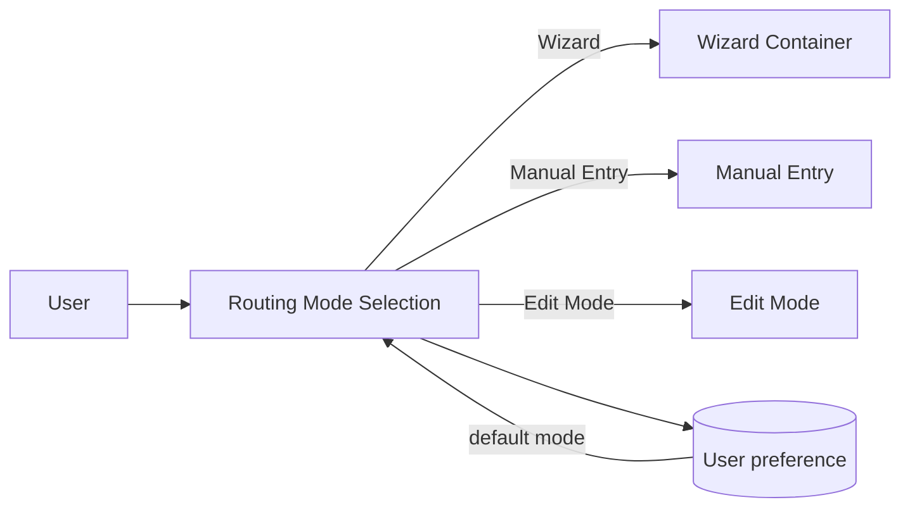
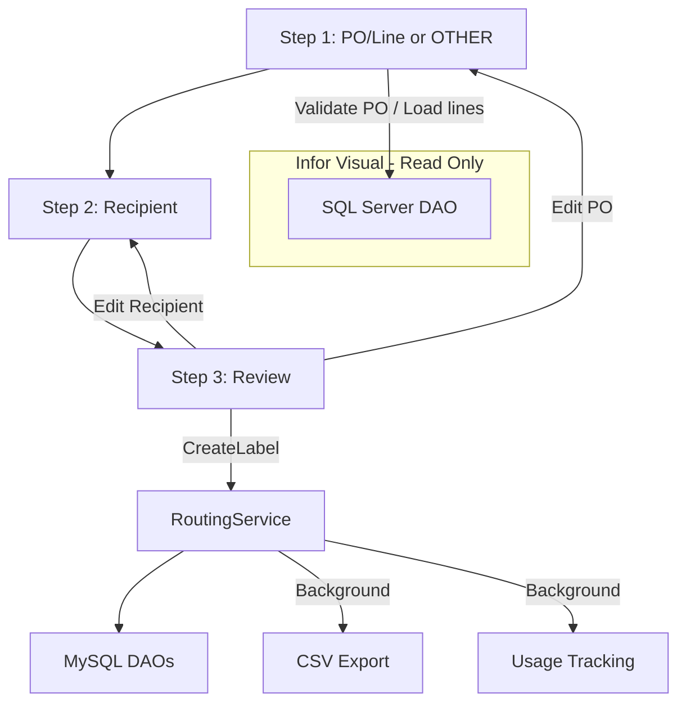

# Module_Routing - Module Documentation

## Module Overview

Module_Routing enables receiving personnel to create and manage internal routing labels for packages/materials.

The module supports three user modes:

- Wizard (primary): guided 3-step flow with PO validation and recipient selection
- Manual Entry: batch entry of multiple labels
- Edit Mode: search/edit/reprint labels and review history

Routing labels are written to MySQL and exported to a CSV file for printing/integration.

## Mermaid Workflow Diagrams

### Mode Selection → Mode Page

### Wizard Flow (Step 1 → 2 → 3 → Create)

## User Interaction Lifecycle

### Wizard Mode

1. Step 1 validates PO number and fetches PO lines (Infor Visual read-only).
2. User selects a PO line.
3. Step 2 loads recipients and Quick Add suggestions.
4. Step 3 presents a review summary.
5. Create label:
   - Inserts label into MySQL
   - Starts background tasks:
     - CSV append (network with retry, local fallback)
     - Usage tracking increment

### Manual Entry Mode

- User enters multiple rows in a grid.
- Optional PO validation can prefill description/line for single-line POs.
- Save All iterates labels and creates each label through the service.

### Edit Mode

- Loads labels (bounded by a limit).
- User searches by PO/recipient/description.
- User can:
  - Save edits (updates label and logs history)
  - Reprint (CSV export only)

## Code Inventory

See: [_bmad/_memory/docent-sidecar/knowledge/Module_Routing-CodeInventory.md](../docent-sidecar/knowledge/Module_Routing-CodeInventory.md)

## Database Schema Details

See: [_bmad/_memory/docent-sidecar/knowledge/Module_Routing-Database.md](../docent-sidecar/knowledge/Module_Routing-Database.md)

## Module Dependencies & Integration

- **MySQL (application DB)**
  - All CRUD operations for routing tables are performed through stored procedures.

- **SQL Server (Infor Visual, READ ONLY)**
  - Used for PO validation and line retrieval.
  - Queries enforce `SITE_REF = '002'`.
  - DAO documentation expects the connection string to include `ApplicationIntent=ReadOnly`.

- **Navigation**
  - Mode selection uses `IService_Navigation` to navigate within a provided Frame.

## Known Deviations & Notes

- Wizard Step 1 “OTHER workflow” reasons are not currently loaded via service (placeholder behavior), even though a DAO and stored procedure exist for `routing_other_reasons`.
- Infor Visual integration uses graceful degradation: if the SQL Server connection check fails, PO validation returns success (true) to avoid blocking label creation.
- CSV export is serialized with a static semaphore to prevent concurrent writes; network path is attempted first with retries, then a local fallback is used.
