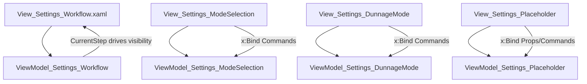

# Module_Settings - Code Inventory

## Purpose

This document contains the detailed component inventory for Module_Settings (Views, ViewModels, Services, Enums) and is designed to be referenced from the main module documentation.

Related validation report:

- [_bmad/_memory/docent-sidecar/validation/VD-Module_Settings-2026-01-09.md](_bmad/_memory/docent-sidecar/validation/VD-Module_Settings-2026-01-09.md)

---

## Boundary Violations (Cross-Module)

This module is currently used as a Settings “hub”, but several settings-related components live outside `Module_Settings`.

Key examples (see VD report for details):

- Volvo settings UI + persistence exist in Module_Volvo.
- User preference model + persistence are split across Module_Settings, Module_Receiving, and Module_Routing.
- Dunnage admin ViewModels use `App.GetService<IService_SettingsWorkflow>()` to navigate back, creating a reverse dependency on Module_Settings.

---

## Enums

### Enum_SettingsWorkflowStep

Values:

- `ModeSelection`
- `ReceivingSettings`
- `DunnageSettings`
- `ShippingSettings`
- `VolvoSettings`
- `AdministrativeSettings`
- `DunnageTypes`
- `DunnageInventory`

---

## Services

### IService_SettingsWorkflow

Public surface:

- `event EventHandler<Enum_SettingsWorkflowStep>? StepChanged`
- `void GoToStep(Enum_SettingsWorkflowStep step)`
- `void GoBack()`
- `void Reset()`

### Service_SettingsWorkflow

Responsibilities:

- Maintains current step (private field) and raises `StepChanged` on step transitions.
- `GoBack()` routes to `ModeSelection`.
- `Reset()` routes to `ModeSelection`.

Notes:

- This service is the state machine coordinator for Settings navigation.

### IService_UserPreferences

Public surface:

- `Task<Model_Dao_Result<Model_UserPreference>> GetLatestUserPreferenceAsync(string username)`
- `Task<Model_Dao_Result> UpdateDefaultModeAsync(string username, string defaultMode)`
- `Task<Model_Dao_Result> UpdateDefaultReceivingModeAsync(string username, string defaultMode)`
- `Task<Model_Dao_Result> UpdateDefaultDunnageModeAsync(string username, string defaultMode)`

### Service_UserPreferences

Constructor dependencies:

- `Dao_User` (Module_Core)
- `IService_LoggingUtility`
- `IService_ErrorHandler`

Behaviors:

- Normalizes username input and rejects empty values.
- Uses `Dao_User.GetUserByWindowsUsernameAsync(...)` to resolve the user.
- Returns a constructed `Model_UserPreference` with example defaults.
- Update methods are placeholders (`Task.Delay(10)` + success result).

Notes / gaps:

- Update methods do not persist anything.
- `GetLatestUserPreferenceAsync` does not read stored preference columns/tables.

---

## ViewModels

All ViewModels inherit from `ViewModel_Shared_Base` (Module_Shared) and use CommunityToolkit.Mvvm attributes.

Note: `ViewModel_Shared_Base` is `ObservableObject`-based and provides common status properties (`IsBusy`, `StatusMessage`, etc.) plus `ShowStatus(...)`.

### ViewModel_Settings_Workflow

Role:

- Shell/coordinator that translates workflow step changes into UI state.

Dependencies:

- `IService_SettingsWorkflow`
- `IService_ErrorHandler`
- `IService_LoggingUtility`

Observable properties:

- `CurrentStep : Enum_SettingsWorkflowStep` (default: `ModeSelection`)
- `CurrentStepTitle : string` (default: `"Settings"`)
- `IsAdminPageVisible : bool`

Internal behavior:

- Subscribes to `StepChanged` and updates `CurrentStep`, `IsAdminPageVisible`, and `CurrentStepTitle`.
- Sets `IsAdminPageVisible = true` only for `DunnageTypes` and `DunnageInventory`.

### ViewModel_Settings_ModeSelection

Role:

- Commands for selecting the top-level settings category.

Dependencies:

- `IService_SettingsWorkflow`
- `IService_ErrorHandler`
- `IService_LoggingUtility`

Commands:

- `SelectReceivingSettings`
- `SelectDunnageSettings`
- `SelectShippingSettings`
- `SelectVolvoSettings`
- `SelectAdministrativeSettings`

### ViewModel_Settings_DunnageMode

Role:

- Commands for Dunnage Settings sub-menu.

Dependencies:

- `IService_SettingsWorkflow`
- `IService_ErrorHandler`
- `IService_LoggingUtility`

Commands:

- `Back` (routes to `ModeSelection`)
- `SelectDunnageTypes` (routes to `DunnageTypes`)
- `SelectDunnageInventory` (routes to `DunnageInventory`)

### ViewModel_Settings_Placeholder

Role:

- Used for categories that are not implemented yet.

Dependencies:

- `IService_SettingsWorkflow`
- `IService_ErrorHandler`
- `IService_LoggingUtility`

Observable properties:

- `CategoryTitle : string` (default: `"Settings"`)
- `PlaceholderMessage : string` (default: `"This settings category is under development."`)

Methods:

- `SetCategory(string title, string message)`

Commands:

- `Back` (routes to `ModeSelection`)

Notes:

- The workflow shell does not call `SetCategory(...)`, so placeholder UI generally shows the defaults.

---

## Views

### View_Settings_Workflow (Page)

Role:

- Hosts the Settings hub and category views.
- Uses a `Frame` (`AdminFrame`) for deep-linked admin pages.

Notable UI elements:

- `View_Settings_ModeSelection` (shown when step = `ModeSelection`)
- `View_Settings_DunnageMode` (shown when step = `DunnageSettings`)
- `View_Settings_Placeholder` (shown for `ReceivingSettings`, `ShippingSettings`, `AdministrativeSettings`)
- `Module_Volvo.Views.View_Volvo_Settings` (shown when step = `VolvoSettings`)
- `AdminFrame` (shown when `IsAdminPageVisible = true`)

Navigation behavior:

- Subscribes to `IService_SettingsWorkflow.StepChanged` and routes Admin pages.
  - `DunnageTypes` navigates to `Module_Dunnage.Views.View_Dunnage_AdminTypesView` via `IService_Navigation.NavigateTo(AdminFrame, ...)`.
  - `DunnageInventory` is currently a TODO (no navigation wired yet).

### View_Settings_ModeSelection (UserControl)

Role:

- Card hub UI with buttons for the main settings categories.

Bindings:

- Uses `x:Bind` to `ViewModel_Settings_ModeSelection` commands.

### View_Settings_DunnageMode (UserControl)

Role:

- Card sub-menu for Dunnage admin deep links.

Bindings:

- Uses `x:Bind` to `ViewModel_Settings_DunnageMode` commands.

### View_Settings_Placeholder (UserControl)

Role:

- “Coming soon” placeholder with Back.

Bindings:

- Uses `x:Bind` to `ViewModel_Settings_Placeholder`.

---

## Mermaid - View/VM Binding Overview

