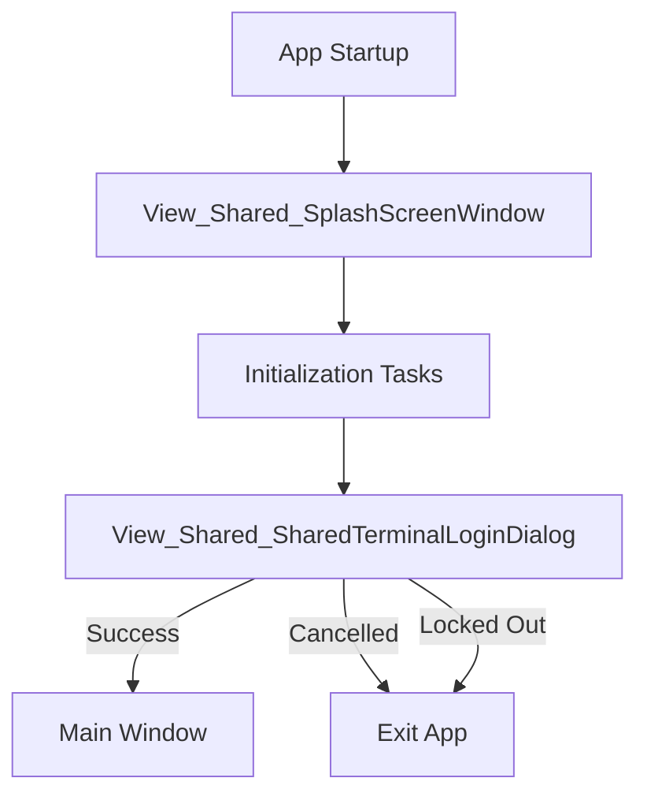
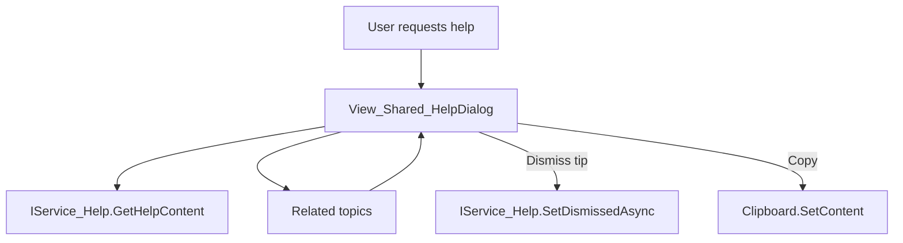
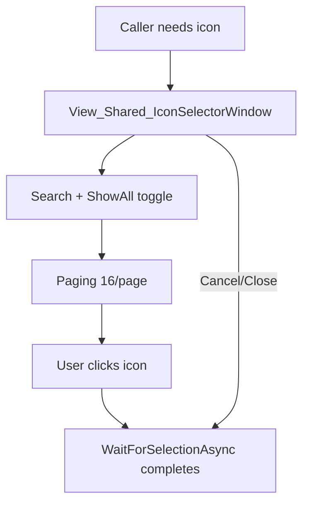

# Module_Shared - Module Documentation

## Module Overview

Module_Shared provides shared UI surfaces used across the app (startup splash, authentication dialogs, new-user setup, centralized help dialog, and a reusable icon selector).

This module does **not** define its own DAOs/services; instead it depends on Module_Core-provided services (authentication, help, notification, error handling, logging, focus, session).

## Mermaid Workflow Diagrams

### Startup Splash → Login → Main Window

### Central Help Dialog

### Icon Selector Window

## Key Behaviors

### Splash screen window

- Window: `View_Shared_SplashScreenWindow`
- Uses `ViewModel_Shared_SplashScreen` to drive status text + progress value.
- Important safety behavior: if user manually closes the splash window (not a programmatic close), the app exits.

### Shared terminal login

- Dialog: `View_Shared_SharedTerminalLoginDialog`
- ViewModel: `ViewModel_Shared_SharedTerminalLogin`
- Validates username and a 4-digit numeric PIN.
- Enforces a 3-attempt limit; on lockout:
  - disables inputs/buttons
  - waits ~5 seconds
  - sets `ViewModel.IsLockedOut = true` and closes
- Uses `IService_Focus` to focus username on open.

### New user setup

- Dialog: `View_Shared_NewUserSetupDialog`
- ViewModel: `ViewModel_Shared_NewUserSetup`
- Loads Departments via `IService_Authentication.GetActiveDepartmentsAsync()`
- Supports “Other” department with a custom text field.
- Optional ERP credential capture (Visual/Infor username/password) for integration; shows a warning in UI.
- Creates account via `IService_Authentication.CreateNewUserAsync()` after validating employee number and PIN rules.

### Central help dialog

- Dialog: `View_Shared_HelpDialog` + `ViewModel_Shared_HelpDialog`
- Loads a `Model_HelpContent` and optional related topics.
- Supports dismissible “Tip” help entries via `IService_Help.IsDismissedAsync()` and `SetDismissedAsync()`.
- Copy-to-clipboard command copies the help content text.

### Base ViewModel behavior

- `ViewModel_Shared_Base` provides `IsBusy`, `StatusMessage`, and a `ShowStatus()` helper.
- Note: `ShowStatus()` uses `App.GetService<IService_Notification>()` (service locator) to publish global notifications.

## Code Inventory

See: [_bmad/_memory/docent-sidecar/knowledge/Module_Shared-CodeInventory.md](../docent-sidecar/knowledge/Module_Shared-CodeInventory.md)

## Database & Integration Notes

See: [_bmad/_memory/docent-sidecar/knowledge/Module_Shared-Database.md](../docent-sidecar/knowledge/Module_Shared-Database.md)
