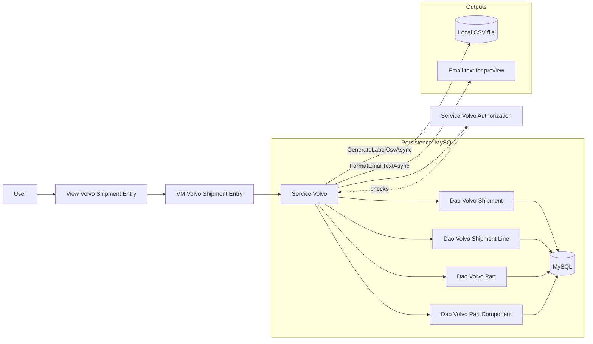
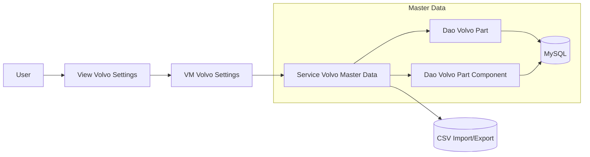
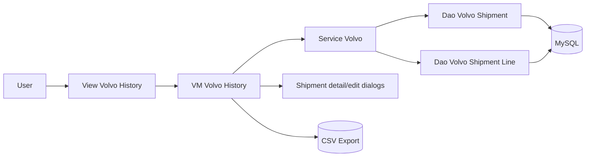

# Module_Volvo - Module Documentation

## Table of Contents

1. [Module Overview](#module-overview)
2. [Mermaid Workflow Diagrams](#mermaid-workflow-diagrams)
3. [User Interaction Lifecycle](#user-interaction-lifecycle)
4. [Code Inventory](#code-inventory)
5. [Database Schema Details](#database-schema-details)
6. [Module Dependencies & Integration](#module-dependencies--integration)
7. [Known Deviations & Risks](#known-deviations--risks)

---

## Module Overview

### Purpose

Module_Volvo implements the Volvo dunnage requisition workflow:

- Create a shipment (as “Pending PO”) by selecting parts and received skids.
- Compute received piece counts and handle discrepancies.
- Generate LabelView-compatible label CSV for printing.
- Generate and format a PO requisition email (with discrepancy section when applicable).
- Complete shipments by adding PO/receiver numbers.
- Maintain Volvo parts master data (parts + components) with CSV import/export.
- View shipment history with filters and export.

### Primary UI Entry Points

- `View_Volvo_ShipmentEntry.xaml` (shipment creation + label/email actions)
- `View_Volvo_History.xaml` (filter/search history, view details, edit)
- `View_Volvo_Settings.xaml` (master data catalog management)

### Core Business Services

- `Service_Volvo` orchestrates shipment lifecycle, component explosion, label CSV creation, email formatting, and shipment history.
- `Service_VolvoMasterData` handles parts master CRUD and CSV import/export for the parts catalog.
- `Service_VolvoAuthorization` currently allows all operations and logs checks (placeholder for RBAC).

---

## Mermaid Workflow Diagrams

### Workflow 1: Shipment Entry → Save Pending → Generate Labels → Complete

### Workflow 2: Parts Master Data (Settings)

### Workflow 3: Shipment History (Filter → Detail → Edit → Export)

---

## User Interaction Lifecycle

### A) Shipment Entry

1. Load active Volvo parts catalog for AutoSuggest.
2. If a pending shipment exists, load it and its lines.
3. Add parts:
   - Select part number + received skids (1–99)
   - Calculate pieces = skids × quantity-per-skid
   - Optionally mark discrepancy and add note
4. Save as Pending:
   - Creates/updates a pending shipment plus its lines.
5. Generate Labels:
   - Ensures shipment exists (save if needed)
   - Computes component explosion across lines
   - Writes a LabelView CSV to a local AppData path
6. Preview Email:
   - Formats a PO requisition email body (includes discrepancies section)
7. Complete Shipment:
   - Adds PO number + receiver number and marks shipment complete

### B) Master Data Settings

- List parts (toggle show inactive)
- Add/Edit/Deactivate part
- View components (read-only summary)
- Import/export parts catalog via CSV

### C) History

- Filter by date range + status
- View shipment details (lines shown in dialog)
- Edit shipment (dialog)
- Export history to CSV

---

## Code Inventory

See: [_bmad/_memory/docent-sidecar/knowledge/Module_Volvo-CodeInventory.md](../docent-sidecar/knowledge/Module_Volvo-CodeInventory.md)

---

## Database Schema Details

See: [_bmad/_memory/docent-sidecar/knowledge/Module_Volvo-Database.md](../docent-sidecar/knowledge/Module_Volvo-Database.md)

---

## Module Dependencies & Integration

### Key Dependencies

- MySQL stored-procedure access via `Helper_Database_StoredProcedure` (preferred).
- CommunityToolkit `DataGrid` used in all three pages.
- `Service_VolvoAuthorization` is called for key operations but currently returns allow-all.

---

## Known Deviations & Risks

- DAO consistency: some Volvo DAO operations use direct `MySqlCommand` stored procedure calls and/or raw SQL text instead of `Helper_Database_StoredProcedure`.
- OUT parameter gaps: `Dao_VolvoPart.DeactivateAsync` attempts an OUT-param reference check but notes the helper doesn’t support OUT params yet, so the check is not enforced.
- Authorization is currently placeholder (logs + allow-all), so RBAC is not actually enforced.

(These are documented here for architectural hygiene; no code changes were made as part of AM generation.)
