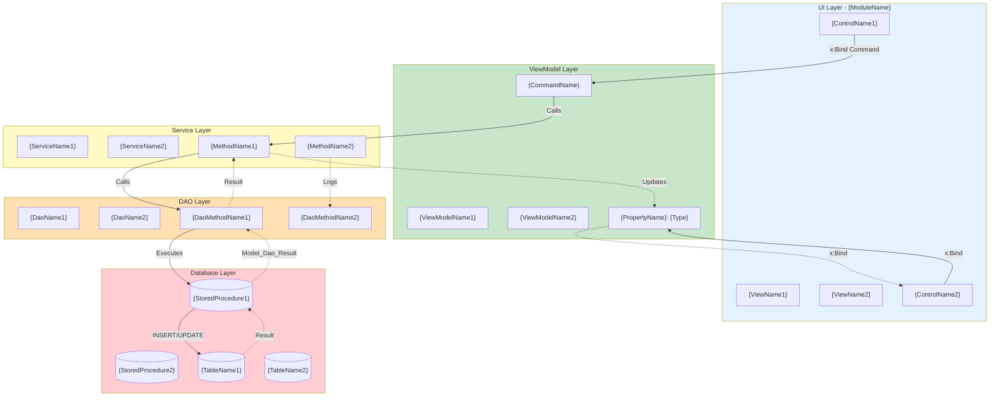
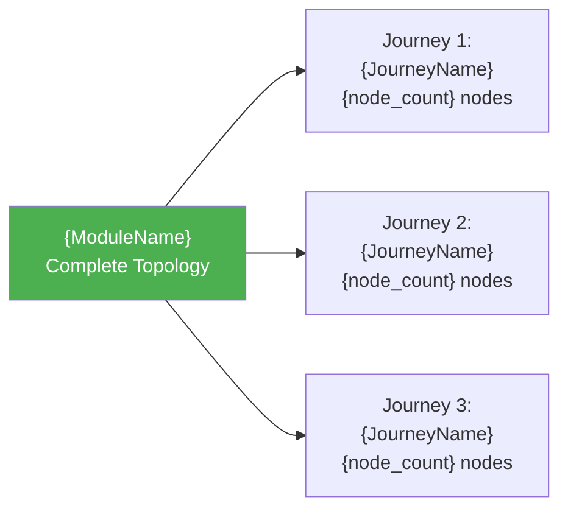

# Generate Diagram Workflow

**Command:** GD (Generate Diagram)
**Purpose:** Create or update Mermaid workflow diagrams without full documentation generation
**Use Case:** Visual reference needs, architecture presentations, onboarding materials

---

## Workflow Execution Steps

### Step 1: Initialize Diagram Generation

**Prompt user:**

```
📊 Docent - Generate Diagram

Module: [await input]
Diagram type: 
  [1] Complete Module Topology
  [2] Specific Workflow
  [3] Database ERD
  [4] Layer Dependencies
Complexity handling: [Single diagram / Split by user journey]
Output: [Console / File / Both]
```

---

### Step 2: Component Discovery

**Scan module based on diagram type:**

**Type 1: Complete Module Topology**

- Discover all Views, ViewModels, Services, DAOs
- Map all data flows
- Generate end-to-end vertical diagram

**Type 2: Specific Workflow**

- User specifies: Entry View → Target ViewModel → Workflow name
- Trace specific user journey
- Generate focused diagram

**Type 3: Database ERD**

- Extract table relationships from DAOs
- Query database for FK relationships
- Generate entity-relationship diagram

**Type 4: Layer Dependencies**

- Map which layers depend on which
- Show module-to-module dependencies
- Generate component diagram

---

### Step 3: Complexity Assessment

**Count diagram nodes:**

```
Node Count Calculation:
- UI Controls: {count}
- ViewModel Properties: {count}
- ViewModel Commands: {count}
- Service Methods: {count}
- DAO Methods: {count}
- Stored Procedures: {count}
- Database Tables: {count}

Total Nodes: {sum}

Complexity Assessment:
✅ Simple (< 20 nodes): Single diagram
⚠️ Moderate (20-30 nodes): Consider splitting
❌ Complex (> 30 nodes): MUST split by user journey
```

**If complex:**

```
⚠️ This module has {count} nodes.

Recommendation: Split into user-journey-based diagrams

Detected User Journeys:
1. {JourneyName} ({node_count} nodes)
2. {JourneyName} ({node_count} nodes)
3. {JourneyName} ({node_count} nodes)

Generate: [All journeys / Select specific / Single anyway]
```

---

### Step 4: Generate Mermaid Diagram(s)

**Type 1: Complete Module Topology (Vertical Flowchart)**



---

**Type 2: Specific Workflow (User Journey)**

```mermaid
flowchart TD
    Start([User Action: {Description}])
    
    subgraph UI["UI Layer"]
        Control["{ControlName}<br/>{ControlType}"]
    end
    
    subgraph VM["ViewModel"]
        Prop["{PropertyName}<br/>Type: {FullType}"]
        Cmd["{CommandName}<br/>Method: {MethodName}"]
    end
    
    subgraph SVC["Service"]
        Method["{ServiceName}.{MethodName}<br/>Validates: {ValidationRules}"]
    end
    
    subgraph DAO["DAO"]
        DaoMethod["{DaoName}.{MethodName}<br/>Returns: Model_Dao_Result"]
    end
    
    subgraph DB["Database"]
        SP[("{StoredProcedureName}<br/>Params: {ParamList}")]
        Table[("{TableName}<br/>Operation: {INSERT/UPDATE}")]
    end
    
    End([UI Updated:<br/>{Description}])
    
    Start --> Control
    Control -->|"x:Bind TwoWay"| Prop
    Control -->|"Command Trigger"| Cmd
    Cmd -->|"Calls"| Method
    Method -->|"Calls"| DaoMethod
    DaoMethod -->|"Executes"| SP
    SP -->|"Modifies"| Table
    
    Table -.->|"Returns ID"| SP
    SP -.->|"Model_Dao_Result"| DaoMethod
    DaoMethod -.->|"Success/Failure"| Method
    Method -.->|"Updates"| Prop
    Prop -.->|"x:Bind OneWay"| Control
    Control -.-> End
    
    style Start fill:#4caf50,color:#fff
    style End fill:#2196f3,color:#fff
    style UI fill:#e3f2fd
    style VM fill:#c8e6c9
    style SVC fill:#fff9c4
    style DAO fill:#ffe0b2
    style DB fill:#ffcdd2
```

---

**Type 3: Database ERD**

```mermaid
erDiagram
    {TABLE1} ||--o{ {TABLE2} : "has many"
    {TABLE1} ||--|| {TABLE3} : "has one"
    {TABLE2} }o--|| {TABLE4} : "belongs to"
    
    {TABLE1} {
        int id PK "Primary Key"
        varchar(50) name "Unique name"
        datetime created_at "Timestamp"
        int created_by FK "User reference"
    }
    
    {TABLE2} {
        int id PK
        int {table1}_id FK "Foreign key to {TABLE1}"
        varchar(100) description
        decimal(10,2) amount
        bit is_active "Boolean flag"
    }
    
    {TABLE3} {
        int id PK
        int {table1}_id FK "One-to-one relationship"
        varchar(200) details
    }
    
    {TABLE4} {
        int id PK
        varchar(50) category
    }
```

---

**Type 4: Layer Dependencies**

```mermaid
graph TB
    subgraph "Module: {ModuleName}"
        UI[Views<br/>{count} files]
        VM[ViewModels<br/>{count} files]
        SVC[Services<br/>{count} files]
        DAO[DAOs<br/>{count} files]
        Models[Models<br/>{count} files]
    end
    
    subgraph "External Modules"
        ExtMod1[{ModuleName}]
        ExtMod2[{ModuleName}]
    end
    
    subgraph "Infrastructure"
        DB[(MySQL Database)]
        InforDB[(SQL Server<br/>Infor Visual)]
    end
    
    UI -->|"Binds to"| VM
    VM -->|"Calls"| SVC
    SVC -->|"Uses"| DAO
    DAO -->|"Queries"| DB
    DAO -->|"Reads"| InforDB
    
    VM -.->|"Uses"| Models
    SVC -.->|"Uses"| Models
    DAO -.->|"Uses"| Models
    
    SVC -->|"Depends on"| ExtMod1
    VM -->|"Navigates to"| ExtMod2
    
    style UI fill:#e3f2fd
    style VM fill:#c8e6c9
    style SVC fill:#fff9c4
    style DAO fill:#ffe0b2
    style DB fill:#ffcdd2
    style InforDB fill:#f8bbd0
```

---

### Step 5: Add Diagram Annotations

**Generate diagram legend and notes:**

```markdown
### Diagram Legend

**Layer Color Coding:**
- 🔵 Blue: UI Layer (Views, Controls)
- 🟢 Green: ViewModel Layer (Properties, Commands)
- 🟡 Yellow: Service Layer (Business Logic)
- 🟠 Orange: DAO Layer (Data Access)
- 🔴 Red: Database Layer (Tables, Stored Procedures)

**Arrow Types:**
- Solid (→): Forward flow (User action → Database)
- Dotted (-.->): Return flow (Database → UI update)

**Node Shapes:**
- Rectangle: Component (ViewModel, Service, DAO)
- Parallelogram: Database operation
- Round edges: Start/End points

### Diagram Notes

**Generated:** {CurrentDate}
**Module:** {ModuleName}
**Total Nodes:** {count}
**Complexity:** {Simple/Moderate/Complex}

**Key Architectural Flows:**
1. {Description of primary flow}
2. {Description of secondary flow}

**MTM Constraints Visualized:**
- x:Bind bindings (compile-time) shown with explicit mode annotations
- Stored procedure calls (mandatory pattern) shown at DAO layer
- Model_Dao_Result return paths (standard DAO pattern) shown with dotted arrows
```

---

### Step 6: Output Diagram

**Console Output:**

```markdown
# {ModuleName} - {DiagramType} Diagram

{Mermaid diagram code}

{Legend}

{Notes}
```

**File Output:**

- Create/update: `docs/diagrams/{ModuleName}_{diagram_type}.md`
- If updating existing documentation: Insert into Section 2

---

### Step 7: Integration with Documentation

**If module documentation exists:**

```
Documentation found: docs/workflows/{ModuleName}.md

Actions:
[1] Replace Section 2 (Mermaid Diagram) with this diagram
[2] Add as additional diagram in appendix
[3] Save to separate file only
[4] Console output only (don't save)

Your choice: [1/2/3/4]
```

**Update documentation:**

- Locate Section 2 in existing doc
- Replace with new diagram
- Update `last_validated` timestamp

---

### Step 8: Multi-Diagram Generation (if split by user journey)

**For each user journey:**

1. Generate focused diagram
2. Save to separate section/file
3. Create index diagram showing all journeys

**Index Diagram:**



**Output structure:**

```markdown
# {ModuleName} - Workflow Diagrams

## Overview

This module's topology is split into {count} user-journey-based diagrams for clarity.

### Journey Index

{Index diagram}

---

## Journey 1: {JourneyName}

{Journey 1 diagram}

{Description and notes}

---

## Journey 2: {JourneyName}

{Journey 2 diagram}

{Description and notes}

---

## Journey 3: {JourneyName}

{Journey 3 diagram}

{Description and notes}
```

---

### Step 9: Diagram Validation

**Check diagram quality:**

- All nodes have clear labels
- All arrows have annotations
- No orphaned nodes (disconnected)
- Proper subgraph nesting
- Color coding applied

**Validation Report:**

```
Diagram Quality Check:
✅ Node labels clear and descriptive
✅ All flows annotated
✅ No orphaned components
✅ Layer subgraphs properly nested
✅ Color coding applied
✅ Legend complete

Diagram ready for use.
```

---

### Step 10: Export Options

**Provide export guidance:**

```
📊 Diagram generated successfully!

View Options:
1. **GitHub Markdown:** Renders automatically in .md files
2. **VS Code:** Install Mermaid Preview extension
3. **Mermaid Live Editor:** https://mermaid.live
4. **Export to PNG/SVG:** Use Mermaid CLI or online tools

Integration:
- Copy to documentation: docs/workflows/{ModuleName}.md
- Standalone file: docs/diagrams/{ModuleName}_{type}.md
- Presentation slides: Export as PNG/SVG
```

---

### Step 11: Update Memory

**Update memories.md:**

```markdown
Diagram generated: {ModuleName} - {DiagramType}
- Nodes: {count}
- Complexity: {Simple/Moderate/Complex}
- Journeys: {count if split}
Output: {FilePath}
```

---

### Step 12: Completion Message

```
✅ Diagram generation complete.

Module: {ModuleName}
Type: {DiagramType}
Nodes: {count}
Complexity: {assessment}

Output:
- {OutputLocation}

Every layer mapped, every flow visualized, every connection clear.

Diagram ready for architectural reference and onboarding.
```

---

**Workflow Version:** 1.0.0  
**Created:** 2026-01-08  
**Status:** Production Ready
