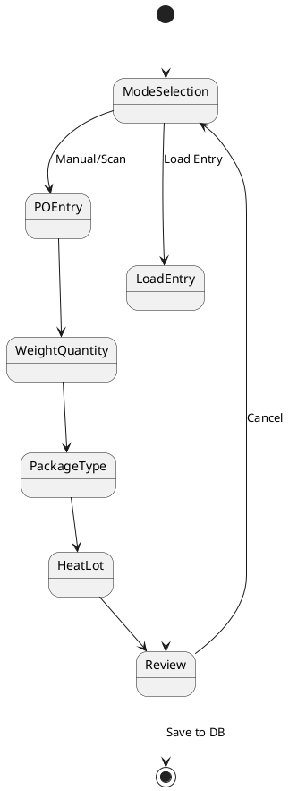
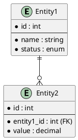
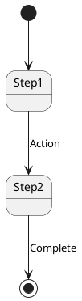

# Module Development Guide

**Version:** 3.0.0 | **Date:** January 15, 2026 | **Estimated Effort:** 6-8 weeks

**Purpose:** Comprehensive guide for rebuilding existing modules, creating new modules, and maintaining Module_Core using modern architectural patterns and industry-standard libraries.

---

## Executive Summary

This guide provides constitutional rules, architectural patterns, and implementation strategies for module development in the MTM Receiving Application ecosystem. It supports three primary workflows:

1. **Module Rebuilding** - Modernizing existing `Module_{Feature}` folders
2. **Module Creation** - Scaffolding new modules from specifications
3. **Core Maintenance** - Safely evolving shared Module_Core infrastructure

**Key Objectives:**

- Reduce Module_Core service count by 50%
- Implement CQRS (Command Query Responsibility Segregation) pattern
- Improve testability through proper abstraction
- Enable true modular independence (100% self-contained modules)
- Establish consistent patterns across all modules

---

## Module Definition & Structure

### What is a Module?

A **module** is a self-contained feature delivery unit represented by a `Module_{Feature}/` folder that:

- ✅ **IS** 100% independent from other `Module_{Feature}` folders
- ✅ **MAY** depend on Module_Core for generic infrastructure only
- ✅ **MUST** contain all feature-specific logic (ViewModels, Handlers, DAOs, Validators)
- ❌ **CANNOT** directly reference other `Module_{Feature}` folders
- ❌ **CANNOT** contain business logic for other features

**Module Naming Convention:** `Module_{Feature}/` where `{Feature}` is PascalCase (e.g., `Module_Receiving`, `Module_Routing`, `Module_Dunnage`)

### Module Independence Criteria

A module is considered **100% independent** when it meets these criteria:

**✅ Self-Contained:**

- All ViewModels reside in `Module_{Feature}/ViewModels/`
- All Handlers reside in `Module_{Feature}/Handlers/`
- All DAOs reside in `Module_{Feature}/Data/`
- All Validators reside in `Module_{Feature}/Validators/`
- All Models reside in `Module_{Feature}/Models/`

**✅ Core Dependencies Only:**

- Module ONLY references Module_Core for:
  - `IService_ErrorHandler` (error handling)
  - `IService_Window` (window management)
  - `IService_Dispatcher` (UI thread marshalling)
  - Database helpers (connection, stored procedure execution)
  - Global pipeline behaviors (logging, validation, audit)

**✅ No Cross-Module References:**

- Module does NOT reference other `Module_{Feature}` assemblies
- Module does NOT call services from other modules

**✅ Event-Driven Communication (Optional):**

- Modules MAY communicate via events published through Module_Core event aggregator
- Events are loosely coupled (publisher doesn't know subscribers)

### Canonical Folder Structure

```
Module_{Feature}/
├── 📂 Data/                    # Instance-based DAOs
│   ├── Dao_Entity1.cs
│   └── Dao_Entity2.cs
├── 📂 Models/                  # Domain entities and DTOs
│   ├── Model_Entity1.cs
│   └── Model_DaoResult.cs
├── 📂 Handlers/               # CQRS command/query handlers
│   ├── 📂 Queries/
│   │   ├── GetEntityQuery.cs
│   │   └── GetEntityHandler.cs
│   └── 📂 Commands/
│       ├── InsertEntityCommand.cs
│       └── InsertEntityHandler.cs
├── 📂 Validators/             # FluentValidation validators
│   ├── InsertEntityValidator.cs
│   └── UpdateEntityValidator.cs
├── 📂 ViewModels/            # Presentation logic (partial classes)
│   ├── ViewModel_Feature_Step1.cs
│   └── ViewModel_Feature_Base.cs
├── 📂 Views/                 # XAML UI
│   ├── View_Feature_Step1.xaml
│   └── View_Feature_Step1.xaml.cs
├── 📂 Services/              # Feature-specific services (minimal)
│   └── Service_FeatureWorkflow.cs
├── 📂 Defaults/              # Configuration and constants
│   ├── Model_DefaultSettings.cs
│   └── Model_DefaultValidationRules.cs
├── 📄 README.md              # Module overview
├── 📄 ARCHITECTURE.md        # Design decisions
├── 📄 DATA_MODEL.md          # Database schema (PlantUML ERD)
├── 📄 WORKFLOWS.md           # User workflows (PlantUML diagrams)
└── 📂 Preparation/           # Planning artifacts
    ├── 03_Clarification_Questions.md
    ├── 04_Implementation_Order.md
    ├── 05_Task_Checklist.md
    ├── 06_Schematic_File.md
    └── 07_Research_Archive.md
```

**NOTE:** `Behaviors/` folder does NOT exist in modules. Pipeline behaviors are GLOBAL and reside in Module_Core.

---

## Core Module Governance

### What Belongs in Module_Core

Module_Core provides **generic infrastructure** that ALL modules need:

**✅ ALLOWED in Module_Core:**

- **Error Handling:** `IService_ErrorHandler`, `Service_ErrorHandler`
- **Window Management:** `IService_Window`, `Service_Window`
- **UI Threading:** `IService_Dispatcher`, `Service_Dispatcher`
- **Database Helpers:** `Helper_Database_Variables`, `Helper_Database_StoredProcedure`
- **Shared Models:** `Model_Dao_Result`, `Model_Dao_Result<T>`
- **Global Pipeline Behaviors:** `LoggingBehavior<,>`, `ValidationBehavior<,>`, `AuditBehavior<,>`
- **Base Classes:** `ViewModel_Shared_Base`, `ObservableObject`
- **Converters:** Value converters for XAML bindings
- **Themes:** Application-wide styles and resources

**❌ FORBIDDEN in Module_Core:**

- Feature-specific services (e.g., `Service_ReceivingLine`, `Service_Routing`)
- Feature-specific DAOs (e.g., `Dao_ReceivingLine`)
- Feature-specific validators (e.g., `ReceivingLineValidator`)
- Feature-specific business logic
- Any class with a feature name in its identifier

### Service Classification Decision Rules

When deciding if a service belongs in Core or Feature module:

```
Decision Tree:
1. Is it used by multiple modules?
   └─ YES → Keep in Module_Core
   └─ NO → Go to step 2

2. Is it generic infrastructure (errors, windows, database)?
   └─ YES → Keep in Module_Core
   └─ NO → Go to step 3

3. Does it contain feature-specific business logic?
   └─ YES → Move to Module_Feature
   └─ NO → Go to step 4

4. Does the class name contain a feature name?
   └─ YES → Move to Module_Feature
   └─ NO → Keep in Module_Core (rare edge case)
```

### Migration Path: Core → Feature

When moving services FROM Module_Core TO a feature module:

1. **Identify Dependencies** - Which other modules use this service?
2. **Break References** - Update all calling code to NOT depend on this service
3. **Move Files** - Relocate service class to `Module_Feature/Services/`
4. **Update DI Registration** - Move registration from global to module-specific
5. **Test Impact** - Verify no compilation errors in other modules
6. **Document Change** - Update module README and Core changelog

---

## Current State Analysis

### Problems to Solve

1. **Service Bloat** - Too many module-specific services in shared Module_Core
2. **Tight Coupling** - ViewModels, Services, and Data Access Objects not properly abstracted
3. **Limited Modularity** - Modules depend heavily on Module_Core
4. **Testing Challenges** - Difficult to test due to tight coupling
5. **Maintenance Burden** - Changes ripple across Module_Core

### What Works Well

- Strict MVVM architecture with partial ViewModels
- Instance-based Data Access Objects returning structured results
- Dependency Injection configured centrally
- WinUI 3 with compile-time data binding (`x:Bind`)
- Stored procedures for all MySQL operations

### What Needs Improvement

- Service layer is monolithic (single service with 10+ methods)
- Navigation is custom-built and tightly coupled
- Validation logic scattered across layers
- Logging lacks structured context
- Export functionality uses custom writers instead of proven libraries

---

## Target Architecture

### Modern Architecture Stack

**Adopted Patterns:**

1. **CQRS** - Separates read (Queries) from write (Commands) operations
2. **Structured Logging** - Serilog with semantic context for diagnostics
3. **Declarative Validation** - FluentValidation for composable rules
4. **Type-Safe Export** - CsvHelper or similar libraries
5. **Navigation Library** - Uno.Extensions.Navigation or similar for ViewModel-based navigation
6. **Resilience Patterns** (Optional) - Polly for retry policies

**Library Selection:**

| Category | Library | Downloads | Justification |
|----------|---------|-----------|---------------|
| Mediator (CQRS) | MediatR 12.0+ | 607M+ | Industry standard, reduces service files |
| Logging | Serilog 3.1+ | 2.3B+ | Structured logging, excellent ecosystem |
| Validation | FluentValidation 11.8+ | 741M+ | Strongly-typed validation rules |
| CSV Export | CsvHelper 30.0+ | 34M+ | Mature, feature-rich |
| Navigation | Uno.Extensions.Navigation | 5M+ | ViewModel-first navigation |

### Architectural Layers

The architecture consists of:

- **Presentation Layer:** Views (XAML) and ViewModels (presentation logic)
- **Application Layer:** Handlers (CQRS commands/queries), Pipeline Behaviors (GLOBAL in Module_Core)
- **Validation Layer:** FluentValidation declarative validators
- **Data Access Layer:** Instance-based Data Access Objects
- **Domain Layer:** Models (business entities)

### Data Flow Transformation

**Current (Service Pattern):**

```
ViewModel → Service (10+ methods) → DAO → Database
```

**New (CQRS Pattern):**

```
ViewModel → Mediator → Handler (single responsibility) → Validator/Logger → DAO → Database
```

**Benefits:**

- Each handler is one class with one responsibility
- Easy to add cross-cutting concerns (logging, validation) via global pipeline behaviors
- Handlers are highly testable with mocked dependencies
- Reduces large service files into small, focused handler classes

### Pipeline Behaviors Architecture

**IMPORTANT:** Pipeline behaviors are **GLOBAL** and reside in **Module_Core**.

**Location:** `Module_Core/Behaviors/`

**Global Behaviors:**

- `LoggingBehavior<TRequest, TResponse>` - Logs all handler executions
- `ValidationBehavior<TRequest, TResponse>` - Validates all commands before execution
- `AuditBehavior<TRequest, TResponse>` - Adds user context to commands

**Registration:** All pipeline behaviors registered once in `App.xaml.cs`:

```csharp
services.AddMediatR(cfg => {
    cfg.RegisterServicesFromAssembly(Assembly.GetExecutingAssembly());
    cfg.AddBehavior(typeof(IPipelineBehavior<,>), typeof(LoggingBehavior<,>));
    cfg.AddBehavior(typeof(IPipelineBehavior<,>), typeof(ValidationBehavior<,>));
    cfg.AddBehavior(typeof(IPipelineBehavior<,>), typeof(AuditBehavior<,>));
});
```

**Why Global?**

- Consistency across all modules
- Single source of truth for cross-cutting concerns
- Easier to update logging/validation/audit strategy
- Prevents module-specific behavior divergence

### Module Communication Pattern

Modules are **100% independent** but can communicate via **event-driven architecture**:

```
Module_Receiving:
  Handler publishes → ReceivingCompletedEvent

Module_Core:
  EventAggregator (Shared)

Module_Routing:
  ViewModel subscribes → ReceivingCompletedEvent
  Triggers routing logic
```

**Rules:**

- Modules publish events through Module_Core event aggregator
- Modules subscribe to events they care about
- Publishers do NOT know subscribers (loose coupling)
- Events are defined in Module_Core for discoverability

---

## Constitutional Constraints (Non-Negotiable)

### I. MVVM Architecture

- ViewModels SHALL NOT directly call Data Access Objects
- ViewModels SHALL NOT access database helpers or connection strings
- All data access MUST flow through Mediator layer
- All ViewModels MUST be partial classes
- All data binding MUST use compile-time binding (`x:Bind`)

### II. Database Layer

- All MySQL operations MUST use stored procedures (no raw SQL)
- All Data Access Objects MUST return structured result objects (`Model_Dao_Result` or `Model_Dao_Result<T>`)
- Data Access Objects MUST be instance-based (NOT static)
- SQL Server (Infor Visual) is READ ONLY
- Database tables MUST include audit columns: `CreatedBy`, `CreatedDate`, `ModifiedBy`, `ModifiedDate`

### III. Dependency Injection

- All services MUST be registered in central configuration (`App.xaml.cs`)
- Constructor injection REQUIRED
- Service locator pattern is FORBIDDEN

**Service Lifetime Rules:**

**Singleton (Created Once):**

- Use for: Stateless, thread-safe services
- Examples: Error Handler, Logger, DAOs, Global Pipeline Behaviors
- Registration: `services.AddSingleton<IService, Service>()`

**Transient (Created Each Time):**

- Use for: Stateful services, per-operation data
- Examples: ViewModels, Handlers, Validators
- Registration: `services.AddTransient<ViewModel>()`

**Anti-Pattern - Captive Dependency:**

- ❌ NEVER inject Transient into Singleton (causes stale data)
- ❌ NEVER inject Scoped into Singleton (not applicable in WinUI, but general rule)

### IV. Error Handling

- Use centralized error handler (`IService_ErrorHandler`) for user-facing errors
- Use structured logging (Serilog) for diagnostics
- Data Access Objects MUST NOT throw exceptions (return `Model_Dao_Result.Failure()`)
- Handlers MUST catch exceptions and return failure results

### V. Code Quality

- Explicit accessibility modifiers required
- Braces required for all control flow statements
- Async methods MUST end with "Async" suffix
- XML documentation required for public APIs

### VI. Performance Targets

All operations must meet these performance benchmarks:

- **Validation:** < 10ms
- **DAO Query Execution:** < 50ms
- **Handler Execution:** < 100ms
- **End-to-End Request:** < 200ms

Metrics tracked via structured logging and dashboards.

### VII. Documentation

- All diagrams MUST use PlantUML (no ASCII art)
- Architecture documents MUST be updated when behavior changes
- Task tracking required with status updates
- Code reviews MUST follow constitutional compliance checklist

---

## Implementation Code Examples

### Dependency Injection Configuration

**Location:** `App.xaml.cs` in `ConfigureServices` method

```csharp
private void ConfigureServices(IServiceCollection services)
{
    // === MODULE_CORE SERVICES (Global) ===
    services.AddSingleton<IService_ErrorHandler, Service_ErrorHandler>();
    services.AddSingleton<IService_Window, Service_Window>();
    services.AddSingleton<IService_Dispatcher, Service_Dispatcher>();
    
    // === SERILOG CONFIGURATION ===
    Log.Logger = new LoggerConfiguration()
        .MinimumLevel.Information()
        .Enrich.WithMachineName()
        .Enrich.WithThreadId()
        .Enrich.WithProperty("Application", "MTM_Receiving_Application")
        .WriteTo.File(
            "logs/app-.txt", 
            rollingInterval: RollingInterval.Day,
            outputTemplate: "{Timestamp:yyyy-MM-dd HH:mm:ss.fff} [{Level:u3}] [{SourceContext}] {Message:lj}{NewLine}{Exception}")
        .CreateLogger();
    
    services.AddLogging(loggingBuilder =>
    {
        loggingBuilder.ClearProviders();
        loggingBuilder.AddSerilog(dispose: true);
    });
    
    // === MEDIATR CONFIGURATION ===
    services.AddMediatR(cfg => {
        cfg.RegisterServicesFromAssembly(Assembly.GetExecutingAssembly());
        // Global pipeline behaviors (Module_Core)
        cfg.AddBehavior(typeof(IPipelineBehavior<,>), typeof(LoggingBehavior<,>));
        cfg.AddBehavior(typeof(IPipelineBehavior<,>), typeof(ValidationBehavior<,>));
        cfg.AddBehavior(typeof(IPipelineBehavior<,>), typeof(AuditBehavior<,>));
    });
    
    // === FLUENTVALIDATION CONFIGURATION ===
    // Auto-discover all validators in executing assembly
    services.AddValidatorsFromAssembly(Assembly.GetExecutingAssembly());
    
    // === MODULE-SPECIFIC REGISTRATIONS ===
    
    // DAOs (Singleton - stateless, reusable)
    var connectionString = Helper_Database_Variables.GetConnectionString();
    services.AddSingleton(sp => new Dao_ReceivingLine(connectionString));
    services.AddSingleton(sp => new Dao_ReceivingLoad(connectionString));
    
    // Services (Transient or Singleton based on state)
    services.AddSingleton<IService_ReceivingWorkflow, Service_ReceivingWorkflow>();
    
    // ViewModels (Transient - new instance per navigation)
    services.AddTransient<ViewModel_Receiving_POEntry>();
    services.AddTransient<ViewModel_Receiving_Review>();
}
```

### ViewModel Pattern with Mediator

```csharp
public partial class ViewModel_Receiving_POEntry : ViewModel_Shared_Base
{
    private readonly IMediator _mediator;

    [ObservableProperty]
    private string _poNumber = string.Empty;

    [ObservableProperty]
    private ObservableCollection<Model_ReceivingLine> _lines;

    public ViewModel_Receiving_POEntry(
        IMediator mediator,
        IService_ErrorHandler errorHandler,
        ILogger<ViewModel_Receiving_POEntry> logger) : base(errorHandler, logger)
    {
        _mediator = mediator;
        Lines = new ObservableCollection<Model_ReceivingLine>();
    }

    [RelayCommand]
    private async Task LoadLinesAsync()
    {
        if (IsBusy) return;
        try
        {
            IsBusy = true;
            StatusMessage = "Loading lines...";

            var query = new GetReceivingLinesQuery { PONumber = PoNumber };
            var result = await _mediator.Send(query);
            
            if (result.IsSuccess)
            {
                Lines.Clear();
                foreach (var line in result.Data)
                {
                    Lines.Add(line);
                }
                StatusMessage = $"Loaded {Lines.Count} lines";
            }
            else
            {
                _errorHandler.ShowUserError(
                    result.ErrorMessage,
                    "Load Error",
                    nameof(LoadLinesAsync));
            }
        }
        catch (Exception ex)
        {
            _errorHandler.HandleException(
                ex,
                Enum_ErrorSeverity.Medium,
                nameof(LoadLinesAsync),
                nameof(ViewModel_Receiving_POEntry));
        }
        finally
        {
            IsBusy = false;
        }
    }
}
```

### Handler Pattern with Validation

```csharp
// Query
public record GetReceivingLinesQuery : IRequest<Model_Dao_Result<List<Model_ReceivingLine>>>
{
    public string PONumber { get; init; } = string.Empty;
}

// Handler
public class GetReceivingLinesHandler : IRequestHandler<GetReceivingLinesQuery, Model_Dao_Result<List<Model_ReceivingLine>>>
{
    private readonly Dao_ReceivingLine _dao;
    private readonly ILogger<GetReceivingLinesHandler> _logger;

    public GetReceivingLinesHandler(
        Dao_ReceivingLine dao,
        ILogger<GetReceivingLinesHandler> logger)
    {
        _dao = dao;
        _logger = logger;
    }

    public async Task<Model_Dao_Result<List<Model_ReceivingLine>>> Handle(
        GetReceivingLinesQuery request, 
        CancellationToken cancellationToken)
    {
        try
        {
            _logger.LogInformation("Retrieving lines for PO: {PONumber}", request.PONumber);
            
            var result = await _dao.GetLinesByPoAsync(request.PONumber);
            
            if (result.IsSuccess)
            {
                _logger.LogInformation("Retrieved {Count} lines for PO: {PONumber}", 
                    result.Data.Count, request.PONumber);
            }
            
            return result;
        }
        catch (DbException ex)
        {
            _logger.LogError(ex, "Database error retrieving lines for PO: {PONumber}", request.PONumber);
            return Model_Dao_Result<List<Model_ReceivingLine>>.Failure(
                "Database error retrieving lines. Please try again.");
        }
        catch (Exception ex)
        {
            _logger.LogError(ex, "Unexpected error in GetReceivingLinesHandler");
            return Model_Dao_Result<List<Model_ReceivingLine>>.Failure(
                "An unexpected error occurred.");
        }
    }
}
```

### Validator Pattern

```csharp
public class InsertReceivingLineValidator : AbstractValidator<InsertReceivingLineCommand>
{
    public InsertReceivingLineValidator()
    {
        RuleFor(x => x.PONumber)
            .NotEmpty().WithMessage("PO Number is required")
            .MaximumLength(50).WithMessage("PO Number cannot exceed 50 characters");

        RuleFor(x => x.PartID)
            .NotEmpty().WithMessage("Part ID is required")
            .MaximumLength(100).WithMessage("Part ID cannot exceed 100 characters");

        RuleFor(x => x.Quantity)
            .GreaterThan(0).WithMessage("Quantity must be greater than 0");

        RuleFor(x => x.LineNumber)
            .GreaterThan(0).WithMessage("Line number must be greater than 0");
    }
}
```

### Global Pipeline Behavior Example

**Location:** `Module_Core/Behaviors/LoggingBehavior.cs`

```csharp
public class LoggingBehavior<TRequest, TResponse> : IPipelineBehavior<TRequest, TResponse>
    where TRequest : IRequest<TResponse>
{
    private readonly ILogger<LoggingBehavior<TRequest, TResponse>> _logger;

    public LoggingBehavior(ILogger<LoggingBehavior<TRequest, TResponse>> logger)
    {
        _logger = logger;
    }

    public async Task<TResponse> Handle(
        TRequest request, 
        RequestHandlerDelegate<TResponse> next, 
        CancellationToken cancellationToken)
    {
        var requestName = typeof(TRequest).Name;
        
        _logger.LogInformation("Handling {RequestName}", requestName);
        
        var stopwatch = Stopwatch.StartNew();
        
        try
        {
            var response = await next();
            
            stopwatch.Stop();
            
            _logger.LogInformation(
                "Handled {RequestName} in {ElapsedMilliseconds}ms", 
                requestName, 
                stopwatch.ElapsedMilliseconds);
            
            return response;
        }
        catch (Exception ex)
        {
            stopwatch.Stop();
            
            _logger.LogError(
                ex, 
                "Error handling {RequestName} after {ElapsedMilliseconds}ms", 
                requestName, 
                stopwatch.ElapsedMilliseconds);
            
            throw;
        }
    }
}
```

---

## Implementation Strategy

### Phase 1: Foundation & Setup (Week 1)

**Objective:** Install packages, create folder structure, configure dependency injection

**Key Tasks:**

1. Install NuGet packages (MediatR, Serilog, FluentValidation, CsvHelper, Uno.Extensions.Navigation)
2. Create canonical folder structure (see structure above)
3. Configure Serilog for structured logging
4. Register MediatR with global pipeline behaviors
5. Register FluentValidation auto-discovery

**Deliverables:**

- All packages installed and configured
- Folder structure established
- Dependency injection configured
- Logging outputs to daily rolling files
- Global pipeline behaviors active

---

### Phase 2: Models & Validation (Week 1-2)

**Objective:** Review existing models and create declarative validators

**Key Tasks:**

1. Review all existing model classes
2. Create FluentValidation validators for each command/query
3. Define validation rules with custom error messages
4. Create default configuration models in `Defaults/` folder
5. Write unit tests for validators

**Validation Approach:**

Instead of scattered validation logic, validation rules are defined in dedicated validator classes that are:

- Strongly-typed (compile-time checked)
- Composable (rules can be shared)
- Testable (easy to verify)
- Centralized (single source of truth)
- Auto-discovered by FluentValidation

**Deliverables:**

- All models documented
- Validators created for each command
- Unit tests for validation rules (80%+ coverage)
- Default configuration values defined

---

### Phase 3: CQRS Handlers (Week 2-3)

**Objective:** Replace Service methods with MediatR handlers

**Migration Pattern:**

**Before:** Single service class with multiple methods

```csharp
public class Service_ReceivingLine
{
    public async Task<Model_Dao_Result> InsertLineAsync(Model_ReceivingLine line) { }
    public async Task<Model_Dao_Result> UpdateLineAsync(Model_ReceivingLine line) { }
    public async Task<Model_Dao_Result<List<Model_ReceivingLine>>> GetLinesByPoAsync(string poNumber) { }
    public async Task<Model_Dao_Result> DeleteLineAsync(int lineId) { }
    // ... 6 more methods
}
```

**After:** Separate handler classes

```csharp
// Queries (Read)
public record GetReceivingLinesQuery : IRequest<Model_Dao_Result<List<Model_ReceivingLine>>>
public class GetReceivingLinesHandler : IRequestHandler<GetReceivingLinesQuery, ...>

// Commands (Write)
public record InsertReceivingLineCommand : IRequest<Model_Dao_Result>
public class InsertReceivingLineHandler : IRequestHandler<InsertReceivingLineCommand, ...>

public record UpdateReceivingLineCommand : IRequest<Model_Dao_Result>
public class UpdateReceivingLineHandler : IRequestHandler<UpdateReceivingLineCommand, ...>

public record DeleteReceivingLineCommand : IRequest<Model_Dao_Result>
public class DeleteReceivingLineHandler : IRequestHandler<DeleteReceivingLineCommand, ...>
```

**Naming Conventions:**

- **Queries:** `Get{Entity}Query`, `List{Entity}Query`, `Search{Entity}Query`
- **Commands:** `Insert{Entity}Command`, `Update{Entity}Command`, `Delete{Entity}Command`
- **Handlers:** `{QueryOrCommand}Handler`

**Deliverables:**

- All service methods migrated to handlers
- ViewModels updated to use `IMediator`
- Global pipeline behaviors tested
- Unit tests for all handlers (80%+ coverage)

---

### Phase 4: ViewModels & Navigation (Week 3-4)

**Objective:** Refactor ViewModels to use Mediator pattern and navigation library

**ViewModel Changes:**

**Before:** ViewModels injected multiple specific services

```csharp
public MyViewModel(
    IService_ReceivingLine receivingLineService,
    IService_ReceivingLoad receivingLoadService,
    IService_ErrorHandler errorHandler,
    ILogger<MyViewModel> logger) : base(errorHandler, logger)
```

**After:** ViewModels inject Mediator + base services

```csharp
public MyViewModel(
    IMediator mediator,
    IService_ErrorHandler errorHandler,
    ILogger<MyViewModel> logger) : base(errorHandler, logger)
```

**Navigation Strategy:**

Use **Uno.Extensions.Navigation** or similar library for ViewModel-first navigation:

```csharp
// Navigate to another ViewModel
await _navigator.NavigateViewModelAsync<ViewModel_Receiving_Review>(this);

// Navigate back
await _navigator.NavigateBackAsync(this);
```

**Deliverables:**

- All ViewModels refactored to use `IMediator`
- Navigation library integrated and working
- All ViewModels registered in DI as Transient
- All Views using compile-time binding (`x:Bind`)

---

### Phase 5: Services Cleanup (Week 4)

**Objective:** Remove module-specific services from Module_Core

**Services to Remove/Replace:**

1. Module-specific data services → Replaced by MediatR handlers
2. Module-specific validation services → Replaced by FluentValidation validators
3. Custom CSV writers → Replaced by CsvHelper-based generic export service
4. Custom logging utilities → Replaced by Serilog

**Services to Keep in Module_Core:**

- `IService_ErrorHandler` / `Service_ErrorHandler`
- `IService_Window` / `Service_Window`
- `IService_Dispatcher` / `Service_Dispatcher`
- Database helpers
- Global pipeline behaviors

**Deliverables:**

- Module-specific services removed from Module_Core
- Generic export service created (if needed)
- Dependency injection updated
- Zero compilation errors across all modules
- Module passes 100% independence criteria

---

### Phase 6: Testing & Documentation (Week 5)

**Objective:** Achieve 80% test coverage and update documentation

**Testing Strategy:**

**Unit Tests:**

- ViewModels with mocked `IMediator`
- Handlers with mocked DAOs
- Validators with test data

**Integration Tests:**

- DAOs against test database
- End-to-end workflow scenarios

**Documentation Updates:**

1. **Module README.md** - Architecture overview, components, dependencies
2. **Module ARCHITECTURE.md** - MVVM patterns, handler design, DAO usage
3. **Module DATA_MODEL.md** - PlantUML ERD, table schemas, stored procedures
4. **Module WORKFLOWS.md** - PlantUML workflow diagrams, state transitions
5. **Module CODE_REVIEW_CHECKLIST.md** - Constitutional compliance checklist
6. **End-User How-To Guide** - Step-by-step usage instructions
7. **Changelog** - All changes documented
8. **Updated Copilot instructions** - Agent guidance

**Deliverables:**

- 80%+ unit test coverage achieved
- Integration tests for all DAOs
- All documentation updated (7 files minimum)
- Code review completed and approved

---

### Phase 7: Performance & Deployment (Week 6)

**Objective:** Validate performance benchmarks and deploy to production

**Performance Validation:**

Run performance tests and verify targets met:

- Validation: < 10ms ✅
- DAO queries: < 50ms ✅
- Handler execution: < 100ms ✅
- End-to-end: < 200ms ✅

**Monitoring Setup:**

- Serilog configured with enrichers (machine, thread, user)
- Dashboards created (Seq or Application Insights)
- Alerting rules configured (error rate, latency)

**Deployment:**

- Build succeeds without warnings
- All tests pass (80%+ coverage)
- Constitutional compliance verified
- Performance benchmarks met
- Security scan shows no vulnerabilities

**Deliverables:**

- Performance benchmarks validated
- Monitoring dashboards active
- Production deployment successful
- Rollback plan documented

---

## Workflow Extraction (Module Rebuilder)

When rebuilding an existing module, the FIRST step is to extract current user workflows for developer validation.

### Workflow Extraction Process

1. **Scan Module Folder** - Identify all ViewModels
2. **Extract Commands** - Find all `[RelayCommand]` methods
3. **Analyze Call Order** - Trace method invocations to build state graph
4. **Generate Workflow Diagram** - Create PlantUML state machine
5. **Developer Validation** - Present workflows for approval/correction

### Algorithm

```csharp
// Pseudocode for workflow extraction
foreach (var viewModel in Directory.GetFiles("Module_{Feature}/ViewModels/*.cs"))
{
    var commands = ExtractRelayCommands(viewModel);
    var navigation = AnalyzeNavigationCalls(viewModel);
    var stateTransitions = MapCommandsToStates(commands, navigation);
    var workflow = GeneratePlantUMLStateDiagram(stateTransitions);
    PresentToUser(workflow);
}
```

### Example Output



**Developer validates:** "Is this accurate? Any missing steps? Any deprecated flows?"

---

## Specification Requirements (Module Creator)

When creating a NEW module, the agent expects a comprehensive specification document.

### Required Specification Sections

**Minimum Requirements:**

1. **Module Purpose** - What problem does this solve?
2. **User Stories** - Who needs this and why?
3. **Acceptance Criteria** - What defines "done"?
4. **Data Model** - PlantUML ERD with entities and relationships
5. **Workflows** - PlantUML state diagrams for user flows
6. **Validation Rules** - Business rules for data integrity

**Optional (Helpful):**

1. **UI Mockups** - Wireframes or screenshots (when applicable)
2. **API Contracts** - External integrations
3. **Performance Requirements** - Expected load and response times

### Specification Template

```markdown
# Module_{Feature} Specification

## 1. Module Purpose
Brief description of what this module does and why it's needed.

## 2. User Stories
- As a [role], I want [functionality] so that [benefit]
- As a [role], I want [functionality] so that [benefit]

## 3. Acceptance Criteria
- [ ] User can perform [action]
- [ ] System validates [field] with [rule]
- [ ] Data is saved to [table]

## 4. Data Model


## 5. Workflows



## 6. Validation Rules

- Field1: Required, MaxLength(50)
- Field2: GreaterThan(0)
- Field3: Match regex pattern

## 7. UI Mockups (Optional)

[Attach wireframes or screenshots]

```

---

## Agent Interaction Model

### When to Use Which Agent

**Module Rebuilder Agent:**
- ✅ USE when: Existing `Module_{Feature}/` folder present
- ✅ USE when: Modernizing legacy code
- ✅ USE when: Migrating from Service pattern to CQRS
- ❌ DO NOT USE when: Creating new module from scratch

**Module Creator Agent:**
- ✅ USE when: No existing folder, have specification document
- ✅ USE when: Greenfield module development
- ✅ USE when: Building new feature from requirements
- ❌ DO NOT USE when: Updating existing module

**Core Maintainer Agent:**
- ✅ USE when: Bug/issue in Module_Core
- ✅ USE when: Adding new generic infrastructure
- ✅ USE when: Updating global pipeline behaviors
- ❌ DO NOT USE when: Working on feature modules

### Agent Coordination

Agents can hand off work to each other:

**Example 1:** Rebuilder discovers feature should be in new module
```

Module Rebuilder → "This feature is independent, should be new module"
→ Hand off to Module Creator with extracted requirements

```

**Example 2:** Creator needs Core infrastructure updated
```

Module Creator → "This needs new generic service in Core"
→ Hand off to Core Maintainer to add infrastructure
→ Return to Creator to continue module build

```

---

## Suggested Documentation Files (Module-Agnostic)

These files should exist for any module to support development, troubleshooting, and onboarding.

### Core Documentation Files (High Priority)

**README.md (Module Root)**
- Purpose: Entry point for module understanding
- Include: module purpose/scope, key components, dependencies, quick-start

**ARCHITECTURE.md**
- Purpose: Deep dive into architecture, patterns, and design decisions
- Include: MVVM usage, handler responsibilities, DAO pattern, error handling, validation

**DATA_MODEL.md**
- Purpose: Database schema reference
- Include: PlantUML ERD, table schemas, stored procedures, foreign keys, indexing notes

**WORKFLOWS.md**
- Purpose: Visual and textual description of user workflows
- Include: workflow steps, state transitions, user interactions, ViewModel data flow

### Preparation Files (Planning & Implementation)

**Preparation/03_Clarification_Questions.md**
- Purpose: Questions to answer before implementation begins
- Include: architecture decisions, database constraints, dependencies, testing expectations

**Preparation/04_Implementation_Order.md**
- Purpose: Step-by-step development plan
- Include: phases, milestones, step dependencies

**Preparation/05_Task_Checklist.md**
- Purpose: Granular task tracking
- Include: setup, model/DAO/validator, ViewModel/navigation, testing, documentation tasks

**Preparation/06_Schematic_File.md**
- Purpose: Visual diagrams and schematics
- Include: folder structure schematic, architecture diagram (PlantUML), workflow state diagram

**Preparation/07_Research_Archive.md**
- Purpose: Store research notes, links, and investigation findings
- Include: library research, architecture references, testing strategies

### Runtime Documentation (Developer Experience)

**DEFAULTS.md**
- Purpose: Document default values and configuration settings
- Include: default validation rules, workflow settings, export settings

**TROUBLESHOOTING.md**
- Purpose: Common issues and solutions
- Include: frequent binding/DI errors, common runtime exceptions, diagnostic steps

**CODE_REVIEW_CHECKLIST.md**
- Purpose: Constitutional compliance verification
- Include: MVVM compliance, handler standards, validation standards, testing standards

---

## Success Metrics

### Quantitative Goals

- Reduce Module_Core service count by 50%
- Achieve 80%+ test coverage
- Reduce average service file size from 500 to under 100 lines
- Meet performance targets (< 10ms validation, < 50ms DAO, < 100ms handler, < 200ms end-to-end)
- Zero architectural violations

### Qualitative Goals

- **Modularity:** Module is 100% self-contained
- **Testability:** Easy to mock `IMediator` for testing
- **Maintainability:** One handler = one responsibility
- **Scalability:** Easy to add operations without modifying existing code
- **Developer Experience:** Clear patterns for new features

---

## Common Pitfalls to Avoid

### Anti-Pattern 1: Direct DAO Injection

❌ **Incorrect:** ViewModels directly inject Data Access Objects
```csharp
public MyViewModel(Dao_ReceivingLine dao, ...) { }
```

✅ **Correct:** ViewModels inject Mediator interface

```csharp
public MyViewModel(IMediator mediator, ...) { }
```

### Anti-Pattern 2: God Handlers

❌ **Incorrect:** Single handler performing multiple operations

```csharp
public class ManageReceivingLineHandler : IRequestHandler<...>
{
    // Handles Insert, Update, Delete, Get - TOO MUCH
}
```

✅ **Correct:** Separate handlers for each operation

```csharp
public class InsertReceivingLineHandler : IRequestHandler<...>
public class UpdateReceivingLineHandler : IRequestHandler<...>
public class DeleteReceivingLineHandler : IRequestHandler<...>
public class GetReceivingLinesHandler : IRequestHandler<...>
```

### Anti-Pattern 3: Skipping Validation

❌ **Incorrect:** Handlers that don't validate input

```csharp
public async Task<...> Handle(InsertCommand request, ...)
{
    // No validation - directly calls DAO
    return await _dao.InsertAsync(request);
}
```

✅ **Correct:** All commands validated via global pipeline behavior

```csharp
// Validator auto-discovered and executed by ValidationBehavior
public class InsertCommandValidator : AbstractValidator<InsertCommand>
{
    public InsertCommandValidator()
    {
        RuleFor(x => x.Name).NotEmpty().MaximumLength(50);
        RuleFor(x => x.Quantity).GreaterThan(0);
    }
}
```

### Anti-Pattern 4: String Interpolation in Logging

❌ **Incorrect:** Log messages with string concatenation

```csharp
_logger.LogInformation("User " + userId + " performed action " + action);
```

✅ **Correct:** Structured logging with semantic properties

```csharp
_logger.LogInformation("User {UserId} performed action {Action}", userId, action);
```

### Anti-Pattern 5: Module-Specific Pipeline Behaviors

❌ **Incorrect:** Creating `Module_Feature/Behaviors/` folder

```
Module_Receiving/
├── Behaviors/  ← WRONG!
│   └── ReceivingAuditBehavior.cs
```

✅ **Correct:** All pipeline behaviors in Module_Core

```
Module_Core/
├── Behaviors/
│   ├── LoggingBehavior.cs      ← GLOBAL
│   ├── ValidationBehavior.cs   ← GLOBAL
│   └── AuditBehavior.cs        ← GLOBAL
```

---

## References

### Official Documentation

- MediatR: <https://github.com/jbogard/MediatR/wiki>
- Serilog: <https://serilog.net>
- FluentValidation: <https://docs.fluentvalidation.net>
- CsvHelper: <https://joshclose.github.io/CsvHelper>
- WinUI 3: <https://learn.microsoft.com/windows/apps/winui>
- Uno.Extensions.Navigation: <https://platform.uno/docs/articles/external/uno.extensions/doc/Overview/Navigation/HowTo-NavigateInCode.html>

### Architecture Patterns

- Clean Architecture: <https://blog.cleancoder.com/uncle-bob/2012/08/13/the-clean-architecture.html>
- CQRS Pattern: <https://martinfowler.com/bliki/CQRS.html>
- Repository Pattern: <https://martinfowler.com/eaaCatalog/repository.html>

### Project-Specific Documents

- Constitution: `.specify/memory/constitution.md`
- Copilot Instructions: `.github/copilot-instructions.md`
- MVVM Guide: `.github/instructions/mvvm-pattern.instructions.md`
- DAO Guide: `.github/instructions/dao-pattern.instructions.md`
- Module Diagrams: `_bmad/module-agents/diagrams/module-rebuild-diagrams.md`

---

## Key Concepts Glossary

**CQRS (Command Query Responsibility Segregation)**

- Separates read operations (queries) from write operations (commands)
- Queries retrieve data without side effects
- Commands modify state and trigger business rules

**Mediator Pattern**

- Reduces coupling by having components communicate through mediator
- ViewModels send requests to `IMediator`, which routes to handlers

**Pipeline Behavior**

- Middleware-like functionality wrapping handler execution
- Applies cross-cutting concerns (logging, validation, transactions)
- ALL pipeline behaviors are GLOBAL in Module_Core

**Structured Logging**

- Treats log events as data structures with semantic properties
- Enables better filtering, searching, and analysis
- Use Serilog with message templates: `_logger.LogInformation("Message {Property}", value)`

**Declarative Validation**

- Validation rules defined as configuration rather than code
- Rules are composable, reusable, testable
- Use FluentValidation with `RuleFor(x => x.Property).NotEmpty()`

**Module Independence**

- Module is 100% self-contained with no cross-feature references
- May only depend on Module_Core for generic infrastructure
- Modules communicate via events (optional)

---

**End of Module Development Guide - Version 3.0.0**
