# Module Rebuild - Architecture Diagrams

<style>
@media print {
  .page-break { page-break-after: always; }
  
  /* Ensure diagrams take up available space and are centered */
  .mermaid, pre.mermaid {
    width: 100%;
    display: flex;
    justify-content: center;
    margin: 0 auto;
  }
  
  /* Container to assist centering and spacing */
  .centered-diagram {
    width: 100%;
    display: flex;
    justify-content: center;
    align-items: center;
    margin-top: 1em;
    margin-bottom: 1em;
  }
}
</style>

**Version:** 3.0.0 | **Date:** January 15, 2026

This document contains visual representations of key architectural concepts for module development (rebuilding, creating, and maintaining modules).

---

## TABLE OF CONTENTS

**Core Architecture Diagrams:**

- Diagram 1-A/1-B: Service Architecture (Before/After)
- Diagram 2: CQRS Command/Query Separation
- Diagram 3: Pipeline Behaviors Flow
- Diagram 4: Exception Handling Pattern
- Diagram 5-A/5-B: Module Dependencies (Before/After)
- Diagram 6: Folder Structure
- Diagram 7: Validation Flow
- Diagram 8: Audit Trail & Security Flow
- Diagram 9: Performance Monitoring Points
- Diagram 10: Implementation Timeline

**Agent-Specific Diagrams:**

- Diagram 11: Workflow Extraction Process (Module Rebuilder)
- Diagram 12: Service Classification Decision Tree (Module Rebuilder)
- Diagram 13: Impact Analysis Workflow (Core Maintainer)
- Diagram 14: Module Communication Pattern (All Agents)
- Diagram 15: DI Registration Flow (All Agents)
- Diagram 16: Specification Document Structure (Module Creator)
- Diagram 17: Spec-to-Scaffolding Workflow (Module Creator)
- Diagram 18: Module Dependency Graph (All Agents)
- Diagram 19: Handler Naming Convention Examples (All Agents)
- Diagram 20: ViewModel Constructor Patterns (All Agents)

---

## Diagram 1-A: Monolithic Service Architecture (Before)

**Description:** The legacy architecture where ViewModels communicate directly with monolithic services that handle all responsibility (validation, logging, data access), leading to high coupling.

<div class="centered-diagram">


</div>

<div class="page-break"></div>

## Diagram 1-B: CQRS & MediatR Architecture (After)

**Description:** The target architecture using CQRS pattern. ViewModels send messages to a MediatR router, which dispatches them to single-responsibility handlers through a pipeline of cross-cutting behaviors.

<div class="centered-diagram">

```mermaid
graph TD
    A[ViewModel] --> B[MediatR Router]
    B --> C[Query Handler]
    B --> D[Command Handler]
    
    C --> E[Global Pipeline Behaviors<br/>Module_Core:<br/>• LoggingBehavior<br/>• ValidationBehavior<br/>• AuditBehavior]
    D --> E
    
    E --> F[DAO]
    F --> G[Database]
    
    style B fill:#9f9,stroke:#333,stroke-width:2px
    style E fill:#ff9,stroke:#333,stroke-width:2px
```

</div>

---

<div class="page-break"></div>

## Diagram 2: CQRS Command/Query Separation

**Description:** Illustrates how operations are separated into Commands (writes) and Queries (reads) with different characteristics.

<div class="centered-diagram">


</div>

---

<div class="page-break"></div>

## Diagram 3: Pipeline Behaviors Flow

**Description:** Shows how global cross-cutting concerns (logging, validation, auditing) are applied automatically through MediatR pipeline behaviors in Module_Core.

<div class="centered-diagram">


</div>

<div class="page-break"></div>

---

## Diagram 4: Exception Handling Pattern

**Description:** Try-Catch pattern used in each handler to ensure no exceptions bubble up to the UI layer.

<div class="centered-diagram">


</div>

<div class="page-break"></div>

---

## Diagram 5-A: Module Dependencies (Before)

**Description:** Current state showing heavy coupling between the feature module and the Core module, with specific business logic leaking into shared services.

<div class="centered-diagram">

```mermaid
graph TD
    subgraph Module_Feature_Before["Module_Feature (Before)"]
        A[ViewModels] --> B["Module_Core Services:<br/>• FeatureLineService<br/>• FeatureValidation<br/>• CSVWriter<br/>• LoggingUtility<br/>❌ Feature-specific in Core!"]
    end
    
    Note1["❌ Problem: Module_Core bloated<br/>with module-specific services"]
    
    style B fill:#f99,stroke:#333,stroke-width:2px
```

</div>

## Diagram 5-B: Module Dependencies (After)

**Description:** Target state showing a self-contained feature module. It owns its own data access and business logic, only depending on Module_Core for generic infrastructure.

<div class="centered-diagram">

```mermaid
graph TD
    subgraph Module_Feature_After["Module_Feature (After)"]
        A[ViewModels] --> B[IMediator]
        B --> C["Self-Contained:<br/>• Handlers Queries/Commands<br/>• Validators FluentValidation<br/>• DAOs Instance-based<br/>✅ 100% Independent"]
        
        D["Uses from Module_Core ONLY:<br/>• IService_ErrorHandler<br/>• IService_Window<br/>• IService_Dispatcher<br/>• Database Helpers<br/>• Global Pipeline Behaviors"]
    end
    
    Note2["✅ Solution: Module is self-contained<br/>Only uses generic core infrastructure"]
    
    style C fill:#9f9,stroke:#333,stroke-width:2px
    style D fill:#9cf,stroke:#333,stroke-width:1px,stroke-dasharray: 5 5
```

</div>

<div class="page-break"></div>

---

## Diagram 6: Canonical Folder Structure

**Description:** Standard folder organization for all modules using CQRS architecture.

```
📁 Module_{Feature}/
├── 📂 Data/                    # Instance-based DAOs
│   ├── Dao_Entity1.cs          # Database operations for Entity1
│   └── Dao_Entity2.cs          # Database operations for Entity2
│
├── 📂 Models/                  # Domain entities and DataTransferObjects
│   ├── Model_Entity1.cs        # Business entity
│   ├── Model_Entity2.cs        # Business entity
│   └── Model_DaoResult.cs      # Result wrapper (may be in Module_Core)
│
├── 📂 Handlers/               # CQRS command/query handlers
│   ├── 📂 Queries/            # Read operations
│   │   ├── GetEntityQuery.cs
│   │   ├── GetEntityHandler.cs
│   │   ├── ListEntitiesQuery.cs
│   │   └── ListEntitiesHandler.cs
│   └── 📂 Commands/           # Write operations
│       ├── InsertEntityCommand.cs
│       ├── InsertEntityHandler.cs
│       ├── UpdateEntityCommand.cs
│       ├── UpdateEntityHandler.cs
│       ├── DeleteEntityCommand.cs
│       └── DeleteEntityHandler.cs
│
├── 📂 Validators/             # FluentValidation validators
│   ├── InsertEntityValidator.cs
│   ├── UpdateEntityValidator.cs
│   └── DeleteEntityValidator.cs
│
├── 📂 ViewModels/            # Presentation logic (partial classes)
│   ├── ViewModel_Feature_Step1.cs
│   ├── ViewModel_Feature_Step2.cs
│   └── ViewModel_Feature_Base.cs
│
├── 📂 Views/                 # XAML UI
│   ├── View_Feature_Step1.xaml
│   ├── View_Feature_Step1.xaml.cs
│   ├── View_Feature_Step2.xaml
│   └── View_Feature_Step2.xaml.cs
│
├── 📂 Services/              # Feature-specific services (minimal, optional)
│   └── Service_FeatureWorkflow.cs
│
├── 📂 Defaults/              # Configuration and constants
│   ├── Model_DefaultSettings.cs
│   └── Model_DefaultValidationRules.cs
│
├── 📄 README.md              # Module overview
├── 📄 ARCHITECTURE.md        # Design decisions
├── 📄 DATA_MODEL.md          # Database schema (PlantUML ERD)
├── 📄 WORKFLOWS.md           # User workflows (PlantUML diagrams)
├── 📄 CODE_REVIEW_CHECKLIST.md  # Constitutional compliance
│
└── 📂 Preparation/           # Planning artifacts
    ├── 03_Clarification_Questions.md
    ├── 04_Implementation_Order.md
    ├── 05_Task_Checklist.md
    ├── 06_Schematic_File.md
    └── 07_Research_Archive.md

⚠️ NOTE: NO Behaviors/ folder! Pipeline behaviors are GLOBAL in Module_Core.
```

<div class="page-break"></div>

---

## Diagram 7: Validation Flow with FluentValidation

**Description:** How validation rules are applied automatically before command execution via global ValidationBehavior in Module_Core.

<div class="centered-diagram">

```mermaid
%%{init: {'themeVariables': {'fontSize': '14px'}, 'flowchart': {'nodeSpacing': 18, 'rankSpacing': 18}}}%%
graph TD
    A[Command Created in ViewModel] --> B[MediatR.Send command]
    B --> C["ValidationBehavior Module_Core<br/>Auto-discover validator"]
    C --> D["Execute FluentValidation rules:<br/>• RuleFor x.Name NotEmpty MaxLength 100<br/>• RuleFor x.Quantity GreaterThan 0<br/>• RuleFor x.Email EmailAddress"]
    D --> E{Is Valid?}
    E -->|Yes| F["Continue to Handler<br/>in Module_Feature"]
    E -->|No| G["Return Model_Dao_Result.Failure<br/>with validation errors"]
    
    style C fill:#fc9,stroke:#333,stroke-width:2px
    style D fill:#fc9,stroke:#333,stroke-width:2px
    style F fill:#9f9,stroke:#333,stroke-width:2px
    style G fill:#f99,stroke:#333,stroke-width:2px
```

</div>

<div class="page-break"></div>

---

## Diagram 8: Audit Trail & Security Flow

**Description:** How user context and audit information flows through the system via global AuditBehavior in Module_Core.

<div class="centered-diagram">

```mermaid
%%{init: {'themeVariables': {'fontSize': '12px'}, 'flowchart': {'nodeSpacing': 12, 'rankSpacing': 12}}}%%
graph TD
    A[User Action in UI] --> B["ViewModel Creates Command<br/>• Data to save<br/>• No user context yet"]
    B --> C[MediatR.Send Command]
    C --> D["AuditBehavior Module_Core<br/>Enriches with:<br/>• UserId • SessionId<br/>• Timestamp • Machine<br/>• OperationType"]
    D --> E["LoggingBehavior Module_Core<br/>Structured log:<br/>• Operation InsertEntity<br/>• User john.doe<br/>• Timestamp 2026-01-15 10:30:45<br/>• Parameters sanitized no PII"]
    E --> F["Handler Executes<br/>in Module_Feature"]
    F --> G["DAO Saves to Database<br/>Audit columns populated:<br/>• CreatedBy john.doe<br/>• CreatedDate 2026-01-15 10:30:45<br/>• ModifiedBy john.doe<br/>• ModifiedDate 2026-01-15 10:30:45"]
    G --> H["Audit Log Complete<br/>✅ Database audit trail<br/>✅ Serilog detailed event<br/>✅ Can trace all actions"]
    
    style D fill:#f9c,stroke:#333,stroke-width:2px
    style E fill:#9cf,stroke:#333,stroke-width:2px
    style G fill:#fc9,stroke:#333,stroke-width:2px
    style H fill:#9f9,stroke:#333,stroke-width:2px
```

</div>

<div class="page-break"></div>

---

## Diagram 9: Performance Monitoring Points

**Description:** Key points where performance metrics are captured and targets enforced.

<div class="centered-diagram">

```mermaid
%%{init: {'themeVariables': {'fontSize': '14px'}, 'flowchart': {'nodeSpacing': 18, 'rankSpacing': 18}}}%%
graph TD
    A["⏱ Request Start<br/>Start Timer"] --> B["📊 Validation<br/>FluentValidation execution<br/>Metric: Validation Time<br/>Metric: Validation Failures<br/>🎯 Target: < 10ms"]
    B --> C["⏱ Handler Execution Start<br/>Handler Timer Start"]
    C --> D["📊 DAO Call<br/>Stored procedure execution<br/>Metric: Query Execution Time<br/>Metric: Database Round-trips<br/>🎯 Target: < 50ms"]
    D --> E["⏱ Handler Execution End<br/>Handler Timer Stop<br/>📊 Metric: Handler Duration<br/>🎯 Target: < 100ms"]
    E --> F["⏱ Request Complete<br/>Total Timer Stop<br/>📊 Metric: End-to-End Duration<br/>📊 Metric: Success/Failure Rate<br/>🎯 Target: < 200ms"]
    
    style A fill:#9cf,stroke:#333,stroke-width:2px
    style B fill:#fc9,stroke:#333,stroke-width:2px
    style D fill:#fc9,stroke:#333,stroke-width:2px
    style F fill:#9f9,stroke:#333,stroke-width:2px
```

</div>

<div class="page-break"></div>

---

## Diagram 10: Implementation Phase Timeline

**Description:** Seven-week implementation timeline with key milestones (includes Phase 7: Performance & Deployment).


</div>

<div class="page-break"></div>

---

## Diagram 11: Workflow Extraction Process (Module Rebuilder)

**Description:** How the Module Rebuilder agent auto-analyzes existing code to extract user workflows for developer validation.

<div class="centered-diagram">

```mermaid
flowchart TD
    Start["🔍 Start Workflow Extraction<br/>Input: Module_Feature folder"] --> ScanFolder["Scan Module_Feature/ViewModels/"]
    
    ScanFolder --> FindVM["Find all ViewModel files<br/>Pattern: ViewModel_*.cs"]
    FindVM --> ExtractCmds["Extract RelayCommand Methods<br/>Look for: [RelayCommand]<br/>private async Task MethodAsync()"]
    
    ExtractCmds --> AnalyzeNav["Analyze Navigation Calls<br/>Pattern: NavigateToAsync<br/>Pattern: NavigateBackAsync"]
    
    AnalyzeNav --> BuildGraph["Build Workflow State Graph<br/>Nodes: ViewModels<br/>Edges: Navigation transitions"]
    
    BuildGraph --> GenDiagram["Generate PlantUML State Diagram<br/>Format: @startuml<br/>[*] --> State1<br/>State1 --> State2"]
    
    GenDiagram --> Present["Present to Developer<br/>❓ Is this workflow accurate?<br/>❓ Any missing steps?<br/>❓ Any deprecated flows?"]
    
    Present --> Validate{Developer<br/>Validates}
    
    Validate -->|Changes Needed| Update["Developer Updates<br/>Workflow Diagram<br/>Manually"]
    Validate -->|Approved| Proceed["✅ Proceed with<br/>Migration Plan<br/>Using validated workflows"]
    
    Update --> Present
    
    style Start fill:#9cf,stroke:#333,stroke-width:2px
    style GenDiagram fill:#fc9,stroke:#333,stroke-width:2px
    style Present fill:#f9c,stroke:#333,stroke-width:2px
    style Proceed fill:#9f9,stroke:#333,stroke-width:2px
```

</div>

**Algorithm Pseudocode:**

```csharp
// Workflow extraction algorithm
var workflows = new List<WorkflowState>();

foreach (var viewModelFile in Directory.GetFiles("Module_{Feature}/ViewModels/*.cs"))
{
    var commands = ExtractRelayCommands(viewModelFile);
    var navigationCalls = AnalyzeNavigationCalls(viewModelFile);
    
    foreach (var command in commands)
    {
        var transitions = FindNavigationTargets(command, navigationCalls);
        workflows.Add(new WorkflowState
        {
            SourceViewModel = viewModelFile,
            Command = command,
            Transitions = transitions
        });
    }
}

var plantUML = GeneratePlantUMLStateDiagram(workflows);
PresentToUserForValidation(plantUML);
```

<div class="page-break"></div>

---

## Diagram 12: Service Classification Decision Tree (Module Rebuilder)

**Description:** Decision tree for determining whether a service belongs in Module_Core or Module_Feature.

<div class="centered-diagram">


</div>

**Examples:**

| Service | Q1: Multi-module? | Q2: Infrastructure? | Q3: Feature name? | Q4: Feature logic? | Decision |
|---------|------------------|---------------------|-------------------|-------------------|----------|
| `Service_ErrorHandler` | Yes | Yes | No | No | ✅ KEEP in Core |
| `Service_ReceivingLine` | No | No | **Yes** | Yes | ❌ MOVE to Module_Receiving |
| `Service_RoutingRules` | No | No | **Yes** | Yes | ❌ MOVE to Module_Routing |
| `Service_Window` | Yes | Yes | No | No | ✅ KEEP in Core |
| `Service_CSVWriter` | No | No | No | **Yes** | ❌ MOVE to Module_Feature (specific export logic) |
| `Service_Dispatcher` | Yes | Yes | No | No | ✅ KEEP in Core |

<div class="page-break"></div>

---

## Diagram 13: Impact Analysis Workflow (Core Maintainer)

**Description:** How the Core Maintainer agent analyzes the impact of proposed changes to Module_Core before proceeding.

<div class="centered-diagram">

```mermaid
flowchart LR
    Start["⚠️ Proposed Change<br/>to Module_Core"] --> Identify["Identify Services/Interfaces<br/>Being Modified<br/>• IService_Window?<br/>• Helper_Database?<br/>• Pipeline Behavior?"]
    
    Identify --> ScanModules["Scan All Module_Feature/<br/>Folders for References<br/>• Search for using statements<br/>• Search for DI registrations<br/>• Search for method calls"]
    
    ScanModules --> Classify{Classify<br/>Impact Level}
    
    Classify -->|No References| Safe["✅ SAFE<br/>Impact: None<br/>No modules affected<br/>Proceed with change"]
    
    Classify -->|Non-Breaking| Minor["⚠️ MINOR IMPACT<br/>Impact: Low<br/>Modules use feature but<br/>change is additive<br/>Review with developer<br/>before proceeding"]
    
    Classify -->|Breaking Change| Breaking["🛑 BREAKING CHANGE<br/>Impact: HIGH<br/>Multiple modules affected<br/>Signature changed<br/>Behavior changed<br/>STOP - Requires redesign"]
    
    Minor --> DevReview{Developer<br/>Approves?}
    DevReview -->|Yes| Proceed["✅ Proceed with Change<br/>Update affected modules"]
    DevReview -->|No| Redesign["Redesign approach<br/>to avoid breaking change"]
    
    Breaking --> Redesign
    
    style Start fill:#fc9,stroke:#333,stroke-width:2px
    style Safe fill:#9f9,stroke:#333,stroke-width:2px
    style Minor fill:#ff9,stroke:#333,stroke-width:2px
    style Breaking fill:#f99,stroke:#333,stroke-width:2px
    style Proceed fill:#9f9,stroke:#333,stroke-width:2px
```

</div>

**Impact Classification Rules:**

**✅ SAFE (No Impact):**

- New service added (no existing references)
- Internal implementation change (interface unchanged)
- New optional parameter with default value

**⚠️ MINOR IMPACT (Non-Breaking):**

- New method added to interface (existing callers unaffected)
- New property added to model (optional)
- Performance improvement (behavior unchanged)

**🛑 BREAKING CHANGE:**

- Method signature changed (different parameters)
- Return type changed
- Behavior changed (contracts violated)
- Service removed
- Required property added to model

<div class="page-break"></div>

---

## Diagram 14: Module Communication Pattern (All Agents)

**Description:** How independent modules communicate without direct references, using event-driven architecture through Module_Core event aggregator.

<div class="centered-diagram">

```mermaid
%%{init: {'themeVariables': {'fontSize': '13px'}}}%%
graph TB
    subgraph Module_Receiving["Module_Receiving (Publisher)"]
        R_VM[ViewModel_Receiving_Review] --> R_Handler[InsertReceivingLineHandler]
        R_Handler --> R_Event["Publish Event:<br/>ReceivingCompletedEvent<br/>• LoadID<br/>• PONumber<br/>• Timestamp"]
    end
    
    subgraph Module_Core["Module_Core (Event Hub)"]
        EventBus["Event Aggregator<br/>IEventAggregator<br/>• Publish method<br/>• Subscribe method<br/>• Weak references"]
    end
    
    subgraph Module_Routing["Module_Routing (Subscriber)"]
        Routing_VM[ViewModel_Routing_Dashboard] --> Routing_Sub["Subscribe:<br/>ReceivingCompletedEvent"]
        Routing_Sub --> Routing_Action["Trigger Action:<br/>• Update routing queue<br/>• Assign location<br/>• Send notification"]
    end
    
    subgraph Module_Dunnage["Module_Dunnage (Subscriber)"]
        Dunnage_VM[ViewModel_Dunnage_Inventory] --> Dunnage_Sub["Subscribe:<br/>ReceivingCompletedEvent"]
        Dunnage_Sub --> Dunnage_Action["Trigger Action:<br/>• Update dunnage count<br/>• Check inventory levels"]
    end
    
    R_Event --> EventBus
    EventBus --> Routing_Sub
    EventBus --> Dunnage_Sub
    
    style EventBus fill:#9cf,stroke:#333,stroke-width:3px
    style R_Event fill:#fc9,stroke:#333,stroke-width:2px
    style Routing_Action fill:#9f9,stroke:#333,stroke-width:2px
    style Dunnage_Action fill:#9f9,stroke:#333,stroke-width:2px
```

</div>

**Key Points:**

- ✅ **Publisher** (Module_Receiving) does NOT know subscribers exist
- ✅ **Subscribers** (Module_Routing, Module_Dunnage) do NOT know publisher exists
- ✅ **Loose Coupling**: Modules can be added/removed without affecting others
- ✅ **Event Definitions**: Declared in Module_Core for discoverability
- ✅ **Weak References**: Prevents memory leaks if subscriber is disposed

**Code Example:**

```csharp
// Event definition in Module_Core
public record ReceivingCompletedEvent
{
    public int LoadID { get; init; }
    public string PONumber { get; init; } = string.Empty;
    public DateTime Timestamp { get; init; }
}

// Publisher in Module_Receiving
public class InsertReceivingLineHandler : IRequestHandler<...>
{
    private readonly IEventAggregator _eventAggregator;
    
    public async Task<...> Handle(...)
    {
        // ... business logic ...
        
        // Publish event
        await _eventAggregator.PublishAsync(new ReceivingCompletedEvent
        {
            LoadID = result.LoadID,
            PONumber = request.PONumber,
            Timestamp = DateTime.UtcNow
        });
    }
}

// Subscriber in Module_Routing
public class ViewModel_Routing_Dashboard : ViewModel_Shared_Base
{
    public ViewModel_Routing_Dashboard(IEventAggregator eventAggregator, ...)
    {
        // Subscribe to event
        eventAggregator.Subscribe<ReceivingCompletedEvent>(OnReceivingCompleted);
    }
    
    private async Task OnReceivingCompleted(ReceivingCompletedEvent evt)
    {
        // Handle event
        await UpdateRoutingQueueAsync(evt.LoadID);
    }
}
```

<div class="page-break"></div>

---

## Diagram 15: Dependency Injection Registration Flow (All Agents)

**Description:** Exact sequence and pattern for registering services, handlers, validators, and ViewModels in App.xaml.cs.

<div class="centered-diagram">

```mermaid
flowchart TD
    Start["App.xaml.cs Startup<br/>ConfigureServices method"] --> CoreReg["1️⃣ Register Module_Core Services<br/>Order: Core first!<br/>• AddSingleton IService_ErrorHandler<br/>• AddSingleton IService_Window<br/>• AddSingleton IService_Dispatcher"]
    
    CoreReg --> SerilogReg["2️⃣ Configure Serilog<br/>• Log.Logger = new LoggerConfiguration<br/>• WriteTo.File logs/app-.txt<br/>• AddLogging loggingBuilder"]
    
    SerilogReg --> MediatRReg["3️⃣ Register MediatR<br/>• AddMediatR Assembly.GetExecutingAssembly<br/>• RegisterServicesFromAssembly"]
    
    MediatRReg --> BehaviorReg["4️⃣ Register Global Pipeline Behaviors<br/>Order matters!<br/>• AddBehavior LoggingBehavior<br/>• AddBehavior ValidationBehavior<br/>• AddBehavior AuditBehavior"]
    
    BehaviorReg --> FluentValReg["5️⃣ Register FluentValidation<br/>Auto-discovery:<br/>• AddValidatorsFromAssembly<br/>Finds all: IValidator implementations"]
    
    FluentValReg --> DAOReg["6️⃣ Register DAOs Singleton<br/>Instance-based pattern:<br/>• var connStr = Helper_Database_Variables.Get<br/>• AddSingleton sp => new Dao_Entity connStr"]
    
    DAOReg --> ServiceReg["7️⃣ Register Feature Services<br/>Singleton OR Transient:<br/>• AddSingleton IService_Workflow<br/>• AddTransient IService_Export"]
    
    ServiceReg --> VMReg["8️⃣ Register ViewModels Transient<br/>New instance per navigation:<br/>• AddTransient ViewModel_Feature_Step1<br/>• AddTransient ViewModel_Feature_Step2"]
    
    VMReg --> Done["✅ DI Container Ready<br/>All services registered<br/>Ready for app startup"]
    
    style Start fill:#9cf,stroke:#333,stroke-width:2px
    style BehaviorReg fill:#fc9,stroke:#333,stroke-width:2px
    style FluentValReg fill:#fc9,stroke:#333,stroke-width:2px
    style DAOReg fill:#ff9,stroke:#333,stroke-width:2px
    style VMReg fill:#9f9,stroke:#333,stroke-width:2px
    style Done fill:#9f9,stroke:#333,stroke-width:3px
```

</div>

**Service Lifetime Decision Matrix:**

| Component Type | Lifetime | Reason | Example |
|----------------|----------|--------|---------|
| Error Handler | **Singleton** | Stateless, thread-safe | `IService_ErrorHandler` |
| Logger | **Singleton** | Stateless, managed by Serilog | `ILogger<T>` |
| DAOs | **Singleton** | Stateless, connection per call | `Dao_ReceivingLine` |
| Global Behaviors | **Singleton** | Stateless, wrap all requests | `LoggingBehavior<,>` |
| Handlers | **Transient** | Auto-registered by MediatR | `GetEntityHandler` |
| Validators | **Transient** | Auto-registered by FluentValidation | `InsertEntityValidator` |
| ViewModels | **Transient** | Stateful, per navigation | `ViewModel_Feature_Step1` |
| Workflow Services | **Singleton** | Stateless orchestration | `Service_FeatureWorkflow` |

<div class="page-break"></div>

---

## Diagram 16: Specification Document Structure (Module Creator)

**Description:** Required sections and format for specification documents used by the Module Creator agent.

<div class="centered-diagram">

```mermaid
%%{init: {'themeVariables': {'fontSize': '12px'}}}%%
graph TD
    Spec["📄 Module Specification Document<br/>Module_{Feature}_Specification.md"] --> Section1["1️⃣ Module Purpose<br/>REQUIRED<br/>• What problem does this solve?<br/>• Why is this needed?<br/>• Target users"]
    
    Spec --> Section2["2️⃣ User Stories<br/>REQUIRED<br/>• As a [role] I want [feature]<br/>• Acceptance criteria per story<br/>• Priority High/Medium/Low"]
    
    Spec --> Section3["3️⃣ Data Model<br/>REQUIRED<br/>• PlantUML ERD<br/>• Entity relationships<br/>• Field types and constraints<br/>• Foreign keys"]
    
    Spec --> Section4["4️⃣ Workflows<br/>REQUIRED<br/>• PlantUML state diagrams<br/>• User flow steps<br/>• State transitions<br/>• Error paths"]
    
    Spec --> Section5["5️⃣ Validation Rules<br/>REQUIRED<br/>• Field-level rules<br/>• Business rules<br/>• Cross-field validation<br/>• Error messages"]
    
    Spec --> Section6["6️⃣ UI Mockups<br/>OPTIONAL but helpful<br/>• Wireframes<br/>• Screenshots<br/>• Layout descriptions"]
    
    Spec --> Section7["7️⃣ API Contracts<br/>OPTIONAL<br/>• External integrations<br/>• Request/Response formats<br/>• Authentication"]
    
    Spec --> Section8["8️⃣ Performance Requirements<br/>OPTIONAL<br/>• Expected load<br/>• Response time targets<br/>• Scalability needs"]
    
    Section1 --> Output["📊 Agent Output:<br/>✅ Module folder structure<br/>✅ Models generated<br/>✅ Handlers scaffolded<br/>✅ Validators created<br/>✅ ViewModels templated<br/>✅ Views with basic XAML"]
    Section2 --> Output
    Section3 --> Output
    Section4 --> Output
    Section5 --> Output
    Section6 --> Output
    Section7 --> Output
    Section8 --> Output
    
    style Section1 fill:#f99,stroke:#333,stroke-width:2px
    style Section2 fill:#f99,stroke:#333,stroke-width:2px
    style Section3 fill:#f99,stroke:#333,stroke-width:2px
    style Section4 fill:#f99,stroke:#333,stroke-width:2px
    style Section5 fill:#f99,stroke:#333,stroke-width:2px
    style Section6 fill:#9cf,stroke:#333,stroke-width:1px
    style Section7 fill:#9cf,stroke:#333,stroke-width:1px
    style Section8 fill:#9cf,stroke:#333,stroke-width:1px
    style Output fill:#9f9,stroke:#333,stroke-width:3px
```

</div>

**Minimum Viable Specification (5 Required Sections):**

1. ✅ **Module Purpose** - Problem statement and solution overview
2. ✅ **User Stories** - Who, what, why with acceptance criteria
3. ✅ **Data Model** - PlantUML ERD with all entities
4. ✅ **Workflows** - PlantUML state diagrams for user flows
5. ✅ **Validation Rules** - All business rules documented

<div class="page-break"></div>

---

## Diagram 17: Spec-to-Scaffolding Workflow (Module Creator)

**Description:** How the Module Creator agent transforms specification document into module code structure.

<div class="centered-diagram">

```mermaid
flowchart TD
    Input["📄 Input: Specification Document<br/>Module_{Feature}_Specification.md"] --> Parse["Parse Specification<br/>Extract sections:<br/>• Entities from Data Model<br/>• Operations from User Stories<br/>• Rules from Validation section<br/>• Flows from Workflows"]
    
    Parse --> GenModels["Generate Models/<br/>• Parse PlantUML ERD<br/>• Create Model_Entity1.cs<br/>• Create Model_Entity2.cs<br/>• Add properties from ERD"]
    
    GenModels --> GenDAOs["Generate Data/<br/>• Create Dao_Entity1.cs<br/>• Instance-based pattern<br/>• CRUD methods stubbed<br/>• Returns Model_Dao_Result"]
    
    GenDAOs --> GenHandlers["Generate Handlers/<br/>From user stories:<br/>• Queries/ GetEntity, ListEntity<br/>• Commands/ InsertEntity, UpdateEntity<br/>• Try-catch error handling<br/>• Inject DAOs"]
    
    GenHandlers --> GenValidators["Generate Validators/<br/>From validation rules:<br/>• InsertEntityValidator.cs<br/>• UpdateEntityValidator.cs<br/>• RuleFor x.Field rules<br/>• Custom error messages"]
    
    GenValidators --> GenVMs["Generate ViewModels/<br/>From workflows:<br/>• ViewModel_Feature_Step1.cs<br/>• Partial class<br/>• ObservableProperty fields<br/>• RelayCommand methods<br/>• Inject IMediator"]
    
    GenVMs --> GenViews["Generate Views/<br/>From workflows + mockups:<br/>• View_Feature_Step1.xaml<br/>• Basic layout<br/>• x:Bind bindings<br/>• Navigation buttons"]
    
    GenViews --> GenDocs["Generate Documentation/<br/>• README.md<br/>• ARCHITECTURE.md<br/>• DATA_MODEL.md from ERD<br/>• WORKFLOWS.md from diagrams<br/>• CODE_REVIEW_CHECKLIST.md"]
    
    GenDocs --> GenDI["Generate DI Registration<br/>Code snippet for App.xaml.cs:<br/>• DAOs as Singleton<br/>• Services as needed<br/>• ViewModels as Transient"]
    
    GenDI --> Output["✅ Output: Complete Module<br/>Module_{Feature}/<br/>All files scaffolded<br/>Ready for implementation"]
    
    style Input fill:#9cf,stroke:#333,stroke-width:2px
    style Parse fill:#fc9,stroke:#333,stroke-width:2px
    style GenModels fill:#ff9,stroke:#333,stroke-width:2px
    style GenHandlers fill:#ff9,stroke:#333,stroke-width:2px
    style GenValidators fill:#ff9,stroke:#333,stroke-width:2px
    style Output fill:#9f9,stroke:#333,stroke-width:3px
```

</div>

**Scaffolding Rules:**

| Spec Section | Generated Code | Pattern |
|--------------|----------------|---------|
| Data Model Entity | `Model_Entity.cs` | Properties from ERD fields |
| Data Model Entity | `Dao_Entity.cs` | Instance-based, CRUD methods |
| User Story "Create X" | `InsertXCommand.cs` + Handler | Command pattern |
| User Story "View X" | `GetXQuery.cs` + Handler | Query pattern |
| Validation Rule | `InsertXValidator.cs` | FluentValidation RuleFor |
| Workflow Step | `ViewModel_Feature_Step.cs` | Partial, IMediator injection |
| Workflow Step | `View_Feature_Step.xaml` | Basic layout, x:Bind |

<div class="page-break"></div>

---

## Diagram 18: Module Dependency Graph (All Agents)

**Description:** Visual representation of allowed and forbidden dependencies between modules.

<div class="centered-diagram">

```mermaid
%%{init: {'themeVariables': {'fontSize': '13px'}}}%%
graph TB
    subgraph Modules["Feature Modules (100% Independent)"]
        ModReceiving["Module_Receiving"]
        ModRouting["Module_Routing"]
        ModDunnage["Module_Dunnage"]
        ModReporting["Module_Reporting"]
        ModSettings["Module_Settings"]
        ModVolvo["Module_Volvo"]
    end
    
    subgraph Core["Module_Core (Shared Infrastructure)"]
        CoreServices["Services:<br/>• IService_ErrorHandler<br/>• IService_Window<br/>• IService_Dispatcher"]
        CoreHelpers["Helpers:<br/>• Helper_Database_*<br/>• WindowHelper_*"]
        CoreBehaviors["Global Pipeline Behaviors:<br/>• LoggingBehavior<br/>• ValidationBehavior<br/>• AuditBehavior"]
        CoreModels["Shared Models:<br/>• Model_Dao_Result<br/>• ViewModel_Shared_Base"]
        CoreConverters["Converters:<br/>• BoolToVisibility<br/>• DateFormat"]
    end
    
    ModReceiving -->|"✅ ALLOWED<br/>Generic infrastructure"| CoreServices
    ModRouting -->|"✅ ALLOWED"| CoreServices
    ModDunnage -->|"✅ ALLOWED"| CoreServices
    ModReporting -->|"✅ ALLOWED"| CoreServices
    ModSettings -->|"✅ ALLOWED"| CoreServices
    ModVolvo -->|"✅ ALLOWED"| CoreServices
    
    ModReceiving -->|"✅ ALLOWED"| CoreHelpers
    ModRouting -->|"✅ ALLOWED"| CoreHelpers
    ModDunnage -->|"✅ ALLOWED"| CoreHelpers
    
    ModReceiving -->|"✅ ALLOWED"| CoreBehaviors
    ModRouting -->|"✅ ALLOWED"| CoreBehaviors
    
    ModReceiving -.->|"❌ FORBIDDEN<br/>No cross-module refs"| ModRouting
    ModRouting -.->|"❌ FORBIDDEN"| ModDunnage
    ModDunnage -.->|"❌ FORBIDDEN"| ModReceiving
    
    CoreServices --> CoreModels
    CoreHelpers --> CoreModels
    
    style ModReceiving fill:#fc9,stroke:#333,stroke-width:2px
    style ModRouting fill:#fc9,stroke:#333,stroke-width:2px
    style ModDunnage fill:#fc9,stroke:#333,stroke-width:2px
    style CoreServices fill:#9f9,stroke:#333,stroke-width:2px
    style CoreBehaviors fill:#9cf,stroke:#333,stroke-width:2px
```

</div>

**Dependency Rules:**

✅ **ALLOWED Dependencies:**

```
Module_Feature → Module_Core (generic infrastructure)
Module_Feature → External NuGet packages
Module_Core → External NuGet packages
```

❌ **FORBIDDEN Dependencies:**

```
Module_Feature → Module_Feature (any other feature)
Module_Feature → Specific implementation details of other modules
Module_Core → Module_Feature (Core should not know about features)
```

**Communication Alternative:**

- Modules communicate via **events** through Module_Core event aggregator
- Loosely coupled, no direct dependencies

<div class="page-break"></div>

---

## Diagram 19: Handler Naming Convention Examples (All Agents)

**Description:** Standard naming patterns for CQRS handlers to ensure consistency.

<div class="centered-diagram">


</div>

**Naming Pattern Rules:**

**Queries (Read):**

```
{Verb}{Entity}{Qualifier}Query
{Verb}{Entity}{Qualifier}Handler

Verbs: Get, List, Search, Find, Exists, Count
Qualifiers: ById, ByName, Active, Recent, etc.

Examples:
- GetReceivingLineByIdQuery / GetReceivingLineByIdHandler
- ListReceivingLinesQuery / ListReceivingLinesHandler
- SearchReceivingLinesByPoQuery / SearchReceivingLinesByPoHandler
```

**Commands (Write):**

```
{Verb}{Entity}Command
{Verb}{Entity}Handler

Verbs: Insert, Update, Delete, Archive, Restore, Activate, Deactivate

Examples:
- InsertReceivingLineCommand / InsertReceivingLineHandler
- UpdateReceivingLineCommand / UpdateReceivingLineHandler
- DeleteReceivingLineCommand / DeleteReceivingLineHandler
- ArchiveReceivingLineCommand / ArchiveReceivingLineHandler
```

**Anti-Patterns (DON'T):**

```
❌ ManageEntityHandler (too vague - what does "manage" mean?)
❌ EntityHandler (missing verb - is it get, insert, update?)
❌ ProcessRequest (not descriptive - what entity? what operation?)
❌ DoSomethingCommand (not specific - what does it do?)
```

<div class="page-break"></div>

---

## Diagram 20: ViewModel Constructor Patterns (All Agents)

**Description:** Standard constructor injection patterns for ViewModels with IMediator.

<div class="centered-diagram">

```mermaid
%%{init: {'themeVariables': {'fontSize': '11px'}}}%%
graph TD
    Pattern1["Pattern 1: Minimal ViewModel<br/>Simple data display, no operations"] --> Code1["public MyViewModel<br/>  IMediator mediator,<br/>  IService_ErrorHandler errorHandler,<br/>  ILogger MyViewModel logger<br/>: base errorHandler, logger"]
    
    Pattern2["Pattern 2: Standard ViewModel<br/>Most common - data + operations"] --> Code2["public MyViewModel<br/>  IMediator mediator,<br/>  IService_ErrorHandler errorHandler,<br/>  ILogger MyViewModel logger<br/>: base errorHandler, logger<br/><br/>_mediator = mediator;"]
    
    Pattern3["Pattern 3: ViewModel with Navigation<br/>Multi-step workflows"] --> Code3["public MyViewModel<br/>  IMediator mediator,<br/>  INavigator navigator,<br/>  IService_ErrorHandler errorHandler,<br/>  ILogger MyViewModel logger<br/>: base errorHandler, logger<br/><br/>_mediator = mediator;<br/>_navigator = navigator;"]
    
    Pattern4["Pattern 4: ViewModel with Events<br/>Module communication"] --> Code4["public MyViewModel<br/>  IMediator mediator,<br/>  IEventAggregator eventAggregator,<br/>  IService_ErrorHandler errorHandler,<br/>  ILogger MyViewModel logger<br/>: base errorHandler, logger<br/><br/>_mediator = mediator;<br/>_eventAggregator = eventAggregator;"]
    
    style Pattern1 fill:#9cf,stroke:#333,stroke-width:2px
    style Pattern2 fill:#9f9,stroke:#333,stroke-width:2px
    style Pattern3 fill:#fc9,stroke:#333,stroke-width:2px
    style Pattern4 fill:#ff9,stroke:#333,stroke-width:2px
```

</div>

**Complete Code Examples:**

**Pattern 1: Minimal ViewModel (Read-Only Data Display)**

```csharp
public partial class ViewModel_Dashboard_Summary : ViewModel_Shared_Base
{
    private readonly IMediator _mediator;

    public ViewModel_Dashboard_Summary(
        IMediator mediator,
        IService_ErrorHandler errorHandler,
        ILogger<ViewModel_Dashboard_Summary> logger) : base(errorHandler, logger)
    {
        _mediator = mediator;
    }

    [RelayCommand]
    private async Task LoadSummaryAsync()
    {
        var query = new GetDashboardSummaryQuery();
        var result = await _mediator.Send(query);
        // ... handle result
    }
}
```

**Pattern 2: Standard ViewModel (Most Common)**

```csharp
public partial class Old_ViewModel_Receiving_Wizard_Display_PoEntry : ViewModel_Shared_Base
{
    private readonly IMediator _mediator;

    [ObservableProperty]
    private string _poNumber = string.Empty;

    [ObservableProperty]
    private ObservableCollection<Model_ReceivingLine> _lines;

    public Old_ViewModel_Receiving_Wizard_Display_PoEntry(
        IMediator mediator,
        IService_ErrorHandler errorHandler,
        ILogger<Old_ViewModel_Receiving_Wizard_Display_PoEntry> logger) : base(errorHandler, logger)
    {
        _mediator = mediator;
        Lines = new ObservableCollection<Model_ReceivingLine>();
    }

    [RelayCommand]
    private async Task LoadLinesAsync()
    {
        var query = new GetReceivingLinesQuery { PONumber = PoNumber };
        var result = await _mediator.Send(query);
        // ... handle result
    }

    [RelayCommand]
    private async Task SaveLineAsync()
    {
        var command = new InsertReceivingLineCommand { /* ... */ };
        var result = await _mediator.Send(command);
        // ... handle result
    }
}
```

**Pattern 3: ViewModel with Navigation (Multi-Step Workflows)**

```csharp
public partial class ViewModel_Receiving_Review : ViewModel_Shared_Base
{
    private readonly IMediator _mediator;
    private readonly INavigator _navigator;

    public ViewModel_Receiving_Review(
        IMediator mediator,
        INavigator navigator,
        IService_ErrorHandler errorHandler,
        ILogger<ViewModel_Receiving_Review> logger) : base(errorHandler, logger)
    {
        _mediator = mediator;
        _navigator = navigator;
    }

    [RelayCommand]
    private async Task SaveAndCompleteAsync()
    {
        var command = new CompleteReceivingCommand { /* ... */ };
        var result = await _mediator.Send(command);
        
        if (result.IsSuccess)
        {
            await _navigator.NavigateViewModelAsync<ViewModel_Receiving_ModeSelection_Display_ModeSelection>(this);
        }
    }

    [RelayCommand]
    private async Task BackToPreviousStepAsync()
    {
        await _navigator.NavigateBackAsync(this);
    }
}
```

**Pattern 4: ViewModel with Events (Inter-Module Communication)**

```csharp
public partial class ViewModel_Routing_Dashboard : ViewModel_Shared_Base
{
    private readonly IMediator _mediator;
    private readonly IEventAggregator _eventAggregator;

    public ViewModel_Routing_Dashboard(
        IMediator mediator,
        IEventAggregator eventAggregator,
        IService_ErrorHandler errorHandler,
        ILogger<ViewModel_Routing_Dashboard> logger) : base(errorHandler, logger)
    {
        _mediator = mediator;
        _eventAggregator = eventAggregator;
        
        // Subscribe to events from other modules
        _eventAggregator.Subscribe<ReceivingCompletedEvent>(OnReceivingCompleted);
    }

    private async Task OnReceivingCompleted(ReceivingCompletedEvent evt)
    {
        // React to event from Module_Receiving
        await UpdateRoutingQueueAsync(evt.LoadID);
    }

    [RelayCommand]
    private async Task AssignLocationAsync()
    {
        var command = new AssignRoutingLocationCommand { /* ... */ };
        var result = await _mediator.Send(command);
        
        if (result.IsSuccess)
        {
            // Publish event for other modules
            await _eventAggregator.PublishAsync(new RoutingCompletedEvent
            {
                LoadID = result.LoadID,
                Location = result.AssignedLocation
            });
        }
    }
}
```

**Dependency Injection Registration (All Patterns):**

```csharp
// In App.xaml.cs ConfigureServices
services.AddTransient<ViewModel_Dashboard_Summary>();
services.AddTransient<Old_ViewModel_Receiving_Wizard_Display_PoEntry>();
services.AddTransient<ViewModel_Receiving_Review>();
services.AddTransient<ViewModel_Routing_Dashboard>();
```

---

**End of Module Rebuild Diagrams - Version 3.0.0**

**Total Diagrams:** 20 comprehensive diagrams covering all aspects of module development
