# The Definitive Guide to Maximizing GitHub Copilot Chat in VSCode

> **A comprehensive guide for leveraging GitHub Copilot Chat effectively in your MTM Receiving Application development workflow**

---

## Table of Contents

1. [Introduction](#introduction)
2. [Pre-Flight Checklist:  Files & Setup](#pre-flight-checklist-files--setup)
3. [Optimal VSCode Settings Configuration](#optimal-vscode-settings-configuration)
4. [Understanding Copilot Models:  When to Use What](#understanding-copilot-models-when-to-use-what)
5. [Best Practices for Effective Prompting](#best-practices-for-effective-prompting)
6. [Things to Avoid](#things-to-avoid)
7. [Real-World Examples Using MTM Receiving Application](#real-world-examples-using-mtm-receiving-application)
8. [Advanced Workflow Patterns](#advanced-workflow-patterns)
9. [Measuring Success](#measuring-success)

---

## Introduction

GitHub Copilot Chat is not just an autocomplete tool—it's a conversational AI coding assistant that can understand context, generate solutions, refactor code, explain complex logic, and even architect entire features. This guide will help you harness its full potential, specifically tailored for C# WPF applications like your MTM Receiving Application.

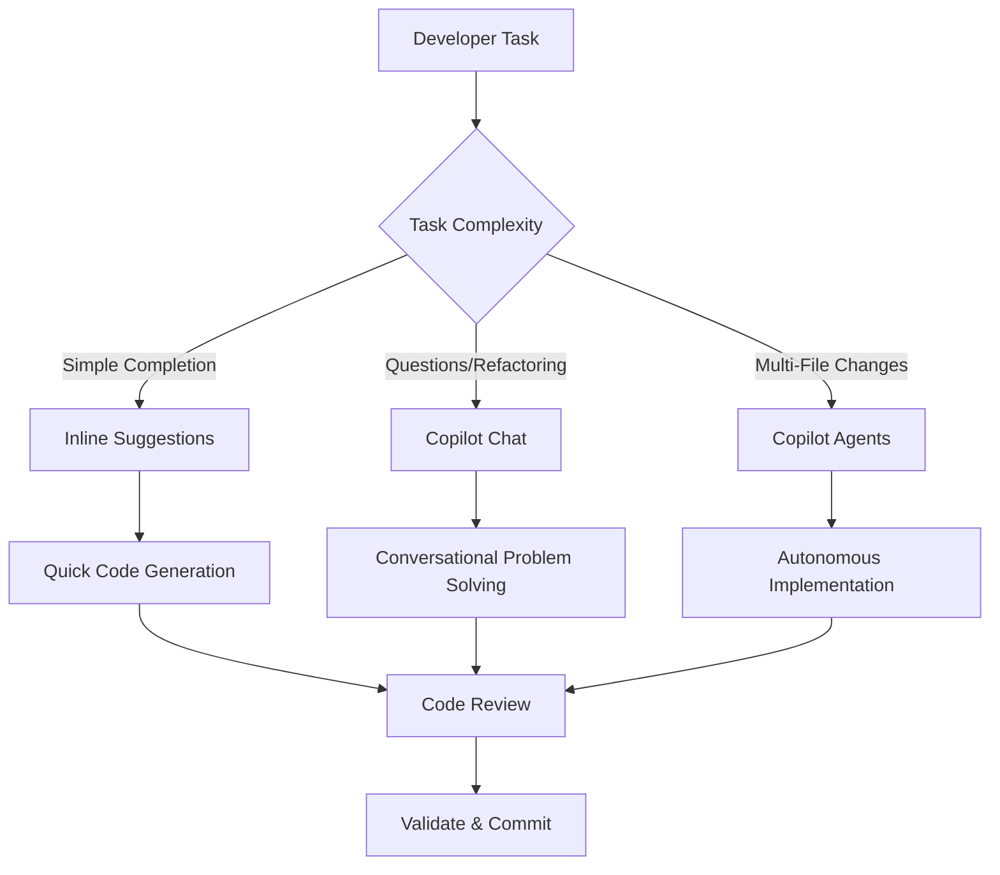

---

## Pre-Flight Checklist: Files & Setup

Before you start leveraging Copilot Chat effectively, ensure these foundational elements are in place:

### Required Files

#### 1. `.instructions.md` (Custom Instructions File)

This is your secret weapon for personalizing Copilot's behavior.  Create this file in your workspace root:

**Location:** `JDKoll1982/MTM_Receiving_Application/.instructions. md`

**Purpose:**

- Define coding standards (naming conventions, architecture patterns)
- Specify preferred libraries and frameworks
- Set testing strategies
- Establish documentation requirements

**How to create:**

- Use VSCode Command Palette:  `Chat: New Instructions File`
- Configure scope (global, workspace, or file-type specific)

#### 2. `.editorconfig`

✅ Already present in your repository.  This ensures consistent code formatting across team members and helps Copilot understand your style preferences.

#### 3. `README.md` and Documentation

✅ You have this.  A well-maintained README helps Copilot understand:

- Project purpose and architecture
- Module organization (Module_Core, Module_Receiving, etc.)
- Dependencies and integrations
- Business logic context

#### 4. `appsettings.json` and Configuration Files

✅ Present in your repo. These provide Copilot with environmental context.

### Recommended Additional Files

#### `.github/copilot-instructions.md`

Team-wide instructions that can be version controlled and shared across all developers working on MTM Receiving Application.

#### `ARCHITECTURE.md` or `DESIGN.md`

Document your modular architecture (Module_Core, Module_Shared, Module_Receiving, etc.) to give Copilot deep architectural awareness.

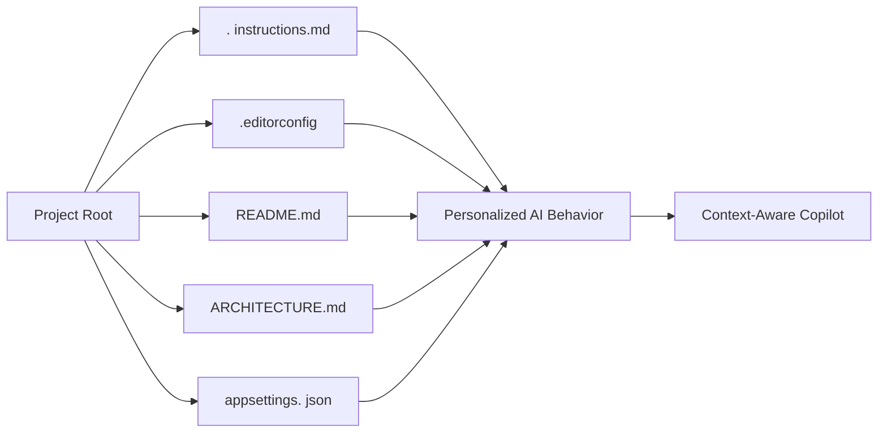

---

## Optimal VSCode Settings Configuration

### Essential Settings for Maximum Performance

Create or update your `.vscode/settings.json`:

**General Copilot Settings:**

| Setting | Value | Purpose |
|---------|-------|---------|
| `github.copilot.enable` | `true` | Master enable switch |
| `github.copilot.editor.enableCodeActions` | `true` | Enable quick fixes and refactoring suggestions |
| `github.copilot.chat.useProjectTemplates` | `true` | Use project-specific context |
| `github.copilot.nextEditSuggestions. enabled` | `true` | Proactive next-step suggestions |

**Chat-Specific Settings:**

| Setting | Value | Purpose |
|---------|-------|---------|
| `github.copilot.chat. localeOverride` | `"en-US"` | Ensure consistent English responses |
| `github.copilot.chat.followUps` | `"always"` | Get contextual follow-up suggestions |
| `github.copilot.chat.terminalChatLocation` | `"quickChat"` | Terminal assistance location |

**Advanced Performance Settings:**

| Setting | Value | Purpose |
|---------|-------|---------|
| `github.copilot.advanced.inlineSuggestCount` | `3` | Multiple suggestion alternatives |
| `github.copilot.advanced.contextLength` | `high` | Larger context window for complex projects |

### Settings Audit Strategy

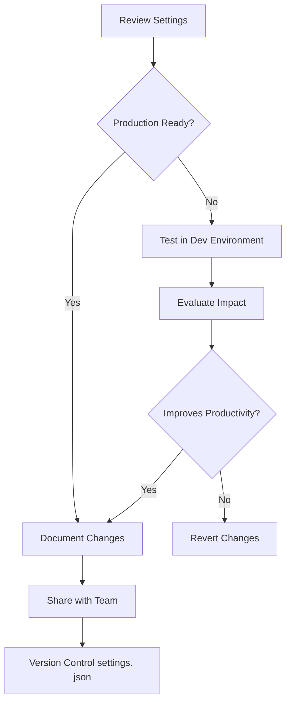

### Workspace vs User Settings

**User Settings** (`settings.json` in user profile):

- Personal preferences
- Model selection defaults
- UI customization

**Workspace Settings** (`.vscode/settings.json` in repository):

- Team coding standards
- Project-specific context
- Shared configurations
- ✅ **Recommended for MTM Receiving Application**

---

## Understanding Copilot Models: When to Use What

GitHub Copilot offers multiple AI models under paid plans.  Each excels in different scenarios.

### Model Comparison Matrix

| Model Type | Best For | Speed | Context Window | Reasoning Depth | Cost Tier |
|------------|----------|-------|----------------|-----------------|-----------|
| **GPT-4o** | Complex architectural decisions, multi-file refactoring | Medium | Very Large | Deep | Premium |
| **GPT-4 Turbo** | Balanced performance, general development tasks | Fast | Large | Moderate | Standard |
| **GPT-3.5 Turbo** | Quick completions, simple queries, boilerplate | Very Fast | Medium | Basic | Basic |
| **Claude 3.5 Sonnet** | Code analysis, security reviews, detailed explanations | Medium | Large | Very Deep | Premium |
| **o1-preview** | Research-level reasoning, algorithm optimization | Slow | Very Large | Exceptional | Enterprise |
| **o1-mini** | Quick reasoning tasks, debugging logic | Fast | Medium | Good | Standard |

### Model Selection Decision Tree

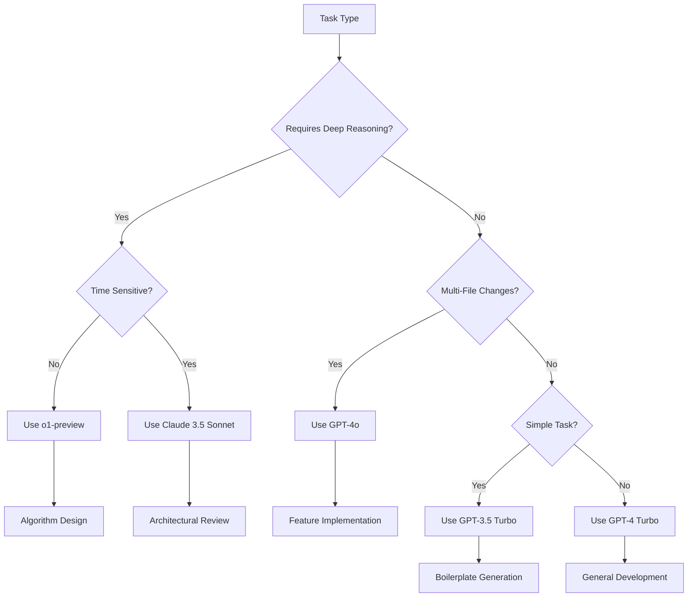

### Scenario-Specific Recommendations for MTM Receiving Application

#### Use **GPT-4o** when

- Refactoring across multiple modules (Module_Core, Module_Receiving, Module_Shared)
- Implementing new features that touch XAML, ViewModels, and database layers
- Converting synchronous database operations to async patterns
- Migrating deprecated APIs or frameworks

#### Use **Claude 3.5 Sonnet** when

- Reviewing SQL injection vulnerabilities in database queries
- Analyzing thread safety in your multi-threaded WPF application
- Explaining complex LINQ queries in your data access layer
- Conducting security audits on authentication mechanisms

#### Use **GPT-4 Turbo** when

- Writing new XAML views for receiving workflows
- Creating ViewModel classes with INotifyPropertyChanged
- Implementing MVVM patterns in new modules
- General day-to-day development tasks

#### Use **GPT-3.5 Turbo** when

- Generating standard CRUD operations
- Creating data transfer objects (DTOs)
- Writing XML documentation comments
- Building simple helper methods

#### Use **o1-preview** when

- Designing optimal database indexing strategies for receiving records
- Optimizing routing algorithms in Module_Routing
- Solving complex performance bottlenecks in report generation
- Architecting new module interactions

#### Use **o1-mini** when

- Debugging WPF binding errors
- Troubleshooting async/await deadlocks
- Understanding why a specific LINQ query isn't working
- Quick logic validation

### Model Switching Strategy

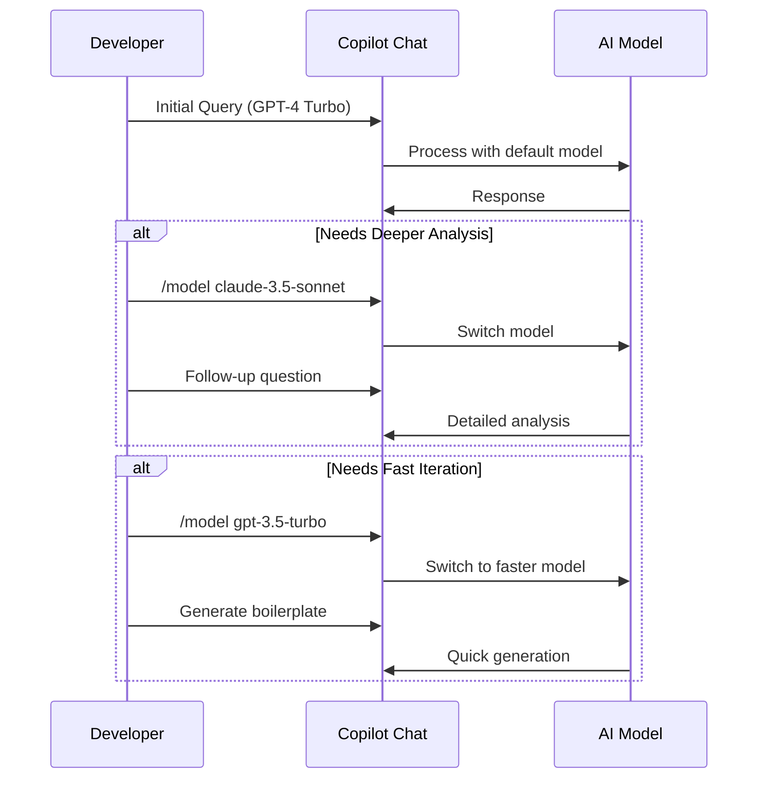

---

## Best Practices for Effective Prompting

### The SPECIFIC Framework

**S**pecific - Be precise about what you want  
**P**rovide context - Include relevant code or scenarios  
**E**xamples - Show input/output expectations  
**C**onstraints - Define limitations or requirements  
**I**ntent - Explain the "why" behind your request  
**F**ormat - Specify desired output format  
**I**terate - Refine based on responses  
**C**ompare - Request alternatives or trade-offs

### Prompt Engineering Techniques

#### ❌ Bad Prompt

"Fix this code"

#### ✅ Good Prompt

"I have a WPF DataGrid binding that's not updating when the underlying ObservableCollection changes in my ReceivingViewModel. The collection implements INotifyCollectionChanged.  Can you review my XAML binding and ViewModel property implementation and suggest why the UI isn't refreshing?  I'm using MVVM pattern with CommunityToolkit.Mvvm."

### Context Priming Strategies

#### Technique 1: File-Level Context

At the top of your C# files, add strategic comments:

**Before working on ReceivingViewModel. cs:**

Strategic comments help Copilot understand architectural patterns, naming conventions, and business logic without you repeating it in every chat query.

#### Technique 2: Chat Context Attachment

Use Copilot Chat's `#file`, `#selection`, `#editor` references:

**Example Query:**
"Analyze #file:ReceivingViewModel.cs and suggest improvements to the async database operations considering our error handling pattern in #file:Module_Core/Services/DatabaseService.cs"

#### Technique 3: Persona Assignment

"Act as a senior C# architect specializing in WPF MVVM applications with 10+ years of experience. Review my Module_Receiving implementation and suggest architectural improvements following SOLID principles."

### Prompt Templates for Common Tasks

#### Template:  Explaining Unfamiliar Code

"Explain the following code from #selection in simple terms:

- What is its purpose?
- How does it integrate with the rest of the module?
- Are there any potential issues or anti-patterns?
- What dependencies does it have?"

#### Template: Refactoring Request

"Refactor the selected method in #file:[filename] to:

- Follow async/await best practices
- Implement proper error handling with try-catch-finally
- Add XML documentation comments
- Ensure thread safety for WPF UI updates
- Maintain compatibility with . NET 8.0"

#### Template: Test Generation

"Generate comprehensive unit tests for #selection using xUnit framework:

- Test happy path scenarios
- Test edge cases (null inputs, empty collections)
- Test exception scenarios
- Use FluentAssertions for readable assertions
- Include test data builders where appropriate"

#### Template: Feature Implementation

"I need to implement a new feature in Module_Receiving:

**Feature:** Barcode scanning for incoming shipments

**Requirements:**

- Integrate with existing barcode scanner hardware (USB HID)
- Validate barcodes against database
- Update UI in real-time as items are scanned
- Support batch scanning mode
- Log all scan events

**Constraints:**

- Must follow MVVM pattern
- Use existing DatabaseService in Module_Core
- Maintain consistency with current UX patterns
- Performance:  handle 100+ scans per minute

Please provide:

1. High-level architecture approach
2. Required ViewModels and Views
3. Service layer modifications
4. Database schema considerations"

### Question Sequencing Strategy

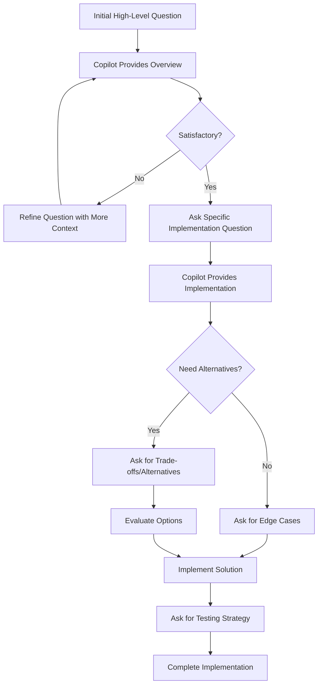

---

## Things to Avoid

### Critical Don'ts

#### ❌ Don't:  Trust Copilot Blindly

**Why:** AI can generate plausible-looking but incorrect code, introduce security vulnerabilities, or use deprecated APIs.

**Do Instead:** Always review, test, and validate Copilot's suggestions before committing.

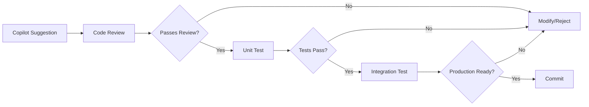

#### ❌ Don't: Use Copilot for Security-Critical Code Without Review

**Why:** AI may not understand your specific security requirements or compliance standards.

**Examples in MTM Receiving Application:**

- Database connection string handling
- User authentication and authorization
- Encryption implementations
- SQL injection prevention

**Do Instead:** Use Copilot to generate initial implementations, then have security experts review.

#### ❌ Don't:  Ignore Warning Signs

**Red Flags:**

- Copilot suggests deprecated APIs without migration notes
- Generated code has obvious logic errors
- Suggestions don't follow your project's established patterns
- Performance anti-patterns (N+1 queries, blocking UI thread)

#### ❌ Don't:  Rely on Copilot for Business Logic Understanding

**Why:** Copilot doesn't understand your specific business requirements, domain knowledge, or organizational context.

**Example Scenario:**
"Generate receiving validation logic" - Copilot won't know your specific receiving rules (e.g., reject shipments after 5 PM, special handling for Volvo parts in Module_Volvo)

**Do Instead:** Provide explicit business rules in your prompts or reference documentation.

#### ❌ Don't: Skip Manual Code Review Steps

**Why:** Copilot-generated code still requires peer review, especially for:

- Architecture decisions
- Performance implications
- Maintainability concerns
- Team coding standards compliance

#### ❌ Don't: Use Copilot as a Learning Replacement

**Why:** Over-reliance prevents skill development and understanding.

**Do Instead:** Use Copilot to accelerate learning:

- Ask it to explain code concepts
- Request step-by-step tutorials
- Generate example implementations you can study

#### ❌ Don't:  Ignore Context Limits

**Why:** Copilot can only process a limited amount of context per query.

**Problem:** Sending entire large files and asking vague questions leads to poor results.

**Do Instead:**

- Use `#selection` for targeted code review
- Break complex queries into smaller, focused questions
- Reference specific methods or classes

#### ❌ Don't:  Forget to Iterate

**Why:** First suggestions are rarely perfect.

**Do Instead:** Treat Copilot Chat as a conversation:

1. Initial query
2. Review response
3. Ask follow-up clarifying questions
4. Request modifications
5. Compare alternatives

### Anti-Patterns to Avoid

#### Anti-Pattern 1: Vague One-Word Queries

**Bad:** "optimize"

**Good:** "Optimize the LoadReceivingRecords method in ReceivingService.cs to handle 10,000+ records efficiently.  Current implementation loads all records into memory.  Consider pagination, async streaming, or database-side filtering."

#### Anti-Pattern 2: Copy-Paste Without Understanding

**Consequence:** Accumulates technical debt, introduces bugs, creates unmaintainable code.

**Solution:** Always ask Copilot to explain generated code before using it.

#### Anti-Pattern 3: Using Wrong Model for Task

**Example:** Using GPT-3. 5 Turbo for complex architectural decisions results in superficial recommendations.

**Solution:** Reference the Model Selection Decision Tree above.

#### Anti-Pattern 4: Not Providing Error Context

**Bad:** "This doesn't work, fix it."

**Good:** "I'm getting a NullReferenceException at line 47 in ReceivingViewModel.cs when the DataGrid is first loaded. The error occurs when binding to the ReceivingItems collection. Here's the stack trace: [paste stack trace].  Can you help diagnose the issue?"

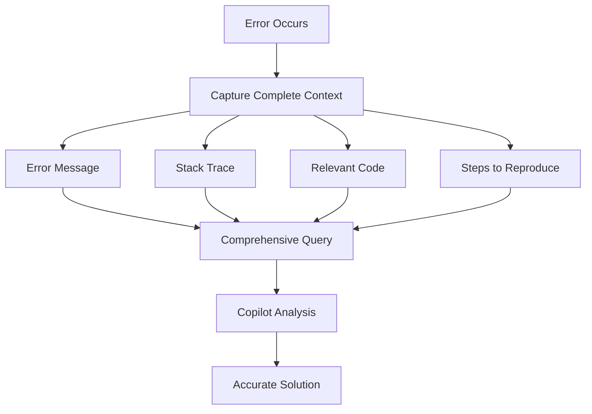

---

## Real-World Examples Using MTM Receiving Application

### Example 1: Understanding Module Architecture

**Scenario:** You need to understand how Module_Receiving interacts with Module_Core.

**Optimal Prompt:**

"I'm working on the MTM_Receiving_Application which uses a modular architecture with separate modules (Module_Core, Module_Receiving, Module_Shared, etc.). I need to understand:

1. How does Module_Receiving communicate with Module_Core for database operations?
2. What is the dependency flow between these modules?
3. Are there any architectural patterns being used (e.g., dependency injection, repository pattern)?
4. Where should I add a new service that both modules need to access?

Please analyze #file:Module_Core and #file:Module_Receiving to answer these questions."

**Model Recommendation:** GPT-4o or Claude 3.5 Sonnet (architectural analysis)

**Expected Outcome:**

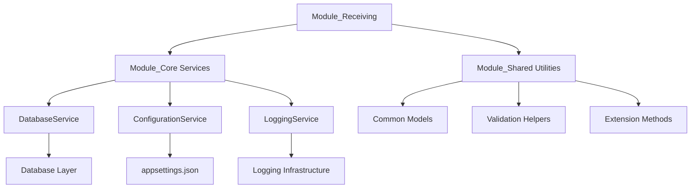

### Example 2: Implementing Async Database Operations

**Scenario:** Your DatabaseService in Module_Core uses synchronous operations, causing UI freezing during large data loads.

**Optimal Prompt:**

"The DatabaseService. cs in Module_Core currently uses synchronous ADO.NET operations which blocks the WPF UI thread during large receiving record queries. I need to:

1. Convert the LoadReceivingRecords method to async/await pattern
2. Ensure proper connection disposal
3. Handle cancellation tokens for long-running queries
4. Update calling code in ReceivingViewModel to use async commands
5. Maintain backward compatibility with existing synchronous callers

Current method signature:
LoadReceivingRecords(DateTime startDate, DateTime endDate) → List<ReceivingRecord>

Please provide:

- Refactored async method implementation
- Example of async command implementation in ViewModel
- Error handling best practices
- Testing approach"

**Model Recommendation:** GPT-4 Turbo (balanced complexity and speed)

### Example 3: Adding New Barcode Scanning Feature

**Scenario:** You need to add barcode scanning capability to the receiving workflow.

**Optimal Prompt:**

"I need to implement barcode scanning in the MTM Receiving Application's Module_Receiving.

**Context:**

- WPF application using MVVM pattern
- Targeting . NET 8.0
- Using CommunityToolkit.Mvvm for ViewModels
- Existing database schema in Database folder
- Hardware:  USB HID barcode scanner (keyboard wedge mode)

**Requirements:**

- Capture barcode input in the receiving screen
- Validate barcode against database (Parts table)
- Display scanned item details in real-time
- Support continuous scanning mode (scan multiple items)
- Provide visual/audio feedback for valid/invalid scans
- Log all scan attempts

**Integration Points:**

- Must use existing DatabaseService in Module_Core
- Follow UI patterns from MainWindow. xaml
- Integrate with existing ReceivingViewModel

Please provide:

1. High-level architecture approach (no code, just strategy)
2. Required ViewModel modifications
3. XAML View structure recommendations
4. Service layer design
5. Database query strategy
6. Error handling approach"

**Model Recommendation:** GPT-4o (multi-file, cross-module implementation)

**Expected Architecture Response:**

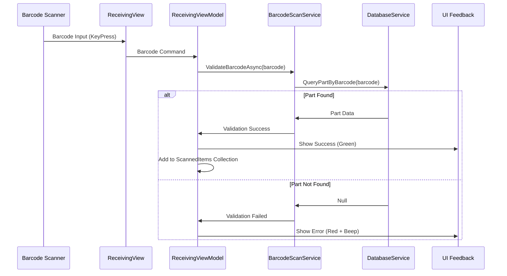

### Example 4: Debugging WPF Binding Issues

**Scenario:** DataGrid in receiving screen isn't updating when new items are added.

**Optimal Prompt:**

"I have a WPF binding issue in Module_Receiving. The DataGrid showing received items doesn't update when I add new items to the collection.

**Symptoms:**

- Initial data loads correctly
- Adding items to collection doesn't update UI
- No binding errors in Output window
- Manual refresh works

**Code Context:**
ViewModel property:
public ObservableCollection<ReceivingItem> ReceivingItems { get; set; }

XAML binding:
<DataGrid ItemsSource="{Binding ReceivingItems}" />

Add operation:
ReceivingItems.Add(newItem);

**Environment:**

- . NET 8.0 WPF
- CommunityToolkit.Mvvm
- UI thread operations

What could be causing this and how do I fix it?"

**Model Recommendation:** o1-mini (debugging logic, quick reasoning)

### Example 5: Optimizing Report Generation

**Scenario:** Module_Reporting generates large Excel reports slowly.

**Optimal Prompt:**

"The Report Generation functionality in Module_Reporting is too slow when generating receiving reports with 10,000+ records.

**Current Implementation:**

- Queries all records from database at once
- Iterates through results to build Excel file using ClosedXML
- Blocks UI thread during generation (3-5 minutes)

**Performance Requirements:**

- Handle 50,000+ records
- Complete in under 30 seconds
- Show progress indicator
- Allow cancellation

**Constraints:**

- Must continue using ClosedXML library
- Database is SQL Server
- Cannot change database schema

Please suggest:

1. Query optimization strategies (pagination, streaming)
2. Async/await implementation approach
3. Progress reporting mechanism
4. Memory optimization techniques
5. Cancellation token integration"

**Model Recommendation:** o1-preview (algorithm optimization, performance)

**Expected Response Strategy:**

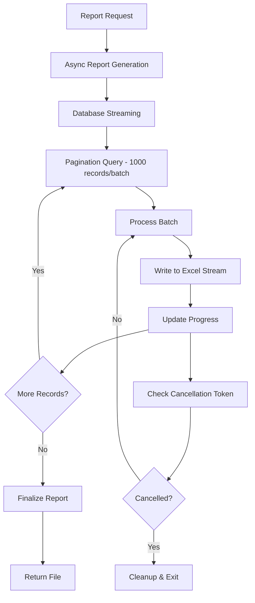

### Example 6: Understanding Legacy Code

**Scenario:** You inherited the project and need to understand the routing algorithm in Module_Routing.

**Optimal Prompt:**

"I'm new to the MTM_Receiving_Application codebase.  I need to understand the routing logic in Module_Routing that determines where received items should be stored.

Can you:

1. Explain the high-level algorithm and business logic
2. Identify key decision points and rules
3. Map out the flow from receiving to warehouse location assignment
4. Highlight any potential issues or technical debt
5. Suggest areas for improvement

Please analyze the relevant files in #file:Module_Routing and explain in simple terms with visual diagrams where helpful."

**Model Recommendation:** Claude 3.5 Sonnet (code analysis and explanation)

### Example 7: Implementing Settings Persistence

**Scenario:** Module_Settings needs to save user preferences to appsettings.json.

**Optimal Prompt:**

"I need to implement user settings persistence in Module_Settings for the MTM Receiving Application.

**Requirements:**

- Read from existing appsettings.json (#file:appsettings.json)
- Allow runtime modifications by users
- Save changes back to appsettings.json
- Support settings categories (UI preferences, database settings, hardware config)
- Provide default values for missing settings
- Validate settings before saving
- Thread-safe access

**Architecture:**

- Create SettingsService in Module_Core
- Expose via dependency injection
- Use IConfiguration from Microsoft.Extensions.Configuration
- Follow repository pattern

Please outline:

1. Service architecture (no code)
2. Configuration structure recommendations
3. Validation strategy
4. Error handling approach
5. Integration with existing DI container"

**Model Recommendation:** GPT-4 Turbo

---

## Advanced Workflow Patterns

### Pattern 1: Iterative Refinement Loop

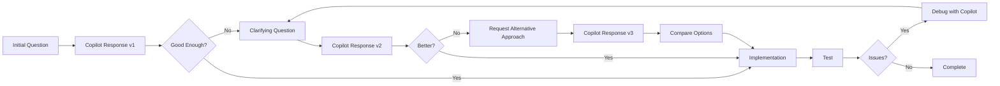

### Pattern 2: Context Building Strategy

**Phase 1: Establish Context**
"I'm working on a WPF MVVM application for warehouse receiving. We use modular architecture with separate assemblies for Core, Receiving, Reporting, etc."

**Phase 2: Add Specifics**
"The Receiving module handles barcode scanning and database operations. We use SQL Server with Entity Framework Core."

**Phase 3: Targeted Question**
"Given this context, how should I implement real-time validation of scanned barcodes against the database without blocking the UI?"

### Pattern 3: Explain-Then-Implement

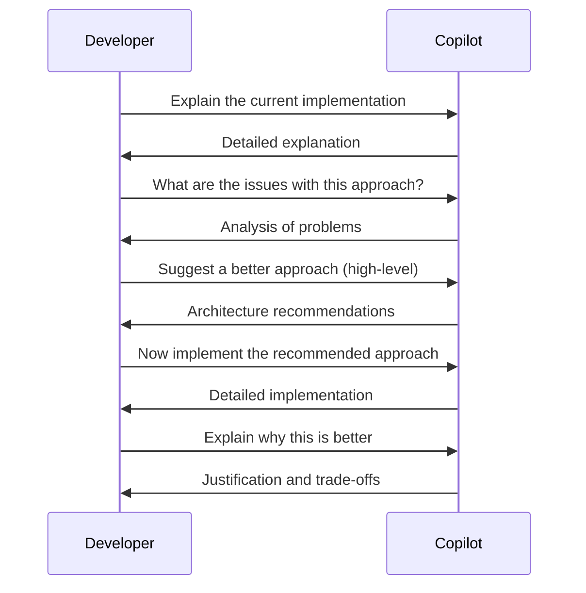

### Pattern 4: Compare and Contrast

"I'm considering two approaches for implementing async database operations in the MTM Receiving Application:

**Approach A:** Use async/await with Task-based patterns
**Approach B:** Use BackgroundWorker for backward compatibility

Please compare these approaches considering:

- WPF UI responsiveness
- Error handling complexity
- Testability
- Maintainability
- Performance
- Learning curve for team

Which would you recommend and why?"

### Pattern 5: Test-Driven Development with Copilot

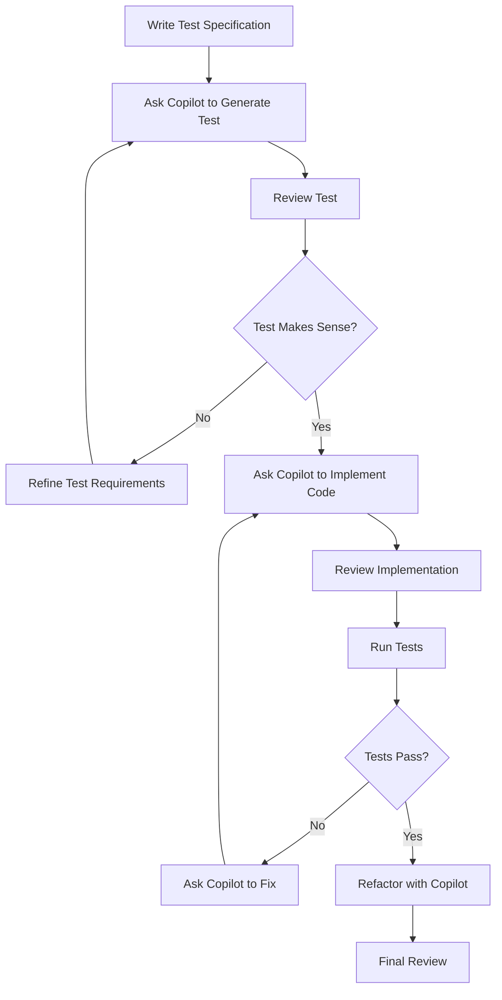

### Pattern 6: Documentation-Driven Development

1. **Write documentation first** (feature spec, API docs, architecture diagrams)
2. **Share with Copilot** for validation and suggestions
3. **Request implementation** based on approved documentation
4. **Generate tests** from documentation specifications
5. **Update documentation** as implementation evolves

---

## Measuring Success

### Key Performance Indicators (KPIs)

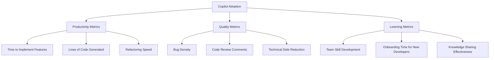

### Measurement Framework

#### Week 1-2: Baseline Measurement

- Track time spent on typical tasks WITHOUT Copilot
- Count code review cycles needed
- Measure bug discovery rate

#### Week 3-4: Copilot Integration

- Same tasks WITH Copilot
- Track acceptance rate of Copilot suggestions
- Monitor time saved vs time spent reviewing AI code

#### Week 5+: Optimization

- Refine prompting strategies
- Adjust model selection based on task types
- Measure improvement trends

### Success Metrics for MTM Receiving Application

| Metric | Baseline (Before Copilot) | Target (With Copilot) | Measurement Method |
|--------|---------------------------|----------------------|-------------------|
| Feature Implementation Time | 5 days | 3 days | Sprint tracking |
| Code Review Cycles | 2-3 rounds | 1-2 rounds | PR metrics |
| Unit Test Coverage | 45% | 70% | Coverage reports |
| Bug Density (bugs/KLOC) | 12 | <8 | Bug tracking |
| Onboarding Time (new devs) | 3 weeks | 1. 5 weeks | HR tracking |
| Documentation Completeness | 60% | 90% | Audit |

### Continuous Improvement Cycle

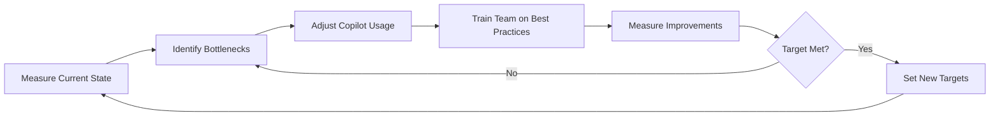

---

## Conclusion

Maximizing GitHub Copilot Chat in VSCode is not about replacing developer expertise—it's about augmenting human creativity and productivity. For your MTM Receiving Application:

✅ **Set up foundational files** (. instructions.md, architecture docs)  
✅ **Configure optimal settings** for your workflow  
✅ **Choose the right model** for each task  
✅ **Master prompt engineering** with the SPECIFIC framework  
✅ **Avoid common pitfalls** and anti-patterns  
✅ **Measure and iterate** on your Copilot integration  

Remember: **Copilot is a tool, not a replacement for thinking.** The most successful developers use it to accelerate the mechanical aspects of coding while focusing their expertise on architecture, design, and problem-solving.

---

## Additional Resources

- [Official GitHub Copilot Documentation](https://docs.github.com/en/copilot)
- [VSCode Copilot Tips and Tricks](https://code.visualstudio.com/docs/copilot/copilot-tips-and-tricks)
- [Prompt Engineering Guide](https://github.blog/developer-skills/github/how-to-use-github-copilot-in-your-ide-tips-tricks-and-best-practices/)
- [Best Practices for Using GitHub Copilot](https://docs.github.com/en/copilot/get-started/best-practices)

---

**Document Version:** 1.0  
**Last Updated:** 2026-01-11  
**Author:** Generated for MTM_Receiving_Application by GitHub Copilot  
**Target Audience:** Development team working on C# WPF applications
