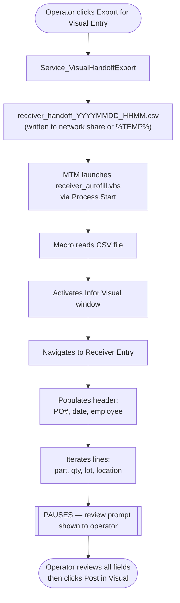

# Approach 2 — Infor Visual Built-in Macro (VBScript)

**Last Updated: 2026-03-08**  
**Status: Recommended for Prototype**  
**Complexity: Medium**  
**Estimated Effort: 1–2 weeks**

---

## Overview

Infor Visual ships with a built-in macro scripting engine that can automate its own windows. Macro scripts are written in VBScript and execute within the Visual process context, giving them direct programmatic access to Visual's form objects — fields, grids, dropdowns, and buttons.

> **Constraint**: All data entry still passes through Infor Visual's UI. The macro only drives the keyboard/mouse actions a human would perform. No data bypasses Visual's business rule layer. No writes to `MTMFG` SQL Server occur outside Visual.

### Precedent at MTM

This approach is not speculative. `docs/InforVisual/TransactionsMacro.txt` is an existing VBScript HTA that:
- Opens an `ADODB.Connection` to `MTMFG`
- Executes SQL against `INVENTORY_TRANS`
- Renders results in an HTML table

The infrastructure — VBScript runtime, `ADODB`, user credentials, network access to Visual's server — already exists on production workstations. This approach extends **a pattern already proven at MTM**.

---

## How It Works



---

## Data Mapping

The following `Model_ReceivingLoad` fields map directly to Infor Visual Receiver Entry:

| MTM Field | Visual Field | Entry Location |
|---|---|---|
| `PONumber` | PO Number | Header |
| `ReceivedDate` | Received Date | Header |
| `EmployeeNumber` | User / Employee | Header |
| `POLineNumber` | Line No | Grid row |
| `PartID` | Part ID | Grid row |
| `WeightQuantity` | Received Qty | Grid row |
| `HeatLotNumber` | Lot / Heat Number | Grid row |
| `InitialLocation` | Warehouse / Location | Grid row |

---

## What Would Be Built

### 1. MTM App — Export Service

```
Module_Receiving/
  Contracts/
    IService_VisualHandoffExport.cs
  Services/
    Service_VisualHandoffExport.cs
  ViewModels/
    ViewModel_Receiving_VisualHandoff.cs        (button + status)
  Views/
    View_Receiving_VisualHandoff.xaml
```

**`Service_VisualHandoffExport.cs`** — generates the handoff file:

```csharp
public interface IService_VisualHandoffExport
{
    Task<Model_Dao_Result<string>> ExportHandoffFileAsync(
        List<Model_ReceivingLoad> loads,
        string outputDirectory);
}
```

The output CSV format (one row per PO line):

```
PONumber,LineNo,PartID,ReceivedQty,LotHeatNumber,Warehouse,Location,ReceivedDate,EmployeeNumber
067101,1,PART-A100,250,HEAT-2026-001,MAIN,A-01,2026-03-08,1042
067101,2,PART-B200,100,HEAT-2026-002,MAIN,A-02,2026-03-08,1042
```

**Launch the macro from the ViewModel:**

```csharp
[RelayCommand]
private async Task LaunchVisualMacroAsync()
{
    if (IsBusy) return;
    try
    {
        IsBusy = true;
        StatusMessage = "Exporting handoff file...";

        var outputDir = _settings.VisualHandoffDirectory; // from appsettings
        var exportResult = await _handoffExport.ExportHandoffFileAsync(CurrentLoads, outputDir);

        if (!exportResult.IsSuccess)
        {
            _errorHandler.ShowUserError(exportResult.ErrorMessage, "Export Failed", nameof(LaunchVisualMacroAsync));
            return;
        }

        var macroPath = _settings.VisualMacroPath; // path to receiver_autofill.vbs
        Process.Start(new ProcessStartInfo
        {
            FileName = "wscript.exe",
            Arguments = $"\"{macroPath}\" \"{exportResult.Data}\"",
            UseShellExecute = true
        });

        StatusMessage = "Visual macro launched. Review fields in Visual before posting.";
    }
    catch (Exception ex)
    {
        _errorHandler.HandleException(ex, Enum_ErrorSeverity.Medium, nameof(LaunchVisualMacroAsync), nameof(ViewModel_Receiving_VisualHandoff));
    }
    finally
    {
        IsBusy = false;
    }
}
```

---

### 2. VBScript Macro — `receiver_autofill.vbs`

Stored at: `docs/InforVisual/Macros/receiver_autofill.vbs`

```vbscript
' receiver_autofill.vbs
' Reads MTM handoff CSV and populates Infor Visual Receiver Entry
' The operator MUST review all fields before clicking Post.
'
' Usage: wscript.exe receiver_autofill.vbs <path_to_handoff_csv>

Option Explicit

Dim fso, csvPath, csvFile, line, fields
Dim shell, wshell

csvPath = WScript.Arguments(0)

Set fso = CreateObject("Scripting.FileSystemObject")
If Not fso.FileExists(csvPath) Then
    MsgBox "Handoff file not found: " & csvPath, vbExclamation
    WScript.Quit 1
End If

Set shell = CreateObject("WScript.Shell")

' Activate Infor Visual (confirm exact window title from production)
shell.AppActivate "VISUAL"
WScript.Sleep 500

If Not AppIsActive("VISUAL") Then
    MsgBox "Infor Visual is not open. Please open Visual and navigate to Receiver Entry before running this macro.", vbExclamation
    WScript.Quit 1
End If

' Navigate to Receiver Entry
' TODO: Map exact keystrokes for your Visual menu path
' e.g., Alt+R, then R for Receiving, then E for Receiver Entry
shell.SendKeys "%r"   ' Alt+R (example - confirm menu shortcuts)
WScript.Sleep 300
shell.SendKeys "e"
WScript.Sleep 800

' Read the CSV and populate fields
Set csvFile = fso.OpenTextFile(csvPath, 1)
csvFile.ReadLine ' Skip header row

Dim firstLine : firstLine = True
Dim currentPO : currentPO = ""

Do While Not csvFile.AtEndOfStream
    line = csvFile.ReadLine
    fields = Split(line, ",")

    Dim poNumber    : poNumber    = Trim(fields(0))
    Dim lineNo      : lineNo      = Trim(fields(1))
    Dim partID      : partID      = Trim(fields(2))
    Dim receivedQty : receivedQty = Trim(fields(3))
    Dim lotHeat     : lotHeat     = Trim(fields(4))
    Dim warehouse   : warehouse   = Trim(fields(5))
    Dim location    : location    = Trim(fields(6))
    Dim rcvDate     : rcvDate     = Trim(fields(7))
    Dim empNum      : empNum      = Trim(fields(8))

    ' Populate header only once per PO
    If firstLine Then
        ' PO Number field (confirm Tab order / control name)
        ' TODO: Replace SendKeys with ControlSetText if AutomationId is known
        shell.SendKeys poNumber
        shell.SendKeys "{TAB}"
        WScript.Sleep 300
        shell.SendKeys rcvDate
        shell.SendKeys "{TAB}"
        WScript.Sleep 200
        firstLine = False
        currentPO = poNumber
    End If

    ' TODO: Populate grid row for this PO line
    ' Each line: partID, receivedQty, lotHeat, location
    shell.SendKeys partID
    shell.SendKeys "{TAB}"
    WScript.Sleep 200
    shell.SendKeys receivedQty
    shell.SendKeys "{TAB}"
    WScript.Sleep 200
    shell.SendKeys lotHeat
    shell.SendKeys "{TAB}"
    WScript.Sleep 200
    shell.SendKeys location
    shell.SendKeys "{ENTER}"
    WScript.Sleep 300
Loop

csvFile.Close

MsgBox "All lines have been populated. Please REVIEW all fields carefully in Visual before clicking Post.", vbInformation, "MTM Auto-Fill Complete"
```

> ⚠️ **The `SendKeys` control names and menu keystrokes above are placeholders.** The production version requires that an operator with Visual access inspect the exact tab order, menu shortcuts, and field names in the Receiver Entry screen. See Open Questions below.

---

## Pros

| | |
|---|---|
| ✅ | Uses Visual's own processing engine — all business rules, GL entries, inventory updates, and trigger chains fire normally |
| ✅ | User sees every field populated in Visual before posting — full visual review |
| ✅ | No external automation framework beyond VBScript — already on every Windows machine |
| ✅ | Directly extends the `TransactionsMacro.txt` pattern already in use at MTM |
| ✅ | Low dependency — only requires a file share or `%TEMP%` folder |
| ✅ | Non-destructive by design — the macro fills fields and pauses; the operator posts manually |
| ✅ | The generated handoff file serves as a session audit record |

## Cons

| | |
|---|---|
| ❌ | Fragile — macro must know Visual's exact control names and tab order; these may change between Visual patches |
| ❌ | Visual must be open and navigated to (or near) Receiver Entry when the macro runs |
| ❌ | SendKeys-based field population can fail silently if focus shifts |
| ❌ | VBScript error handling is limited — failures may leave the screen in a partial state |
| ❌ | Visual's macro security settings must permit script execution |
| ❌ | Visual's Receiver Entry grid (PO lines) may use a non-standard control that SendKeys cannot drive reliably |
| ❌ | Single-instance — one macro runs per session; cannot be parallelized across users |

---

## Open Questions

| # | Question | Required Before |
|---|---|---|
| 1 | What is the exact menu path in Visual to reach Receiver Entry? (keyboard shortcut or top menu) | Macro development |
| 2 | What is the tab/field order within the Receiver Entry header and grid? | Macro development |
| 3 | What is the exact window title string for `AppActivate`? | Macro development |
| 4 | Does Visual's macro security policy on production workstations allow `wscript.exe` to run `.vbs` files? | IT |
| 5 | Can the Receiver Entry grid rows be driven line-by-line with `SendKeys`, or does it require specific VBA object model calls via Visual's macro host? | Developer (test in sandbox) |

---

## Security Considerations

- The handoff CSV file contains PO numbers, part numbers, and quantities. Write it to a user-owned temp path (`%TEMP%`) or a secured share, not a public network location.
- The macro is read-only with respect to `MTMFG`. It cannot write to the database because it sends keystrokes to the Visual UI — it has no database connection of its own.
- The existing `TransactionsMacro.txt` prompts for credentials at runtime via `InputBox`. If the receiver macro needs to query Visual for validation (e.g., verifying the PO is open), it should follow the same credential prompt pattern rather than embedding credentials.

---

## Related Files

| File | Purpose |
|---|---|
| [docs/InforVisual/TransactionsMacro.txt](../TransactionsMacro.txt) | Existing VBScript HTA — direct implementation precedent |
| [Module_Receiving/Models/Model_ReceivingLoad.cs](../../../Module_Receiving/Models/Model_ReceivingLoad.cs) | Source data model |
| [Module_Receiving/Documentation/AI-Handoff/Guardrails.md](../../../Module_Receiving/Documentation/AI-Handoff/Guardrails.md) | No-write-to-SQL-Server constraint |
| [docs/InforVisual/Integration/Approach_5_EDI_Import.md](Approach_5_EDI_Import.md) | Alternative: file-based import |
| [docs/InforVisual/Integration/Approach_6_Infor_ION.md](Approach_6_Infor_ION.md) | Alternative: API-based integration |
