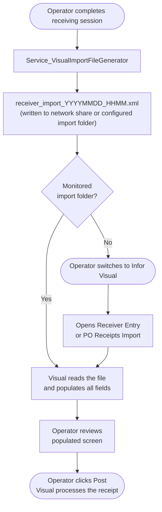

# Approach 5 — EDI / XML Import File

**Last Updated: 2026-03-08**  
**Status: Deferred — Prerequisites Not Yet Met**  
**Complexity: High**  
**Estimated Effort: 4–8 weeks (after prerequisites resolved)**

---

## Overview

Infor Visual supports batch import of purchase receipts through its **transaction import facility**. The application can accept structured data files — typically Infor's proprietary delimited text format or XML — that represent one or more receiver transactions. When imported, Visual processes the data through its full application business layer: inventory updates, GL journal preparation, AP accrual, costing, and `INVENTORY_TRANS` record creation all occur normally.

> **Constraint**: All data enters through Visual's import processor. No data bypasses Visual's business rule layer. No writes to `MTMFG` SQL Server occur outside Visual's own process.

This is substantively different from Approaches 2 and 3: rather than automating the **screen**, the MTM app generates a **file in a format Visual was designed to consume** and the import facility within Visual does the rest.

---

## How It Works



If Visual is configured with a **monitored import folder**, the operator step of selecting the file may be eliminated entirely — Visual picks it up automatically.

---

## Data Mapping

| MTM Field | Visual Import Field | Notes |
|---|---|---|
| `PONumber` | `PURC_ORDER_ID` | Required — matches `PURCHASE_ORDER.ID` in MTMFG |
| `POLineNumber` | `LINE_NO` | Required — matches `PURC_ORDER_LINE.LINE_NO` |
| `PartID` | `PART_ID` | Required |
| `WeightQuantity` | `RECEIVED_QTY` | Required |
| `HeatLotNumber` | `LOT_ID` / `HEAT_ID` | Optional per Visual config |
| `ReceivedDate` | `RECEIVED_DATE` | Header-level field |
| `InitialLocation` | `WAREHOUSE_ID` / `LOCATION_ID` | Optional per Visual config |
| `EmployeeNumber` | `USER_ID` | Header-level field |

> ⚠️ The exact field names, format, and required vs. optional status must be confirmed against Infor Visual 9.0.8's import specification. The names above are derived from the `MTMFG_Schema_Tables.csv` `RECEIVER` and `RECEIVER_LINE` table columns and are a reasonable starting hypothesis, not a confirmed specification.

---

## Import File Format — What Is Known

Infor Visual's import facility for purchase receipts is documented in the **Infor VISUAL Transaction Import Guide**, which is available from Infor's support portal (Docs.infor.com) under the Visual 9.x documentation set. The guide describes:

- **Flat file (delimited)**: Fixed column order, pipe- or comma-delimited, one record per receiver line
- **XML**: Hierarchical, header + line structure, schema defined in Visual's import XSD files

The precise format supported depends on the Visual version and which import modules are licensed. **This must be confirmed before implementation begins.**

A flat-file receiver import record typically follows this structure (example — confirm against documentation):

```
H|RECEIVER_ID|PURC_ORDER_ID|RECEIVED_DATE|USER_ID|SITE_ID
L|LINE_NO|PART_ID|RECEIVED_QTY|WAREHOUSE_ID|LOCATION_ID|LOT_ID
```

An XML structure (example — confirm against XSD):

```xml
<Receivers>
  <Receiver>
    <PurchaseOrderID>067101</PurchaseOrderID>
    <ReceivedDate>2026-03-08</ReceivedDate>
    <UserID>JKOLL</UserID>
    <SiteID>002</SiteID>
    <Lines>
      <Line>
        <LineNo>1</LineNo>
        <PartID>PART-A100</PartID>
        <ReceivedQty>250</ReceivedQty>
        <WarehouseID>MAIN</WarehouseID>
        <LocationID>A-01</LocationID>
        <LotID>HEAT-2026-001</LotID>
      </Line>
    </Lines>
  </Receiver>
</Receivers>
```

---

## What Would Be Built

### 1. MTM App — Import File Generator Service

```
Module_Receiving/
  Contracts/
    IService_VisualImportFileGenerator.cs
  Services/
    Service_VisualImportFileGenerator.cs
  ViewModels/
    ViewModel_Receiving_VisualHandoff.cs        (export button + status)
  Views/
    View_Receiving_VisualHandoff.xaml
```

**`IService_VisualImportFileGenerator.cs`**:

```csharp
public interface IService_VisualImportFileGenerator
{
    /// <summary>
    /// Generates an Infor Visual-compatible receiver import file
    /// from a completed MTM receiving session.
    /// </summary>
    /// <param name="loads">Loads from the completed receiving session.</param>
    /// <param name="outputDirectory">Directory to write the import file.</param>
    /// <returns>Full path to the generated file, or failure result.</returns>
    Task<Model_Dao_Result<string>> GenerateImportFileAsync(
        List<Model_ReceivingLoad> loads,
        string outputDirectory);
}
```

**`Service_VisualImportFileGenerator.cs`** (structure, pending confirmed format):

```csharp
public class Service_VisualImportFileGenerator : IService_VisualImportFileGenerator
{
    private readonly IService_LoggingUtility _logger;

    public Service_VisualImportFileGenerator(IService_LoggingUtility logger)
    {
        _logger = logger;
    }

    public async Task<Model_Dao_Result<string>> GenerateImportFileAsync(
        List<Model_ReceivingLoad> loads,
        string outputDirectory)
    {
        try
        {
            var fileName = $"receiver_import_{DateTime.Now:yyyyMMdd_HHmm}.xml";
            var fullPath = Path.Combine(outputDirectory, fileName);

            // TODO: Replace with confirmed Infor Visual 9.0.8 import format
            var xml = BuildImportXml(loads);

            await File.WriteAllTextAsync(fullPath, xml);
            _logger.LogInfo($"Visual import file generated: {fullPath}");

            return new Model_Dao_Result<string> { IsSuccess = true, Data = fullPath };
        }
        catch (Exception ex)
        {
            return new Model_Dao_Result<string>
            {
                IsSuccess = false,
                ErrorMessage = $"Failed to generate Visual import file: {ex.Message}",
                Severity = Enum_ErrorSeverity.Error
            };
        }
    }

    private string BuildImportXml(List<Model_ReceivingLoad> loads)
    {
        // Group by PO number to create one Receiver record per PO
        var byPO = loads.GroupBy(l => l.PONumber);

        var sb = new StringBuilder();
        sb.AppendLine("<?xml version=\"1.0\" encoding=\"utf-8\"?>");
        sb.AppendLine("<Receivers>");

        foreach (var poGroup in byPO)
        {
            var first = poGroup.First();
            sb.AppendLine("  <Receiver>");
            sb.AppendLine($"    <PurchaseOrderID>{SecurityElement.Escape(poGroup.Key)}</PurchaseOrderID>");
            sb.AppendLine($"    <ReceivedDate>{first.ReceivedDate:yyyy-MM-dd}</ReceivedDate>");
            sb.AppendLine($"    <UserID>{SecurityElement.Escape(first.UserId ?? string.Empty)}</UserID>");
            sb.AppendLine("    <SiteID>002</SiteID>");
            sb.AppendLine("    <Lines>");

            foreach (var load in poGroup)
            {
                sb.AppendLine("      <Line>");
                sb.AppendLine($"        <LineNo>{load.LoadNumber}</LineNo>");
                sb.AppendLine($"        <PartID>{SecurityElement.Escape(load.PartID)}</PartID>");
                sb.AppendLine($"        <ReceivedQty>{load.WeightQuantity}</ReceivedQty>");
                sb.AppendLine($"        <LotID>{SecurityElement.Escape(load.HeatLotNumber)}</LotID>");
                sb.AppendLine("      </Line>");
            }

            sb.AppendLine("    </Lines>");
            sb.AppendLine("  </Receiver>");
        }

        sb.AppendLine("</Receivers>");
        return sb.ToString();
    }
}
```

### 2. Settings

Add to `appsettings.json`:

```json
{
  "VisualIntegration": {
    "ImportFileOutputDirectory": "\\\\fileserver\\visual-import\\receiving",
    "ImportFileFormat": "XML"
  }
}
```

---

## Pros

| | |
|---|---|
| ✅ | Officially supported integration path in Infor Visual — designed for exactly this use case |
| ✅ | Does not bypass any business rules — Visual processes the import through its full application layer |
| ✅ | Batch-friendly — handles 1 line or 100 lines with equal reliability |
| ✅ | No fragile UI control mapping — data goes through a defined file schema, not screen automation |
| ✅ | Supports unattended operation if Visual's monitored import folder is configured |
| ✅ | The generated file is a natural audit artifact — MTM can archive it as proof of what was submitted |
| ✅ | No VBScript or external runtime dependencies on workstations |

## Cons

| | |
|---|---|
| ❌ | **Infor's import file format for Receivers must be confirmed** against Visual 9.0.8 — this requires accessing Infor's documentation portal and may require a support contract |
| ❌ | Requires configuration inside Visual to enable and map the import facility — may require Infor partner or support involvement |
| ❌ | Error reporting is limited — import failures often produce generic log messages rather than field-level feedback |
| ❌ | If the monitored folder is not configured, the operator must still trigger the import step manually within Visual |
| ❌ | Schema differences between Visual versions mean the generated file must be regression-tested after any Visual patch or upgrade |
| ❌ | Visual's import facility may not accept partial receivers (lines without all optional fields) — requires careful testing |

---

## Prerequisites — Must Be Resolved Before Implementation

| # | Prerequisite | How to Resolve |
|---|---|---|
| 1 | **Obtain Infor Visual 9.0.8 Transaction Import Guide** | Log into `docs.infor.com` → Infor VISUAL 9.0 → Integration → Transaction Import. May require Infor support contract. |
| 2 | **Confirm receiver import is licensed and enabled in the MTM Visual installation** | Ask IT or Infor account manager whether the import facility for Purchase Receipts is active |
| 3 | **Determine supported format** (XML vs. delimited) | From the documentation or by asking the Infor account manager |
| 4 | **Obtain or derive the XSD / field spec** for receiver import records | From the documentation |
| 5 | **Test a manually-crafted import file** in a Visual sandbox/test environment before writing any code | Required to validate the format before implementation |

---

## Security Considerations

- The import file contains PO numbers, part IDs, and quantities. Write it to a secured network share with access limited to the receiving department. Do not write to a public share or the root of a shared drive.
- Use `SecurityElement.Escape()` (or equivalent XML encoding) on all string values before writing them into the XML to prevent malformed files.
- Archive generated files with a timestamp and session ID so they can be traced back to specific MTM receiving sessions.
- The import facility in Visual runs under the credentials of the logged-in Visual user. No separate credential or elevated account is needed.

---

## Related Files

| File | Purpose |
|---|---|
| [Module_Receiving/Models/Model_ReceivingLoad.cs](../../../Module_Receiving/Models/Model_ReceivingLoad.cs) | Source data model |
| [Module_Receiving/Documentation/AI-Handoff/Guardrails.md](../../../Module_Receiving/Documentation/AI-Handoff/Guardrails.md) | No-write-to-SQL-Server constraint |
| [docs/InforVisual/DatabaseReferenceFiles/MTMFG_Schema_Tables.csv](../DatabaseReferenceFiles/MTMFG_Schema_Tables.csv) | `RECEIVER` and `RECEIVER_LINE` column reference |
| [docs/InforVisual/Integration/Approach_2_VBScript_Macro.md](Approach_2_VBScript_Macro.md) | Alternative: screen automation via macro |
| [docs/InforVisual/Integration/Approach_6_Infor_ION.md](Approach_6_Infor_ION.md) | Alternative: API-based integration via ION |
