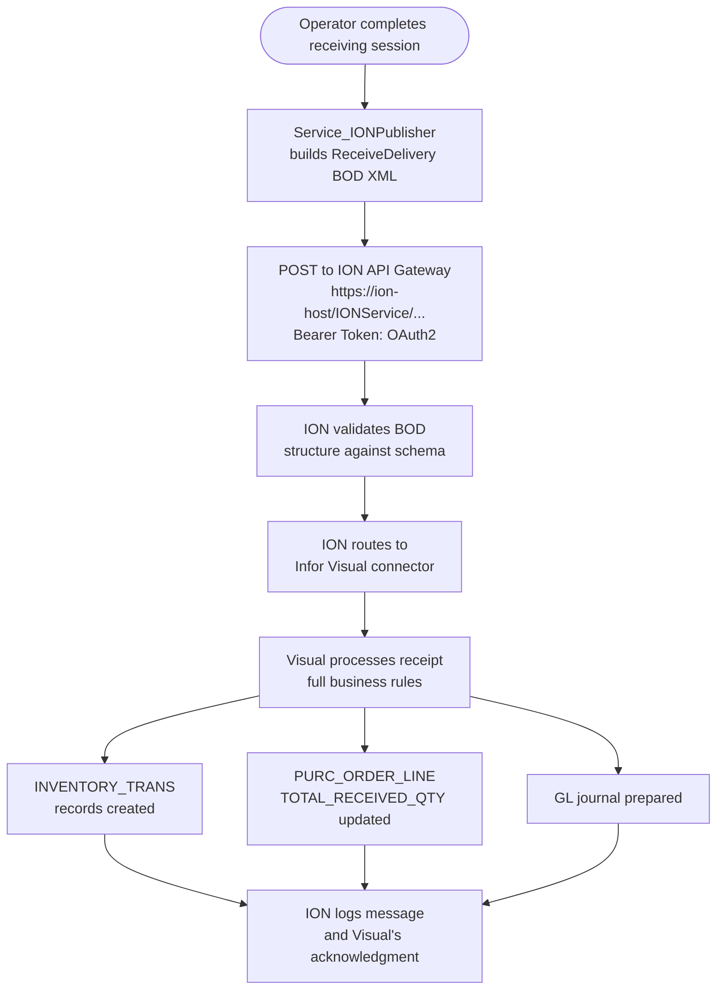

# Approach 6 — Infor ION API / BOD Message Bus

**Last Updated: 2026-03-08**  
**Status: Deferred — Requires ION License Confirmation**  
**Complexity: Very High**  
**Estimated Effort: Months (after prerequisites resolved)**

---

## Overview

**Infor ION (Intelligent Open Network)** is Infor's official middleware and integration platform. It connects Infor applications — and external systems — through a **BOD (Business Object Document)** XML message bus. External applications publish BOD messages to the ION API Gateway; ION validates, routes, and delivers those messages to target applications including Infor Visual.

The MTM Receiving Application would publish a `ReceiveDelivery` BOD message after a receiving session is complete. ION routes it to Infor Visual, which processes the delivery through its full business layer: inventory transactions, GL postings, AP accrual, and costing all occur exactly as if the receipt had been entered manually.

> **Constraint**: Data enters Infor Visual through ION's official application integration layer. No data goes directly to SQL Server. Visual processes every inbound BOD through its own application code — the same code path as a manually entered receipt.

This is the **gold-standard Infor integration pattern** and the approach Infor themselves recommend for system-to-system integration. It is also the highest-complexity and highest-cost option.

---

## How It Works



---

## BOD Structure — `ReceiveDelivery`

The standard Infor BOD for purchase receipt is `ReceiveDelivery.Process`. The following is an illustrative structure based on the Infor BOD specification (the exact schema version must be confirmed against the ION installation at MTM):

```xml
<?xml version="1.0" encoding="UTF-8"?>
<BOD xmlns="http://schema.infor.com/InforOAGIS/2"
     xmlns:xsi="http://www.w3.org/2001/XMLSchema-instance"
     xsi:schemaLocation="http://schema.infor.com/InforOAGIS/2"
     versionID="2.8.2" systemEnvironmentCode="Production">

  <ApplicationArea>
    <Sender>
      <LogicalID>lid://MTM.ReceivingApplication</LogicalID>
      <ComponentID>Module_Receiving</ComponentID>
      <ConfirmationCode>OnError</ConfirmationCode>
    </Sender>
    <CreationDateTime>2026-03-08T14:32:00</CreationDateTime>
    <BODID>urn:uuid:550e8400-e29b-41d4-a716-446655440000</BODID>
  </ApplicationArea>

  <DataArea>
    <Process>
      <ActionCriteria>
        <ActionExpression actionCode="Add"/>
      </ActionCriteria>
    </Process>

    <ReceiveDelivery>
      <ReceiveDeliveryHeader>
        <DocumentID>
          <ID>MTM-RCV-20260308-001</ID>
        </DocumentID>
        <DocumentDateTime>2026-03-08T14:32:00</DocumentDateTime>
        <PurchaseOrderReference>
          <DocumentID>
            <ID>067101</ID>
          </DocumentID>
        </PurchaseOrderReference>
        <ReceivedBy>
          <EmployeeID>1042</EmployeeID>
        </ReceivedBy>
        <Location>
          <ID>002</ID>   <!-- Site ID -->
        </Location>
      </ReceiveDeliveryHeader>

      <ReceiveDeliveryLine>
        <LineNumber>1</LineNumber>
        <Item>
          <ID>PART-A100</ID>
        </Item>
        <Quantity unitCode="EA">250</Quantity>
        <Lot>
          <ID>HEAT-2026-001</ID>
        </Lot>
        <Location>
          <Warehouse>
            <ID>MAIN</ID>
          </Warehouse>
          <BinLocation>
            <ID>A-01</ID>
          </BinLocation>
        </Location>
      </ReceiveDeliveryLine>

    </ReceiveDelivery>
  </DataArea>
</BOD>
```

> ⚠️ The `ReceiveDelivery` BOD schema version and exact field paths **must be validated against the specific ION and Visual 9.0.8 versions installed at MTM** before implementation. Infor BOD schemas differ between Visual 9.x versions.

---

## What Would Be Built

### 1. ION API Client Service

```
Module_Core/
  Contracts/Services/
    IService_IONApiClient.cs
  Services/
    Service_IONApiClient.cs

Module_Receiving/
  Contracts/
    IService_VisualIONPublisher.cs
  Services/
    Service_VisualIONPublisher.cs
  ViewModels/
    ViewModel_Receiving_VisualHandoff.cs
  Views/
    View_Receiving_VisualHandoff.xaml
```

**`IService_IONApiClient.cs`**:

```csharp
public interface IService_IONApiClient
{
    /// <summary>
    /// Publishes a BOD XML message to the ION API Gateway.
    /// Returns the ION message ID on success.
    /// </summary>
    Task<Model_Dao_Result<string>> PublishBodAsync(string bodXml, string bodType);
}
```

**`Service_IONApiClient.cs`** (structure):

```csharp
public class Service_IONApiClient : IService_IONApiClient
{
    private readonly HttpClient _httpClient;
    private readonly IONApiSettings _settings;
    private readonly IService_LoggingUtility _logger;

    public Service_IONApiClient(
        HttpClient httpClient,
        IONApiSettings settings,
        IService_LoggingUtility logger)
    {
        _httpClient = httpClient;
        _settings = settings;
        _logger = logger;
    }

    public async Task<Model_Dao_Result<string>> PublishBodAsync(string bodXml, string bodType)
    {
        try
        {
            // Obtain OAuth2 token from ION's token endpoint
            var token = await GetAccessTokenAsync();

            var request = new HttpRequestMessage(HttpMethod.Post, _settings.GatewayUrl);
            request.Headers.Authorization = new AuthenticationHeaderValue("Bearer", token);
            request.Content = new StringContent(bodXml, Encoding.UTF8, "application/xml");
            request.Headers.Add("X-BOD-Type", bodType);

            var response = await _httpClient.SendAsync(request);

            if (!response.IsSuccessStatusCode)
            {
                var error = await response.Content.ReadAsStringAsync();
                return new Model_Dao_Result<string>
                {
                    IsSuccess = false,
                    ErrorMessage = $"ION API returned {(int)response.StatusCode}: {error}",
                    Severity = Enum_ErrorSeverity.Error
                };
            }

            var messageId = response.Headers.GetValues("X-ION-MessageId").FirstOrDefault() ?? "unknown";
            _logger.LogInfo($"BOD published to ION. Type: {bodType}, MessageId: {messageId}");

            return new Model_Dao_Result<string> { IsSuccess = true, Data = messageId };
        }
        catch (Exception ex)
        {
            return new Model_Dao_Result<string>
            {
                IsSuccess = false,
                ErrorMessage = $"Failed to publish BOD to ION: {ex.Message}",
                Severity = Enum_ErrorSeverity.Error
            };
        }
    }

    private async Task<string> GetAccessTokenAsync()
    {
        // ION uses OAuth2 client_credentials flow
        // Credentials must be stored in appsettings / secrets manager — never hardcoded
        var tokenRequest = new FormUrlEncodedContent(new[]
        {
            new KeyValuePair<string, string>("grant_type", "client_credentials"),
            new KeyValuePair<string, string>("client_id", _settings.ClientId),
            new KeyValuePair<string, string>("client_secret", _settings.ClientSecret),
        });

        var tokenResponse = await _httpClient.PostAsync(_settings.TokenUrl, tokenRequest);
        tokenResponse.EnsureSuccessStatusCode();

        var json = await tokenResponse.Content.ReadAsStringAsync();
        // Parse token from JSON response
        using var doc = JsonDocument.Parse(json);
        return doc.RootElement.GetProperty("access_token").GetString() ?? string.Empty;
    }
}
```

### 2. Settings in `appsettings.json`

```json
{
  "IONApi": {
    "GatewayUrl": "https://<ion-host>/IONService/ws/ION/InforOSInboundService",
    "TokenUrl": "https://<ion-host>/IONAPI/oauth/token",
    "ClientId": "MTM_ReceivingApp",
    "ClientSecret": ""   // ← Populated from environment variable or secrets manager ONLY
  }
}
```

> ⚠️ The `ClientSecret` **must never be stored in source control**. Use `dotnet user-secrets`, a secrets manager, or environment variables. See the Security section below.

### 3. BOD Builder Service

```csharp
public class Service_VisualIONPublisher : IService_VisualIONPublisher
{
    private readonly IService_IONApiClient _ionClient;
    private readonly IService_LoggingUtility _logger;

    public async Task<Model_Dao_Result<string>> PublishReceiveDeliveryAsync(
        List<Model_ReceivingLoad> loads)
    {
        try
        {
            var bodXml = BuildReceiveDeliveryBod(loads);
            return await _ionClient.PublishBodAsync(bodXml, "ReceiveDelivery.Process");
        }
        catch (Exception ex)
        {
            return new Model_Dao_Result<string>
            {
                IsSuccess = false,
                ErrorMessage = $"Failed to publish ReceiveDelivery BOD: {ex.Message}",
                Severity = Enum_ErrorSeverity.Error
            };
        }
    }

    private string BuildReceiveDeliveryBod(List<Model_ReceivingLoad> loads)
    {
        // TODO: Build BOD XML using confirmed schema version from ION at MTM
        // Group by PO number; create one ReceiveDelivery per PO
        throw new NotImplementedException("BOD schema must be confirmed before implementation.");
    }
}
```

---

## Pros

| | |
|---|---|
| ✅ | The gold standard of Infor integration — explicitly designed for system-to-system data exchange |
| ✅ | Fully decoupled — MTM app does not need to know anything about Visual's UI, database, or import screen |
| ✅ | ION handles delivery, retries on failure, and logs all messages — no custom retry logic needed |
| ✅ | Enterprise-grade audit trail — ION maintains a complete, independent message log |
| ✅ | Official Infor support — Infor documentation and support contracts apply |
| ✅ | Future-proof — if MTM moves to Infor CloudSuite or a newer ERP, ION integration persists |
| ✅ | Supports fully unattended operation — no manual steps in Visual after publishing |
| ✅ | No fragile UI control mapping — data goes through a defined, version-controlled BOD schema |

## Cons

| | |
|---|---|
| ❌ | **Requires ION to be licensed, installed, and configured at MTM** — this is a significant additional product line, not included in a base Infor Visual 9.x license |
| ❌ | ION is typically part of Infor OS / CloudSuite — on-premise Visual 9.x installations often do not have it without an explicit add-on purchase |
| ❌ | Very high implementation complexity — requires BOD schema knowledge, ION Connect configuration, API credential provisioning, and adapter setup in Visual |
| ❌ | Long lead time — a new ION integration can take weeks to months to implement and validate in a production environment |
| ❌ | No operator review step before posting — ION submits to Visual automatically (this can be designed around, but requires extra work) |
| ❌ | If Visual rejects the BOD, the error surfaces in ION's log, not in the MTM UI — requires monitoring and alerting infrastructure |
| ❌ | Requires a dedicated ION service account and credentials in MTM's app settings with appropriate secrets management |

---

## Prerequisites — Must Be Resolved Before Any Work Begins

| # | Prerequisite | How to Resolve |
|---|---|---|
| 1 | **Confirm ION is licensed and installed** at MTM's Visual installation | Contact Infor account manager or IT to check current license entitlements |
| 2 | **Identify ION API Gateway URL and token endpoint** | IT or Infor admin |
| 3 | **Confirm `ReceiveDelivery.Process` BOD is supported** by the Visual 9.0.8 ION connector installed at MTM | Infor support or ION admin console |
| 4 | **Obtain the applicable BOD schema version** (e.g., OAGIS 9.x) used by the MTM ION connector | ION admin console → Connected applications → Visual adapter version |
| 5 | **Provision an API client credential** (client_id + client_secret) for the MTM Receiving Application in ION's OAuth2 configuration | ION admin |
| 6 | **Set up a test/sandbox ION environment** for integration testing | IT / Infor admin |
| 7 | **Define error notification path** — how will ION message failures be surfaced to the warehouse team? | Business + IT |

---

## Security Considerations

- **OAuth2 client credentials must never be committed to source control.** Use `dotnet user-secrets` in development and environment variables or a secrets manager (e.g., Azure Key Vault, HashiCorp Vault) in production.
- ION API communication must use **HTTPS only**. Do not allow HTTP fallback.
- The ION service account should be scoped to `ReceiveDelivery.Process` publish rights only — no read access to other BOD types.
- All BOD XML must be constructed using proper XML APIs (`XDocument`, `XmlWriter`) with character escaping — never raw string concatenation with user-supplied data, which risks XML injection.
- ION message IDs returned on successful publish must be logged by the MTM app for correlation with Visual's processing log.

```csharp
// ✅ CORRECT — use System.Security.SecurityElement.Escape or XElement values
new XElement("ID", SecurityElement.Escape(load.PartID))

// ❌ FORBIDDEN — string concatenation into XML
$"<ID>{load.PartID}</ID>"   // injection risk if PartID contains <, >, &, "
```

---

## When to Revisit This Approach

| Trigger | Action |
|---|---|
| MTM upgrades to Infor CloudSuite Manufacturing | ION becomes the primary integration channel — re-evaluate immediately |
| MTM purchases Infor OS add-on for Visual | Begin feasibility assessment |
| Volume of receiving sessions exceeds what Approach 2 can handle | Re-evaluate ION as a scalable alternative |
| Infor releases a simplified ION Connector specifically for Visual 9.x on-premise | Re-evaluate complexity and cost |

---

## Related Files

| File | Purpose |
|---|---|
| [Module_Receiving/Models/Model_ReceivingLoad.cs](../../../Module_Receiving/Models/Model_ReceivingLoad.cs) | Source data model |
| [Module_Receiving/Documentation/AI-Handoff/Guardrails.md](../../../Module_Receiving/Documentation/AI-Handoff/Guardrails.md) | No-write-to-SQL-Server constraint |
| [docs/InforVisual/DatabaseReferenceFiles/MTMFG_Schema_Tables.csv](../DatabaseReferenceFiles/MTMFG_Schema_Tables.csv) | `RECEIVER` and `RECEIVER_LINE` schema reference |
| [docs/InforVisual/Integration/Approach_2_VBScript_Macro.md](Approach_2_VBScript_Macro.md) | Lower-complexity alternative recommended for near-term |
| [docs/InforVisual/Integration/Approach_5_EDI_Import.md](Approach_5_EDI_Import.md) | File-based alternative that does not require ION |
