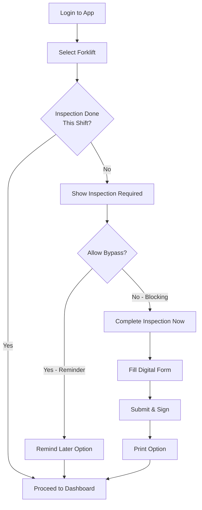
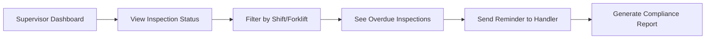

# Forklift Safety Inspection Digitization Feature

**Status:** Proposed Feature for MTM Waitlist Application  
**Date:** January 22, 2026  
**Priority:** High - Safety & Compliance  
**Category:** Workflow Enhancement, Compliance Tracking

## Current State

**Manual Process:**
- Material Handlers fill out handwritten forklift safety inspection sheets
- Required once per shift per forklift
- Paper forms stored for compliance records
- No automated tracking or reminders
- Time-consuming and prone to missed inspections

**Pain Points:**
- Manual paperwork slows down shift start
- No automatic enforcement - easy to forget
- Difficult to track compliance across shifts
- Paper forms can be lost or damaged
- No real-time visibility for supervisors

## Proposed Solution

### Digital Forklift Inspection System

**Core Concept:**  
Integrate forklift safety inspections directly into the MTM Waitlist Application workflow, making compliance seamless and automatic.

### Key Features

#### 1. **Forklift Registration & Tracking**
- Each forklift has a unique identifier (number/name)
- System tracks which forklift is assigned to which Material Handler
- Inspection status tracked per forklift per shift

#### 2. **Digital Inspection Form**
- Pre-populated checklist based on OSHA/company requirements
- Quick tap/click interface for each inspection item
- Photo upload capability for noted issues
- Digital signature/timestamp for audit trail

#### 3. **Automatic Prompting**
- When Material Handler logs in and selects forklift:
  - System checks if inspection complete for current shift
  - If NOT complete: Prompt to complete inspection
  - Configurable: blocking vs. reminder
- Prevents starting tasks until inspection complete (if configured)

#### 4. **Compliance Tracking**
- Dashboard for supervisors showing inspection status
- Real-time view of which forklifts are/aren't inspected
- Historical compliance reports
- Alerts for overdue inspections

#### 5. **Print & Export**
- Option to print completed inspection form(s)
- PDF export for records
- Integration with compliance reporting systems

## User Workflows

### Material Handler - Shift Start



### Supervisor - Compliance Monitoring



## Implementation Strategy

### Phase 1: Basic Digitization (MVP)
**Goal:** Replace paper with digital inspection form

- [ ] Database schema for forklift master list
- [ ] Database schema for inspection records
- [ ] Digital inspection form UI (checklist)
- [ ] Basic save/submit functionality
- [ ] Simple print output

**Estimated Effort:** 2-3 weeks

### Phase 2: Workflow Integration
**Goal:** Make inspections part of daily workflow

- [ ] Forklift selection on login
- [ ] Inspection status checking
- [ ] Automatic prompting logic
- [ ] Integration with Material Handler dashboard
- [ ] Blocking vs. reminder configuration

**Estimated Effort:** 2-3 weeks

### Phase 3: Compliance & Reporting
**Goal:** Provide supervision and compliance features

- [ ] Supervisor dashboard for inspection status
- [ ] Real-time compliance monitoring
- [ ] Historical reporting
- [ ] Alert system for overdue inspections
- [ ] PDF export for records

**Estimated Effort:** 2 weeks

### Phase 4: Advanced Features (Future)
**Goal:** Enhance with additional capabilities

- [ ] Photo upload for damage/issues
- [ ] GPS tracking of forklift location
- [ ] Maintenance request integration
- [ ] Predictive maintenance based on inspection data
- [ ] Mobile app support for field inspections

**Estimated Effort:** 3-4 weeks

## Technical Architecture

### Database Design

**Table: Forklifts**
```sql
CREATE TABLE forklifts (
    forklift_id INT PRIMARY KEY AUTO_INCREMENT,
    forklift_number VARCHAR(20) UNIQUE NOT NULL,
    forklift_name VARCHAR(100),
    model VARCHAR(50),
    serial_number VARCHAR(50),
    is_active BOOLEAN DEFAULT TRUE,
    created_at TIMESTAMP DEFAULT CURRENT_TIMESTAMP,
    updated_at TIMESTAMP ON UPDATE CURRENT_TIMESTAMP
);
```

**Table: ForkliftInspections**
```sql
CREATE TABLE forklift_inspections (
    inspection_id INT PRIMARY KEY AUTO_INCREMENT,
    forklift_id INT NOT NULL,
    user_id INT NOT NULL,
    shift_type VARCHAR(20) NOT NULL, -- 1st, 2nd, 3rd, Weekend
    inspection_date DATE NOT NULL,
    inspection_time TIME NOT NULL,
    
    -- Inspection Items (simplified - full checklist in separate table)
    brakes_ok BOOLEAN,
    steering_ok BOOLEAN,
    horn_ok BOOLEAN,
    lights_ok BOOLEAN,
    tires_ok BOOLEAN,
    forks_ok BOOLEAN,
    
    overall_status VARCHAR(20), -- Pass, Fail, ConditionalPass
    notes TEXT,
    issues_reported TEXT,
    
    signature_data TEXT, -- Digital signature
    completed_by INT NOT NULL,
    completed_at TIMESTAMP DEFAULT CURRENT_TIMESTAMP,
    
    FOREIGN KEY (forklift_id) REFERENCES forklifts(forklift_id),
    FOREIGN KEY (user_id) REFERENCES users(user_id),
    UNIQUE KEY unique_shift_inspection (forklift_id, shift_type, inspection_date)
);
```

**Table: InspectionItems** (for configurable checklist)
```sql
CREATE TABLE inspection_items (
    item_id INT PRIMARY KEY AUTO_INCREMENT,
    item_name VARCHAR(100) NOT NULL,
    item_description TEXT,
    is_required BOOLEAN DEFAULT TRUE,
    display_order INT,
    is_active BOOLEAN DEFAULT TRUE
);
```

**Table: InspectionResponses** (for flexible responses)
```sql
CREATE TABLE inspection_responses (
    response_id INT PRIMARY KEY AUTO_INCREMENT,
    inspection_id INT NOT NULL,
    item_id INT NOT NULL,
    response_value VARCHAR(50), -- Pass, Fail, N/A
    notes TEXT,
    FOREIGN KEY (inspection_id) REFERENCES forklift_inspections(inspection_id),
    FOREIGN KEY (item_id) REFERENCES inspection_items(item_id)
);
```

### MVVM Architecture

**Module:** `Module_ForkliftInspection`

**ViewModels:**
- `ViewModel_ForkliftInspection_Form` - Inspection form
- `ViewModel_ForkliftInspection_Dashboard` - Supervisor view
- `ViewModel_ForkliftInspection_History` - Inspection history

**Services:**
- `IService_ForkliftInspection` - Business logic
- `IService_ForkliftManagement` - Forklift CRUD
- `IService_ComplianceReporting` - Reporting

**DAOs:**
- `Dao_Forklift` - Forklift master data
- `Dao_ForkliftInspection` - Inspection CRUD
- `Dao_InspectionItem` - Checklist items

### UI/UX Considerations

**Material Handler View:**
- Quick, mobile-friendly inspection form
- Large touch targets for checkbox items
- Minimal text entry
- Clear pass/fail indication
- Optional photo upload for issues

**Supervisor View:**
- Real-time grid of all forklifts and inspection status
- Color-coded status indicators (green=done, yellow=pending, red=overdue)
- Filter by shift, department, date range
- One-click reminder sending
- Export to Excel/PDF

**Print Format:**
- Standard 8.5x11 inspection form
- Company branding/logo
- Clear pass/fail status
- Digital signature and timestamp
- QR code for digital record lookup

## Business Value

### Time Savings
- **Estimated 10-15 minutes per shift per Material Handler**
- Eliminate paper form handling and filing
- Faster compliance checks for supervisors

### Compliance Improvement
- **Reduce missed inspections by 90%+**
- Automatic enforcement ensures no forklift operates uninspected
- Complete audit trail for OSHA compliance

### Visibility & Control
- Real-time dashboard for supervision
- Immediate identification of issues
- Data-driven maintenance scheduling

### Cost Reduction
- Eliminate paper forms and storage
- Reduce compliance violations and fines
- Better maintenance scheduling reduces downtime

## Decision Points (from Questionnaire)

### 1. **Digitize Forklift Inspections?**
- ✅ Yes - digitize completely
- ✅ Yes - but print option available
- ❌ No - keep paper
- ⚠️ Partial - digital tracking, manual inspection

**Recommendation:** Yes with print option (Phase 1-2)

### 2. **Inspection Frequency?**
- ✅ Once per shift (current practice)
- ⚠️ Once per forklift per day
- ❌ Before each use (too frequent)
- ❌ Once per week (too infrequent)

**Recommendation:** Once per shift (maintains current compliance)

### 3. **Prompting Strategy?**
- ✅ Immediately on login (blocking) - **Best for compliance**
- ⚠️ Before first task - **Good balance**
- ❌ Reminder only - **Weak enforcement**
- ⚠️ Supervisor bypass - **For emergencies only**

**Recommendation:** Blocking on login with supervisor bypass option

## Success Metrics

**Compliance:**
- 100% inspection completion rate (up from ~85% with paper)
- Zero missed shift inspections
- Complete audit trail for all inspections

**Efficiency:**
- Reduce inspection time from 15 min to 5 min
- Eliminate paper form filing time
- Instant supervisor visibility

**Safety:**
- Identify issues faster (immediate vs. end-of-shift)
- Track recurring issues for maintenance planning
- Reduce forklift-related incidents

## Risks & Mitigation

### Risk: Device Availability
**Mitigation:** Ensure kiosk PCs or tablets available at forklift staging areas

### Risk: Resistance to Change
**Mitigation:** Phased rollout, training, emphasize time savings

### Risk: System Downtime
**Mitigation:** Fallback to paper forms, offline mode for app

### Risk: Data Loss
**Mitigation:** Regular backups, cloud sync, audit logs

## Integration Points

**With MTM Waitlist App:**
- Material Handler login/forklift selection
- Dashboard integration
- Notification system for reminders

**With MTM Receiving App:**
- Shared user authentication
- Shared forklift master list
- Shared maintenance request system

**External Systems:**
- OSHA compliance reporting
- Maintenance management system
- Safety incident tracking

## Future Enhancements

### Mobile App
- Native iOS/Android app for inspections
- Works offline, syncs when connected
- Camera integration for photos

### IoT Integration
- RFID tags on forklifts
- Automatic forklift detection
- Real-time location tracking

### Predictive Maintenance
- ML analysis of inspection data
- Predict component failures
- Automated maintenance scheduling

### Advanced Analytics
- Trend analysis over time
- Comparison across shifts/operators
- Safety performance dashboards

## Next Steps

1. **Validate Requirements** - Review questionnaire responses
2. **Design Database Schema** - Finalize tables and stored procedures
3. **Create UI Mockups** - Design inspection form and dashboards
4. **Prototype MVP** - Build Phase 1 features
5. **User Testing** - Pilot with small group of Material Handlers
6. **Iterate** - Refine based on feedback
7. **Rollout** - Deploy to all shifts

## Related Documents

- [MTM Waitlist Project Overview](./README.md)
- [Material Handler Workflows](./Documentation/Workflows/material-handler-workflow.md)
- [Role-Based Permissions](./Mockups/ROLE_VISIBILITY_MATRIX.md)
- [Database Strategy](./CLARIFICATION-Database.md)
- [Questionnaire Results](../HTML/generated/core-all-roles.html)

---

**Document Version:** 1.0  
**Last Updated:** January 22, 2026  
**Owner:** Project Team  
**Status:** Proposed - Pending Questionnaire Results
