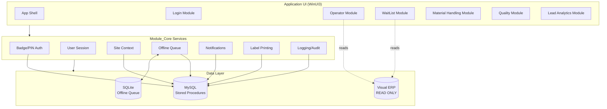

# **EPIC: MTM Waitlist Application v1.0 - Core Foundation & MVP**

**Epic ID:** WAIT-001  
**Status:** 📋 Planning  
**Priority:** 🔴 Critical  
**Target Release:** Q2 2026  
**Estimated Duration:** 16-20 weeks  
**Business Owner:** Nick Wunsch, Cristofer Muchowski  
**Technical Lead:** TBD  

---

## **Executive Summary**

Replace the existing "Tables Ready" system with a modern, module-based Windows desktop application that reduces operator training burden, minimizes data entry errors, and provides production leads with actionable analytics. Version 1.0 delivers **core foundation services** and a **minimal viable product** that closely mirrors current workflows while establishing the architecture for future enhancements.

### **Business Value**

- ⏱️ **Reduce wasted time** from incorrect material requests (coils, parts, operations)
- 📉 **Minimize data entry errors** through guided dropdowns and wizards
- 📊 **Enable data-driven decisions** with role-based analytics
- 🎓 **Reduce training burden** through intuitive, self-contained modules
- 🏗️ **Future-proof architecture** for phased enhancement rollout

### **Success Metrics (v1.0)**

- ✅ 100% feature parity with existing "Tables Ready" system
- ✅ Zero writes to Visual ERP (read-only compliance)
- ✅ Offline capability with automatic sync
- ✅ Badge + PIN authentication for all users
- ✅ Site separation (Expo Drive vs VITS Drive)
- ✅ Production leadership approval before shop-floor deployment

---

## **Strategic Alignment**

| Business Goal | How This Epic Delivers |
|--------------|------------------------|
| Reduce operational waste | Guided wizards prevent incorrect requests; analytics identify bottlenecks |
| Improve data quality | Structured dropdowns replace free-text entry; audit trails track all actions |
| Enable scalability | Module-based architecture allows incremental feature additions without disruption |
| Support workforce development | Embedded training module + simplified UX reduces onboarding time |

---

## **Scope: What's In vs. What's Out**

### **✅ IN SCOPE (v1.0)**

#### **1. Module_Core (Foundation Services)**

- Badge + PIN authentication (MySQL-based user accounts)
- User session management with role-based access control
- Site context detection (workstation IP/hostname → site_id mapping)
- Offline queue service with automatic sync
- Error handling, logging, and audit trail
- Label printing service (LabelView 2022 integration)
- Email + Teams notification framework
- Application shell with role-based navigation

#### **2. Module_Login**

- Login UI with badge/PIN entry
- Role detection (Operator, Lead, Material Handler, Quality, Admin)
- Session timeout and re-authentication

#### **3. Module_Operator (Basic)**

- Press selection dropdown (site-filtered)
- Work order context from Visual ERP (read-only)
- Basic waitlist request creation (material type, quantity, notes)
- View personal waitlist items

#### **4. Module_WaitList (Core Features)**

- Shared waitlist queue (site-scoped)
- Create, update, close waitlist items
- Time tracking per request type (preset standards)
- Priority indicators (normal → red as deadline approaches)
- Basic analytics (lead-only): task duration, completion times

#### **5. Module_MaterialHandling (Basic)**

- Zone assignment UI
- Task pickup from waitlist (manual selection)
- "Quick Add" for non-waitlist tasks (credit tracking)
- Completed task logging

#### **6. Database Infrastructure**

- MySQL schema with stored procedures for ALL write operations
- Visual ERP read-only integration (SELECT queries only)
- Local SQLite offline queue database
- Device-to-site mapping registry
- Printer profile storage

#### **7. Deployment & Infrastructure**

- MTM Application Loader integration (copy-folder deployment)
- Runtime artifacts stored in %LOCALAPPDATA%
- Shared settings in MySQL
- File versioning for update detection

### **❌ OUT OF SCOPE (v1.0 - Future Phases)**

- ⏭️ Guided wizards (Phase 2)
- ⏭️ Favorites/Recents quick-add (Phase 2)
- ⏭️ Auto-assign tasks based on zone urgency (Phase 2)
- ⏭️ Quality alert notifications (Phase 2)
- ⏭️ Advanced lead analytics dashboards (Phase 2)
- ⏭️ Module_Training (standalone training programs) (Phase 3)
- ⏭️ Module_SetupTech (setup change requests) (Phase 3)
- ⏭️ Module_Logistics (truck/van routing) (Phase 3)
- ⏭️ Intercom integration (requires security approval)
- ⏭️ Mobile/web versions (in-house Windows only)

---

## **User Stories (Organized by Module)**

### **EPIC THEME: Core Foundation**

#### **As a System**, I need reliable foundation services

| Story ID | User Story | Acceptance Criteria | Estimate |
|----------|-----------|-------------------|----------|
| WAIT-101 | As a **developer**, I need a dependency injection container setup so that all modules can access shared services | • App.xaml.cs registers all core services• Services use interface-based contracts• Services are testable in isolation | 3 days |
| WAIT-102 | As the **application**, I need to detect which site the workstation belongs to so that users only see relevant data | • Device hostname/IP maps to site_id• Mapping cached locally for offline startup• Fallback to default + warning if unmapped | 5 days |
| WAIT-103 | As a **user**, I need my work to be saved even when the network is down so that I don't lose productivity | • SQLite-based offline queue persists work items• Background sync retries with exponential backoff• Dead-letter queue for fatal errors• UI shows sync status indicator | 8 days |
| WAIT-104 | As the **application**, I need to log all user actions for audit and troubleshooting | • All CRUD operations logged to MySQL• Session context (user, site, device) captured• Correlation IDs for tracking workflows• Error stack traces captured | 4 days |

#### **As an IT Administrator**, I need secure authentication and deployment

| Story ID | User Story | Acceptance Criteria | Estimate |
|----------|-----------|-------------------|----------|
| WAIT-105 | As an **IT admin**, I need users to authenticate with badge + PIN so that access is controlled | • Badge scan (barcode scanner) or manual entry• PIN hashed before storage (never plaintext)• Failed login attempts logged• Lockout after 3 failed attempts | 5 days |
| WAIT-106 | As an **IT admin**, I need the app to deploy via MTM Loader so that updates are managed centrally | • App runs from read-only install folder• Runtime files stored in %LOCALAPPDATA%• File version increments trigger update prompts• No writes to install folder | 3 days |
| WAIT-107 | As an **IT admin**, I need printer profiles stored centrally so that users don't have to configure printers | • Printer selection stored in MySQL per site• LabelView 2022 template references• Default printer auto-selected by site | 5 days |

---

### **EPIC THEME: Operator Workflow**

#### **As a Press Operator**, I need to request materials simply

| Story ID | User Story | Acceptance Criteria | Estimate |
|----------|-----------|-------------------|----------|
| WAIT-201 | As an **operator**, I need to select my press from a dropdown so that my requests are site-specific | • Press list filtered by current site_id• Press name, number, location displayed• Selection persists for session | 3 days |
| WAIT-202 | As an **operator**, I need the app to show me my current work order so that I have context | • Work order pulled from Visual ERP (read-only)• Displays part number, operation, die, next op• Shows dunnage requirements if available | 5 days |
| WAIT-203 | As an **operator**, I need to create a waitlist request for materials so that material handlers know what I need | • Request form: type, quantity, notes• Timer starts when request submitted• Request appears in shared waitlist immediately• Operator sees confirmation | 5 days |
| WAIT-204 | As an **operator**, I need to see my pending requests so that I know what's coming | • List view of operator's active requests• Shows request time, type, status• Color-coded by urgency (green → yellow → red) | 3 days |

---

### **EPIC THEME: Waitlist Management**

#### **As a Material Handler**, I need to see and complete tasks

| Story ID | User Story | Acceptance Criteria | Estimate |
|----------|-----------|-------------------|----------|
| WAIT-301 | As a **material handler**, I need to see all waitlist requests for my site so that I can prioritize | • Shared waitlist view (site-scoped)• Sorted by urgency (red first, then oldest)• Shows press, type, quantity, time elapsed | 5 days |
| WAIT-302 | As a **material handler**, I need to assign myself to a zone so that tasks are distributed | • Zone selection dropdown (A, B, C, etc.)• Filters waitlist by zone proximity• Zone assignment logged | 3 days |
| WAIT-303 | As a **material handler**, I need to mark requests complete so that they're removed from the queue | • "Complete" button on selected request• Completion time logged• Request moves to completed list• Operator notified (visual indicator) | 4 days |
| WAIT-304 | As a **material handler**, I need to manually log non-waitlist tasks so that I get credit | • "Quick Add" button for manual tasks• Select task type, quantity, notes• Logged with handler ID and timestamp• Counts toward handler metrics | 4 days |

---

### **EPIC THEME: Lead Analytics**

#### **As a Production Lead**, I need visibility into operations

| Story ID | User Story | Acceptance Criteria | Estimate |
|----------|-----------|-------------------|----------|
| WAIT-401 | As a **lead**, I need to see waitlist analytics so that I can identify bottlenecks | • Analytics tab (lead-only access control)• Average completion time by request type• Longest pending requests• Handler activity summary | 8 days |
| WAIT-402 | As a **lead**, I need to adjust time standards so that urgency thresholds are accurate | • UI to edit time standards by request type• Restricted to approved leads (Nick, Chris)• Changes logged to audit trail• Takes effect immediately | 5 days |
| WAIT-403 | As a **lead**, I need to see which requests went red so that I can coach teams | • Report: requests that exceeded time standard• Filter by date range, press, handler• Export to CSV | 5 days |

---

### **EPIC THEME: Quality Control (Basic)**

#### **As a Quality Technician**, I need to see quality-related tasks

| Story ID | User Story | Acceptance Criteria | Estimate |
|----------|-----------|-------------------|----------|
| WAIT-501 | As an **operator**, I need to create a quality request so that issues are escalated | • "Quality Issue" button on operator dashboard• Request goes to quality-only queue• Operator not blocked waiting for quality | 4 days |
| WAIT-502 | As a **quality tech**, I need a separate queue for quality issues so that I'm not distracted by material requests | • Quality queue tab (quality role only)• Shows press, part, issue description• Color-coded by time pending | 5 days |

---

## **Technical Architecture**

### **Technology Stack**

- **Framework:** WinUI3 on .NET 8 (Windows Desktop)
- **Language:** C# 12
- **MVVM Toolkit:** CommunityToolkit.Mvvm
- **Dependency Injection:** Microsoft.Extensions.DependencyInjection
- **Databases:**
  - MySQL 8+ (application data) - **FULL CRUD via stored procedures**
  - SQL Server 2019+ (Infor Visual ERP) - **READ ONLY**
  - SQLite (local offline queue)
- **Logging:** Microsoft.Extensions.Logging
- **Testing:** xUnit

### **Critical Constraints**

1. ❌ **NO writes to Visual ERP** - SELECT queries only
2. ✅ **ALL MySQL writes via stored procedures** - No raw SQL in code
3. ✅ **Offline-first design** - Must work without network
4. ✅ **In-house only** - Not a web app, no phone apps
5. ✅ **Install folder is read-only** - Runtime artifacts in %LOCALAPPDATA%

### **High-Level Architecture**



---

## **Database Schema (Core Tables)**

### **Required Tables**

1. **`sites`** - Site definitions (Expo Drive, VITS Drive)
2. **`devices`** - Device registry (hostname/IP → site mapping)
3. **`user_accounts`** - Badge IDs, PIN hashes, roles
4. **`waitlist_items`** - Active and completed requests
5. **`waitlist_time_standards`** - Time thresholds by request type
6. **`printer_profiles`** - Printer settings per site
7. **`app_settings`** - Configuration key-value store
8. **`offline_work_items`** - Queued offline actions
9. **`audit_events`** - Append-only audit log

### **Required Stored Procedures**

- `sp_user_authenticate` (badge, pin_hash) → user record
- `sp_device_get_site_mapping` (hostname, ip) → site_id
- `sp_waitlist_create` (site, user, type, qty, notes) → waitlist_id
- `sp_waitlist_complete` (waitlist_id, handler_id) → success
- `sp_analytics_get_lead_summary` (site_id, date_range) → metrics
- `sp_offline_queue_sync` (work_items_json) → results

---

## **Deliverables & Acceptance Criteria**

### **Phase 1: Core Foundation (Weeks 1-6)**

| Deliverable | Acceptance Criteria | Owner |
|------------|-------------------|-------|
| **Module_Core** implementation | • All core services registered in DI• Unit tests >80% coverage• Documentation complete | Dev Team |
| **MySQL database schema** | • All tables created• All stored procedures tested• Sample data populated | DB Admin |
| **Visual ERP integration** | • Read-only connection validated• Work order lookup working• Part/operation data retrieval | Dev Team |
| **Offline queue service** | • SQLite queue persists offline• Sync loop runs in background• Dead-letter queue functional | Dev Team |

### **Phase 2: MVP Modules (Weeks 7-12)**

| Deliverable | Acceptance Criteria | Owner |
|------------|-------------------|-------|
| **Module_Login** | • Badge + PIN authentication works• Roles mapped correctly• Session timeout functional | Dev Team |
| **Module_Operator** | • Press selection works• Work order display accurate• Waitlist creation successful | Dev Team |
| **Module_WaitList** | • Shared queue displays correctly• Site filtering works• Time tracking accurate | Dev Team |
| **Module_MaterialHandling** | • Task assignment works• Zone filtering functional• Quick Add logs correctly | Dev Team |

### **Phase 3: Analytics & Quality (Weeks 13-16)**

| Deliverable | Acceptance Criteria | Owner |
|------------|-------------------|-------|
| **Lead Analytics** | • Role-based access enforced• Metrics accurate• Reports exportable | Dev Team |
| **Quality Module** | • Quality queue isolated• Quality requests routed correctly• Basic notifications working | Dev Team |

### **Phase 4: Testing & Rollout (Weeks 17-20)**

| Deliverable | Acceptance Criteria | Owner |
|------------|-------------------|-------|
| **Integration testing** | • End-to-end scenarios pass• Offline/online transitions smooth• No Visual writes detected | QA Team |
| **User acceptance testing** | • Leadership demo approved• Operator feedback collected• Training materials created | Product Owner |
| **Production deployment** | • MTM Loader integration verified• Site mapping validated• Printer profiles configured | IT/DevOps |

---

## **Risks & Mitigation**

| Risk | Impact | Probability | Mitigation Strategy |
|------|--------|-------------|---------------------|
| LabelView 2022 integration complexity | 🔴 High | 🟡 Medium | • Research COM/API early (Week 2)• Build adapter abstraction• Have fallback to manual print |
| Visual ERP schema changes | 🟡 Medium | 🟢 Low | • Document all SELECT queries• Use views where possible• Validate against Visual test environment |
| User resistance to change | 🔴 High | 🟡 Medium | • Start with v1.0 feature parity• Collect feedback early• Embedded training module |
| Network reliability issues | 🟡 Medium | 🟡 Medium | • Robust offline queue with retry• Clear sync status indicators• Test with network disconnected |
| Leadership approval delays | 🔴 High | 🟡 Medium | • Weekly demo sessions• Clear approval gates• Documented decision points |

---

## **Dependencies**

### **External Dependencies**

- ✅ **IT:** Device-to-site mapping data, network access to MySQL/Visual servers
- ✅ **Security:** Email/Teams notification approvals, SMTP relay access
- ✅ **Operations:** Time standard baseline data

### **Internal Dependencies**

- ✅ **MySQL server:** Schema creation, stored procedure deployment
- ✅ **Visual ERP access:** Read-only account provisioning, test environment access
- ✅ **MTM Application Loader:** Integration testing environment

---

## **Success Criteria (Final Acceptance)**

### **Functional Requirements**

- ✅ 100% feature parity with "Tables Ready" system
- ✅ All user stories marked complete
- ✅ Zero defects in P0/P1 categories
- ✅ Offline mode tested and validated

### **Non-Functional Requirements**

- ✅ Response time: < 2 seconds for all UI operations
- ✅ Uptime: 99.5% (excluding planned maintenance)
- ✅ Audit coverage: 100% of data-changing operations
- ✅ Security: All PINs hashed, no plaintext credentials

### **Business Acceptance**

- ✅ Production leadership approval (Nick, Chris, Brett, Dan)
- ✅ 5+ operators trained and using successfully
- ✅ 2+ material handlers trained and using successfully
- ✅ Zero Visual ERP writes detected in audit logs

---

## **Post-Launch Support Plan**

### **Week 1 Post-Launch**

- 🟢 Daily check-ins with operators and material handlers
- 🟢 Monitor offline queue sync success rate
- 🟢 Collect immediate feedback on usability issues

### **Weeks 2-4 Post-Launch**

- 🟢 Weekly usage reports to leadership
- 🟢 Address P1/P2 bugs within 48 hours
- 🟢 Begin planning Phase 2 enhancements

### **Month 2+**

- 🟢 Monthly analytics review with production leads
- 🟢 Refine time standards based on real data
- 🟢 Plan guided wizards and favorites (Phase 2)

---

## **Budget Estimate**

| Category | Cost Estimate | Notes |
|----------|--------------|-------|
| **Development Labor** | $80,000 - $100,000 | 16-20 weeks × 1-2 developers |
| **Database/Infrastructure** | $0 | Existing MySQL/SQL Server infrastructure |
| **Hardware** | $0 | Existing barcode scanners and label printers |
| **Testing/QA** | $10,000 | UAT support, test environment |
| **Training** | $5,000 | Training material creation, sessions |
| **Contingency (20%)** | $19,000 | Risk buffer |
| **TOTAL** | **$114,000 - $134,000** | |

---

## **Approval & Sign-Off**

| Stakeholder | Role | Approval Required For | Status |
|------------|------|---------------------|--------|
| Nick Wunsch | Production Lead | Business requirements, v1.0 feature set | ⏳ Pending |
| Cristofer Muchowski | Production Lead | Analytics requirements, time standards | ⏳ Pending |
| Brett Lusk | Production Lead | Operator workflows, training plan | ⏳ Pending |
| Dan Smith | IT/Operations | Infrastructure, security, deployment | ⏳ Pending |

---

## **Timeline Overview (Gantt Summary)**

```plaintext
Weeks 1-6:   Module_Core + Database + Auth + Offline Queue
Weeks 7-12:  Operator + WaitList + Material Handling modules
Weeks 13-16: Lead Analytics + Quality module
Weeks 17-18: Integration testing + Bug fixes
Weeks 19-20: UAT + Training + Production deployment
```

---

## **Related Documentation**

- 📄 [Meeting Transcript](meeting-transcript.md)
- 📄 [Meeting Summary](meeting-summary.md)
- 📄 [Module Breakdown](module-breakdown.md)
- 📄 [Technical Kickoff](kickoff-revised-core-first.md)
- 📄 [File Structure Breakdown](file-structure-breakdown.md)

---

**Epic Status:** 📋 **Ready for Stakeholder Review**  
**Next Action:** Schedule kickoff meeting with Nick, Chris, Brett, and Dan for Epic approval  
**Target Kickoff Date:** TBD  
**Target Launch Date:** Q2 2026 (pending stakeholder approval)

---

*This Epic represents version 1.0 - Core Foundation and MVP. Future phases will add guided wizards, favorites/recents, auto-assign, advanced analytics, and training programs based on stakeholder feedback and v1.0 adoption metrics.*
