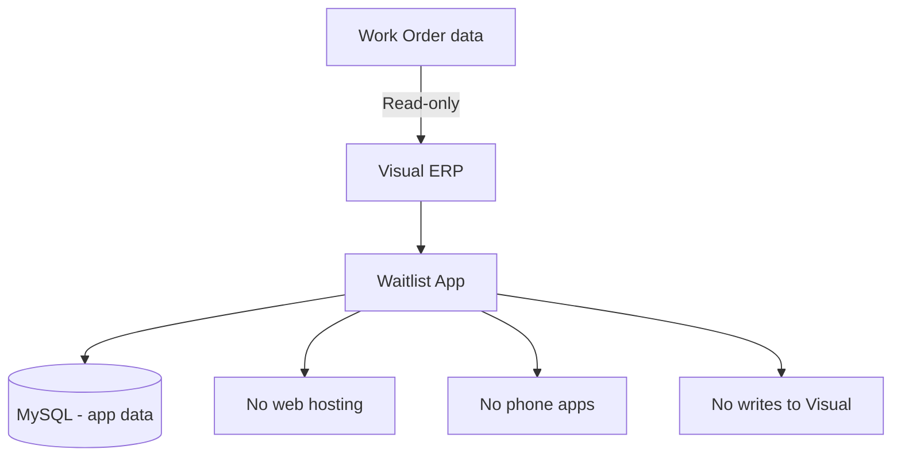
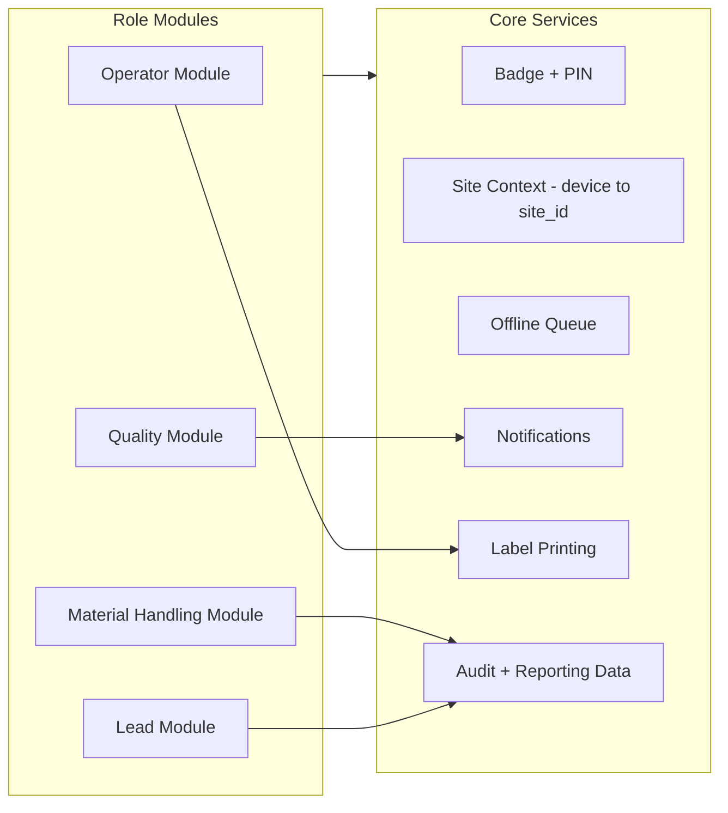
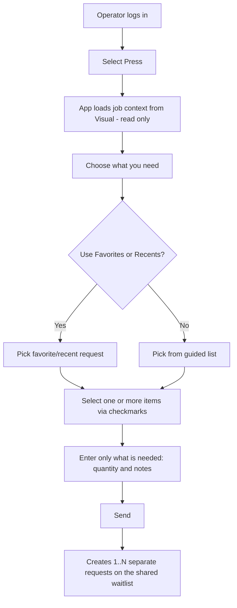
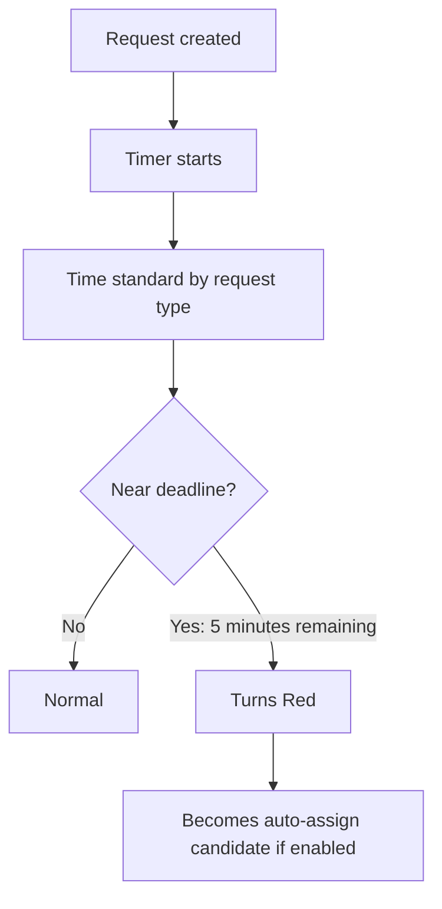
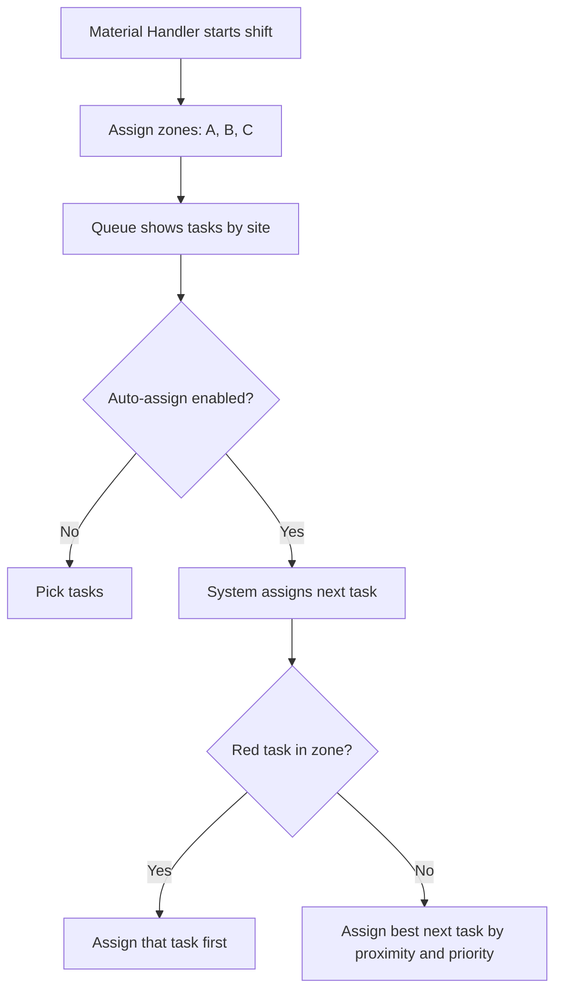
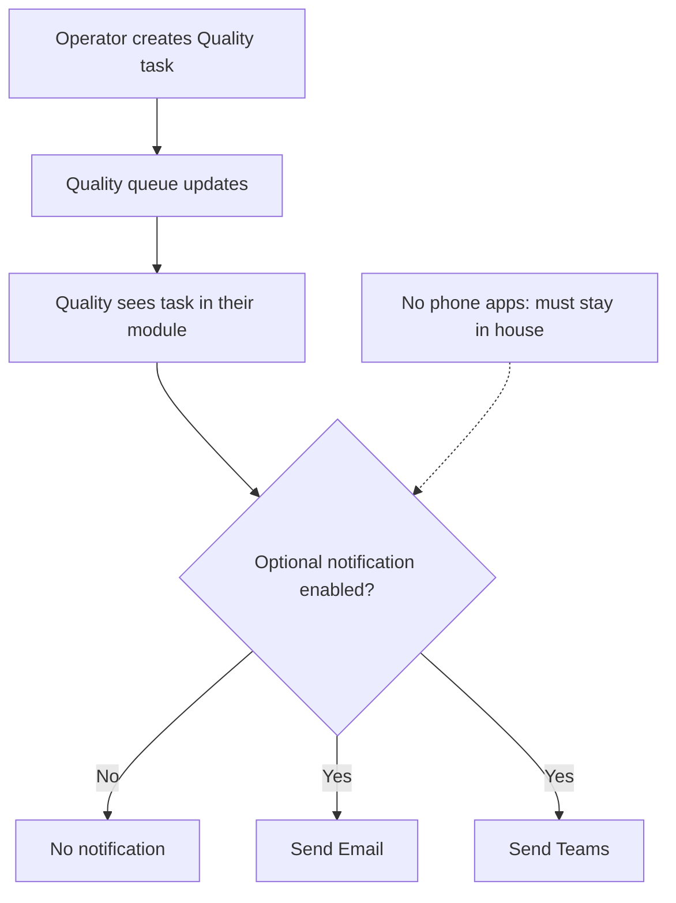
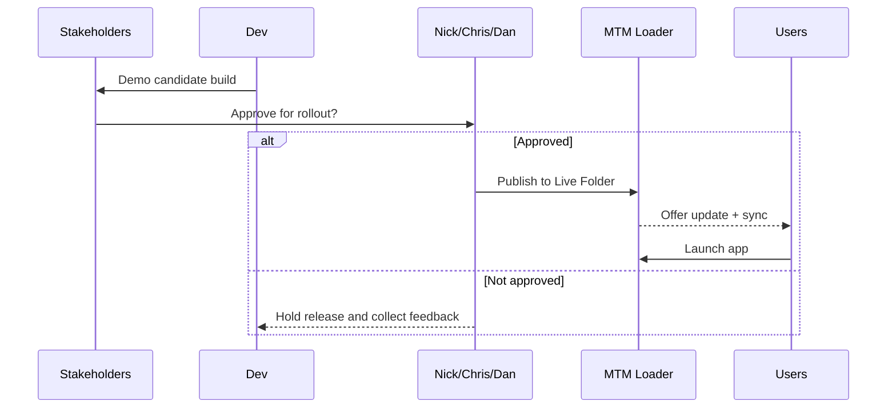
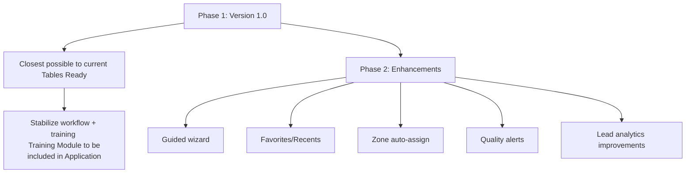

# Kickoff: Module-Based Waitlist App (Stakeholder Version — Transcript Aligned)

## Executive Summary

This project delivers an **in-house, Windows desktop** waitlist system that connects to **MySQL** for application data and reads from **Visual ERP (SQL Server)** for work order validation and job context.

The core approach discussed in the meeting is **module-based design**: each department (Operator, Material Handling, Quality, Leads) has its own “module”, allowing changes for one group without breaking others.

## What We Heard in the Meeting (Key Outcomes)

- The app must stay **on our servers / in-house** and **not be a web app**.

- Visual ERP usage is **read-only** (no writing to Visual).

- The goal is to reduce wasted time caused by **incorrect coils/parts/ops** being requested.

- Operators should **not have to type** most inputs; they should **click from lists**.

- A **guided wizard** was requested for operators.

- Operators need **Favorites/Recents** for repeat requests.

- Leads need **analytics rights** (duration/usage visibility) that operators do not have.

- Time standards should be centrally controlled and refined using real data.

- Material Handling discussed **zone-based assignment** and optional **auto-assign** when tasks become urgent (“red”).

- Quality needs a workflow that does not require operators to leave the press; notifications may help but must respect security and practical adoption.

- Rollout must be controlled: **Version 1.0 should be as close to current Tables Ready as possible**, with enhancements after approval.

## Non‑Negotiables / Guardrails

- **No writes to Visual ERP**.

- **In-house only** (not web-hosted; no phone app).

- **Version 1.0 requires approval** before rollout.

## What “Module-Based” Means (Stakeholder View)

A module is the part of the application each group uses. It lets us change one group’s experience without disrupting others.

## Core User Experience (Operator)

The operator experience must be **simple and low-typing**.

### Intended workflow

- Operator selects the **press**.

- The app pulls the relevant job context from Visual (read-only).

- The operator chooses what they need from a list or wizard.

- They can use **Favorites** or **Recents** to avoid repeated steps.

- If they select multiple items (e.g., skids + gaylords), the app creates **separate waitlist items** automatically.

## Shared Waitlist + Analytics Rights

- Everyone can **see the waitlist** and create requests.

- Leads have **analytics rights** that operators do not.

- Example: leads can see how long tasks took and trend data.

## Time Standards (“Red” Urgency)

The meeting discussed using time standards per request type and marking items urgent (“red”) as they approach the deadline.

- Time standards are not adjustable by operators.

- Time standards are tuned over time using real data.

## Material Handling (Zone Assignment + Auto-Assign Concept)

The meeting discussed reducing cherry-picking by enabling zone assignment and optional auto-assign rules.

## Quality Workflow + Alerts

The meeting discussed letting operators create a quality task without leaving the press.

Important realities from the meeting:

- Email sending can be restricted by security.

- Teams/email may not be monitored in real time; Quality process alignment is required.

- Intercom/phone-based paging was discussed but is not currently approved.

## Dunnage / Notes Reality

The meeting noted Visual does not reliably store dunnage in a structured way.

- We can keep dunnage entry in the workflow.

- Pulling from Visual notes only works if notes are written in a consistent format.

## Site Separation (Expo vs VITS)

- The waitlist must be separated by `site_id`.

- `site_id` refers to what building the Waitlist is being operated from (Expo Drive / Vits Drive).

- `site_id` is determined by the workstation running the app (IP/host mapping).

## Deployment + Release Governance

- Updates cannot be rolled out without leadership consent.

  - Leadership Being:
    - "Nick Wunsch" <NWunsch@mantoolmfg.com>
    - "Cristofer Muchowski" <CMuchowski@mantoolmfg.com>
    - "Brett Lusk" <blusk@mantoolmfg.com>
    - "Dan Smith" <DSmith@mantoolmfg.com>

- Version 1.0 must be approved before shop-floor release.

## Rollout Strategy (as discussed)

## Training Expectation

The meeting highlighted that this is not a “checklist only” change.

- We will need a training plan (train-the-trainer, mentors, or structured sessions).

## Decisions Needed From Stakeholders (to move forward)

- Which roles get **analytics rights**, and what is visible.

- What **exact analytics** need to be reported.

- Who can adjust **time standards** and how often. **Time Standards** being the amount of time allocated to each type of request (Coil, Pickup, Die, ...)
  - As of right now we agreed to only:
    - "Cristofer Muchowski" <CMuchowski@mantoolmfg.com>
    - "Nick Wunsch" <NWunsch@mantoolmfg.com>

- Whether **auto-assign** is enabled and how strict it should be.

- Which notification methods are officially approved and monitored (Email, Teams).

- Ownership for maintaining workstation → `site_id` mapping.
