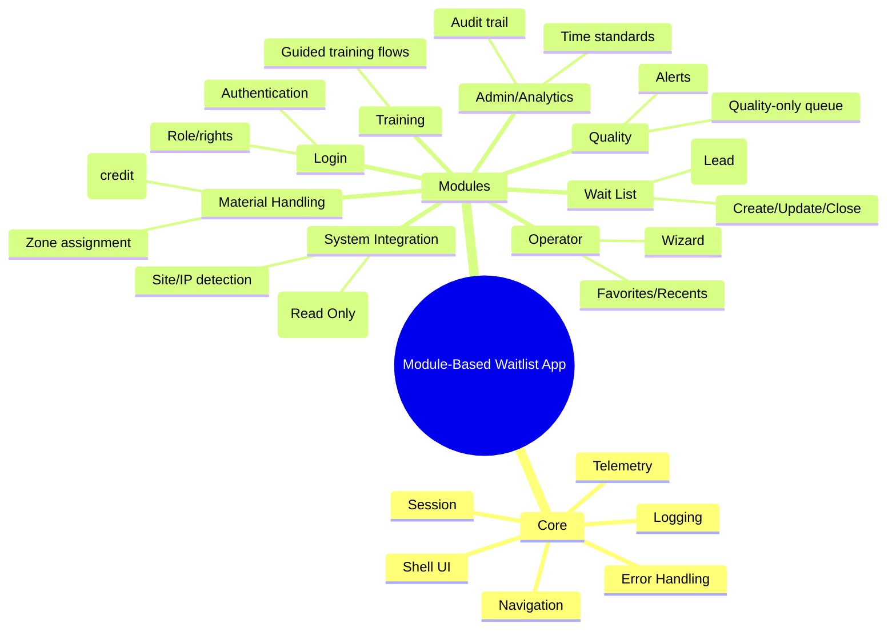
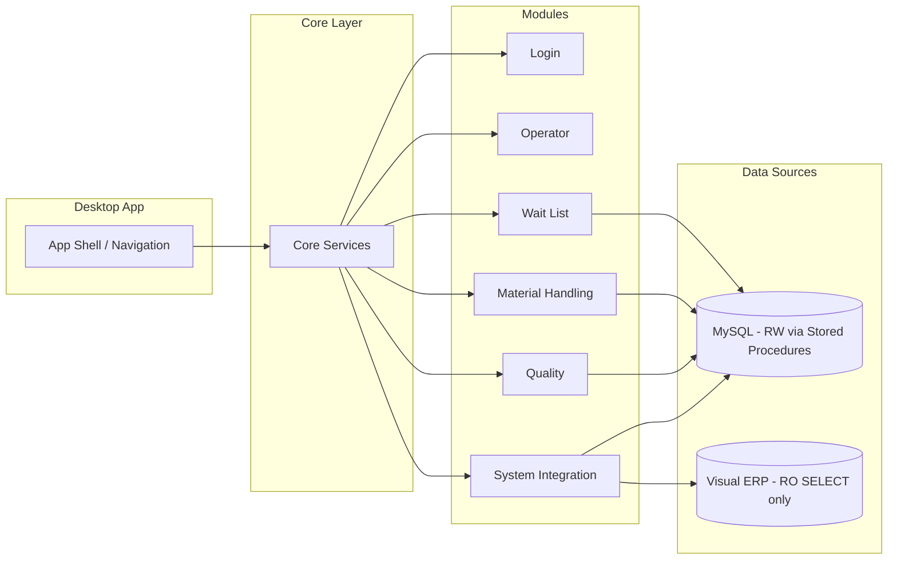
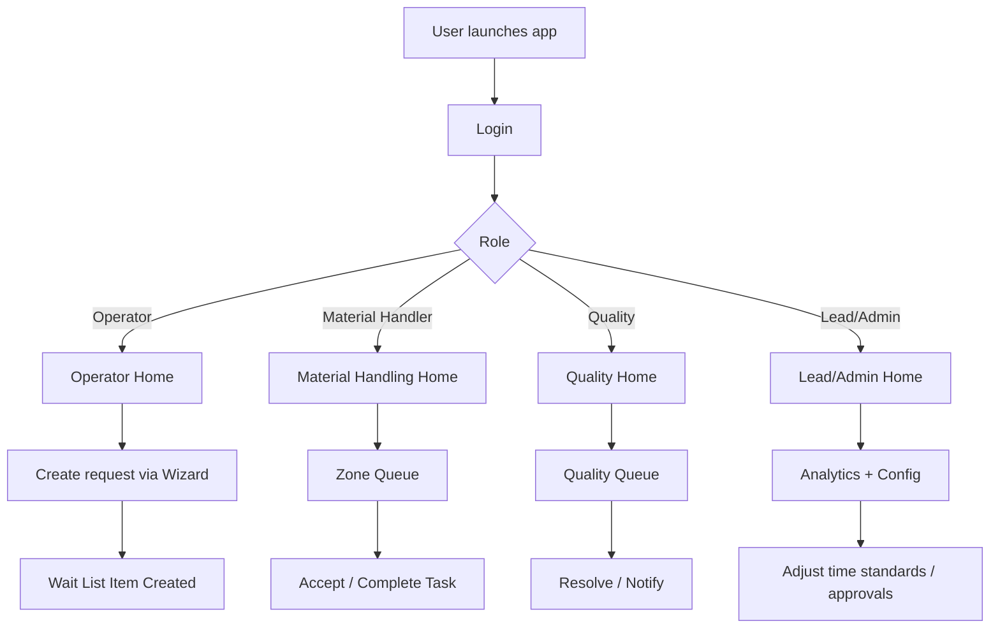
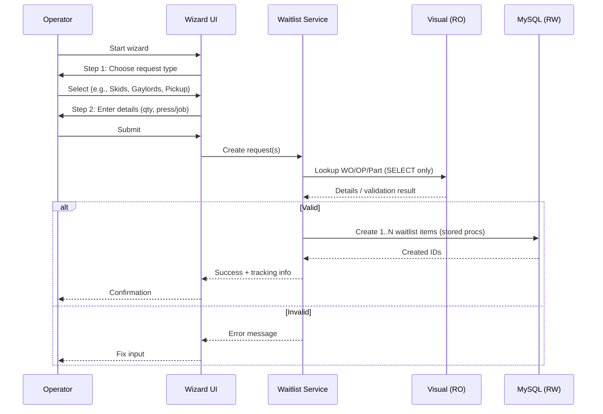
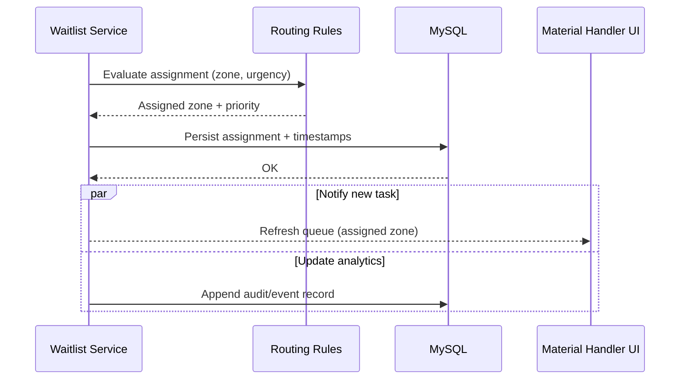
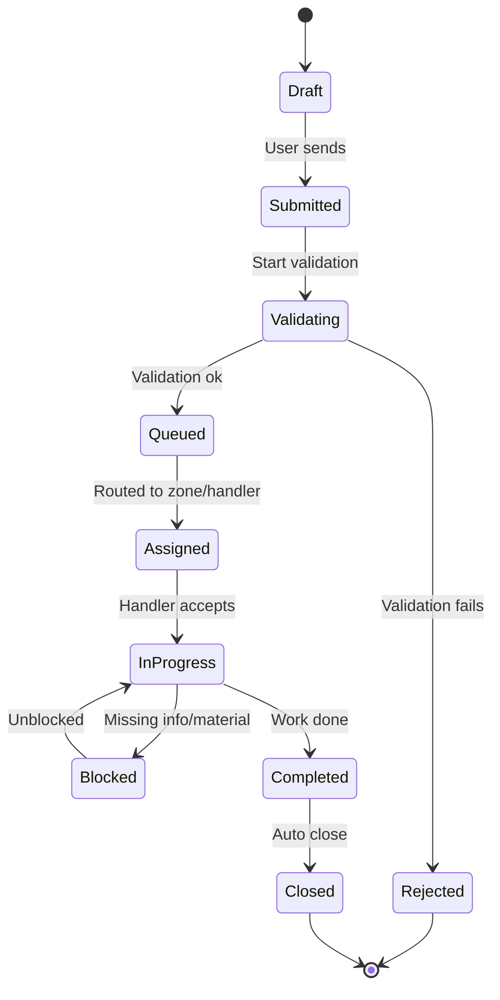
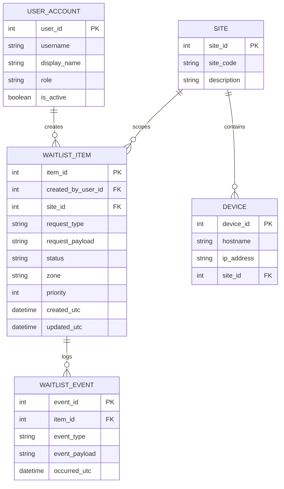
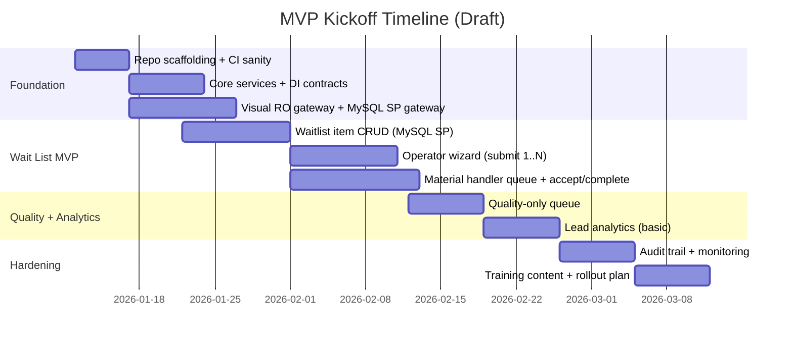

# Kickoff: Module-Based Waitlist Application (Implementation Starter)

> **Purpose**: A reusable, code-agnostic kickoff blueprint to start implementing the new module-based waitlist application discussed in the meeting notes.
>
> **Note**: Repo docs *prefer PlantUML*, but this kickoff uses **Mermaid** diagrams per request. If you need PlantUML versions later, convert each diagram section.

## 1) What We’re Building (from meeting input)

### Goals

- A **desktop, module-based** application where each department/module is self-contained and changes don’t ripple across unrelated areas.
- Store all application state in **MySQL**.
- Integrate with **Visual ERP (SQL Server)** for **read-only** validation/lookups.
- Provide a **guided wizard** for operators to reduce training burden and input errors.
- Provide **favorites/recents** for quick repeat requests.
- A shared **Wait List** that everyone can see, but with **role-based analytics rights**.
- Support **zone-based routing/auto-assignment** for material handling.
- Support **Quality-only queue** and a plan for alerting/notification (subject to IT/security approvals).

### Non-goals (initial MVP)

- Writing to Visual ERP (explicitly forbidden).
- “Perfect” automated notifications (email/Teams/intercom) without security signoff.
- Full analytics suite on day 1 (start with essentials + audit trail).

### Hard constraints

- **Visual ERP is read-only**: `SELECT` only.
- **MySQL writes use stored procedures** (no raw SQL in app code).
- Must remain usable by non-tech-savvy operators: minimize typing, maximize guided choices.

## 2) Module Map (high-level)

## 3) Recommended Stack (best fit for this app)

### Framework + language

- **Framework**: Windows Desktop UI framework that supports strong MVVM + DI.
  - Recommended for your ecosystem: **WinUI 3 + .NET 8+**
- **Language**: **C#**

### Why this stack

- Fits the existing patterns you already have (MVVM, DI, modular folders, service/DAO layering).
- Good performance for kiosk/production floor use.
- Strong typing helps prevent binding/runtime errors.

### VS Code extensions (recommended)

- Mermaid preview/diagrams extension (for editing this doc and future specs)
- C# (Dev Kit)
- XAML tools
- markdownlint + Markdown All in One

### NuGet package shortlist (baseline)

- MVVM: `CommunityToolkit.Mvvm`
- DI/config/logging: `Microsoft.Extensions.DependencyInjection`, `Microsoft.Extensions.Configuration`, `Microsoft.Extensions.Logging`
- SQL Server RO integration: `Microsoft.Data.SqlClient`
- MySQL connectivity (if used at runtime): `MySql.Data` or equivalent (match org standards)
- Optional resilience: `Polly` (only if you want explicit retry policies)

## 4) MVVM Toolkit Patterns (code-agnostic)

Use these consistently across modules:

- **Observable state**: properties generated through MVVM toolkit attributes (no manual INotifyPropertyChanged boilerplate).
- **Commands**: generated command properties for UI actions.
- **Busy + status**: one standard pattern for `IsBusy` and `StatusMessage` (or equivalent) to drive loading indicators and prevent double-submits.
- **No business logic in Views**: views wire events + bindings only.
- **Services own business rules**; **DAOs own persistence**.

## 5) Core Architecture (layering + data sources)

## 6) Core Services Catalog (required for day-1 operability)

| Service | Purpose | Notes / Acceptance Criteria |
|---|---|---|
| Error Handling | Centralized user-friendly errors + exception capture | UI-safe messages; supports severity; logs details |
| Logging | Standard logging across modules | Correlate events by session/user/device |
| Navigation | Shell navigation + module routing | Role-based menu; deep-link to tasks |
| Session / Identity | Current user, role, rights, site | “Analytics rights” gate enforced here |
| Messaging / Event Bus | Cross-module notifications without tight coupling | Publish “waitlist updated”, “assignment changed” |
| Dispatcher / UI Thread | Safe UI updates from async operations | Avoid cross-thread exceptions |
| Configuration | App config + feature flags | Can disable notifications if not approved |
| Time Provider | Testable time + consistent timestamps | Use UTC for storage, local for display |
| Visual Gateway (RO) | Read-only lookups/validation against Visual | Must guarantee `SELECT` only |
| MySQL Stored Proc Gateway | All MySQL reads/writes via stored procs | No raw SQL in app code |
| Audit Trail | Append-only operational events | Who did what/when; supports reporting |
| Authorization | Fine-grained gating of analytics/admin | “Lead-only analytics” enforced |

## 7) Converters (UI helpers you will want early)

| Converter | Use | Example |
|---|---|---|
| Bool → Visibility | Hide/show panels | Show analytics tab only for leads |
| Inverse Bool | Enable controls when not busy | Disable submit while saving |
| Enum ↔ Display String | Friendly labels | “Red Zone”, “Normal”, etc. |
| DateTime/Offset Formatter | Display timestamps | “Created 2m ago” |
| Null → Placeholder | Stable UI bindings | Show “(none)” when missing |
| Role/Rights → Visibility | Authorization at UI level | Leads see analytics detail |

## 8) Key Workflows (Mermaid diagrams)

### 8.1 Role-based entry flow

### 8.2 Operator wizard → waitlist creation

### 8.3 Auto-assignment by zone/priority

### 8.4 Waitlist item lifecycle

## 9) Data Model Starter (MySQL; placeholder)

> **Important**: This is a conceptual ER model so you can start implementing services/DAOs and stored procedures. Adjust columns to match your final schema.

## 10) Implementation Sequence (the “first steps”)

### Phase 0 — Repo + scaffolding

1. Confirm target devices, Windows version, and deployment method.
2. Create the new solution/app shell with modular folder boundaries.
3. Wire DI + configuration + logging.
4. Add a minimal navigation shell that can show module placeholders.

### Phase 1 — Core services

1. Error handling service (UI safe + logging).
2. Session/identity service (user, role, analytics rights).
3. Navigation service + module registration.
4. Dispatcher/UI-thread service.
5. Event bus/messaging service.

### Phase 2 — Data access foundations

1. Visual RO gateway (SELECT-only enforcement).
2. MySQL stored procedure gateway (single way to call SPs).
3. Audit trail events.

### Phase 3 — Waitlist MVP

1. Waitlist domain model + statuses.
2. Waitlist CRUD via stored procedures.
3. Operator wizard to create waitlist items.
4. Material handler queue to accept/complete items.

### Phase 4 — Routing + quality + analytics

1. Zone-based routing rules (auto-assign).
2. Quality-only queue + workflow.
3. Lead analytics view (basic metrics + filtering).
4. Notification plan (email/Teams/intercom) behind feature flag.

## 11) MVP timeline (draft)

## 12) BMAD “implementation-ready” placeholders

Use these placeholders as prompts/inputs when driving implementation via BMAD.

### BMAD inputs (fill in)

- **App name**: `<TBD>`
- **Sites**: `<list of site codes>`
- **Roles**: `Operator | MaterialHandler | Quality | Lead | Admin`
- **Analytics rights**: `<definition>`
- **Zones**: `<list of zones>`
- **Waitlist request types**: `<list of request types>`
- **Validation rules** (Visual RO): `<WO/OP/Part checks>`
- **Notification channels** (approved?): `<none|email|teams|intercom>`

### BMAD task slices (repeat per module)

- Define module scope + navigation entry
- Define models (DTOs + persistence models)
- Define service contracts
- Define stored procedures (MySQL) + DAO methods
- Define ViewModels (state + commands)
- Define Views (bindings + UX)
- Add audit trail events
- Add tests (service + DAO)

## 13) Open questions (track early)

- Site identification: do we map by **hostname**, **IP**, or both?
- How are “favorites/recents” scoped: per user, per site, or shared?
- What is the minimum acceptable Quality alert path under security policy?
- What data must be captured for “credit” and analytics (start/stop timestamps, reassignment events, etc.)?

---

## Source Notes

This kickoff is derived from:

- MeetingOutline.md
- MeetingSummary.md
- MeetingTranscript.md
- MeetingModuleBreakdown.md
- MeetingFileBreakdown.md
