# Module_Bulk_Inventory — Data Entry Workflow Diagrams

Last Updated: 2026-03-08

> **Colour legend**
> - `◈` **GOTO node** — cross-diagram connector; find the matching `◀` entry node in the named diagram.
> - White/default — behaviour fully specified in the design docs
> - 🟠 **Orange** — partially specified; implementation details unclear
> - 🔴 **Red** — not accounted for in current docs; needs a decision before implementation

---

## Diagram A — Startup & Pre-Push

Covers: crash recovery check · credential guard · VMINVENT session pre-check · data entry ·
validation · push gate · consolidation · Visual launch.

```mermaid
flowchart TB

    %% ═══════════════════════════════════════
    %% § 0  APP STARTUP
    %% ═══════════════════════════════════════
    S([App starts])
    S --> SIR{"Stale InProgress audit records?<br/>&#40;status=InProgress older than 5 min&#41;"}
    SIR -- "None" --> CG
    SIR -- "Found" --> BNR["Show 'Interrupted Batch' banner<br/>Mark stale records → Failed<br/>Option: view in Summary · re-push"]
    BNR --> CG

    CG{"Credential guard<br/>IsAllowed?"}
    CG -- "Blocked: SHOP2 / MTMDC" --> NH["Nav item hidden<br/>Update Visual credentials in Settings"]
    NH --> STOP1(["― inaccessible ―"])
    CG -- "Allowed" --> NV["Nav item visible<br/>FooterMenuItems — Visibility=Collapsed until allowed"]
    NV --> OM["User opens Bulk Inventory"]

    %% ═══════════════════════════════════════
    %% § 1  VISUAL SESSION PRE-CHECK
    %% ═══════════════════════════════════════
    OM --> VR{"VMINVENT.exe<br/>already running?"}
    VR -- "No" --> GR["Grid ready — empty"]
    VR -- "Yes" --> LM{"Username in hub window title<br/>&#40;'Infor VISUAL - MTMFG/{user}'&#41;<br/>== IService_UserSessionManager<br/>.CurrentSession.User.VisualUsername<br/>&#40;case-insensitive&#41;?"}
    LM -- "Match" --> GR
    LM -- "Mismatch" --> CF["Inline error on view<br/>Push button disabled<br/>Close Visual or update credentials"]
    CF --> RE{"Conflict<br/>resolved?"}
    RE -- "User closes Visual" --> GR
    RE -- "User updates credentials" --> RCK["Inline error clears on credential save<br/>User manually re-clicks Push Batch<br/>to re-trigger credential guard"]
    RCK --> CG

    %% ═══════════════════════════════════════
    %% § 2  DATA ENTRY
    %% ═══════════════════════════════════════
    GR --> DE[/"Data entry grid<br/>ObservableCollection — editable inline<br/>Add · Delete · Clear All available"/]

    DE --> VAL["Validate All button"]
    VAL --> VQ["Query Infor Visual SQL Server<br/>PART table · location existence check"]
    VQ --> VW{"Warnings<br/>found?"}
    VW -- "None" --> DE
    VW -- "Warnings" --> IW["Inline warnings on rows<br/>no dialog shown"]
    IW --> DE

    DE --> PCHK{"Validation warnings<br/>present on any row?"}
    PCHK -- "No warnings" --> CON
    PCHK -- "Warnings exist" --> WP["Push Batch button disabled<br/>Resolve all warnings first<br/>&#40;re-run Validate All or fix rows&#41;"]
    WP --> DE

    %% ═══════════════════════════════════════
    %% § 3  CONSOLIDATION + VISUAL LAUNCH
    %% ═══════════════════════════════════════
    CON["Pre-push consolidation<br/>Group rows: same PartID + From + To — sum Qty<br/>Mark original rows → Consolidated<br/>Iterate over consolidated rows only"]

    CON --> LC{"VMINVENT running<br/>with correct user?"}
    LC -- "Yes — reuse" --> NAV["Navigate to module window<br/>via ALT+E, S"]
    LC -- "No" --> EP{"Exe accessible<br/>at settings path?"}
    EP -- "Not found" --> EF["Batch error<br/>Exe not found — check Settings › Shared Paths"]
    EP -- "Found" --> VL["Launch VMINVENT.exe<br/>-d MTMFG -u {user} -p {pw}<br/>⚠ credentials visible in Task Manager"]
    VL --> WW{"Hub window<br/>appears ≤ 30 s?"}
    WW -- "Appeared" --> NAV
    WW -- "Timeout" --> RB{"Retry budget<br/>remaining? (max 2)"}
    RB -- "Yes" --> VL
    RB -- "No" --> EF2["Batch Failed<br/>Visual did not start within retries"]

    %% ═══════════════════════════════════════════════════════════════
    %% 4 — PER-ROW AUTOMATION LOOP
    %% ═══════════════════════════════════════════════════════════════
    NAV --> GOTO_B(["◈ GOTO: Diagram B — Automation Loop<br/>Entry node: OVS"])
```

---

## Diagram B — Automation Loop

Covers: overlay on/off · cancel · per-row iteration · F6 skip · window-not-found recovery (kill +
relaunch + retry from row start) · row type branch · audit update · summary.

```mermaid
flowchart TB

    ENTRY_B(["◀ From: Diagram A — Node NAV"])
    ENTRY_B --> OVS

    %% ═══════════════════════════════════════
    %% OVERLAY ON
    %% ═══════════════════════════════════════
    OVS["Show full-screen overlay<br/>IsAutomationRunning = true<br/>All app mouse+keyboard input blocked<br/>Only Cancel button remains active"]
    OVS --> RL{"More consolidated<br/>rows to process?"}

    RL -- "None remaining" --> OVH["Hide overlay<br/>IsAutomationRunning = false"]
    OVH --> SUM

    %% ═══════════════════════════════════════
    %% PER-ROW
    %% ═══════════════════════════════════════
    RL -- "Next row" --> CCHK{"CancellationToken<br/>fired?"}
    CCHK -- "Yes — cancelled" --> CLC["Stop all UI automation<br/>Send Escape → close partial Visual window<br/>Current row → Skipped · update audit record"]
    CLC --> OVH

    CCHK -- "No" --> AUD["Write MySQL audit record<br/>status = InProgress<br/>before any keystrokes sent"]

    AUD --> FCHK{"F6 — skip this row?"}
    FCHK -- "Yes" --> SKP["Row → Skipped · update audit record"]
    SKP --> RL
    FCHK -- "No" --> WF{"Module window<br/>found?"}
    WF -- "Found" --> TB{"Transaction type?"}

    %% ═══════════════════════════════════════
    %% WINDOW-NOT-FOUND RECOVERY
    %% ═══════════════════════════════════════
    WF -- "Not found" --> WFR{"Row retry<br/>budget < 2?"}
    WFR -- "Budget exhausted" --> WFF["Row → Failed<br/>Module window not found after relaunch"]
    WFF --> UPDF

    WFR -- "Retry" --> KV["Kill all VMINVENT.exe processes<br/>&#40;window did not exist — no fields to clear&#41;"]
    KV --> RVL["Re-launch VMINVENT.exe<br/>-d MTMFG -u {user} -p {pw}"]
    RVL --> RWW{"Hub window<br/>appears ≤ 30 s?"}
    RWW -- "Appeared" --> RNAV["Navigate to module window<br/>via ALT+E, S"]
    RNAV --> WF
    RWW -- "Timeout" --> WFF

    %% ═══════════════════════════════════════
    %% CROSS-DIAGRAM BRANCHES
    %% ═══════════════════════════════════════
    TB -- "Transfer" --> GOTO_C(["◈ GOTO: Diagram C — Transfer Mode<br/>Entry node: T1"])
    TB -- "New Transaction" --> GOTO_D(["◈ GOTO: Diagram D — New Transaction Mode<br/>Entry node: NW"])

    %% ═══════════════════════════════════════
    %% AUDIT UPDATE — returned from C or D
    %% ═══════════════════════════════════════
    ENTRY_UPDS(["◀ From: Diagram C or D — Row Success"]) --> UPDS
    ENTRY_UPDF(["◀ From: Diagram C or D — Row Failed"]) --> UPDF

    UPDS["Update audit record — Success<br/>+ optional Visual state read-back"]
    UPDF["Update audit record — Failed"]
    UPDS --> RL
    UPDF --> RL

    %% ═══════════════════════════════════════
    %% § 5  SUMMARY
    %% ═══════════════════════════════════════
    SUM["Summary screen<br/>Success · Failed · Skipped counts"]
    SUM --> RPF["Re-push Failed rows<br/>User selects subset · re-triggers loop<br/>Consolidation skipped — rows pushed as-is"]
    RPF --> DONE(["Session complete"])
    SUM --> DONE
```

---

## Diagram C — Transfer Mode

Covers: Part ID fill · Parts popup guard · field fill sequence · TAB-triggered duplicate popup ·
WaitingForConfirmation timeout.

```mermaid
flowchart TB

    ENTRY_C(["◀ From: Diagram B — Node TB (Transfer)"])
    ENTRY_C --> T1

    %% ═══════════════════════════════════════
    %% PART ID + PARTS POPUP GUARD
    %% ═══════════════════════════════════════
    T1["FillField 4102  Part ID"]
    T1 --> T1W["await ~1 s — Visual processes Part ID"]

    T1W --> PA{"WaitForPopupAsync<br/>class: Gupta:AccFrame · title: Parts<br/>settle ≤ 2 s · poll 100 ms"}
    PA -- "IntPtr.Zero — no popup" --> T4
    PA -- "hwnd found — popup appeared" --> PFG{"SetForegroundVerified<br/>returns true?"}
    PFG -- "No — focus not acquired" --> RFOC["Row → Failed<br/>Could not focus Parts popup"]
    PFG -- "Yes" --> PDA["{UP} {ENTER}<br/>WaitForWindowToCloseAsync 3 s"]
    PDA --> PDR{"Closed ≤ 3 s?"}
    PDR -- "Yes" --> T4
    PDR -- "Timeout" --> RFPS["Row → Failed<br/>Parts popup did not close"]

    %% ═══════════════════════════════════════
    %% FIELD FILL SEQUENCE
    %% ═══════════════════════════════════════
    T4["FillField 4111  Quantity"]
    T4 --> T5["FillField 4123  From Warehouse &#40;default 002&#41;"]
    T5 --> T6["FillField 4124  From Location"]
    T6 --> T7["FillField 4142  To Warehouse &#40;default 002&#41;"]
    T7 --> T8["FillField 4143  To Location + TAB<br/>TAB triggers server duplicate check"]

    %% ═══════════════════════════════════════
    %% DUPLICATE WARNING POPUP
    %% ═══════════════════════════════════════
    T8 --> PB2{"WaitForPopupAsync<br/>class: Gupta:AccFrame<br/>title: Inventory Transaction Entry<br/>settle ≤ 2 s · poll 100 ms"}
    PB2 -- "IntPtr.Zero — no popup" --> TS["Row → Success"]
    PB2 -- "hwnd found — duplicate warning" --> WC["Row → WaitingForConfirmation<br/>Overlay: ⚠ Please respond to the dialog in Infor Visual"]

    WC --> WCW{"WaitForWindowToCloseAsync<br/>5 min timeout · poll 200 ms<br/>CancellationToken active"}
    WCW -- "User dismisses popup" --> TS
    WCW -- "5 min timeout" --> RF_T["Row → Failed<br/>User did not confirm in time"]
    WCW -- "CancellationToken" --> RF_C["Row → Failed<br/>User cancelled"]

    %% ═══════════════════════════════════════
    %% RETURN TO AUTOMATION LOOP
    %% ═══════════════════════════════════════
    TS   --> GOTO_UPDS_C(["◈ GOTO: Diagram B — Automation Loop<br/>Entry node: ENTRY_UPDS"])
    RFOC --> GOTO_UPDF_C(["◈ GOTO: Diagram B — Automation Loop<br/>Entry node: ENTRY_UPDF"])
    RFPS --> GOTO_UPDF_C
    RF_T --> GOTO_UPDF_C
    RF_C --> GOTO_UPDF_C
```

---

## Diagram D — New Transaction Mode

Covers: Transfer window cleanup guard · Work Order fill · Parts popup guard · Lot No · Quantity ·
To Warehouse · To Location.

```mermaid
flowchart TB

    ENTRY_D(["◀ From: Diagram B — Node TB (New Transaction)"])
    ENTRY_D --> NW

    %% ═══════════════════════════════════════
    %% WINDOW FIND + TRANSFER CLEANUP
    %% ═══════════════════════════════════════
    NW["FindWindow<br/>title: Inventory Transaction Entry - Infor VISUAL - MTMFG"]
    NW --> NTC["If _appOpenedTransferWindow = true:<br/>Send WM_CLOSE to Transfer window<br/>Set _appOpenedTransferWindow = false"]

    %% ═══════════════════════════════════════
    %% FIELD FILL SEQUENCE
    %% ═══════════════════════════════════════
    NTC --> N1["FillField 4115  Work Order + TAB<br/>Format: WO-######  &#40;e.g. WO-123456&#41;"]

    N1 --> NPA{"WaitForPopupAsync<br/>class: Gupta:AccFrame · title: Parts<br/>settle ≤ 2 s — precautionary check"}
    NPA -- "No popup" --> N3
    NPA -- "Popup appeared" --> NPD["{UP} {ENTER}<br/>WaitForWindowToCloseAsync 3 s"]
    NPD --> N3

    N3["FillField 4116  Lot No + TAB &#40;default 1&#41;"]
    N3 --> N4["FillField 4143  Quantity<br/>⚠ same AutomationId as Transfer To-Location"]
    N4 --> N5["FillField 4148  To Warehouse &#40;default 002&#41;"]
    N5 --> N6["FillField 4152  To Location + TAB"]
    N6 --> NTS["Row → Success"]

    %% ═══════════════════════════════════════
    %% RETURN TO AUTOMATION LOOP
    %% ═══════════════════════════════════════
    NTS --> GOTO_UPDS_D(["◈ GOTO: Diagram B — Automation Loop<br/>Entry node: ENTRY_UPDS"])
```

---

## Decision Log

| Item | Status | Resolution |
|------|--------|------------|
| **Push with warnings** | ✅ Resolved | Push Batch button disabled while any row carries a validation warning. §2.3 updated. |
| **Cancel cleanup** | ✅ Resolved | CancellationToken fired → stop automation → send `Escape` to close partial Visual window → current row → `Skipped` → audit updated → overlay hidden. §3.4 updated. |
| **Transfer window close guard** | ✅ Resolved | `_appOpenedTransferWindow` bool on `Service_VisualInventoryAutomation`; set `true` after successful `LaunchVMINVENT()`, `false` if window was already present on pre-check. Diagram D updated. |
| **Re-push Failed rows** | ✅ Resolved | Re-push runs the automation loop filtered to selected rows only; consolidation is skipped — rows pushed as-is. Diagram B §5 updated. |
| **Crash recovery / stale `InProgress` records** | ✅ Resolved | On app startup query `bulk_inventory_transactions` for `InProgress` records older than 5 min; mark as `Failed`, show "Interrupted Batch" banner with re-push option. Diagram A §0 updated. |
| **Window not found — retry restart point** | ✅ Resolved | Kill all VMINVENT.exe processes (window did not exist — no fields to clear), re-launch Visual, navigate to module window, retry row from field-fill step 1. Max 2 retries; 3rd failure → row `Failed`. Diagram B window-not-found sub-flow updated. |
| **Delete row during active push** | ✅ Resolved | Full-screen overlay blocks all app mouse and keyboard input during automation — mechanically impossible for the user to delete a row mid-push. No additional code guard required. |

## Orange nodes — partially specified

| Node | Gap |
|------|-----|
| **Visual conflict — resolve UX** | ✅ Resolved | After saving new credentials the inline error clears; the user must manually re-click Push Batch to re-trigger the credential guard check. Diagram A node `RCK` updated. |