# Module Rebuild - Architecture Diagrams

<style>
@media print {
  .page-break { page-break-after: always; }
  
  /* Ensure diagrams take up available space and are centered */
  .mermaid, pre.mermaid {
    width: 100%;
    display: flex;
    justify-content: center;
    margin: 0 auto;
  }
  
  /* Container to assist centering and spacing */
  .centered-diagram {
    width: 100%;
    display: flex;
    justify-content: center;
    align-items: center;
    margin-top: 1em;
    margin-bottom: 1em;
  }
}
</style>

**Version:** 2.0.0 | **Date:** January 15, 2026

This document contains visual representations of the key architectural concepts for the module rebuild.

---

## Diagram 1-A: Monolithic Service Architecture (Before)

**Description:** The legacy architecture where ViewModels communicate directly with monolithic services that handle all responsibility (validation, logging, data access), leading to high coupling.

<div class="centered-diagram">


</div>

<div class="page-break"></div>

## Diagram 1-B: CQRS & MediatR Architecture (After)

**Description:** The target architecture using CQRS pattern. ViewModels send messages to a MediatR router, which dispatches them to single-responsibility handlers through a pipeline of cross-cutting behaviors.

<div class="centered-diagram">


</div>

---

<div class="page-break"></div>

## Diagram 2: CQRS Command/Query Separation

**Description:** Illustrates how operations are separated into Commands (writes) and Queries (reads) with different characteristics.

<div class="centered-diagram">


</div>

---

<div class="page-break"></div>

## Diagram 3: Pipeline Behaviors Flow

**Description:** Shows how cross-cutting concerns (logging, validation, auditing) are applied automatically through MediatR pipeline behaviors.

<div class="centered-diagram">


</div>

<div class="page-break"></div>

---

## Diagram 4: Exception Handling Pattern

**Description:** Try-Catch pattern used in each handler to ensure no exceptions bubble up to the UI layer.

<div class="centered-diagram">


</div>

<div class="page-break"></div>

---

## Diagram 5-A: Module Dependencies (Before)

**Description:** Current state showing heavy coupling between the Receiving module and the Core module, with specific business logic leaking into shared services.

```mermaid
graph TD
    subgraph Module_Receiving_Before["Module_Receiving (Before)"]
        A[ViewModels] --> B["Module_Core Services:<br/>• ReceivingLineService<br/>• ValidationService<br/>• CSVWriter<br/>• LoggingUtility"]
    end
    
    Note1["❌ Problem: Module_Core bloated<br/>with module-specific services"]
    
    style B fill:#f99,stroke:#333,stroke-width:2px
```

<div class="centered-diagram">



</div>

## Diagram 5-B: Module Dependencies (After)

**Description:** Target state showing a self-contained Receiving module. It owns its own data access and business logic, only depending on Module_Core for generic infrastructure (Windowing, Error Handling).

```mermaid
graph TD
    subgraph Module_Receiving_After["Module_Receiving (After)"]
        A[ViewModels] --> B[MediatR Mediator]
        B --> C["Self-Contained:<br/>• Handlers<br/>• Validators<br/>• DAOs"]
        
        D["Uses from Module_Core:<br/>• ErrorHandler generic<br/>• WindowManager generic<br/>• Dispatcher generic"]
    end
    
    Note2["✅ Solution: Module is self-contained<br/>Only uses generic core services"]
    
    style C fill:#9f9,stroke:#333,stroke-width:2px
    style D fill:#9cf,stroke:#333,stroke-width:1px,stroke-dasharray: 5 5
```

<div class="centered-diagram">



</div>

<div class="page-break"></div>

---

## Diagram 6: Folder Structure

**Description:** New folder organization within the module for CQRS architecture.

```
📁 Module_Name/
├── 📂 Data/              # DAO classes for database operations (Dao_Entity1.cs, Dao_Entity2.cs)
├── 📂 Models/            # Domain entities and result types (Model_Entity1.cs, Model_DaoResult.cs)
├── 📂 Handlers/          # CQRS command/query handlers (separated by operation type)
│   ├── 📂 Queries/       # Read operations (GetEntityQuery.cs, GetEntityHandler.cs)
│   └── 📂 Commands/      # Write operations (InsertEntityCommand.cs, InsertEntityHandler.cs)
├── 📂 Validators/        # FluentValidation rules for commands (InsertEntityValidator.cs, UpdateEntityValidator.cs)
├── 📂 Behaviors/         # Cross-cutting concerns (LoggingBehavior.cs, ValidationBehavior.cs, AuditBehavior.cs)
├── 📂 ViewModels/        # WPF ViewModels that use MediatR (ViewModel_Feature1.cs, ViewModel_Base.cs)
├── 📂 Views/             # XAML user interface files (View_Feature1.xaml)
├── 📂 Defaults/          # Module configuration and constants (DefaultConfiguration.cs)
└── 📄 README.md          # Module documentation
```

<div class="page-break"></div>

---

## Diagram 7: Validation Flow with FluentValidation

**Description:** How validation rules are applied automatically before command execution.

```mermaid
%%{init: {'themeVariables': {'fontSize': '14px'}, 'flowchart': {'nodeSpacing': 18, 'rankSpacing': 18}}}%%
graph TD
    A[Command Created in ViewModel] --> B[MediatR.Send command]
    B --> C["Validation Pipeline Behavior<br/>Find validator auto-discovered"]
    C --> D["Execute validation rules:<br/>• RuleFor x.Name NotEmpty MaxLength 100<br/>• RuleFor x.Quantity GreaterThan 0"]
    D --> E{Is Valid?}
    E -->|Yes| F[Continue to handler]
    E -->|No| G["Return Failure<br/>with error list"]
    
    style C fill:#fc9,stroke:#333,stroke-width:2px
    style D fill:#fc9,stroke:#333,stroke-width:2px
    style F fill:#9f9,stroke:#333,stroke-width:2px
    style G fill:#f99,stroke:#333,stroke-width:2px
```

<div class="centered-diagram">



</div>

<div class="page-break"></div>

---

## Diagram 8: Audit Trail & Security Flow

**Description:** How user context and audit information flows through the system.

```mermaid
%%{init: {'themeVariables': {'fontSize': '12px'}, 'flowchart': {'nodeSpacing': 12, 'rankSpacing': 12}}}%%
graph TD
    A[User Action in UI] --> B["ViewModel Creates Command<br/>• Data to save<br/>• No user context yet"]
    B --> C[MediatR Sends Command]
    C --> D["Audit Pipeline Behavior<br/>Enriches with:<br/>• User ID • Session ID<br/>• Timestamp • Machine<br/>• Operation Type"]
    D --> E["Logging Behavior<br/>Structured log:<br/>• Operation InsertEntity<br/>• User john.doe<br/>• Timestamp<br/>• Parameters sanitized"]
    E --> F[Handler Executes]
    F --> G["DAO Saves to Database<br/>Audit columns:<br/>• CreatedBy<br/>• CreatedDate<br/>• ModifiedBy<br/>• ModifiedDate"]
    G --> H["Audit Log Complete<br/>✅ Database audit trail<br/>✅ Serilog detailed event<br/>✅ Can trace all actions"]
    
    style D fill:#f9c,stroke:#333,stroke-width:2px
    style E fill:#9cf,stroke:#333,stroke-width:2px
    style G fill:#fc9,stroke:#333,stroke-width:2px
    style H fill:#9f9,stroke:#333,stroke-width:2px
```

<div class="centered-diagram">



</div>

<div class="page-break"></div>

---

## Diagram 9: Performance Monitoring Points

**Description:** Key points where performance metrics should be captured.

```mermaid
%%{init: {'themeVariables': {'fontSize': '14px'}, 'flowchart': {'nodeSpacing': 18, 'rankSpacing': 18}}}%%
graph TD
    A["⏱ Request Start<br/>Start Timer"] --> B["📊 Validation<br/>Metric: Validation Time<br/>Metric: Validation Failures<br/>Target: &lt; 10ms"]
    B --> C["⏱ Handler Execution Start<br/>Handler Timer Start"]
    C --> D["📊 DAO Call<br/>Metric: Query Execution Time<br/>Metric: Database Round-trips<br/>Target: &lt; 50ms"]
    D --> E["⏱ Handler Execution End<br/>Handler Timer Stop<br/>📊 Metric: Handler Duration<br/>Target: &lt; 100ms"]
    E --> F["⏱ Request Complete<br/>Total Timer Stop<br/>📊 Metric: End-to-End Duration<br/>📊 Metric: Success/Failure<br/>Target: &lt; 200ms"]
    
    style A fill:#9cf,stroke:#333,stroke-width:2px
    style B fill:#fc9,stroke:#333,stroke-width:2px
    style D fill:#fc9,stroke:#333,stroke-width:2px
    style F fill:#9f9,stroke:#333,stroke-width:2px
```

<div class="centered-diagram">



</div>

<div class="page-break"></div>

---

## Diagram 10: Implementation Phase Timeline

**Description:** Six-week implementation timeline with key milestones.


</div> 

---