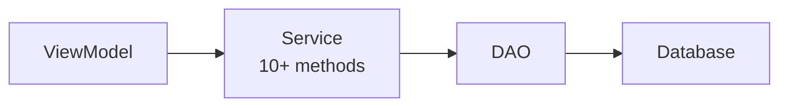
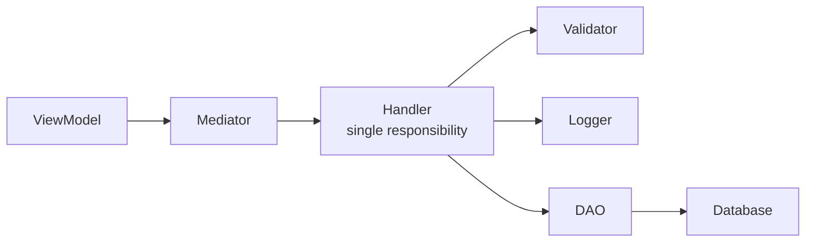

# Module Rebuild - Implementation Guide

**Version:** 2.0.0 | **Date:** January 15, 2026 | **Estimated Effort:** 6-8 weeks

---

## Executive Summary

Complete architectural redesign of any module using modern patterns and industry-standard libraries to create a highly modular, testable, and maintainable codebase.

**Key Objectives:**

- Reduce Module_Core service count by 50%
- Implement CQRS (Command Query Responsibility Segregation) pattern
- Improve testability through proper abstraction
- Enable true modular independence

---

## Current State Analysis

### Problems to Solve

1. **Service Bloat** - Too many module-specific services in shared Module_Core
2. **Tight Coupling** - ViewModels, Services, and Data Access Objects not properly abstracted
3. **Limited Modularity** - Module depends heavily on Module_Core
4. **Testing Challenges** - Difficult to test due to tight coupling
5. **Maintenance Burden** - Changes ripple across Module_Core

### What Works Well

- Strict MVVM architecture with partial ViewModels
- Instance-based Data Access Objects returning structured results
- Dependency Injection configured centrally
- WinUI 3 with compile-time data binding
- Stored procedures for all MySQL operations

### What Needs Improvement

- Service layer is monolithic (single service with 10+ methods)
- Navigation is custom-built and tightly coupled
- Validation logic scattered across layers
- Logging lacks structured context
- Export functionality uses custom writers instead of proven libraries

---

## Target Architecture

### Modern Architecture Stack

**Adopted Patterns:**

1. **CQRS** - Separates read (Queries) from write (Commands) operations
2. **Structured Logging** - Serilog with semantic context for diagnostics
3. **Declarative Validation** - FluentValidation for composable rules
4. **Type-Safe Export** - CsvHelper or similar libraries
5. **Resilience Patterns** - Optional Polly for retry policies

**Library Selection:**

<table border="1">
  <thead>
    <tr>
      <th>Category</th>
      <th>Library</th>
      <th>Downloads</th>
      <th>Justification</th>
    </tr>
  </thead>
  <tbody>
    <tr>
      <td>Mediator (CQRS)</td>
      <td>MediatR 12.0+</td>
      <td>607M+</td>
      <td>Industry standard, reduces service files</td>
    </tr>
    <tr>
      <td>Logging</td>
      <td>Serilog 3.1+</td>
      <td>2.3B+</td>
      <td>Structured logging, excellent ecosystem</td>
    </tr>
    <tr>
      <td>Validation</td>
      <td>FluentValidation 11.8+</td>
      <td>741M+</td>
      <td>Strongly-typed validation rules</td>
    </tr>
    <tr>
      <td>CSV Export</td>
      <td>CsvHelper 30.0+</td>
      <td>34M+</td>
      <td>Mature, feature-rich</td>
    </tr>
  </tbody>
</table>

### Architectural Layers

The architecture consists of:

- **Presentation Layer:** Views (XAML) and ViewModels (presentation logic)
- **Application Layer:** Handlers (CQRS commands/queries), Pipeline Behaviors
- **Validation Layer:** FluentValidation declarative validators
- **Data Access Layer:** Instance-based Data Access Objects
- **Domain Layer:** Models (business entities)

### Data Flow Transformation

**Current (Service Pattern):**



**New (CQRS Pattern):**



**Benefits:**

- Each handler is one class with one responsibility
- Easy to add cross-cutting concerns (logging, validation) via pipeline behaviors
- Handlers are highly testable with mocked dependencies
- Reduces large service files into small, focused handler classes

---

## Constitutional Constraints (Non-Negotiable)

### I. MVVM Architecture

- ViewModels SHALL NOT directly call Data Access Objects
- ViewModels SHALL NOT access database helpers or connection strings
- All data access MUST flow through Service or Mediator layer
- All ViewModels MUST be partial classes
- All data binding MUST use compile-time binding (x:Bind)

### II. Database Layer

- All MySQL operations MUST use stored procedures (no raw SQL)
- All Data Access Objects MUST return structured result objects
- Data Access Objects MUST be instance-based
- SQL Server (Infor Visual) is READ ONLY

### III. Dependency Injection

- All services MUST be registered in central configuration
- Constructor injection REQUIRED
- Service locator pattern is FORBIDDEN

### IV. Error Handling

- Use centralized error handler for user-facing errors
- Use structured logging for diagnostics
- Data Access Objects MUST NOT throw exceptions (return failure results)

### V. Code Quality

- Explicit accessibility modifiers required
- Braces required for all control flow statements
- Async methods MUST end with "Async" suffix
- XML documentation required for public APIs

---

## Implementation Strategy

### Phase 1: Foundation & Setup (Week 1)

**Objective:** Install packages, create folder structure, configure dependency injection

**Key Tasks:**

1. Install NuGet packages (MediatR, Serilog, FluentValidation, CsvHelper)
2. Create folder structure for Handlers, Validators, Defaults
3. Configure Serilog for structured logging
4. Register MediatR with pipeline behaviors
5. Register FluentValidation auto-discovery

**Deliverables:**

- All packages installed and configured
- Folder structure established
- Dependency injection configured
- Logging outputs to daily rolling files

---

### Phase 2: Models & Validation (Week 1-2)

**Objective:** Review existing models and create declarative validators

**Key Tasks:**

1. Review all existing model classes
2. Create FluentValidation validators for each model
3. Define validation rules with custom error messages
4. Create default configuration models
5. Write unit tests for validators

**Validation Approach:**
Instead of scattered validation logic, validation rules are defined in dedicated validator classes that are:

- Strongly-typed (compile-time checked)
- Composable (rules can be shared)
- Testable (easy to verify)
- Centralized (single source of truth)

**Deliverables:**

- All models documented
- Validators created
- Unit tests for validation rules
- Default configuration values defined

---

### Phase 3: CQRS Handlers (Week 2-3)

**Objective:** Replace Service methods with MediatR handlers

**Migration Pattern:**

**Before:** Single service class with multiple methods

- InsertEntity, UpdateEntity, GetEntities, DeleteEntity, etc.

**After:** Separate handler classes

- GetEntitiesQuery + GetEntitiesHandler (read operation)
- InsertEntityCommand + InsertEntityHandler (write operation)
- UpdateEntityCommand + UpdateEntityHandler (write operation)
- DeleteEntityCommand + DeleteEntityHandler (write operation)

**Key Concepts:**

**Queries (Read Operations):**

- Retrieve data without modifying state
- Can be cached or optimized independently
- Return data transfer objects

**Commands (Write Operations):**

- Modify application state
- Include validation before execution
- Return success/failure results

**Pipeline Behaviors:**

- Logging Behavior - Automatically logs all handler executions
- Validation Behavior - Validates commands before execution
- Transaction Behavior (Optional) - Wraps commands in transactions

**Deliverables:**

- All service methods migrated to handlers
- ViewModels updated to use Mediator
- Pipeline behaviors implemented
- Unit tests for all handlers

---

### Phase 4: ViewModels & Navigation (Week 3-4)

**Objective:** Refactor ViewModels to use Mediator pattern

**ViewModel Changes:**

- **Before:** ViewModels injected multiple specific services
- **After:** ViewModels inject single Mediator interface

**Benefits:**

- Reduced coupling to service implementations
- Easier to mock for testing
- Clearer separation of concerns
- Easier to add operations without modifying ViewModel

**Deliverables:**

- All ViewModels refactored to use Mediator
- Logging updated to use Serilog
- Navigation strategy implemented
- All ViewModels registered in dependency injection

---

### Phase 5: Services Cleanup (Week 4)

**Objective:** Remove module-specific services from Module_Core

**Services to Remove/Replace (Examples):**

1. Module-specific data services → Replaced by MediatR handlers
2. Module-specific validation services → Replaced by FluentValidation
3. Custom export writers → Replaced by CsvHelper or similar
4. Custom logging utilities → Replaced by Serilog

**Services to Keep:**

- Error Handler Service
- Window Management Service
- UI Thread Dispatcher Service

**Deliverables:**

- Module-specific services removed from Module_Core
- Generic export service created if needed
- Dependency injection updated
- Zero compilation errors

---

### Phase 6: Testing & Documentation (Week 5)

**Objective:** Achieve 80% test coverage and update documentation

**Testing Strategy:**

**Unit Tests:**

- ViewModels with mocked Mediator
- Handlers with mocked Data Access Objects
- Validators with test data

**Integration Tests:**

- Data Access Objects against test database
- End-to-end workflow scenarios

**Documentation Updates:**

- Module README with architecture overview
- Architecture document with design decisions
- End-User How-To Guide (step-by-step usage instructions)
- Changelog with all changes
- Updated Copilot instructions

**Deliverables:**

- 80% unit test coverage achieved
- Integration tests for all Data Access Objects
- All documentation updated (including end-user guide)
- Code review completed

---

## Suggested Documentation Files (Module-Agnostic)

These files should exist for any module to support development, troubleshooting, and onboarding.

### Core Documentation Files (High Priority)

- **README.md (Module Root)**
  - Purpose: Entry point for module understanding.
  - Include: module purpose/scope, key components, dependencies, and a quick-start pointer to preparation workflow.

- **ARCHITECTURE.md**
  - Purpose: Deep dive into architecture, patterns, and design decisions.
  - Include: MVVM usage, service responsibilities, DAO pattern, error handling, validation, and database interaction constraints.

- **DATA_MODEL.md**
  - Purpose: Database schema reference.
  - Include: PlantUML ERD, table schemas, stored procedures, foreign keys, and indexing notes.

- **WORKFLOWS.md**
  - Purpose: Visual and textual description of user workflows.
  - Include: workflow steps, state transitions, user interactions, ViewModel data flow, and session management notes.

### Preparation Files (Planning & Implementation)

- **Preparation/03_Clarification_Questions.md**
  - Purpose: Questions to answer before implementation begins.
  - Include: architecture decisions, database constraints, dependencies, validation/testing expectations, UI/UX constraints, and deployment requirements.

- **Preparation/04_Implementation_Order.md**
  - Purpose: Step-by-step development plan.
  - Include: phases, milestones, and step dependencies.

- **Preparation/05_Task_Checklist.md**
  - Purpose: Granular task tracking.
  - Include: setup, model/DAO/validator, ViewModel/navigation, testing, documentation, and code review tasks.

- **Preparation/06_Schematic_File.md**
  - Purpose: Visual diagrams and schematics.
  - Include: folder structure schematic, architecture diagram (PlantUML), workflow state diagram (PlantUML), and data flow diagram (PlantUML).

- **Preparation/07_Research_Archive.md**
  - Purpose: Store research notes, links, and investigation findings.
  - Include: library research, architecture references, testing strategies, and performance/migration notes.

### Runtime Documentation (Developer Experience)

- **DEFAULTS.md**
  - Purpose: Document default values and configuration settings.
  - Include: default validation rules, workflow settings, and export settings.

- **TROUBLESHOOTING.md**
  - Purpose: Common issues and solutions.
  - Include: frequent binding/DI errors, common runtime exceptions, and diagnostic steps.

---

## Success Metrics

### Quantitative Goals

- Reduce Module_Core service count by 50%
- Achieve 80%+ test coverage
- Reduce average service file size from 500 to under 100 lines
- Maintain or improve performance
- Zero architectural violations

### Qualitative Goals

- **Modularity:** Module is 100% self-contained
- **Testability:** Easy to mock Mediator for testing
- **Maintainability:** One handler = one responsibility
- **Scalability:** Easy to add operations without modifying existing code
- **Developer Experience:** Clear patterns for new features

---

## Exception Handling Strategy

**Approach: Try-Catch in Each Handler**

Each handler wraps its logic in try-catch block and returns failure result instead of throwing exceptions.

**Implementation:**

- Catch specific exception types that are expected (DbException, ValidationException)
- Create user-friendly error message for each exception type
- Return structured failure result with error details
- Log exceptions with full context for debugging

**Benefits:**

- Fine-grained control over error handling per handler
- Explicit error messages tailored to specific operations
- No unhandled exceptions bubbling up to UI
- Consistent error format via Model_Dao_Result

**Example Pattern:**

```csharp
public async Task<Model_Dao_Result> Handle(InsertEntityCommand request)
{
    try
    {
        // Handler logic here
        var result = await _dao.InsertAsync(request.Entity);
        return result;
    }
    catch (DbException ex)
    {
        _logger.LogError(ex, "Database error inserting entity");
        return Model_Dao_Result.Failure("Failed to save entity. Please try again.");
    }
    catch (Exception ex)
    {
        _logger.LogError(ex, "Unexpected error in InsertEntityHandler");
        return Model_Dao_Result.Failure("An unexpected error occurred.");
    }
}
```

---

## Security & Audit Trail

**Sensitive Data Handling:**

- Ensure logging doesn't capture personally identifiable information
- Verify FluentValidation rules cannot be bypassed
- Confirm stored procedures prevent SQL injection

**Audit Trail Requirements:**

- All Insert, Update, Delete commands logged with user context
- Structured logging includes UserId, SessionId, Timestamp
- Critical operations require detailed audit trail

**MediatR Pipeline Audit:**
Create AuditBehavior that automatically logs:

- User who executed command
- Timestamp of execution
- Command type and parameters (excluding sensitive data)
- Execution result (success/failure)

**Configuration Security:**

- Store connection strings in User Secrets
- Restrict log file paths to application data folder
- No hardcoded credentials

---

## Observability & Monitoring

**Metrics to Track:**

- Handler execution time (average, p95, p99)
- Handler success rate
- Validation failure count by rule
- Data Access Object query times
- Error rate (errors per minute)

**Structured Logging Enrichers:**
Configure Serilog to add context:

- Machine name
- Thread ID
- Application and module name
- Environment (Dev, Staging, Production)

**Dashboard Recommendations:**

- Use Seq (free for development) or Application Insights (Azure)
- Create dashboards for handler performance, error rates, user sessions

**Alerting Rules:**

- Alert if error rate exceeds 10/minute
- Alert if p95 latency exceeds 2 seconds
- Alert if validation failures exceed 20%

---

## CI/CD Pipeline Integration

**Build Pipeline Components:**

- Automated NuGet restore
- Compilation with warnings as errors
- Automated test execution
- Code coverage reporting
- Static code analysis

**Deployment Checklist:**

- Build succeeds without warnings
- All tests pass with 80%+ coverage
- Constitutional compliance checks pass
- Performance benchmarks within targets
- Security scan shows no vulnerabilities

---

## Code Review Standards

**Instruction for Code Reviews:**
When creating or modifying files in this module, create a `CODE_REVIEW_CHECKLIST.md` file if it doesn't exist, and follow the checklist for all changes.

**Code Review Checklist (to be created in module root):**

**General Code Quality:**

- [ ] Code follows .editorconfig formatting rules
- [ ] No compiler warnings present
- [ ] XML documentation on all public APIs
- [ ] No TODO comments without corresponding task tracking

**MVVM Architecture Compliance:**

- [ ] ViewModels are partial classes
- [ ] ViewModels use ObservableProperty and RelayCommand attributes
- [ ] Views use x:Bind (compile-time binding)
- [ ] No business logic in XAML code-behind files

**MediatR Handler Standards:**

- [ ] Handler has single responsibility (one query OR one command)
- [ ] Handler includes structured logging
- [ ] Handler returns appropriate result type
- [ ] Handler includes try-catch exception handling
- [ ] Handler name follows naming pattern (VerbEntityHandler)

**FluentValidation Standards:**

- [ ] Validator exists for all command/query parameters
- [ ] Validator rules are comprehensive
- [ ] Validator includes meaningful error messages
- [ ] Validator is registered in dependency injection

**Testing Standards:**

- [ ] Unit tests exist for handler logic (with mocked dependencies)
- [ ] Unit tests exist for validator rules
- [ ] Integration tests for Data Access Object if new stored procedure
- [ ] Test coverage exceeds 80% for new code

**Documentation Standards:**

- [ ] Module README updated if public API changed
- [ ] Architecture document updated if design decision made
- [ ] End-user guide updated if user-facing features changed
- [ ] Changelog entry added for this change

---

## Performance Baseline & Benchmarks

**Current State Baseline (measure before rebuild):**

- View load times for each screen
- Database query execution times
- Export duration for typical data volumes
- Navigation between screens

**Target Performance (post-rebuild):**

- View load time: under 200ms
- Large data views (100+ records): under 500ms
- Export (1000 records): under 3 seconds
- Navigation transitions: under 100ms

**Performance Testing Approach:**

- Use BenchmarkDotNet for handler performance
- Use WinUI Performance Profiler for UI responsiveness
- Log database query times via structured logging
- Run performance tests after each phase
- Flag degradation exceeding 20%

---

## Common Pitfalls to Avoid

### Anti-Pattern 1: Direct DAO Injection

- **Incorrect:** ViewModels directly inject Data Access Objects
- **Correct:** ViewModels inject Mediator interface

### Anti-Pattern 2: God Handlers

- **Incorrect:** Single handler performing multiple operations
- **Correct:** Separate handlers for each operation

### Anti-Pattern 3: Skipping Validation

- **Incorrect:** Handlers that don't validate input
- **Correct:** All commands validated via pipeline behavior

### Anti-Pattern 4: String Interpolation in Logging

- **Incorrect:** Log messages with string concatenation
- **Correct:** Structured logging with semantic properties

---

## Risk Mitigation

**Performance Risk:** MediatR adds overhead

- **Mitigation:** Baseline before rebuild, measure after each phase

**Migration Risk:** Breaking existing functionality

- **Mitigation:** Feature flags for gradual rollout

**Testing Risk:** Insufficient coverage leads to defects

- **Mitigation:** 80% coverage requirement, automated tests

**Knowledge Transfer Risk:** Team unfamiliar with patterns

- **Mitigation:** Documentation, code examples, pair programming

---

## Pre-Implementation Checklist

**Before Starting Phase 1:**

- [ ] All critical questions answered
- [ ] Team approval on library selections
- [ ] Test database environment available
- [ ] Development environment setup verified

**During Implementation:**

- [ ] Follow phase order strictly (1 through 6)
- [ ] Update task tracking after each task
- [ ] Run automated tests after each phase
- [ ] Document architectural decisions

**Post-Implementation:**

- [ ] All tests passing with 80%+ coverage
- [ ] No architectural violations
- [ ] Documentation complete
- [ ] Performance benchmarks meet targets

---

## References

### Official Documentation

- MediatR: github.com/jbogard/MediatR/wiki
- Serilog: serilog.net
- FluentValidation: docs.fluentvalidation.net
- CsvHelper: joshclose.github.io/CsvHelper
- WinUI 3: learn.microsoft.com/windows/apps/winui

### Architecture Patterns

- Clean Architecture: blog.cleancoder.com/uncle-bob/2012/08/13/the-clean-architecture.html
- CQRS Pattern: martinfowler.com/bliki/CQRS.html

### Project-Specific Documents

- Constitution: .specify/memory/constitution.md
- Copilot Instructions: .github/copilot-instructions.md
- MVVM Guide: .github/instructions/mvvm-pattern.instructions.md
- DAO Guide: .github/instructions/dao-pattern.instructions.md

---

## Key Concepts Glossary

**CQRS (Command Query Responsibility Segregation)**

- Separates read operations (queries) from write operations (commands)
- Queries retrieve data without side effects
- Commands modify state and trigger business rules

**Mediator Pattern**

- Reduces coupling by having components communicate through mediator
- ViewModels send requests to Mediator, which routes to handlers

**Pipeline Behavior**

- Middleware-like functionality wrapping handler execution
- Applies cross-cutting concerns (logging, validation, transactions)

**Structured Logging**

- Treats log events as data structures with semantic properties
- Enables better filtering, searching, and analysis

**Declarative Validation**

- Validation rules defined as configuration rather than code
- Rules are composable, reusable, testable

---

**End of Implementation Guide**
