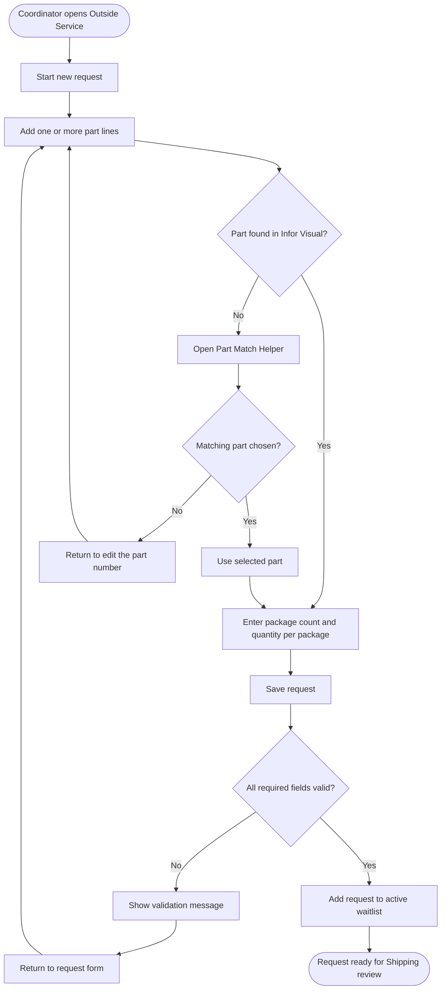
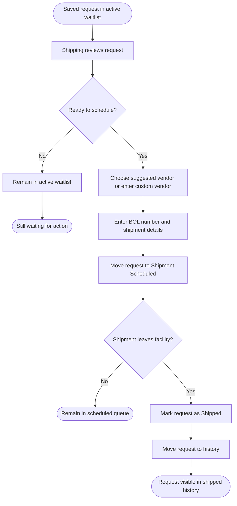

# Module_OutsideService — End-User Workflow And Mockups

Last Updated: 2026-03-27

This document explains how the new Outside Service waitlist is expected to work for day-to-day users.
It is written for coordinators, Shipping, and support staff.
Version 1 focuses on creating and viewing open requests.
Later scheduling and shipped-history screens are included below as future-state mockups so the full workflow is easy to understand.

---

## Who This Is For

- Outside Service Coordinator
- Shipping team
- Leads and support staff who need to understand the process

---

## What Version 1 Includes

- Create a new outside-service request
- Add one or more part lines to the request
- Use a Part Match Helper if the entered part number is close but not exact
- Enter number of packages and quantity per package for each line
- Save the request into an active waitlist
- View the open waitlist for Shipping follow-up

## What Version 1 Does Not Include

- Scheduling the shipment
- Entering a BOL number
- Marking the request as shipped
- Editing a saved request after it is submitted
- Cancelling a saved request

---

## Workflow Overview

### Version 1 Flow



### Future Full Lifecycle



---

## Screen Summary

| Screen | Version | Purpose |
| ------ | ------- | ------- |
| `Outside Service Request Entry` | Version 1 | Create a new request with part lines only |
| `Part Match Helper` | Version 1 | Help the user choose the correct part when the entered part number is close but not exact |
| `Outside Service Active Waitlist` | Version 1 | Show open requests waiting for Shipping action |
| `Outside Service Shipment Scheduled` | Future Phase | Capture BOL number and shipment scheduling details |
| `Outside Service Shipped History` | Future Phase | Review requests that have already left the facility |

---

## Screen 1 — Outside Service Request Entry

This is the main Version 1 screen for the Outside Service Coordinator.

### What The User Does

1. Starts a new request.
2. Adds one or more part lines.
3. If a part number is not found, uses the Part Match Helper to choose the correct part.
4. Enters package count and quantity per package for each line.
5. Saves the request.

### Request Entry Mockup

```text
+----------------------------------------------------------------------------------+
| Outside Service - New Request                                                    |
+----------------------------------------------------------------------------------+
| Requested By: [Current User                     ]   Request Date: [2026-03-27]   |
| Notes:        [______________________________________________________________]   |
|                                                                                  |
| Part Lines                                                                       |
| [Add Part Line]                                                                  |
|                                                                                  |
| Line | Part ID        | Packages | Qty / Package                                 |
| 1    | [ABC-123_____] | [4_____] | [25_______]                                   |
| 2    | [XYZ-900_____] | [2_____] | [10_______]                                   |
|                                                                                  |
| [Save Request]   [Clear Form]                                                    |
+----------------------------------------------------------------------------------+
```

### Request Entry User Notes

- The request cannot be saved unless every part line has valid counts.
- If the entered part number is not found, the Part Match Helper opens and shows similar parts.
- Vendor selection does not happen in Version 1.
- Shipping will choose the vendor later when the request is scheduled.

---

## Screen 1A — Part Match Helper

This helper appears when the part number typed by the coordinator does not exactly match a part in Infor Visual.

### What The User Does

1. Reviews the closest part matches.
2. Selects the correct part if one is shown.
3. Returns to the request form if the entered value needs to be corrected manually.

### Part Match Helper Mockup

```text
+----------------------------------------------------------------------------------+
| Part Match Helper                                                                |
+----------------------------------------------------------------------------------+
| We could not find an exact match for: [ABC1234]                                  |
|                                                                                  |
| Did you mean one of these parts?                                                 |
|                                                                                  |
| ( ) ABC-1234   Widget Housing                                                    |
| ( ) ABC-1235   Widget Housing Rev B                                              |
| ( ) ABC-1284   Widget Cover                                                      |
|                                                                                  |
| [Use Selected Part]   [Go Back And Edit]                                         |
+----------------------------------------------------------------------------------+
```

### Part Match Helper Notes

- This helper is meant to be easier for end users to understand than the term fuzzy search.
- It helps prevent failed requests caused by a small typing error in the part number.
- If none of the shown parts is correct, the user returns to the form and fixes the value manually.

---

## Screen 2 — Outside Service Active Waitlist

This is the Version 1 list that Shipping uses to see open work.

### What The User Sees

- newest requests first
- vendor still pending Shipping assignment
- number of part lines in the request
- request status, which will be `Initial Entry` in Version 1

### Active Waitlist Mockup

```text
+------------------------------------------------------------------------------------------------+
| Outside Service - Active Waitlist                                                              |
+------------------------------------------------------------------------------------------------+
| Search: [__________________________]   Status: [Initial Entry v]   [Refresh]                  |
|                                                                                                |
| Request #   Created On   Created By        Vendor Status       Lines   Status                  |
| OS-000128   03/27/2026   J. Smith          Pending Shipping    2       Initial Entry           |
| OS-000127   03/27/2026   A. Lopez          Pending Shipping    1       Initial Entry           |
| OS-000126   03/26/2026   J. Smith          Pending Shipping    3       Initial Entry           |
|                                                                                                |
| Request Details                                                                               |
| Request #: OS-000128                                                                          |
| Vendor: Not selected yet                                                                      |
| Lines: 2                                                                                      |
| - ABC-123 | 4 packages | 25 each                                                              |
| - XYZ-900 | 2 packages | 10 each                                                              |
|                                                                                                |
| [View Request]                                                                                |
+------------------------------------------------------------------------------------------------+
```

### Active Waitlist User Notes

- In Version 1 this list is for visibility only.
- Scheduling actions are not part of the first release.
- Vendor assignment is intentionally deferred until Shipping works the request.
- The existing Ship/Rec Outside Service History screen remains separate and continues to serve historical lookup needs.

---

## Screen 3 — Outside Service Shipment Scheduled

**Future Phase**

This screen is not part of Version 1.
It shows how Shipping would later confirm that a request is scheduled to leave.

### Shipment Scheduled Mockup

```text
+----------------------------------------------------------------------------------------------+
| Outside Service - Shipment Scheduled                                                         |
+----------------------------------------------------------------------------------------------+
| Request #: [OS-000128]                                                                      |
| Vendor: [Suggested Vendor v]              [Use Custom Vendor]                               |
| Custom Name: [__________________________________________]                                   |
| BOL Number: [____________________________________]                                           |
| Scheduled Ship Date: [03/30/2026]   Pickup Window: [2:00 PM - 4:00 PM]                      |
| Shipping Contact: [________________________________]                                         |
| Notes: [__________________________________________________________________________________] |
|                                                                                              |
| [Save As Scheduled]   [Back To Waitlist]                                                     |
+----------------------------------------------------------------------------------------------+
```

### Shipment Scheduled Notes

- This phase is where Shipping would choose the vendor and add the BOL number.
- Once saved, the request would move from `Initial Entry` to `Shipment Scheduled`.

---

## Screen 4 — Outside Service Shipped History

**Future Phase**

This screen is also not part of Version 1.
It shows what the end-state history screen may look like after requests are marked as shipped.

### Shipped History Mockup

```text
+------------------------------------------------------------------------------------------------+
| Outside Service - Shipped History                                                             |
+------------------------------------------------------------------------------------------------+
| Search: [________________________]   Vendor: [All v]   Date Range: [Last 30 Days v]          |
|                                                                                                |
| Request #   Ship Date    BOL Number      Vendor              Status                           |
| OS-000091   03/19/2026   BOL-445991      Metro Heat Treat    Shipped                          |
| OS-000087   03/17/2026   BOL-445870      Allied Plating      Shipped                          |
|                                                                                                |
| [Open History Record]                                                                         |
+------------------------------------------------------------------------------------------------+
```

### Shipped History Notes

- This is the screen that would replace manual tracking for completed shipments.
- It is intended for history and follow-up, not for new request entry.

---

## Daily Workflow Summary

| Role | Version 1 Action |
| ---- | ---------------- |
| Outside Service Coordinator | Create new requests with part and package details only |
| Shipping | Review the active waitlist, choose the vendor later, and prepare for future scheduling work |
| Support Staff | Use the screen layout and lifecycle summary to understand what is currently live versus future-state |

---

## Support Notes

- If a user asks where BOL number entry is, the correct answer for Version 1 is: not available yet.
- If a user asks why the request does not appear in Ship/Rec history, the answer is: the waitlist and the history lookup are separate tools.
- If a user asks why there is no vendor field during request entry, the answer is: vendor selection belongs to Shipping, not the Outside Service Coordinator.
