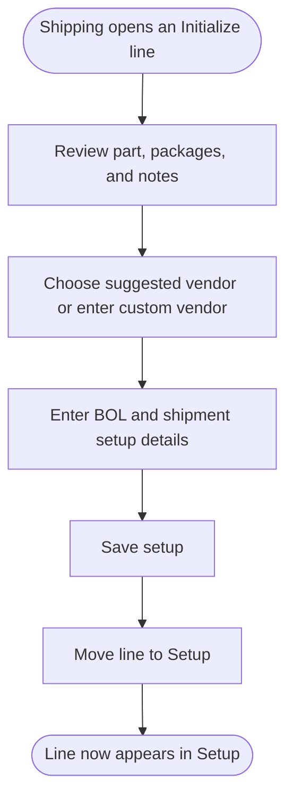
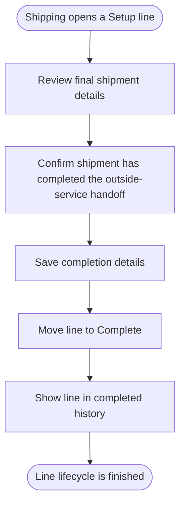
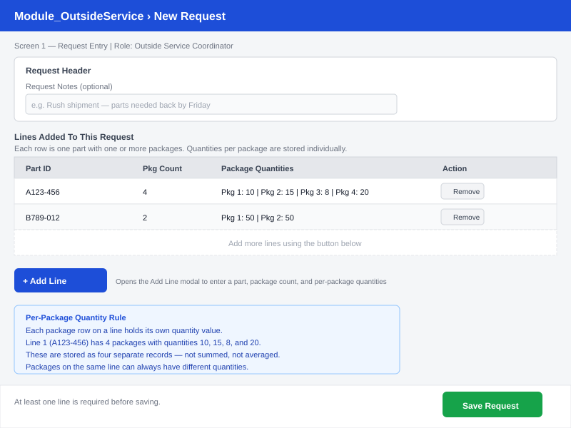
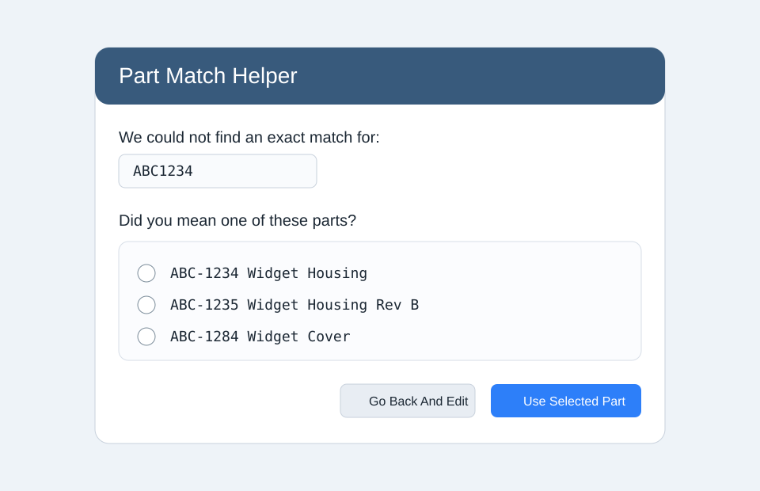
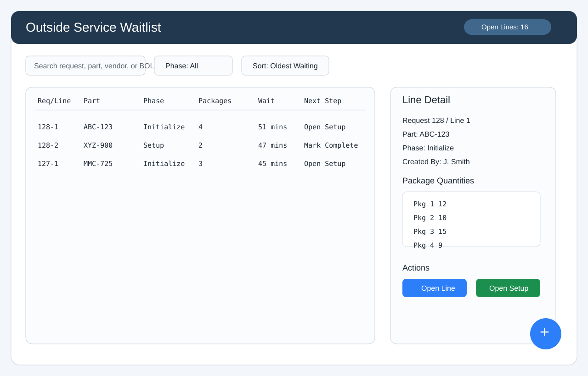
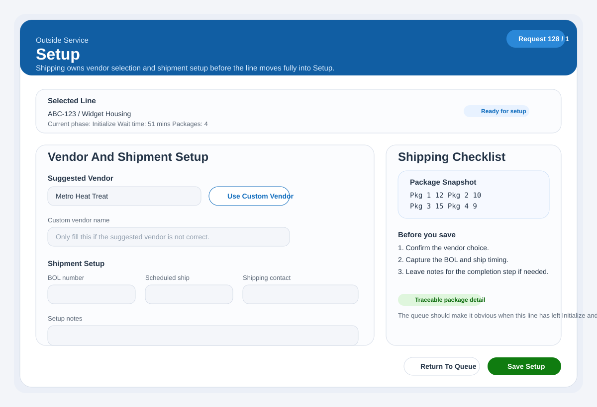
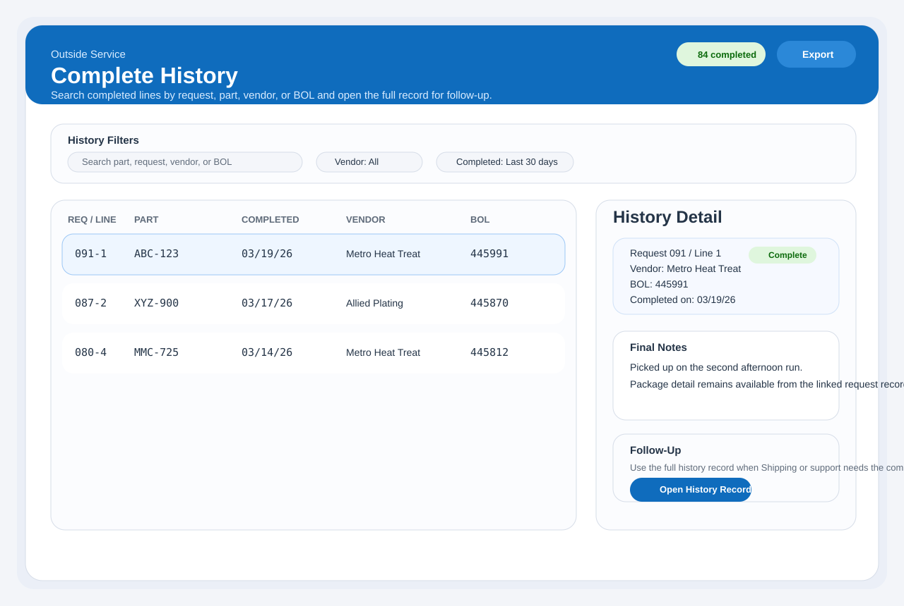

# Module_OutsideService - End-User Workflow And Mockups

Last Updated: 2026-03-27

This document explains how the new Outside Service waitlist works for day-to-day users.
It is written for coordinators, Shipping, and support staff.
Version 1 includes the full delivered line lifecycle.
Each waitlist line moves through `Initialize`, then `Setup`, then `Complete`.
The mockups linked below are concept sketches in SVG format, not final screen replicas.

## Who This Is For

- Outside Service Coordinator
- Shipping clerk
- Leads and support staff who need to understand the process

## What Version 1 Includes

- Create a new outside-service request
- Add one or more part lines to the request
- Enter package count and one quantity value for each package on the line
- Use a Part Match Helper when the typed part number does not exactly match Infor Visual
- Save lines into the active waitlist in phase `Initialize`
- Let Shipping complete vendor and BOL setup in phase `Setup`
- Let Shipping finish lines in phase `Complete`
- View active waitlist lines and completed-history lines

## What Version 1 Does Not Include

- Cancelling a saved request
- Editing a fully completed line
- Writing anything back into Infor Visual

## Workflow Overview

### Phase 1 - Initialize

```mermaid
flowchart TD
  I1_Start([Coordinator opens Outside Service]) --> I1_NewRequest[Start new request]
  I1_NewRequest --> I1_AddLine[Add part line]
  I1_AddLine --> I1_CheckPart{Part found in Infor Visual?}
  I1_CheckPart -->|Yes| I1_SetCount[Enter package count]
  I1_CheckPart -->|No| I1_OpenHelper[Open Part Match Helper]
  I1_OpenHelper --> I1_HelperChoice{Use suggested part?}
  I1_HelperChoice -->|Yes| I1_ApplyMatch[Apply selected part]
  I1_ApplyMatch --> I1_SetCount
  I1_HelperChoice -->|No| I1_EditPart[Return and correct part entry]
  I1_EditPart --> I1_AddLine
  I1_SetCount --> I1_EnterPackages[Enter one quantity for each package]
  I1_EnterPackages --> I1_SaveRequest[Save request]
  I1_SaveRequest --> I1_IsValid{All lines and packages valid?}
  I1_IsValid -->|No| I1_ShowError[Show validation message]
  I1_ShowError --> I1_AddLine
  I1_IsValid -->|Yes| I1_AddToWaitlist[Add line(s) to active waitlist]
  I1_AddToWaitlist --> I1_End([Line(s) now waiting in Initialize])
```

### Phase 2 - Setup



### Phase 3 - Complete



## Screen Summary

| Screen | Purpose | Mockup |
| ------ | ------- | ------ |
| `Outside Service Request Entry` | Coordinator creates a request and enters package-by-package quantities |  |
| `Part Match Helper` | User-friendly helper for mismatched part numbers |  |
| `Outside Service Active Waitlist` | Open lines waiting in `Initialize` or `Setup` |  |
| `Outside Service Setup` | Shipping enters vendor and BOL details |  |
| `Outside Service Complete History` | Completed lines and follow-up history |  |

## Screen 1 - Outside Service Request Entry

This is the main request-entry screen used by the Outside Service Coordinator.


### Coordinator Actions

1. Starts a new request.
2. Adds one or more part lines.
3. Enters package count for the selected line.
4. Enters one quantity value for each package on that line.
5. Saves the request when all lines are valid.

### Request Entry Notes

- Vendor selection does not happen here.
- If a line has four packages, the user must enter four package quantities.
- The package quantities for one line can all be different.
- The request cannot be saved unless every package quantity is valid.

## Screen 1A - Part Match Helper

This helper appears when the entered part number does not exactly match a part in Infor Visual.


### Helper Actions

1. Reviews similar part options.
2. Applies the correct part if it is shown.
3. Returns to the request form if manual correction is still needed.

### Part Match Helper Notes

- The name "Part Match Helper" is intended to be easier for end users to understand than "fuzzy search".
- It prevents small typing errors from forcing the whole request to be restarted.
- If no suggestion is correct, the user goes back and fixes the part manually.

## Screen 2 - Outside Service Active Waitlist

This is the working queue used by Shipping.
It should feel like a live waitlist board, not just a plain grid.


### What The User Sees

- open lines grouped by current phase
- elapsed waiting time for each line
- part and package summary for each line
- next action for the line
- a details panel that shows package-level quantities when a line is selected

### Active Waitlist Notes

- The queue is line-based, not request-based.
- Two lines from the same request can be in different phases at the same time.
- Shipping uses the queue to open an `Initialize` line and move it into `Setup`.

## Screen 3 - Outside Service Setup

Shipping uses this screen to perform the second phase of the lifecycle.


### Shipping Setup Actions

1. Reviews the line details.
2. Chooses a vendor suggestion or enters a custom vendor.
3. Enters BOL and shipment setup details.
4. Saves the line into phase `Setup`.

### Setup Notes

- Vendor selection is Shipping-owned.
- The line remains traceable back to its original package breakdown.
- The queue should clearly show when the line has entered `Setup`.

## Screen 4 - Outside Service Complete History

This screen shows lines that have finished the lifecycle.


### History Actions

1. Reviews completed lines.
2. Searches by part, vendor, request, or BOL.
3. Opens a history record when follow-up is needed.

### Complete History Notes

- This is a history and audit screen, not a new-entry screen.
- Completed lines should still show enough setup detail for follow-up questions.
- History should remain line-based so users can trace exactly which line was completed.

## Daily Workflow Summary

| Role | Version 1 Action |
| ---- | ---------------- |
| Outside Service Coordinator | Creates requests and enters package-by-package quantities in `Initialize` |
| Shipping clerk | Moves each line through `Setup` and `Complete` |
| Support Staff | Uses the lifecycle summary and history views to answer operational questions |

## Support Notes

- If a user asks where vendor selection happens, the answer is: Shipping does that in `Setup`.
- If a user asks what happens when package quantities differ, the answer is: the line stores one quantity for each package, so different package quantities are supported.
- If a user asks what happens when the part does not match Infor Visual, the answer is: the Part Match Helper opens and offers similar parts.
- If a user asks what the progress steps are, the answer is: each waitlist line moves through `Initialize`, then `Setup`, then `Complete`.
